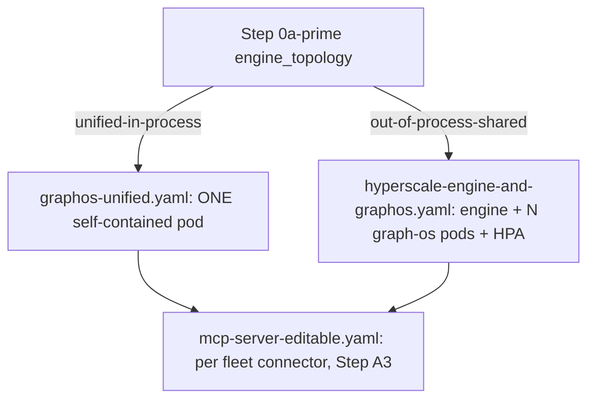

# Kubernetes deployment recipes — the genesis DEFAULT k8s path

Three small, TEMPLATE-shaped manifest sets that `agent-os-genesis` treats as the
**default** starting point whenever `orchestrator: kubernetes` (Step 0c) — covering
both the unified self-contained `graph-os` and the editable-install `*-mcp` fleet.
They exist so a genesis run never has to invent k8s YAML from scratch: copy the file
that matches the resolved `engine_topology` (Step 0a′), replace every `<PLACEHOLDER>`,
apply.

None of these are applied by genesis automatically and none are live cluster state —
they are references genesis points an operator/agent at during Step 5/Step A2 (see
[`../../SKILL.md`](../../SKILL.md)). Real, previously-applied manifests for this
repo's own homelab live under `services/*/k8s/` and `deploy/k8s/` in the workspace —
see "Graduating beyond these recipes" below for how those relate.

## What's here

| File | `engine_topology` | Shape |
|------|--------------------|-------|
| [`graphos-unified.yaml`](graphos-unified.yaml) | `unified-in-process` (DEFAULT for `tiny`/`single-node-prod`) | ONE pod = engine + KG + numeric kernel + messaging + gateway. `replicas: 1`, no HPA — see the file header for why this shape is never horizontally scaled. |
| [`mcp-server-editable.yaml`](mcp-server-editable.yaml) | orthogonal — used at every profile above `tiny` | ONE `*-mcp` fleet connector (`agents/*`, `deploy/mcp-fleet.registry.yml`), parameterized by service name/image/port. Two container variants: dev/editable (source-mount + PYTHONPATH + pip-install-at-start) or prod/baked-deps. |
| [`hyperscale-engine-and-graphos.yaml`](hyperscale-engine-and-graphos.yaml) | `out-of-process-shared` (DEFAULT for `enterprise`) | A separately-scaled `epistemic-graph` engine + N stateless `graph-os` client pods behind a `HorizontalPodAutoscaler`, built against the eg `cluster` cargo feature. |

## How genesis selects between them

Step 0a′ already resolves `engine_topology` per profile (`genesis.yaml`
`profiles.<profile>.engine_topology`): `unified-in-process` for `tiny` /
`single-node-prod`, `out-of-process-shared` for `enterprise` — overridable per the
same run-plan axis as everything else in Step 0. Step 5 (`orchestrator: kubernetes`)
stands up the cluster substrate; **Step A2** (`graph-os-unified-gateway`) is where the
resolved topology picks the manifest set:

- `engine_topology: unified-in-process` → render **`graphos-unified.yaml`**.
- `engine_topology: out-of-process-shared` → render **`hyperscale-engine-and-graphos.yaml`**
  (and, once real HA is needed beyond the single-instance engine default here, graduate
  to the 3-voter Raft design in `services/epistemic-graph/k8s/raft-cluster/` — see
  that file's own header for why this recipe doesn't ship Raft peering directly).
- **Step A3** (`mcp-fleet-deploy`), independent of topology, renders one
  **`mcp-server-editable.yaml`** copy per fleet member selected for the active profile.

Full topology depth (the two shapes, the batching rule, what "hyperscaling" actually
buys/costs): [`../engine-topology-and-hyperscaling.md`](../engine-topology-and-hyperscaling.md).

## Current config contract — what these recipes never do

All three files are written against the CURRENT `agent_utilities.core.config`
contract only. Engine locality is decided **solely** by whether
`GRAPH_SERVICE_ENDPOINTS` is present on the ConfigMap — absent in
`graphos-unified.yaml` (packaged local engine), present in
`hyperscale-engine-and-graphos.yaml` (remote/shared engine) — nothing else switches
the shape. `GRAPH_SERVICE_PERSIST_DIR` pins the durable snapshot dir wherever the
engine is local. None of the three files ever sets a key from
`agent_utilities/core/config.py`'s `_RETIRED_CONFIGURATION_KEYS` — most importantly
never `ENGINE_MODE`, `ENGINE_ENDPOINT`, `GRAPH_SERVICE_TCP_ADDR`,
`EPISTEMIC_GRAPH_AUTOSTART`, or `GRAPH_BACKEND` (all four hard-fail boot with a
`ValueError` if present, whether in `config.json` or the process environment). Full
narrative: [`docs/recipes/unified-self-contained.md`](../../../../../../docs/recipes/unified-self-contained.md).

## How to use these files

1. Copy the file (or files) that match the resolved `engine_topology` into your
   operator-owned private `infrastructure` repo (Step 9b — never commit resolved,
   host-specific manifests back into this public `agent-utilities` repo).
2. Replace every `<PLACEHOLDER>` — namespace, image references, Keycloak/OIDC
   endpoints, OpenBao KV paths, hostnames, storage class / hostPath.
3. Apply with `kubectl apply -f <file>` (or fold into the fleet's Kustomize/GitOps
   pipeline — Step 10 `portainer-gitops-bind`).

These are **intentionally `<PLACEHOLDER>`-style, not `envsubst`-style** (`${VAR}`).
This repo already learned that lesson the hard way: `inventory/k8s-migration/scaffold_k8s.py`
originally emitted `${SERVER}`-templated manifests that `kubectl apply` silently
accepted as literal strings, which would have created **duplicate workloads**
alongside what was already live — see the reconciliation header comment at the top of
`services/graph-os/k8s/manifests.yaml` in the workspace repo for the full incident. A
bare `kubectl apply -f` against one of these three files as-is fails closed on the
literal `<PLACEHOLDER>` text (invalid image reference, unresolvable host, etc.)
instead of quietly deploying something wrong.

## Graduating beyond these recipes

These are **genesis's starting point**, not the ceiling. Once a real deployment needs
more than the default shape, this `agent-utilities` repo and the surrounding workspace
already carry heavier, more mature references — adapt them, don't apply verbatim
(their own file headers say the same):

| Need | Reference |
|---|---|
| A worked, already-current-contract example with per-tenant engine sharding + HPA | `deploy/k8s/graphos.yaml` (agent-utilities repo) |
| 3-voter Raft HA for the engine tier (zero-downtime rolling upgrades thereafter) | `services/epistemic-graph/k8s/raft-cluster/` |
| Full mesh-secured, certification-gated, multi-zone production target (Istio mTLS, exact-digest image pinning, disaster recovery) — a heavier system than any genesis default | `deploy/k8s/production-cell/` (agent-utilities repo; see its own `deploy/README.md` for the required render + certify pipeline — do not apply the template directory directly) |
| Security-hardened single-node profile on Swarm instead of k8s (same identity/session/secret/TLS boundaries, smaller footprint) | `deploy/swarm/graphos.stack.yml` (agent-utilities repo) |
| Bundled single-pod core (dev / uvx / compose fit, not k8s production) | `services/epistemic-graph/k8s/bundled-core-pod.yaml` |
| One `*-mcp` connector, fleet-wide inventory (image, console script, port, profile) | `deploy/mcp-fleet.registry.yml` (agent-utilities repo) |

## Helm chart — follow-up, not built here

A proper Helm chart (values schema per topology, `_helpers.tpl`, a real templating
pass over the three shapes above) is materially more than an hour of work and would
be speculative machinery without a concrete multi-environment consumer driving its
values contract yet. These plain, template-shaped manifests are the pragmatic
default for now; revisit a chart once a second/third real deployment target
(beyond this homelab) actually needs one.
