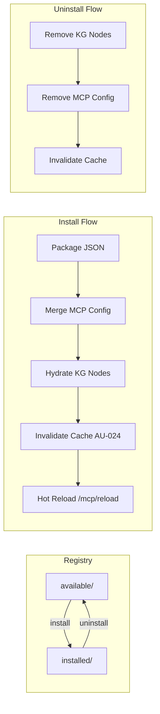

# CONCEPT:OS-5.0 — Agent Registry

> Package-manager-style specialist installation with KG auto-hydration and hot-reload.

## Overview

The Agent Registry (`agent_utilities/core/registry_cli.py`) provides a CLI and programmatic API for installing, removing, and managing specialist capabilities at runtime — the `apt-get` for agents.

Each specialist is packaged as a JSON definition containing an MCP server config fragment, tool metadata, and dependency declarations. Installation merges the config, hydrates KG nodes, and triggers hot-reload.

## Architecture



## Package Format

Each specialist package is a JSON file in the `available/` directory:

```json
{
  "name": "salesforce-specialist",
  "version": "0.1.0",
  "description": "Salesforce CRM integration specialist",
  "mcp_config": {
    "name": "salesforce",
    "command": "uvx",
    "args": ["salesforce-mcp"],
    "env": {
      "SF_API_KEY": "secret://salesforce/api_key"
    }
  },
  "tools": [
    "list_accounts",
    "create_lead",
    "search_contacts"
  ],
  "dependencies": [],
  "tags": ["crm", "salesforce", "enterprise"]
}
```

## Directory Structure

```
~/.agent-utilities/registry/
├── available/           # Packages available for installation
│   ├── salesforce-specialist.json
│   └── jira-specialist.json
└── installed/           # Currently installed packages
    └── gitlab-specialist.json
```

## Configuration

| Variable | Default | Description |
|:---|:---|:---|
| `SPECIALIST_REGISTRY_PATH` | `~/.agent-utilities/registry` | Path to the registry directory |

## Usage

### Programmatic API

```python
from agent_utilities.core.registry_cli import AgentRegistry

registry = AgentRegistry(
    mcp_config_path="/path/to/mcp_config.json",
    engine=knowledge_engine,
)

# Install a specialist
result = await registry.install("salesforce-specialist")

# List installed packages
for pkg in registry.list_installed():
    print(f"{pkg.name} v{pkg.version} ({len(pkg.tools)} tools)")

# Search for packages
matches = registry.search("crm")

# Uninstall
result = await registry.uninstall("salesforce-specialist")
```

## Integration with systems-manager

For packages requiring system-level installation (e.g., Docker containers, system dependencies), the registry can delegate to `systems-manager`:

1. Package definition includes `"install_via": "systems-manager"`
2. Registry sends install request to `systems-manager` MCP server
3. `systems-manager` validates caller identity (AU-031) and executes
4. Registry updates KG and cache upon completion

## KG Persistence

Installed packages are tracked as `SpecialistPackageNode` entries in the KG, linked via:
- `INSTALLED_FROM` → source registry
- `PROVIDES` → tool nodes the package exposes

## Default Catalog

The registry ships a built-in catalog of **38 packages** via `agent_utilities/core/default_catalog.py`. On first `AgentRegistry` init, the catalog is seeded automatically:

- **OS Subsystems** (4 packages) → auto-installed into `installed/`
- **OS Services** (2 packages) → placed in `available/`
- **Domain Specialists** (27 packages) → placed in `available/`
- **Community MCPs** (5 packages) → placed in `available/`

### OS Subsystems (auto-installed)

| Package | Description | Tools |
|:---|:---|:---|
| `systems-manager` | Host OS ops, Agent OS MCP wrappers | 23+ |
| `container-manager-mcp` | Docker/Compose/Swarm lifecycle, multi-endpoint | 60+ |
| `tunnel-manager` | SSH tunnels, remote exec, file transfer, host inventory | 43 |
| `repository-manager` | Git workspace mgmt, project lifecycle, dep graphs | 24 |

### OS Services (deploy-on-demand)

| Package | Description | Default |
|:---|:---|:---|
| `searxng-mcp` | Privacy-respecting metasearch | Public instance (no deploy required) |
| `langfuse-agent` | Observability, tracing, prompt mgmt | Deploy via compose template |

### Domain Specialists

| Package | Category | Description |
|:---|:---|:---|
| `gitlab-api` | DevOps | Projects, MRs, pipelines, issues, CI/CD |
| `github-agent` | DevOps | Repos, PRs, issues, actions |
| `ansible-tower-mcp` | DevOps | Automation, playbooks, inventory |
| `servicenow-api` | Enterprise | ITSM, incidents, CMDB, change requests |
| `atlassian-agent` | Enterprise | Jira issues, Confluence pages |
| `leanix-agent` | Enterprise | EA management via REST/GraphQL |
| `plane-agent` | Enterprise | Project management, issues, cycles |
| `microsoft-agent` | Enterprise | Outlook, Teams, OneDrive, SharePoint |
| `jellyfin-mcp` | Media | Media server, libraries, playback |
| `media-downloader` | Media | Audio/video download via yt-dlp |
| `audio-transcriber` | Media | Transcription via Whisper |
| `arr-mcp` | Media | Sonarr, Radarr, Lidarr automation |
| `qbittorrent-agent` | Media | Torrent management, RSS |
| `home-assistant-agent` | IoT | Smart home control, automations |
| `adguard-home-agent` | IoT | DNS filtering, DHCP, query logs |
| `uptime-kuma-agent` | IoT | Uptime monitoring, status pages |
| `stirlingpdf-agent` | Documents | PDF manipulation, OCR |
| `documentdb-mcp` | Database | MongoDB-compatible on PostgreSQL |
| `archivebox-api` | Documents | Web archiving, bookmarks |
| `vector-mcp` | Database | RAG with multiple vector backends |
| `portainer-agent` | Cloud | Docker env management, stacks |
| `nextcloud-agent` | Cloud | File management, sharing |
| `postiz-agent` | Social | Social media scheduling |
| `owncast-agent` | Social | Self-hosted live streaming |
| `mealie-mcp` | Productivity | Recipes, meal planning |
| `wger-agent` | Fitness | Workouts, nutrition, measurements |
| `genius-agent` | Core | Orchestrator (consumes all MCPs) |

### Community MCPs

| Package | Description | Command |
|:---|:---|:---|
| `mcp-playwright` | Browser automation & E2E testing | `npx` |
| `mcp-sentry` | Error monitoring & performance | `npx` |
| `mcp-cloudflare` | DNS, Workers, CDN configuration | `npx` |
| `mcp-kubernetes` | Cluster management, pods, services | `npx` |
| `mcp-sqlite` | Local database queries & schemas | `npx` |

### Seeding Behavior

```python
# Auto-seeded on first init (transparent to user)
registry = AgentRegistry()
# → 4 packages in installed/, 34 in available/

# Refresh catalog like `apt update`
registry.reseed_defaults()
# → Re-writes available/ with latest catalog without touching installed/
```

### Searching

```python
# Search by tag
registry.search("devops")      # → 8 packages
registry.search("media")       # → 6 packages
registry.search("community")   # → 5 packages
registry.search("os_subsystem") # → 4 packages
```
