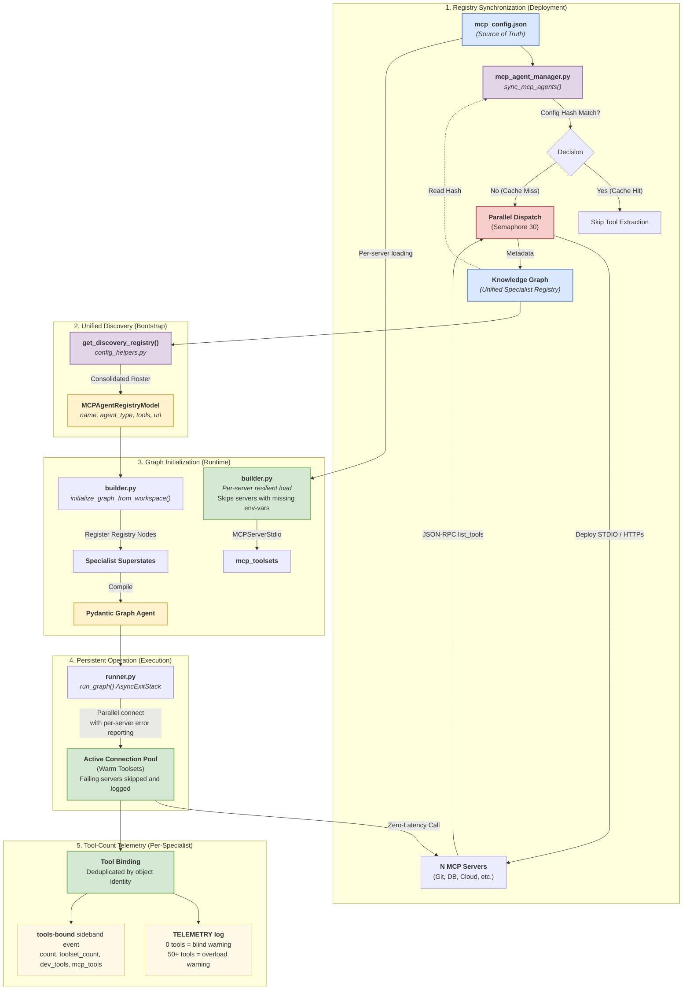

# Agents & Orchestration

## Specialist Registry (Discovery Phase)

The specialist ecosystem is managed via the **Knowledge Graph**. This registry is the primary source of truth for routing.

**How it works:**
1. Each specialist entry in the graph matches to a `.json` file in `agent_utilities/prompts/` (for prompt agents) or a remote endpoint (for A2A/MCP agents).
2. The `agent_registry_builder.py` script automatically synchronizes this registry by parsing prompt JSON and ingesting them as `PromptNode`s.
3. When `builder.py` spawns the orchestrator, it loads all agents via `get_discovery_registry()`.
4. Capability tags are assigned to agents, and the `expert_executor` uses these tags to dynamically bind toolsets at runtime.

**Prompt JSON format:** All prompts in `agent_utilities/prompts/` are structured JSON blueprints. The canonical shape is:

```json
{
  "name": "role-name",
  "type": "prompt",
  "description": "...",
  "capabilities": ["..."],
  "tags": ["..."],
  "content": "<prompt body as a single string>"
}
```

Consumers load via `json.loads(...)` and pluck `"content"` for the system prompt body. The package-data glob in `pyproject.toml` is `"prompts/*.json"`. Two JSON shapes coexist in the registry: the modern `{name, description, capabilities, content}` blueprint schema and the `StructuredPrompt` variant (`{task, goal, tools, input}`) still used by some specialist prompts.

**Adding a new role:**
1. Create `[role].json` matching the schema above in `agent_utilities/prompts/`.
2. The graph will automatically pick up the new role during the next ingestion phase or server reload.
3. Keep role IDs in `snake_case`.

## MCP Loading & Registry Architecture



## Operational Reliability & Coordination

| Capability | Logic | Graph Integration |
| :--- | :--- | :--- |
| **Stuck Loop Detection** | Detects repetitive tool calls, alternating patterns, and no-op loops. | Records `SelfEvaluationNode` for long-term pattern auditing. |
| **Lifecycle Hooks** | Unified PRE/POST_TOOL_USE and BEFORE/AFTER_RUN hooks for auditing. | Auto-traces every tool call as a `ToolCallNode` in the graph. |
| **Context Warnings** | Proactively warns model as token budget nears 70% (URGENT) and 90% (CRITICAL). | Records critical context pressure events in the graph memory. |
| **Output Eviction** | Intercepts massive tool outputs (>80k chars) and moves them to KB. | Stores full content as `RawSource` node; leaves preview in history. |
| **Conversation Checkpoints** | Full conversation snapshots (checkpoints) at tool/turn boundaries. | Persisted as `CheckpointNode` for cross-process fork/rewind. |
| **Agent Teams** | Shared task management and P2P messaging across agent groups. | Persists `TeamNode` and `TaskNode` with assigned relationships. |
| **Governance** | Policies and guardrails discovered from the graph during planning. | `PolicyNode` linked to topics and agents. |
| **Process Flows** | Standard Operating Procedures (SOPs) fetched and executed dynamically. | `ProcessFlowNode` and `ProcessStepNode` sequences. |
| **Output Styles** | Dynamic response style discovery (concise, formal, etc.) via KB. | Styles are stored as `Article` nodes in `kb:output-styles`. |

## Agent Communication Protocol (ACP)

All inter-agent coordination (Teams) and frontend communication (TUI/Web) leverages the **Agent Communication Protocol (ACP)**. This provides a standardized message bus for sideband events (approvals, logs, status) and P2P message routing between agent specialists.

## Memory & Code Lifecycle (CRUD + Analysis)

Agents interact with this layer using the `knowledge_tools` suite to manage memory, reason about the codebase, and manage the ecosystem state.

| Operation | Tool | Trigger Criteria |
| :--- | :--- | :--- |
| **CREATE MEMORY** | `add_knowledge_memory` | When a new **project fact**, **user preference**, or **permanent decision** is established. |
| **READ MEMORY** | `get_knowledge_memory` | When the agent needs the **full context** or timestamp for a historical decision/memory. |
| **SEARCH** | `search_knowledge_graph` | **Hybrid Search**: Performs a keyword and topological search across agents, tools, code, and memories. |
| **IMPACT** | `get_code_impact` | **Topological Analysis**: Before making changes, analyzes which symbols or files will be affected. |
| **UPDATE MEMORY** | `update_knowledge_memory`| When a previous memory is found to be **outdated, incomplete, or refined**. |
| **DELETE MEMORY** | `delete_knowledge_memory`| When a memory is proven **false, irrelevant, or superseded**. |
| **LINK** | `link_knowledge_nodes` | When a relationship is discovered between disparate items (e.g., linking a memory to a code symbol). |
| **SYNC** | `sync_feature_to_memory`| Automatically captures the full **SDD lifecycle** (Spec, Plan, Tasks) after a feature is completed. |
| **HEARTBEAT** | `log_heartbeat` | Agent telemetry logging to the `Heartbeat` node schema. |
| **CLIENT/USER** | `create_client` / `create_user` / `save_preference` | Creating user profiles and preferences directly into the graph schema. |
| **CHAT/CRON** | `save_chat_message` / `log_cron_execution` | Storing execution and dialog logs, maintained dynamically by background pruning tasks. |
| **REASONING** | `ingest_episode` / `record_outcome` | Capturing reasoning traces and evaluating outcomes for self-improvement. |
| **MAGMA** | `retrieve_orthogonal_context` | Policy-guided retrieval across Semantic, Temporal, Causal, and Entity views. |
| **SPAWNING** | `spawn_specialized_agent` | Creating dynamic sub-agents with curated toolsets for complex tasks. |
| **INGEST DOCUMENT** | `DocumentIngestionPipeline.ingest_document` | When ingesting new documents into Document DB, Vector DB, and Knowledge Graph with unified IDs. |
| **UPDATE DOCUMENT** | `DocumentUpdatePipeline.update_document` | When updating document content or metadata with cascading sync to all storage layers. |
| **DELETE DOCUMENT** | `DocumentDeletionPipeline.delete_document` | When soft/hard deleting documents with cascading cleanup across all storage layers. |
| **CLEANUP DOCUMENTS** | `DocumentCleanupManager.run_cleanup` | When performing automated cleanup of old soft-deleted documents and orphan data. |

## Graph Event System & Phase Map

Every significant state transition emits a structured event via `emit_graph_event()` (`graph/config_helpers.py`). Events serve two purposes:
1. **Server-side structured logging** -- `_log_graph_trace()` uses `_PHASE_MAP` to prefix each log line with a phase label.
2. **Real-time UI sideband streaming** -- Each event is pushed as a `data-graph-event` payload via SSE.

### Event Emission Contract
```python
emit_graph_event(
    eq=event_queue,           # asyncio.Queue (or None to skip)
    event_type="routing_started",  # Must be a key in _PHASE_MAP
    query=ctx.state.query,    # Arbitrary metadata kwargs
)
```

### `_PHASE_MAP` Reference

| Phase | Event Types | Emitted By |
|---|---|---|
| **LIFECYCLE** | `graph_start`, `graph_complete`, `node_start`, `node_complete` | `runner.py`, `steps.py` |
| **SAFETY** | `safety_warning` | `steps.py` (usage_guard) |
| **ROUTING** | `routing_started`, `routing_completed` | `steps.py` (router) |
| **PLANNING** | `plan_created` | `steps.py` (dispatcher) |
| **REPLANNING** | `replanning_started`, `replanning_completed` | `steps.py` (planner) |
| **DISPATCH** | `step_dispatched`, `batch_dispatched` | `steps.py` (dispatcher) |
| **ENRICHMENT** | `context_gap_detected` | `steps.py` (memory_selection) |
| **EXECUTION** | `specialist_enter`, `specialist_exit`, `expert_metadata`, `expert_thinking`, `expert_text`, `expert_complete`, `tools_bound`, `subagent_started`, `subagent_completed` | `hsm.py`, `executor.py` |
| **TOOL_CALL** | `expert_tool_call`, `subagent_tool_call` | `executor.py`, `steps.py` |
| **TOOL_RESULT** | `tool_result` | `executor.py`, `steps.py` |
| **PARALLEL** | `orthogonal_regions_start`, `orthogonal_regions_complete`, `region_start`, `region_complete` | `hsm.py` |
| **VERIFICATION** | `verification_result` | `steps.py` (verifier) |
| **SYNTHESIS** | `agent_node_delta`, `synthesis_fallback` | `executor.py`, `steps.py` |
| **APPROVAL** | `approval_required`, `approval_resolved`, `elicitation` | `approval_manager.py`, `executor.py` |
| **RECOVERY** | `error_recovery_replan`, `error_recovery_terminal` | `steps.py` (error_recovery) |
| **TERMINATION** | `graph_force_terminated` | `steps.py` (dispatcher) |

**You must add an entry to `_PHASE_MAP`** whenever you add a new `emit_graph_event()` call. Always use `snake_case` for event types.

### Frontend Event Consumers
| Frontend | Events Used | Purpose |
|---|---|---|
| **agent-webui** (`GraphActivity.tsx`) | `routing_started`, `routing_completed`, `expert_tool_call`, `subagent_tool_call`, `approval_required` | Graph activity visualizer, approval cards |
| **agent-terminal-ui** (`app.py`) | `specialist_enter`, `routing_started`, `routing_completed`, `approval_required` | Status line updates, tool approval modal |

## Governance & Operational Workflows

The Knowledge Graph now serves as the unified registry for project governance (Policies) and operational workflows (Process Flows). This integration allows the agent to reason over established SOPs and guardrails during the planning and execution phases.

- **Policies**: Declarative constraints and guardrails (e.g., "Always use TDD", "No destructive operations on production"). Policies are grounded in Knowledge Base topics and applied based on the current context.
- **Process Flows**: Procedural step-by-step execution guides (SOPs) retrieved from the KG. The Planner agent discovers relevant flows and can choose to follow them for consistent execution.
- **Dynamic Execution**: The `LoadAndExecuteProcessFlow` node (`process_executor`) allows the graph to transition into a guided execution mode based on a retrieved SOP.
