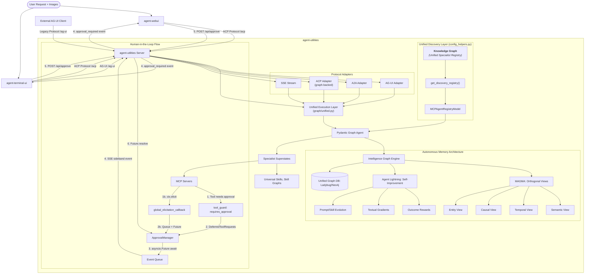
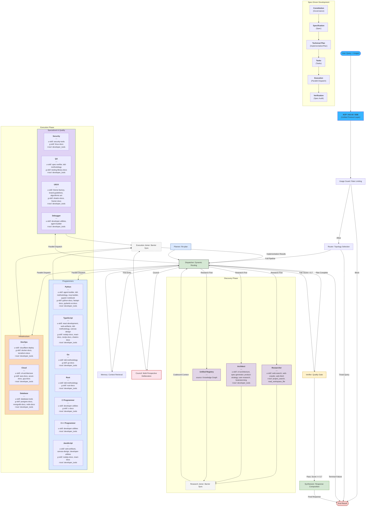
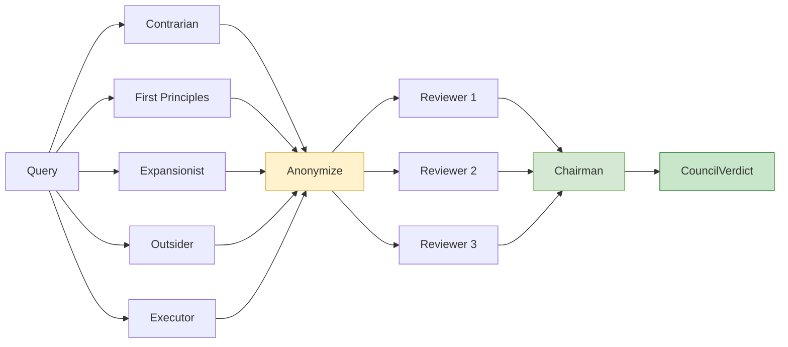

# Architecture

## Core Architecture Diagram



## Protocol Layer Architecture

The framework provides three canonical protocol adapters:

1. **ACP (Agent Communication Protocol)**: Primary protocol for standardized sessions, planning, and streaming
2. **A2A (Agent-to-Agent)**: Peer-to-peer agent communication and coordination
3. **AG-UI**: Legacy streaming interface for backward compatibility with native Pydantic AI clients

All protocol adapters are centralized in `agent_utilities/`:
- `acp_adapter.py`: ACP envelope formatting, session management, per-session `agent_factory`
- `a2a.py`: A2A peer discovery, JSON-RPC client, registry management
- `agui_emitter.py`: AG-UI wire format translator for direct graph execution events
- Server endpoints: `/acp` (MOUNT), `/a2a` (MOUNT), `/ag-ui` (POST)

### Direct Graph Execution (Fast Path)

When a `graph_bundle` is present and `GRAPH_DIRECT_EXECUTION=true` (default), the **AG-UI endpoint** bypasses the outer LLM agent entirely:

```
# Legacy (Agent-mediated):
User Query → /ag-ui → Agent.run() → LLM → "call run_graph_flow" → graph.run()

# Direct (Fast Path):
User Query → /ag-ui → graph.iter() → [step events] → AGUIGraphEmitter → wire format
```

This eliminates one full LLM inference round-trip per request. The fast path uses `graph.iter()` (pydantic-graph beta API) for step-by-step execution, yielding per-node events that are translated to AG-UI wire format by `AGUIGraphEmitter`.

The fast path is gated on:
1. `graph_bundle` containing a real Graph object with `.iter()` support
2. `GRAPH_DIRECT_EXECUTION` env var set to `true` (default)

The **ACP adapter** uses pydantic-acp's `agent_factory` callback for per-session agent creation, binding graph context directly to each session's closure.

The **A2A path** retains the LLM-mediated `run_graph_flow` tool call to support multi-agent negotiation.

### Authentication Passthrough (`custom_headers`)

`create_agent_server()` and `create_graph_agent_server()` accept a generic `custom_headers: dict[str, Any] | None = None` kwarg that is propagated verbatim to the LLM HTTP client as request headers. agent-utilities itself is **auth-agnostic** -- it does not ship provider-specific auth code (OIDC, client-credentials flows, bearer-token fetchers, etc.) and has no opinion about where those headers come from. Downstream packages are free to populate the dict from any source: environment variables, a token-fetching library, static config, a secret manager, or a callable that refreshes on every run. The same kwarg is reused by `ssl_verify` for self-signed gateways. See `agents/repository-manager/repository_manager/agent_server.py` for a reference implementation that builds the dict from `LLM_CUSTOM_HEADERS` / `LLM_HEADER_*` environment variables without pulling any provider-specific dependency into this core package.

## Graph Orchestration Architecture



> **Note:** MCP ecosystem agents (AdGuard, Jellyfin, Ansible Tower, etc.) are dynamically spawned as `CallableResource` nodes in the Knowledge Graph. They are discovered at runtime from `mcp_config.json` and do not appear in this static diagram.

### Council Deliberation Node

The **Council** is a specialized graph node that implements Karpathy's LLM Council pattern for high-stakes decision-making. It provides a 4-stage deliberative pipeline:



| Stage | Purpose | Implementation |
|-------|---------|---------------|
| **1. Advisors** | 5 parallel agents with distinct thinking styles | `run_orthogonal_regions` / sequential dispatch |
| **2. Anonymize** | Shuffle identities behind labels (A-E) | Pure Python, zero LLM cost |
| **3. Peer Review** | 3 reviewers rank, critique, find collective gaps | Independent reviewer agents |
| **4. Chairman** | Synthesize into structured `CouncilVerdict` | `output_type=CouncilVerdict` |

**Key features:**
- **Hybrid model routing**: Uses `ModelRegistry` to assign different real LLM models to different advisor roles
- **Generalized transcripts**: `AgentTranscript` and `render_agent_transcript_markdown()` work for any agent output, not just council
- **KG persistence**: Verdicts are stored as `DecisionNode` entries for future reference
- **Trigger modes**: Auto-routed by the Router, keyword-triggered ("council this"), or invocable as a tool

## Hierarchical State Machine (HSM) Architecture

The graph orchestration system is a **Hierarchical State Machine**. It follows the same formal model used in robotics, game engines, UML statecharts, and SCXML workflow engines.

### HSM Level Mapping
```
Level 0: Root Graph (N Orchestration Nodes)
├── usage_guard → router → dispatcher → memory_selection → dispatcher
├── researcher, architect, verifier (discovery/validation)
├── parallel_batch_processor → expert_executor (fan-out)
├── research_joiner, execution_joiner (fan-in)
├── verifier → synthesizer → END (quality gate + response composition)
└── planner (re-planning on verification failure)

Level 1: Superstates - Specialist Agents
├── Specialist Roster (Dynamically discovered from the **Knowledge Graph**)
│   Each loads: name-matched prompt + discovered capabilities + mapped MCP toolsets
│   Supports: 'prompt' (local), 'mcp' (stdio), and 'a2a' (remote) agent types
└── Unified Execution: Dynamic routing based on registry-provided metadata

Level 2: Substates - Agent Internal Loop
└── Pydantic AI Agent.run() = UserPromptNode → ModelRequestNode → CallToolsNode → ...
    Multi-turn tool iteration (max 3 iterations per specialist)

Level 3: Leaf States - MCP Tool Execution
└── Each tool call invokes an MCP server subprocess via stdio/HTTP
    Atomic operations: get_project(), list_branches(), run_cypher_query(), etc.
```

### Concept Mapping
| agent-utilities Concept        | HSM Concept            | Details                                           |
|--------------------------------|------------------------|---------------------------------------------------|
| Root graph                     | Root state machine     | N Orchestration nodes                             |
| Router -> Dispatcher            | Top-level transitions  | Router generates plan, dispatcher executes        |
| Planner (re-plan only)         | Re-entry transition    | Invoked by verifier on score < 0.4                |
| Synthesizer                    | Terminal action        | Composes final response from the results          |
| `NODE_SKILL_MAP` agents        | Superstates (L1)       | N hardcoded domains                               |
| Dynamic agents (unified)       | Superstates (L1)       | N from `discover_all_specialists()` (MCP + A2A)   |
| `_execute_specialized_step()`  | Enter superstate       | Loads prompt + skills + deduplicated MCP toolsets |
| `Agent.run()` internal loop    | Substates (L2)         | Model request/tool cycles                         |
| MCP tool call (stdio)          | Leaf states (L3)       | Atomic operations                                 |
| Verifier feedback loop         | Re-entry transition    | Parent re-dispatches to child                     |
| Circuit breaker (open)         | Guard condition        | Blocks entry to failed state                      |
| `node_transitions` guard       | Watchdog timer         | Force-terminates after 50 transitions             |
| Memory-first dispatch          | Entry action           | Enriches context before first step                |
| Research-before-execution      | Phase ordering         | Discovery completes before execution              |
| Process-Guided Planning        | Knowledge Influx       | KG-native SOPs injected into Planner context      |
| Policy Guardrails              | Transition Guard       | Policies enforce constraints at state boundaries  |

### HSM Design Principles
1. **Treat subgraphs as macro-states.** A specialist should behave as a single opaque state to the dispatcher. Define clear input/output contracts.
2. **Scale horizontally, not vertically.** Add new subgraphs (new MCP servers, new agent packages) instead of adding nodes to existing graphs.
3. **Plan enhancements by level.** Routing concern -> L0. Domain behavior -> L1 specialist. Tool-level fix -> L3 MCP.
4. **Use types as boundaries.** `ExecutionStep`, `GraphPlan`, `GraphResponse`, and `MCPAgent` are the boundary contracts between levels.
5. **Defer flattening.** Never visualize the full system as one graph. Visualize one level at a time.
6. **The growth test:** If tempted to add more nodes to a graph, ask whether you should add a new state machine instead.

### Behavior Tree (BT) Concepts
The graph incorporates key Behavior Tree patterns **inside** the HSM structure.

| agent-utilities Concept | BT Concept | Details |
|---|---|---|
| `_attempt_specialist_fallback`, `static_route_query` | Selector (priority/fallback) | Specialist fallback chain, static route before LLM |
| `dispatcher_step`, `assert_state_valid` | Sequence (fail-fast) | Plan step execution with cursor |
| `_execute_dynamic_mcp_agent`, `expert_executor_step` | Retry decorator | Tool-level retries with exponential backoff |
| `asyncio.wait_for()` in specialist execution | Timeout decorator | Per-node timeout via `ExecutionStep.timeout` |
| `check_specialist_preconditions` | Precondition guard | Check server health before entering specialist |
| `assert_state_valid()` | Boundary re-evaluation | State invariants at dispatcher and verifier boundaries |

**Design rule:** If logic chooses between options -> BT concept. If logic defines long-lived phases -> HSM concept.

## Server Endpoint Reference

| Endpoint | Method | Tag | Description |
|---|---|---|---|
| `/health` | GET | Core | Health check and server metadata |
| `/ag-ui` | POST | Agent UI | AG-UI streaming endpoint with sideband graph events |
| `/stream` | POST | Agent UI | Generic SSE stream endpoint for graph agent execution |
| `/acp` | MOUNT | ACP | Agent Communication Protocol (pydantic-acp) |
| `/a2a` | MOUNT | A2A | Agent-to-Agent (fastA2A) JSON-RPC endpoint |
| `/api/approve` | POST | Human-in-the-Loop | Resolves pending tool approvals and MCP elicitation requests |
| `/chats` | GET | Core | List all stored chat sessions |
| `/chats/{chat_id}` | GET | Core | Get full message history for a specific chat |
| `/chats/{chat_id}` | DELETE | Core | Delete a specific chat session |
| `/mcp/config` | GET | Interoperability | Return the current MCP server configuration |
| `/mcp/tools` | GET | Interoperability | List all tools from connected MCP servers |
| `/mcp/reload` | POST | Interoperability | Hot-reload MCP servers and rebuild graph |

## The Complete Execution Journey

### Phase 1: Ingress & Protocol Handling
1. **Entry**: A user query (text + optional images) arrives via any supported protocol: AG-UI (`/ag-ui`), ACP (`/acp`), SSE (`/stream`), or REST (`/api/chat`).
2. **Direct Dispatch Check**: If a `graph_bundle` is present and `GRAPH_DIRECT_EXECUTION=true`, AG-UI routes directly to `execute_graph_iter()` — bypassing the outer LLM agent.
3. **Unified Execution**: All protocols funnel through the same graph engine via `graph/unified.py`. The `execute_graph_iter()` entry point uses `graph.iter()` for step-by-step control.
4. **State Initialization**: A fresh `GraphState` is initialized with the consolidated `query_parts`.

### Phase 2: Safety & Policy Enforcement
4. **Usage Guard**: The `usage_guard_step` checks session's token usage and estimated cost against safety limits.
5. **Policy Check**: If enabled, a lightweight LLM check validates the query against security policies.

### Phase 3: Routing & Planning
6. **Fast-Path Check**: Trivial or conversational queries are answered directly, bypassing the full graph pipeline.
7. **Routing**: The `router_step` analyzes the multi-modal intent and generates a `GraphPlan`.
8. **Infinite-Loop Guard**: A `node_transitions` counter (max 50) prevents runaway graph execution.

### Phase 4: Context Enrichment & Dispatch
9. **Memory Selection**: On first entry, the `dispatcher` routes to `memory_selection_step` for RAG-style context injection.
10. **Research-Before-Execution**: The dispatcher reorders the plan to guarantee research steps execute before specialist steps.
11. **Dispatch**: The `dispatcher` spawns selected specialist nodes with concurrent execution via `parallel_batch_processor`.

### Phase 5: Parallel Execution
12. **Specialist Loop**: Each specialist enters a high-fidelity `Agent.run()` loop with dedicated system prompts, domain-specific toolsets, and original multi-modal query parts.
13. **Convergence**: Results are coalesced at the `execution_joiner` and written to the `results_registry`.

### Phase 6: Verification & Synthesis
14. **Verification**: The `verifier_step` compares results against user intent using a `ValidationResult` score (0.0-1.0).
15. **Feedback Loop**: Score 0.4-0.7 -> re-dispatch same plan with feedback. Score < 0.4 -> full re-plan via `planner_step`.
16. **Synthesis**: Once validated (score >= 0.7), the `synthesizer_step` composes the final markdown response.
17. **Memory Persistence**: Execution metadata is persisted to the Knowledge Graph as a `historical_execution` memory.
