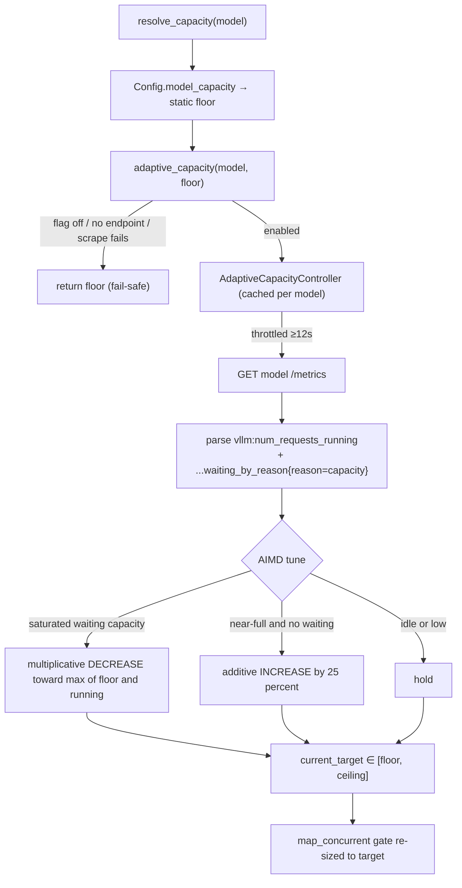

# Adaptive Model Concurrency — auto-scaling LLM/embedding fan-out to real vLLM capacity

> CONCEPT:AU-KG.compute.surfaces-universal-latency-signal. Builds on the static per-model concurrency controller
> (CONCEPT:AU-KG.compute.concurrency-controller-sizing, `agent_utilities/core/model_concurrency.py`).

## The problem

LLM/embedding fan-out (`map_concurrent` / `map_concurrent_sync`) is gated by a
**static** per-model capacity: `Config.model_capacity` =
`parallel_instances × max_parallel_calls` (default 1, live homelab value ~4). That
number is a *guess* baked into config — it cannot grow when a beefier GPU or an
extra vLLM instance is added, and it cannot tell when the serving tier is actually
saturated. So fan-out either under-utilises new hardware (a hardcoded ceiling that
never moves) or over-drives a busy engine.

## The controller

`agent_utilities/core/model_capacity_autoscale.py` adds an **AIMD
(additive-increase / multiplicative-decrease) controller, one per model, cached**.
It watches each model's vLLM Prometheus signals and auto-tunes the per-model
concurrency *target* between a floor and a ceiling, with **no hardcoded small
ceiling** — it ramps `4 → … → 512` as the hardware allows.

### Metrics URL derivation

The model's `/metrics` URL is derived from its `base_url`:
`http://host/v1` → `http://host/metrics` (drop a trailing `/v1`, append
`/metrics`). E.g. embedding `bge-m3` at `http://vllm-embed.arpa/v1` →
`http://vllm-embed.arpa/metrics`.

### Signals (per `model_name` label)

| Gauge | Meaning |
|-------|---------|
| `vllm:num_requests_running` | in-flight requests now |
| `vllm:num_requests_waiting_by_reason{reason="capacity"}` | **>0 ⇒ SATURATED** (engine at scheduling capacity) |

GPU memory is *not* used as a saturation signal — on Grace-Blackwell unified-memory
parts `nvidia-smi` reports `memory.used=N/A`. vLLM's capacity-waiting gauge is the
primary, reliable saturation signal.

### AIMD logic

- **SATURATED** (`waiting{capacity} > 0`) → multiplicative **decrease** toward the
  sustainable level: `target = max(floor, running)`, at least `target × 0.8`.
- **HEALTHY & near-full** (`running ≥ 0.8 × target` and no capacity-waiting) →
  additive **increase**: `target += max(1, target × 0.25)` to discover headroom.
- **idle / low** → hold.
- **Bounds**: floor = the static configured capacity (never below — no regression);
  ceiling = `MODEL_MAX_CONCURRENCY` (default 512).

Scraping is **lazy and throttled** (min ~12 s between polls), so it never adds a
network round-trip per call.

### Semaphore resize

The fan-out gate in `model_concurrency.py` is cached by `(model, capacity)`. When
the adaptive target changes, the next `map_concurrent`/`map_concurrent_sync` call
resolves the new capacity and gets a fresh, larger/smaller `asyncio.Semaphore` /
`ThreadPoolExecutor` at that size — the gate "resizes" by being re-created at the
new size. `reset_controllers()` drops both the gates and the adaptive controllers.

### Fail-safe

If `/metrics` is unreachable, returns garbage, or the model has no `base_url`,
`adaptive_capacity` returns the static floor unchanged — ingestion never breaks.
With `KG_ADAPTIVE_CONCURRENCY=0` the behaviour is byte-for-byte the static path.

## Config knobs

| Var | Default | Meaning |
|-----|---------|---------|
| `KG_ADAPTIVE_CONCURRENCY` | on | Master switch. Off → static capacity only. |
| `MODEL_MAX_CONCURRENCY` | 512 | Ceiling the target can ramp to (per model). |

These are read via `config.setting(...)` (live), not bare `os.environ`.

## Observability

`get_utilization(model)` returns a snapshot — `running`, `waiting_capacity`,
`current_target`, `floor`, `ceiling`, `metrics_ok`, `saturated`, `last_poll`,
`metrics_url`. It is surfaced in `EngineTasks.lane_metrics()` under
`model_concurrency` (for the `embedding`, `lite`, and `default` roles), so an
operator can see over/under-utilisation of the vLLM serving tier next to lane
congestion.

## Where it plugs in

`resolve_capacity(model)` (the one function `map_concurrent` /
`map_concurrent_sync` already call) now resolves the static capacity as the floor
and returns the adaptive target. Every existing fan-out consumer
(`pipeline/phases/embedding.py`, `enrichment/semantic.py`) picks up the adaptive
value automatically — no consumer change needed.
