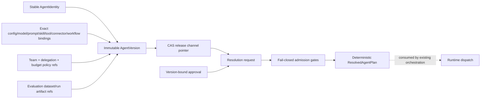

# Agent control-plane release admission

`agent_utilities.control_plane.agents` is the typed governance boundary for
agent identities and releases. It resolves a release into a deterministic,
dispatch-neutral plan. It does not start an agent, call a model, invoke a tool,
or select a transport. Existing orchestration remains the runtime authority.

## Contract flow

## Immutable release content

An identity is derived from publisher, package, and agent name. A version is
content-addressed over its normalized binding set, policy-set digest, and
evaluation-evidence digest. Each binding is an exact kind/version/reference /
artifact-digest/schema-digest tuple. Configuration, model, prompt, skill,
tool, connector, and workflow bindings are separate typed fields; duplicate
logical IDs in a kind are rejected, so an alias cannot silently select two
versions. Workflow dependencies use exact binding IDs, are bounded, and are
checked for unknown references and cycles before a version can exist.

No model carries inline configuration bodies, prompts, tool results, connector
credentials, URLs, or secret values. References are opaque controlled
coordinates and digests are the only durable content evidence. Evaluation
state is represented by bounded dataset and passed-run references, never by
inline rows, scores, or result bodies.

## Channels, promotion, and rollback

`AgentReleasePointer` is the sole pointer for an `(agent_id, channel)` key.
Every promotion or rollback supplies the expected revision and expected
version, and the repository applies it through one compare-and-swap operation.
The new pointer records its prior version and carries a deterministic pointer
digest. Rollback is limited to the pointer's recorded previous release; an
arbitrary version cannot bypass the release history. The same approval gate
binds the target version, channel, policy digest, and evaluation digest for
both promotion and rollback.

## Pre-dispatch admission

Resolution accepts either a channel pointer or an explicitly pinned version,
never an ambiguous combination. Before returning a plan it requires an
approved, unexpired approval record whose identity, release, channel, policy,
and evaluation digests all match. It then checks requested binding IDs against
the approved set, team membership ceilings, delegation depth/fan-out and
delegated budget, plus token/cost/time ceilings. Unknown capabilities,
stale approvals, missing approvals, cycles, and every escalation fail closed
with stable error codes. No fallback release, default approval, or degraded
empty success exists.

The returned `ResolvedAgentPlan` contains only IDs, digests, bounded binding
references, and a deterministic resolution digest. It is intentionally not a
callable, process handle, credential, prompt body, or dispatch command.

## Repository and graph projections

`AgentRepository` is a storage-neutral protocol. An adapter may use the
authoritative knowledge engine or an approved relational read model, but must
retain immutable versions, enforce pointer CAS, and apply tenant/principal/
grant scope before ordering or pagination. `AgentPage` and
`AgentGraphProjection` are bounded allow-listed summaries; they contain no
private authority material, raw policy bodies, evaluation results, or runtime
payloads. A cross-tenant page or scope-mismatched cursor is rejected by the
service boundary.
