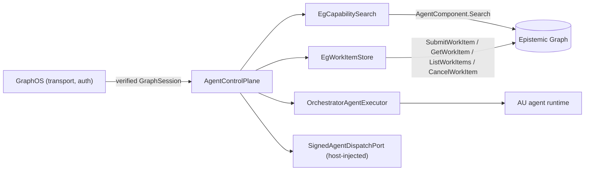

# Agent control plane

Agent Utilities exposes its agent-application operations to a host (GraphOS)
through one typed, transport-free API: `agent_utilities.api`. The host owns
authentication, MCP/REST/A2A registration and deployment. Agent Utilities owns
the behaviour. Epistemic Graph (EG) owns every durable record.

```mermaid
flowchart LR
  Host["GraphOS (transport, auth)"] -->|verified GraphSession| Plane["AgentControlPlane"]
  Plane --> Search["EgCapabilitySearch"]
  Plane --> Store["EgWorkItemStore"]
  Plane --> Exec["OrchestratorAgentExecutor"]
  Plane --> Dispatch["SignedAgentDispatchPort (host-injected)"]
  Search -->|AgentComponent.Search| EG[(Epistemic Graph)]
  Store -->|SubmitWorkItem / GetWorkItem / ListWorkItems / CancelWorkItem| EG
  Exec --> Runtime["AU agent runtime"]
```

## Operations

| Operation | Scope | Port |
|---|---|---|
| `graph_rlm` | `kg:read` (`evolve_prompt`: `kg:write`) | none; runs in AU |
| `resolve_capability` | `kg:read` | `CapabilitySearchPort` |
| `execute_agent` | `kg:write` | `AgentExecutionPort` |
| `submit_agent_task` | `kg:write` | `WorkItemStorePort` + `SignedAgentDispatchPort` |
| `get_work_item` / `list_work_items` | `kg:read` | `WorkItemStorePort` |
| `cancel_work_item` | `kg:write` | `WorkItemStorePort` |

`AgentControlPlane.operation_descriptors` publishes the request/result JSON
schemas. It is metadata, not a dispatcher.

## Composition

`compose_eg_agent_control_plane(eg_client, session, runner=..., authentication_method=...,
policy_digest=..., catalog_digest=..., model_digest=..., signed_dispatch=...)`
binds the concrete adapters:

* **`EgWorkItemStore`** builds EG's `RequestContext` only from the verified
  session, privacy-sanitizes the task body and metadata before digesting or
  sending them, and returns EG's `created`/`replayed` outcome unchanged. Reusing
  an idempotency key for a different payload raises `WorkItemIdempotencyConflict`.
  The sanitized body lives in reserved `au:` metadata keys, and callers may not
  write to that prefix.
* **`EgCapabilitySearch`** sends a typed, tenant-scoped `AgentComponent.Search`
  for `skill` and `a2a_agent_card` components and keeps EG's ranking order.
* **`OrchestratorAgentExecutor`** runs AU's agent runtime with the caller's
  verified session bound as the ambient graph authority for the whole run.

An adapter whose EG method is not served by the connected engine raises
`AgentControlPlaneUnavailable`. Agent Utilities never falls back to raw
queries or a local store.
