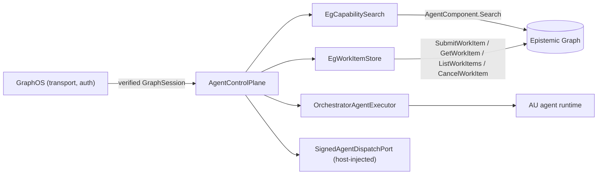

# Agent control plane

Agent Utilities exposes its agent-application operations to a host (GraphOS)
through one typed, transport-free API: `agent_utilities.api`. The host owns
authentication, MCP/REST/A2A registration and deployment. Agent Utilities owns
the behaviour. Epistemic Graph (EG) owns every durable record.

```mermaid
flowchart LR
  Host["GraphOS (transport, auth)"] -->|verified GraphSession| Plane["AgentControlPlane"]
  Plane --> Search["EgCapabilitySearch"]
  Plane --> Store["EgWorkItemStore"]
  Plane --> Exec["OrchestratorAgentExecutor"]
  Plane --> Dispatch["SignedAgentDispatchPort (host-injected)"]
  Search -->|AgentComponent.Search| EG[(Epistemic Graph)]
  Store -->|SubmitWorkItem / GetWorkItem / ListWorkItems / CancelWorkItem| EG
  Exec --> Runtime["AU agent runtime"]
```

## Operations

| Operation | Scope | Port |
|---|---|---|
| `graph_rlm` | `kg:read` (`evolve_prompt`: `kg:write`) | none; runs in AU |
| `resolve_capability` | `kg:read` | `CapabilitySearchPort` |
| `execute_agent` | `kg:write` | `AgentExecutionPort` |
| `submit_agent_task` | `kg:write` | `WorkItemStorePort` + `SignedAgentDispatchPort` |
| `get_work_item` / `list_work_items` | `kg:read` | `WorkItemStorePort` |
| `cancel_work_item` | `kg:write` | `WorkItemStorePort` |
| `get_run_output` | `kg:read` | `RunOutputPort` |

`AgentControlPlane.operation_descriptors` publishes the request/result JSON
schemas. It is metadata, not a dispatcher.

## Composition

A host that owns only the caller's EG client and verified session uses
`compose_hosted_agent_control_plane(eg_client, session)`. Agent Utilities binds
every port itself: the EG adapters below, agent execution on the process
runtime, a signed-queue dispatcher and a redacted run-output reader. The
process runtime is opened once by the host through `agent_utilities.api.runtime`
(`open_process_runtime`, the host lock and drain/close). It is never created
implicitly.

Task admission can carry `allowed_tools` (at most 64). The list is signed into
the dispatch carrier, so a changed list fails verification, and the worker
passes it to the agent's toolset construction. If dispatch is refused, the
admitted WorkItem is cancelled with reason `dispatch_admission_failed`.

Capability search never sends free text to EG. A request with a typed
`task_iri` (one of EG's five task terms) searches the ontology. A request
naming an agent walks the bounded catalog. Any other request has no match.

`compose_eg_agent_control_plane(eg_client, session, runner=..., authentication_method=...,
policy_digest=..., catalog_digest=..., model_digest=..., signed_dispatch=...)`
binds the concrete adapters:

* **`EgWorkItemStore`** builds EG's `RequestContext` only from the verified
  session, privacy-sanitizes the task body and metadata before digesting or
  sending them, and returns EG's `created`/`replayed` outcome unchanged. Reusing
  an idempotency key for a different payload raises `WorkItemIdempotencyConflict`.
  The sanitized body lives in reserved `au:` metadata keys, and callers may not
  write to that prefix.
* **`EgCapabilitySearch`** sends a typed, tenant-scoped `AgentComponent.Search`
  for `skill` and `a2a_agent_card` components (with `task_iri` when given) and
  keeps EG's ranking order.
* **`OrchestratorAgentExecutor`** runs AU's agent runtime with the caller's
  verified session bound as the ambient graph authority for the whole run.

An adapter whose EG method is not served by the connected engine raises
`AgentControlPlaneUnavailable`. Agent Utilities never falls back to raw
queries or a local store.
