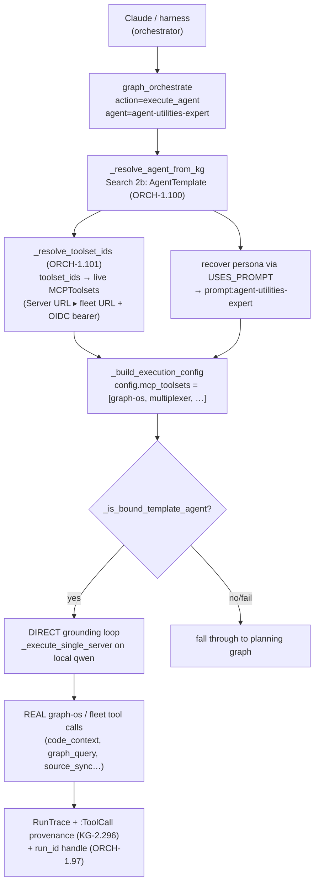

# The `agent-utilities-expert` agent — the native, KG-bound delegate

> CONCEPT:ORCH-1.100 (native, KG-bound, dispatchable expert persona) ·
> ORCH-1.101 (bind the template's `toolset_ids` into LIVE MCP toolsets)
> A resident expert persona for ecosystem work — the **default delegate target** named
> in `AGENTS.md`'s *"Delegate to the KG + graph-os"* section. It lets Claude/the harness
> hand an ecosystem task to a **local-LLM expert grounded in the Knowledge Graph**
> instead of doing the work itself.

## What it is

`agent-utilities-expert` is a **built-in `AgentTemplate`** that turns a packaged persona
prompt into a *dispatchable, KG-bound agent*. It understands the whole agent-utilities
ecosystem — the 5 pillars (KG / ORCH / AHE / ECO / OS), the one-engine ontology-driven
Knowledge Graph, the dev discipline (worktree workflow, Native / Wire-First /
Two-surfaces / No-Legacy, anti-sprawl, the Quality Bar, concept-ID coordination), SDD
(`.specify/specs` + the `:SpecProposal` / OS-5.73 review gate), graph-os + the
multiplexer + the full `engine_<domain>` MCP surface, connectors / ingestion (KG-2.9
`source_sync`, KG-2.59 `mcp_tool` presets, `code_context` self-understanding), and the
evolution loop (`graph_loops`, `EvolutionState` / saturation, the AHE-3.x hardening
cycle) — and it **manages and evolves the platform as code**.

It is the persona you reach for whenever the work is *"about agent-utilities itself"*: a
question about how an area works, a development task, a deploy/troubleshoot step, or an
evolution step. Because it runs on the **local LLM** and grounds its answers in the KG, it
is the embodiment of the delegation-first model — see
[`delegation-first-operating-model.md`](delegation-first-operating-model.md).

## Why it exists

The platform is built so the local model + graph-os do the work and the harness
orchestrates + resolves exceptions. For that to hold, there must be a **competent local
delegate** for ecosystem work — otherwise every "how does X work?" / "do Y in the repo"
falls back to Claude doing it by hand. `agent-utilities-expert` is that delegate:

- It is **native** — packaged with the framework, not a per-session ad-hoc agent.
- It is **KG-bound** — it answers by querying graph-os / `code_context`, not by
  hallucinating, so its claims are grounded and cited.
- It is **dispatchable** — `graph_orchestrate action=execute_agent` resolves it and runs
  it through the same execution seam (and the same `RunTrace` / `:ToolCall` provenance,
  KG-2.296) as any other delegated run, so the harness can steer it and read exactly what
  it did.

## How it works

Three pieces wire the persona into a runnable, grounded agent.

### 1. The persona prompt

`agent_utilities/prompts/agent-utilities-expert.json` is a `StructuredPrompt` (the
`{task, identity, instructions.core_directive, tools, skills}` shape). Its
`core_directive` is the operating manual: how it orients on the self-documentation
surface first, the 5-pillar / one-engine model, the *query-the-KG-before-grep* loop, its
native tools (graph-os `go__*`, the multiplexer meta-tools, the full `engine_<domain>`
surface), the cardinal dev rules, SDD, connectors/ingestion, the Loop engine, and
(sections 10–11, added with KG-2.297) **how it is deployed** and **how it troubleshoots
itself across every layer**. It is ingested as a base prompt node `prompt:agent-utilities-expert`.

### 2. Registration as a dispatchable `AgentTemplate` (ORCH-1.100)

A prompt blueprint is only a *persona*; an `AgentTemplate` is what makes that persona a
*runnable agent* — it binds the system-prompt node, the toolsets, and the model
preference. `agent_utilities/agent/registry_builder.py` declares the built-in template in
`_BUILTIN_AGENT_TEMPLATES` and seeds it via `seed_builtin_agent_templates(engine)`, which
runs on the **same prompt-ingest path** (right after the prompt nodes are upserted in
`ingest_prompts_to_graph`). Seeding is best-effort and idempotent (keyed on the stable
node id) and wires a `USES_PROMPT` edge so resolution can recover the system prompt:

```python
{
  "id": "at:agent-utilities-expert",
  "name": "agent-utilities-expert",
  "role": "ecosystem-expert",
  "system_prompt_id": "prompt:agent-utilities-expert",
  "toolset_ids": ["graph-os", "mcp-multiplexer", "repository-manager-mcp",
                  "data-science-mcp", "scholarx-mcp"],
  "model_preference": "qwen/qwen3.6-27b",   # local fleet model; the router gets final say
  "execution_tier": "standard",
}
```

`orchestration/agent_runner._resolve_agent_from_kg` gained an **`AgentTemplate`
resolution arm** (Search 2b): it matches the name/id, recovers the persona via the
`USES_PROMPT` edge, and `_build_execution_config` drives the run with that persona — so
`graph_orchestrate execute_agent agent=agent-utilities-expert` runs the expert on the
local LLM.

### 3. Binding `toolset_ids` into LIVE MCP toolsets (ORCH-1.101)

ORCH-1.100 alone resolved the persona prompt and its `toolset_ids`, but `run_agent` only
built live MCP toolsets for `type=="server"` agents with a URL — so the template's
`toolset_ids` were **never turned into callable tools** and the expert ran prompt-only and
**hallucinated** (it answered with invented tools like `ingest_external_connector` /
`get_tool_definition` instead of the real `source_sync` / `graph_analyze code_context`).
ORCH-1.101 closes that:

- **`_toolset_for_id`** resolves ONE `toolset_id` to a live `MCPToolset`, reusing the
  existing machinery (no new binder, no new transport): prefer an explicit served `url`
  on a `:Server` node (the `mcp_config`-derived registry), else fall back to the homelab
  fleet served-URL convention `http://<id>.<domain>/mcp` (`_fleet_server_url`, the same
  resolution the focused-tools path ORCH-1.74 uses). The toolset carries the OIDC
  service-account bearer (`_spawn_auth_headers`) so jwt-protected `*.arpa` servers don't
  reject the call.
- **`_resolve_toolset_ids`** binds the whole list, skipping (and logging) any single id
  that fails to bind so the persona still gets every toolset that *did* resolve (e.g.
  `graph-os` for grounding) even if one server is unreachable.
- **`_build_execution_config`** binds the template's `toolset_ids` into
  `config["mcp_toolsets"]` so the persona actually **has** graph-os + the fleet.
- **`_is_bound_template_agent` + `run_agent` dispatch**: a bound template runs a **DIRECT
  grounding loop** (its persona prompt + its bound toolsets, via `_execute_single_server`)
  rather than the full planning graph — which would over-decompose the ask and never let
  the persona/tools drive a single query-then-answer turn. It falls through to the graph
  on failure.

The same commit also fixed a pre-existing connect bug in `mcp/toolset_factory.py` that
blocked **every** remote HTTP MCP toolset: fastmcp ≥3.x calls the httpx client factory
with `follow_redirects=`, which the factory rejected — so no remote toolset could connect
until it was accepted (plus forward-compat `**kwargs`).

**Live proof:** all five `toolset_ids` bind and route to the grounding loop; the bound
`graph-os` toolset connected to live graph-os (72 tools discovered, incl. `source_sync` /
`graph_query` / `graph_analyze`) and a read-only `graph_query` executed against the live
KG (20,538 nodes) — i.e. the expert can now ground its answers.

## Flow



## How to dispatch it

Over MCP / graph-os:

```text
graph_orchestrate action=execute_agent agent=agent-utilities-expert task="<the ecosystem task or question>"
```

The return carries a `run_id` (ORCH-1.97) — query its `RunTrace` / `:ToolCall` chain to
see exactly which tools it called and what they returned (see
[`orchestration-execution-seam.md`](orchestration-execution-seam.md)). The expert's own
prompt also drives it to query the code KG (`graph_analyze action=code_context`) before
acting, and to read the self-documentation surface (`docs/start-here.md`, the pillar
docs, the `agent-utilities` skill-graph) first.

## Configuration / registration details

- **Node:** `AgentTemplateNode` id `at:agent-utilities-expert`, `is_permanent=True`,
  with a `USES_PROMPT` edge to `prompt:agent-utilities-expert`.
- **Seeding:** automatic on prompt ingestion (`ingest_prompts_to_graph` →
  `seed_builtin_agent_templates`); no separate step. Best-effort — a seeding failure
  never breaks prompt ingestion.
- **Toolsets:** `graph-os`, `mcp-multiplexer`, `repository-manager-mcp`,
  `data-science-mcp`, `scholarx-mcp` — resolved to served URLs at dispatch time.
- **Model:** prefers the local fleet model `qwen/qwen3.6-27b`; the adaptive
  model-router (ORCH-1.79) has the final say.
- **Skills it leans on** (declared in the prompt): `agent-utilities` (the platform's own
  skill-graph), `kg-ingest`, `kg-delegate`,
  `agent-utilities-evolution`, `agent-package-builder`, `agent-os-genesis`.

## Operating notes — when to use it vs a specific skill/workflow

- **Use `agent-utilities-expert`** for **open-ended ecosystem work**: understanding how
  an area works, a development/refactor task in the repo, a deploy/troubleshoot step, an
  evolution step, or any "do this in/about agent-utilities" ask where the right concrete
  skill/workflow isn't obvious. It will itself reach for the right `code_context` query,
  skill, or `engine_<domain>` tool.
- **Use a specific ingested skill or workflow** (`graph_orchestrate
  action=execute_agent agent=<skill>` / `action=execute_workflow name=<wf>`) when the
  task maps cleanly onto **one known capability** — e.g. `kg-ingest`,
  `agent-package-builder`, a named deployment workflow. It is the more direct, cheaper
  path when you already know which capability you want.
- **Either way, you stay the orchestrator + exception-resolver.** Read the run's
  `RunTrace` / `:ToolCall` provenance; if the expert (or a skill) ran ungrounded or
  failed, find why, fix the gap (a missing skill, an unbound tool, a prompt, missing
  ingestion), and re-delegate — hardening the system via the AHE-3.x loop so it
  self-handles next time.
