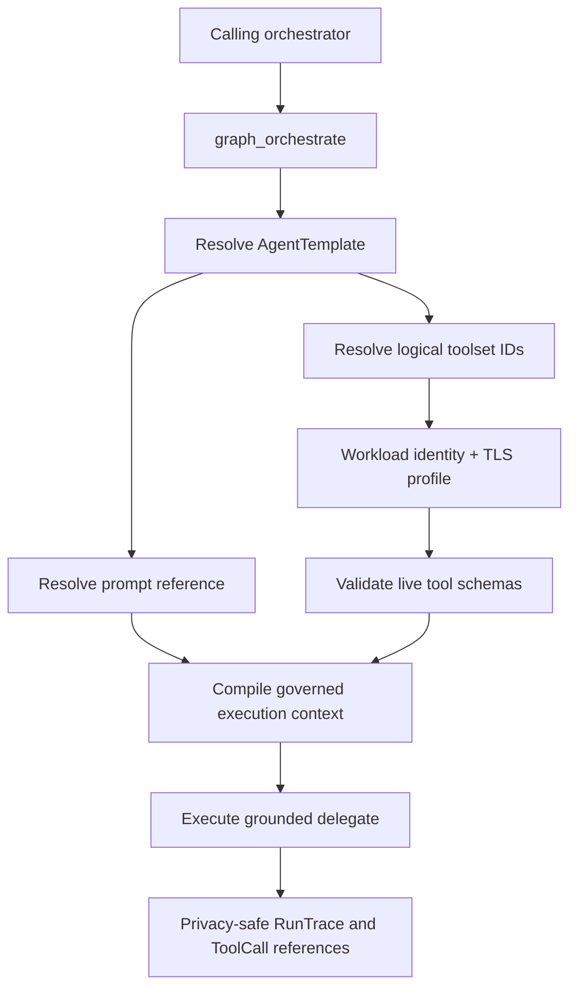

# `agent-utilities-expert`: the native KG-bound delegate

> CONCEPT:AU-ORCH.dispatch.builtin-agent-templates · ORCH-1.101

`agent-utilities-expert` is the packaged delegate for open-ended work about the
Agent Utilities ecosystem. It is a dispatchable `AgentTemplate` whose prompt,
capability references, tool use, and outcomes are grounded in the epistemic graph.

## Contract

The delegate is:

- **native:** its template and structured prompt ship with the package;
- **KG-bound:** it queries `code_context`, graph search, and the documentation graph
  before making repository or architecture claims;
- **dispatchable:** `graph_orchestrate` resolves and executes it through the standard
  execution seam;
- **policy-bound:** every tool call inherits verified `ActorContext`, ActionPolicy,
  tenant, and ACL enforcement;
- **observable:** runs emit privacy-safe `RunTrace` and `ToolCall` provenance; and
- **deployment-neutral:** the template stores logical toolset/model references, never
  service URLs, credentials, host names, filesystem locations, or personal identity.

Use it for ecosystem explanation, implementation, documentation, deployment diagnosis,
and governed evolution when a narrower packaged workflow is not already the obvious
choice.

## Persona and registration

`agent_utilities/prompts/agent-utilities-expert.json` is the structured persona. It
describes the architecture pillars, one-engine authority, development discipline,
specification workflow, GraphOS tools, connectors, ingestion, and optimization loop.
Prompt ingestion creates `prompt:agent-utilities-expert`.

The registry seeds an idempotent `AgentTemplateNode` and connects it to that prompt:

```python
{
    "id": "at:agent-utilities-expert",
    "name": "agent-utilities-expert",
    "role": "ecosystem-expert",
    "system_prompt_id": "prompt:agent-utilities-expert",
    "toolset_ids": [
        "graph-os",
        "repository-manager-mcp",
        "data-science-mcp",
        "scholarx-mcp",
    ],
    "model_preference": "economy",
    "execution_tier": "standard",
}
```

`model_preference` is a logical route. The model registry resolves it from XDG
AgentConfig at runtime; the template does not name a provider deployment.

## Live tool binding

At dispatch time, `_resolve_toolset_ids` resolves each logical toolset ID through the
configured fleet registry. The registry is supplied by the operator-owned runtime
profile and contains endpoint discovery plus authentication/TLS references. The
template itself remains portable.

For each remote MCP server:

1. resolve the current served endpoint from the fleet registry;
2. obtain the outbound workload credential through `OIDC_CLIENT_SECRET_REF` and
   the configured OIDC client metadata;
3. resolve the applicable TLS profile;
4. establish the MCP transport;
5. fetch the live tool schema and apply the policy-filtered allow-list; and
6. record only opaque server/tool references in the trace.

A toolset that cannot be authenticated, verified, schema-matched, or authorized is not
bound. The agent must not invent a replacement tool or bypass the failed boundary.

`_build_execution_config` passes the resulting MCP toolsets to the direct grounding
loop. If the selected shape requires broader planning, the same bound references flow
through the standard orchestration graph.

## Flow


```mermaid
flowchart TD
    O[Calling orchestrator] --> G[graph_orchestrate]
    G --> R[Resolve AgentTemplate]
    R --> P[Resolve prompt reference]
    R --> B[Resolve logical toolset IDs]
    B --> I[Workload identity + TLS profile]
    I --> S[Validate live tool schemas]
    P --> C[Compile governed execution context]
    S --> C
    C --> E[Execute grounded delegate]
    E --> T[Privacy-safe RunTrace and ToolCall references]
```

## Dispatch

```text
graph_orchestrate agent=agent-utilities-expert task="<ecosystem task>"
```

The result includes a `run_id`. Query its trace chain to inspect selected logical
tools, policy decisions, evidence references, and outcomes. Raw credentials, personal
identity, endpoint values, prompt content, and filesystem paths are excluded from
durable trace data.

## Configuration

Deployment configuration belongs in
`$XDG_CONFIG_HOME/agent-utilities/config.json` and the external fleet registry:

- leave both external GraphOS process-identity sources unset only for tiny,
  packaged-local GraphOS over stdio with no configured engine endpoints;
- configure exactly one external GraphOS process identity for every network
  transport, non-tiny profile, explicit engine endpoint, or other entry point;
- configure JWT issuer/JWKS, audience, and policy version on network surfaces;
- reference TLS profiles for every remote engine, MCP, model, and observability
  transport;
- resolve model and connector credentials from runtime secret references; and
- keep workspace locations runtime-only and non-persistent.

Before delegation, validate the boundary:

```bash
agent-utilities doctor --only config auth secrets transport_security graph_connections
```

## Choosing the expert or a packaged workflow

- Use `agent-utilities-expert` when the task spans multiple ecosystem areas or needs
  KG-guided discovery.
- Use one of the ten pre-bundled workflows when the task maps directly to its domain,
  such as `graph-ingestion-and-integration`,
  `graph-orchestration-and-automation`, `agent-utilities-development`,
  `agent-utilities-evolution`, or `agent-utilities-deployment`.

In both cases, review `RunTrace` and `ToolCall` provenance. A failure should become a
governed optimization proposal through the shared trace/outcome loop, not an untracked
manual bypass.
