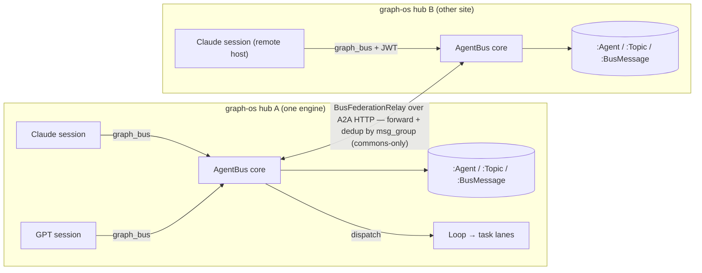
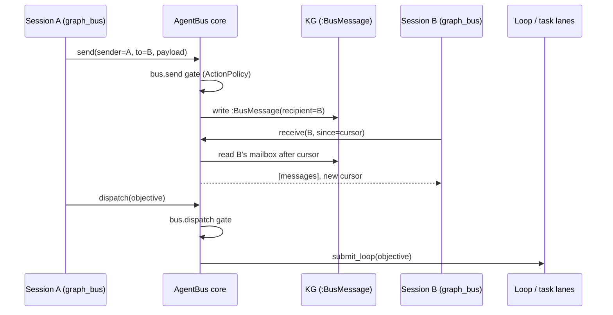

# Agent Communication Bus (AgentBus)

> One shared graph-os hub lets **any** session — many Claude Code sessions, other LLMs,
> sessions from any first-party provider, on **any host** — register, discover each other,
> message each other, and hand work to the fleet, for the cost of the LLM calls each side
> already makes. **CONCEPT:ECO-4.84 / ECO-4.85 / ECO-4.86 / ORCH-1.80 / KG-2.141 / ECO-4.87.**

## Why

The platform already had a *human*-reach core (`MessagingService`, ECO-4.48) and a host-local
*invoker↔spawned-agent* channel (`agent_channel.py`, ORCH-1.40). What was missing was a way for
**independent sessions** to address and talk to **each other**. The AgentBus fills that gap by
making presence and messages first-class, durable KG objects, so the bus is cross-process,
cross-host (everyone is an HTTP client of the same engine), and survives restarts.

## Design at a glance

- **Durable-store-first.** A participant is an `:Agent` node; a message is a `:BusMessage` node
  linked to its recipient (`:hasBusMessage`); a subscription is `:Agent -[:SUBSCRIBES_TO]-> :Topic`
  (KG-2.141). No volatile in-RAM channel is on the read path, so any process on the same engine —
  including a remote session over streamable-http — sees the same roster and mailbox.
- **Cursor delivery.** `receive(since)` returns the slice after the `since` count and the new
  cursor — at-least-once, the same model as `agent_channel.receive`.
- **Presence is computed, not written.** The roster derives `online`/`offline` from `last_seen`
  vs a staleness window, so a crashed session shows offline with no reaper.
- **Governed.** Every `send` passes the fail-closed ActionPolicy `bus.send` gate; a `dispatch`
  passes `bus.dispatch` and turns a message into fleet work via `submit_loop` (ORCH-1.80).
- **Hybrid auth.** Cross-host participants authenticate with a JWT (the served-profile is
  fail-closed over streamable-http); local stdio stays frictionless. `agent_id` should derive
  from the authenticated `ActorContext.actor_id` so ids don't collide across hubs.
- **Two surfaces.** The `graph_bus` MCP tool and the `/graph/bus` REST twin dispatch into the one
  `AgentBus` core (ECO-4.85).

## Hub topology + mesh

Within one hub, cross-host "just works": remote sessions are HTTP clients of the same engine, so
the durable mailbox is shared. Across hubs, the **BusFederationRelay** (ECO-4.86) forwards a
message group to peer hubs (registered as A2A peers carrying the `agent-bus-hub` capability),
deduping by `msg_group` and breaking loops via the `federated_from` stamp. Only `commons`-marked
traffic crosses a hub boundary (KG-2.60).

## Flow: send → receive → dispatch

## Surfaces & files

| Concern | Where |
|---|---|
| Core service | `agent_utilities/messaging/bus.py` (`AgentBus`) |
| MCP tool + REST twin | `agent_utilities/mcp/tools/bus_tools.py` (`graph_bus`) → `/graph/bus` |
| Federation relay | `agent_utilities/messaging/federation.py` (`BusFederationRelay`) |
| Ontology | `:Agent`/`:Topic`/`:BusMessage` in `knowledge_graph/ontology_orchestration.ttl` |
| Governance | `bus.send`/`bus.dispatch` in `orchestration/action_policy.py` + `deploy/action-policy.default.yml` |
| Observability | `agent_utilities_bus_*` in `observability/gateway_metrics.py`; Grafana `agent-bus.json` |
| Load harness | `scripts/bench_bus.py` |
| Capacity model | `docs/scaling/capacity_model.py` (`bus_plan_for`) |
| Health | `system_doctor` `bus` check (`deployment/doctor.py`) |

## Scale & profiling

`scripts/bench_bus.py` drives a live hub over `/graph/bus` and reports send/receive latency
percentiles + throughput, printing the modeled expectation from `docs/scaling/capacity_model.py`
alongside. The bus is durable-store-first, so its throughput is bounded by the same
single-connection engine anchor as everything else (~2 ops per delivered message). Use
`bus_plan_for(participants, msgs_per_sec, avg_recipients)` to size engine connections (shards) and
federated hubs; watch the `agent-bus` Grafana dashboard and the `bus` doctor check in production.
