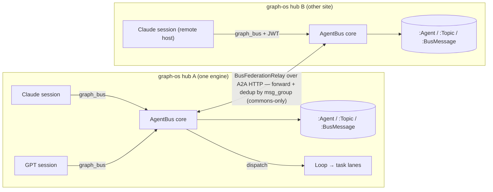
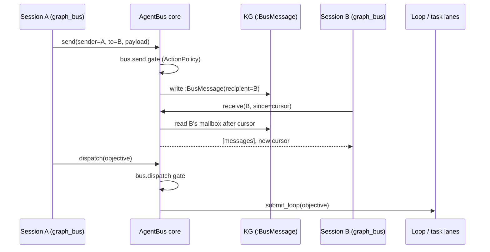
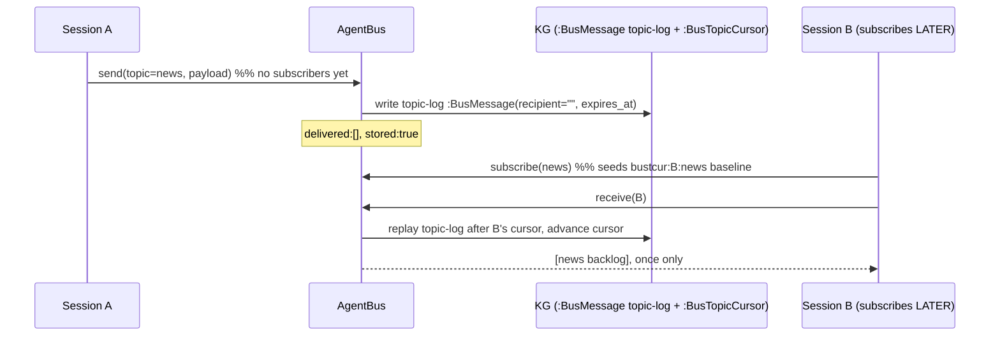
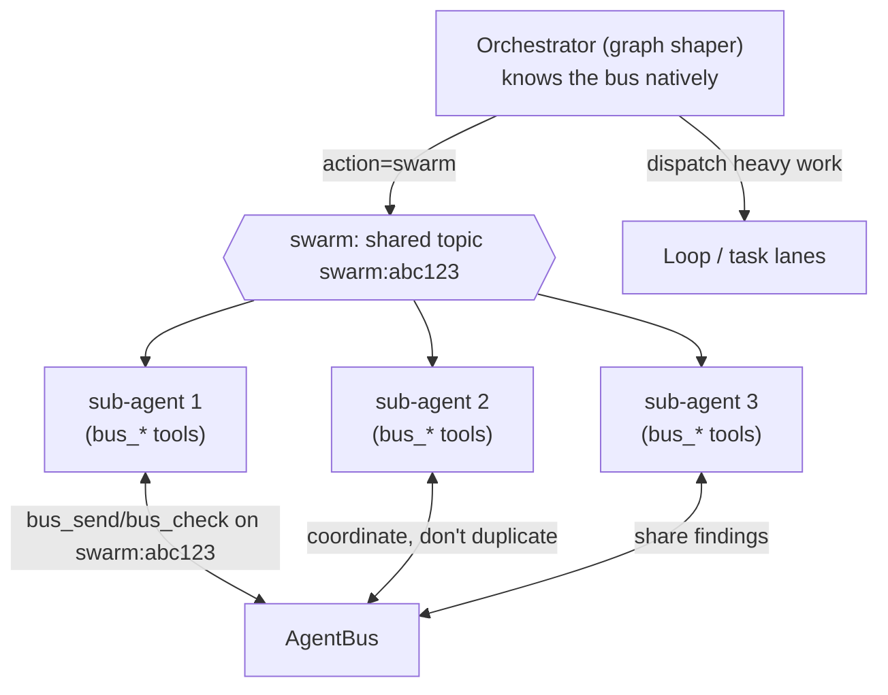

# Agent Communication Bus (AgentBus)

> One shared graph-os hub lets **any** session — many Claude Code sessions, other LLMs,
> sessions from any first-party provider, on **any host** — register, discover each other,
> message each other, and hand work to the fleet, for the cost of the LLM calls each side
> already makes. **CONCEPT:AU-ECO.bus.agentbus-federated-agent-agent / ECO-4.85 / AU-ECO.bus.federation-relay / AU-ORCH.routing.resolve-body-single-canonical / KG-2.141 / ECO-4.87.**

## Why

The platform already had a *human*-reach core (`MessagingService`, AU-ECO.messaging.messaging-reach-service-governed) and a host-local
*invoker↔spawned-agent* channel (`agent_channel.py`, AU-ORCH.session.session-anchored-collections-native). What was missing was a way for
**independent sessions** to address and talk to **each other**. The AgentBus fills that gap by
making presence and messages first-class, durable KG objects, so the bus is cross-process,
cross-host (everyone is an HTTP client of the same engine), and survives restarts.

## Design at a glance

- **Durable-store-first.** A participant is an `:Agent` node; a message is a `:BusMessage` node
  linked to its recipient (`:hasBusMessage`); a subscription is `:Agent -[:SUBSCRIBES_TO]-> :Topic`
  (KG-2.141). No volatile in-RAM channel is on the read path, so any process on the same engine —
  including a remote session over streamable-http — sees the same roster and mailbox.
- **Cursor delivery.** `receive(since)` returns the slice after the `since` count and the new
  cursor — at-least-once, the same model as `agent_channel.receive`.
- **Presence is computed, not written.** The roster derives `online`/`offline` from `last_seen`
  vs a staleness window, so a crashed session shows offline with no reaper.
- **Governed.** Every `send` passes the fail-closed ActionPolicy `bus.send` gate; a `dispatch`
  passes `bus.dispatch` and turns a message into fleet work via `submit_loop` (AU-ORCH.routing.resolve-body-single-canonical).
- **Hybrid auth.** Cross-host participants authenticate with a JWT (the served-profile is
  fail-closed over streamable-http); local stdio stays frictionless. `agent_id` should derive
  from the authenticated `ActorContext.actor_id` so ids don't collide across hubs.
- **Two surfaces.** The `graph_bus` MCP tool and the `/graph/bus` REST twin dispatch into the one
  `AgentBus` core (ECO-4.85).

## Hub topology + mesh

Within one hub, cross-host "just works": remote sessions are HTTP clients of the same engine, so
the durable mailbox is shared. Across hubs, the **BusFederationRelay** (AU-ECO.bus.federation-relay) forwards a
message group to peer hubs (registered as A2A peers carrying the `agent-bus-hub` capability),
deduping by `msg_group` and breaking loops via the `federated_from` stamp. Only `commons`-marked
traffic crosses a hub boundary (AU-KG.compute.data-is-private-its).

## Flow: send → receive → dispatch

## Store-and-forward — leave a message for a busy/offline peer (CONCEPT:AU-ECO.bus.store-and-forward-log)

A **direct** send (`to=`) already survives an offline recipient: it materializes a durable
`:BusMessage{recipient=to}` regardless of the peer's presence, so the peer picks it up on its
next `receive`. The gap was **topic** messages — a `send(topic=…)` with **zero current
subscribers** used to be dropped, and a peer that subscribed *later* never saw earlier traffic.

Store-and-forward closes both: every topic send ALSO writes one durable **topic-log** entry
(`:BusMessage{recipient="", kind="topic", expires_at}`, id `topicmsg:<group>`) on top of the
per-subscriber fan-out. A late subscriber replays that log via a **per-(agent,topic) cursor**
node (`:BusTopicCursor{agent_id,topic,last_ts}`, id `bustcur:<agent>:<topic>`) so each message
is read at most once and current subscribers (whose cursor is advanced to `now` at send time)
never get a duplicate.

- **Replay window:** by default a brand-new subscriber replays only messages **newer than its
  subscription** (no history dump). `subscribe(replay_recent=True)` backfills a bounded recent
  window (`TOPIC_REPLAY_RECENT_S`, 1h) so a joiner can catch up on what it just missed.
- **Bounded growth:** topic-log entries carry `expires_at = created + TOPIC_MSG_TTL_S` (24h); the
  bus reaper `AgentBus.prune_topic_log()` runs on the messaging daemon's existing reaper cadence
  (`router._inbox_reaper_loop`, alongside the ECO-4.83 inbox reaper) and deletes expired entries.
- **Upsert-clobber safety:** each agent's replay cursor is its **own node**, never a property on
  the shared `:Topic` node — the durable backend replaces a node's whole property blob on upsert,
  so a shared-node cursor would clobber every other agent's. (Same gotcha as `heartbeat`/inbox.)

## Auto-register + online presence (CONCEPT:AU-ECO.bus.auto-register-online-presence)

A session that has the `graph_bus` tool **appears online to peers without an explicit
`register` call**. Every `graph_bus` action resolves an acting id (the explicit
`agent_id`/`sender`, else a stable served-session identity) and calls `AgentBus.touch(id)`,
which **auto-creates** the `:BusAgent` on first reference and **bumps `last_seen`** on every
subsequent action — so merely *using* the bus keeps you rosterable and `presence=online`
(the roster still computes staleness lazily from `last_seen`, so a vanished session goes
`offline` on its own with no reaper).

**Session identity:** on served MCP requests FastMCP injects a `Context` whose `session_id`
(fallback `client_id`) is stable for the connection's life; `bus_tools._session_identity(ctx)`
derives `session:<id>` from it so a call that passes **no** `agent_id` is still auto-registered
and presence-tracked. **Limitation:** headless/in-process calls have no `Context` (identity is
`""`), so there the caller must still pass an id explicitly — we never fabricate one. `touch`
preserves an existing agent's capability/provider blob (no upsert clobber).

## Native capability — every agent knows the bus (CONCEPT:AU-ECO.bus.agent-bus-awareness)

The bus is **not** an opt-in persona you must select; it is a native capability the *graph
shaper* (the core orchestrator) and **every spawned swarm/sub-agent** inherit, per the
*Universal capability* rule. Three seams make that true, all bottoming out at the one
`create_agent` choke point (`agent/factory.py`):

1. **Awareness in the prompt.** `bus_capability_prompt()` (`messaging/bus.py`, single source) is
   appended to every agent's system prompt when universal tools are on — so each agent knows it
   can `bus_join`/`bus_peers`/`bus_send`/`bus_check` and `dispatch`, and that it should set up
   agent-to-agent comms whenever more than one agent is involved.
2. **Actionable native tools.** `bus_join` / `bus_peers` / `bus_send` / `bus_check`
   (`tools/agent_tools.py`, registered in `tools/tool_registry.py` alongside `reach_user`) wrap
   `AgentBus` in-process, so an agent uses the bus **without** needing the graph-os MCP bound.
3. **Swarms coordinate by default.** The swarm path (`graph_orchestrate action=swarm`) stamps a
   shared topic `swarm:<hash>` into `manifest.context`, so every wave agent is told to broadcast
   progress and ask peers on that topic instead of fanning in only at synthesis.

For a deeper, focused profile there is also a standalone blueprint
`prompts/bus_coordinator.json` (+ the `mcp_config.bus.json` preset that trims graph-os to just
`graph_bus`+`graph_reach`) — used when you want a dedicated bus-first session on a small model.

## Surfaces & files

| Concern | Where |
|---|---|
| Core service | `agent_utilities/messaging/bus.py` (`AgentBus`) |
| MCP tool + REST twin | `agent_utilities/mcp/tools/bus_tools.py` (`graph_bus`) → `/graph/bus` |
| Native agent tools (universal) | `tools/agent_tools.py` (`bus_join`/`bus_peers`/`bus_send`/`bus_check`) + `tools/tool_registry.py` |
| Capability awareness | `bus_capability_prompt()` (`messaging/bus.py`) injected at `agent/factory.py` |
| Swarm coordination | shared `swarm_topic()` in `mcp/tools/analysis_tools.py` (`action=swarm`) |
| Standalone preset | `prompts/bus_coordinator.json` + `mcp_config.bus.json` (2-tool focused surface) |
| Federation relay | `agent_utilities/messaging/federation.py` (`BusFederationRelay`) |
| Ontology | `:BusAgent`/`:Topic`/`:BusSubscription`/`:BusMessage`/`:BusTopicCursor` in `knowledge_graph/ontology_orchestration.ttl` |
| Store-and-forward (ECO-4.91) | topic-log `:BusMessage` + per-(agent,topic) `:BusTopicCursor`; reaper `AgentBus.prune_topic_log()` |
| Auto-presence (AU-ECO.bus.auto-register-online-presence) | `AgentBus.touch()` + `bus_tools._session_identity(ctx)` (served-session id) |
| Governance | `bus.send`/`bus.dispatch` in `orchestration/action_policy.py` + `deploy/action-policy.default.yml` |
| Observability | `agent_utilities_bus_*` in `observability/gateway_metrics.py`; Grafana `agent-bus.json` |
| Load harness | `scripts/bench_bus.py` |
| Capacity model | `docs/scaling/capacity_model.py` (`bus_plan_for`) |
| Health | `system_doctor` `bus` check (`deployment/doctor.py`) |

## Backend note (live-validated)

Reads resolve via the epistemic-graph **engine authority** (schema-less, source of truth);
rows optionally mirror to **Postgres/pg-age**. So bus state uses a dedicated `:BusAgent` label
(not the platform's typed `:Agent` table), a `created` timestamp (the per-table `created_at`
column is reserved `TIMESTAMPTZ`), and **1-hop** property reads with subscriptions as
first-class `:BusSubscription` nodes (AGE multi-hop traversals are unreliable). These were found
and fixed via a live E2E (`reports/agent-bus-live-e2e-findings-2026-06-21.md`).

## Scale & profiling

`scripts/bench_bus.py` drives a live hub over `/graph/bus` and reports send/receive latency
percentiles + throughput, printing the modeled expectation from `docs/scaling/capacity_model.py`
alongside. The bus is durable-store-first, so its throughput is bounded by the same
single-connection engine anchor as everything else (~2 ops per delivered message). Use
`bus_plan_for(participants, msgs_per_sec, avg_recipients)` to size engine connections (shards) and
federated hubs; watch the `agent-bus` Grafana dashboard and the `bus` doctor check in production.
