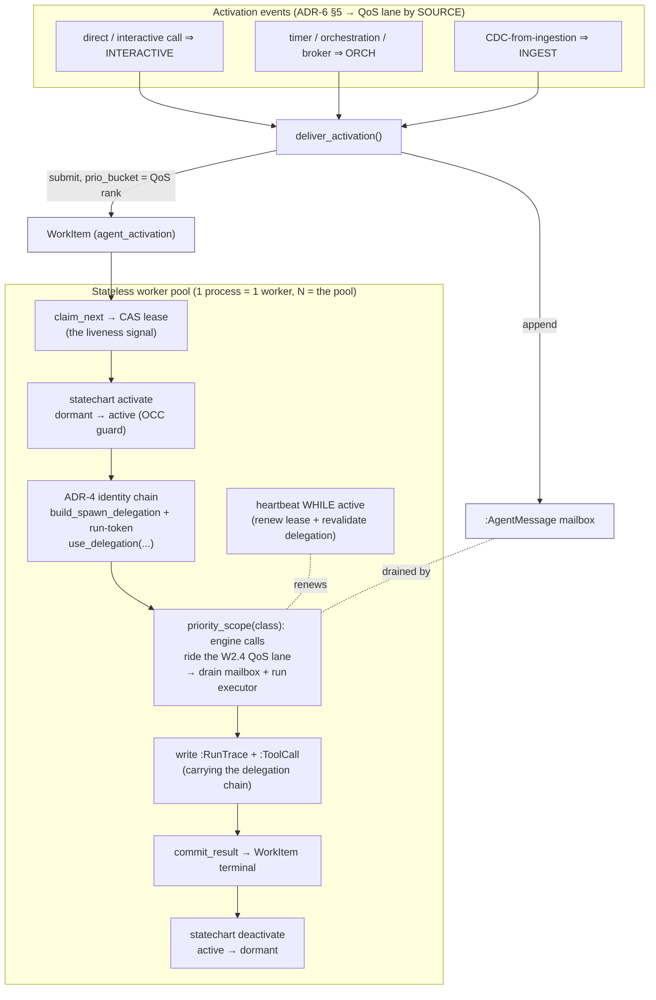

# Agents-as-data activation layer (ADR-6 / W2.3)

> **Concept:** `AU-ORCH.dispatch.agents-as-data-activation` ·
> **Module:** `agent_utilities/orchestration/agent_activation.py` ·
> **Engine:** `epistemic-graph` `src/agent_lifecycle_statechart.rs`

**A million agents are rows, not processes.** A dormant agent instance is a durable
`eg-statechart` `MachineInstance` (its `dormant ⇄ active` lifecycle) plus a per-tenant
graph node — **no connection, no thread, no heartbeat while dormant**. You pay only for
the agents you activate.

This is a *composition* of three stores that already exist, plus one worker loop. It is
**not** a new scheduler framework or actor library (the ADR-6 non-goals):

| Store | Role in the activation layer |
|---|---|
| **statecharts.redb** (`Method::Statechart`) | The agent-instance `MachineInstance` is the durable **lifecycle authority** (`dormant ⇄ active`, `terminated`). Template = the canonical [`AGENT_LIFECYCLE_DEF`], a byte-mirror of eg's `agent_lifecycle_statechart.rs`. |
| **WorkItem CAS** (the ADR-5 substrate) | Each *activation* is a `WorkItem` (kind `agent_activation`). Its redb CAS row is the sole **lease authority** (who may run); its own statechart is the activation lifecycle. **The lease *is* the liveness signal.** |
| **graphs** | The `:AgentInstance` dormant registry row (+ mailbox + a best-effort mirror of the authoritative lifecycle state), the `:AgentMessage` mailbox, and `:RunTrace` / `:ToolCall` provenance. |

## Two lifecycles, composed — never one

The **agent-instance** lifecycle (`dormant ⇄ active`) is distinct from an **activation's**
lifecycle (the WorkItem `submitted → ready → leased → running → …`). `active` means "an
activation currently holds this instance"; the statechart's OCC `version` is the
instance-level concurrency guard (two racing activations of the *same* instance cannot both
land `dormant → active` — the second defers). Liveness is the WorkItem **lease**, never a
heartbeat on the dormant instance row — a dead worker's lease simply expires and the
activation re-queues (bounded retries → `dead_letter`, the ADR-5 machinery).

## The flow



### Backpressure (ADR-6 §5)

The activation's QoS admission class is derived from its **source**
([`activation_priority_class`]): `direct` ⇒ `INTERACTIVE`, `timer`/`orchestration`/`broker`
⇒ `ORCHESTRATION`, `cdc` ⇒ `BACKGROUND_INGESTION`. It rides both the WorkItem `prio_bucket`
(so `claim_next` selects an interactive activation before an ingest one) **and** the
`PriorityClass` the worker binds while running (so the engine calls the executor makes ride
the matching W2.4 engine QoS lane). Interactive activations preempt ingestion-triggered
ones end to end.

### Per-agent identity (ADR-4)

Each activation runs under the on-behalf-of chain: the worker resolves the originating
principal (carried on the WorkItem, or the ambient caller), builds a `SpawnDelegation`
(`[principal, …, agent:<name>:<run_id>]`), mints a per-activation run-scoped token, and
`use_delegation(...)`s it around the run. The chain is stamped on the `:RunTrace` **and**
every `:ToolCall`, so a single tool call's provenance shows its full on-behalf-of identity.
The heartbeat revalidates the delegated credential's expiry — revoking the caller lapses
the lease at the next beat (**bounded-time revocation**, no separate kill channel).

## Running it

```bash
# One process = one worker; N processes = the pool. Serves specific tenants
# (native ClaimWorkItem is tenant-scoped; omit --tenant for the bound-session tenant).
agent-activation-worker --workers 4 --tenant tenant-a --tenant tenant-b
```

The full LLM/tool loop plugs in via `set_activation_executor(...)`; until one is bound the
worker still does real, observable work (drain the mailbox + write provenance).

## Local scale proof (feeds W5.3)

`tests/unit/orchestration/test_agent_activation_scale.py` registers `N` dormant instances,
activates `M` of them through the worker pool, and asserts **exactly `M` are touched** —
activation is `O(activations)`, **independent of the dormant population `N`**. The instance
count is a parameter; `python -m tests.unit.orchestration.test_agent_activation_scale` runs
the full **100 000-dormant / 1 000-active** proof.

Standalone run (in-memory *floor* — the composed test double keeps every row in Python RAM):

| Metric | Value |
|---|---|
| Dormant instances | 100 000 registered in ~10.7 s |
| Dormant footprint | **~1.54 KiB / instance** (linear: 10k→107 MiB … 100k→244 MiB) |
| Concurrent activations | **1 000 / 1 000 completed** (~202/s, GIL-bound in-process pool) |
| Instances touched | **1 000 == M** (the other 99 000 untouched — O(M) proven) |
| Peak RSS | **283 MiB** (100k dormant + 1k concurrent activations) |

The in-memory numbers are a floor: the real engine's catalog/resident paging
(`EPISTEMIC_GRAPH_MAX_RESIDENT_GRAPHS`, cold-offload) keeps only resident graphs in RAM, so
RSS stays bounded well below the linear floor at 1M scale, and a **one-process-per-worker**
pool (the W5.1 k8s Deployment) gives true N-core parallelism rather than the GIL-bound
in-process thread pool. The 1M-instance cluster soak is W5.3.

[`AGENT_LIFECYCLE_DEF`]: ../../agent_utilities/orchestration/agent_activation.py
[`activation_priority_class`]: ../../agent_utilities/orchestration/agent_activation.py
