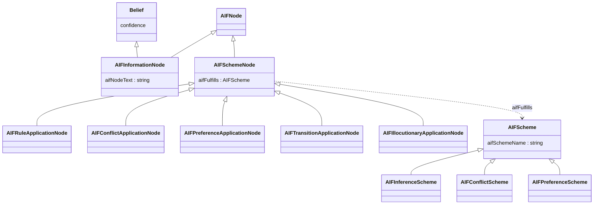
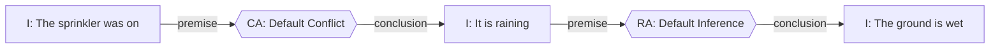

# AIF Argumentation (I-nodes/S-nodes → Dung acceptability)

> CONCEPT:AU-KG.argumentation.aif. Layers the **Argument Interchange Format**
> (AIF — Rahwan & Reed, "The Argument Interchange Format"; AIFdb/arg-tech.org)
> as a typed interchange vocabulary over the engine's EXISTING argumentation
> machinery. It does not add a second argumentation engine.

## Why AIF, and why not a new engine

`epistemic-graph`'s `eg-epistemic` crate already does argumentation natively:
Claim/Evidence/`BeliefState` confidence propagation, plus a paraconsistent,
justification-based TMS with genuine Dung abstract-argumentation semantics
(grounded/preferred/stable extensions) reachable standalone via
`Method::ResolveConflict` (see `epistemic-graph/AGENTS.md`, and
`agent_utilities/mcp/tools/epistemic_tools.py`'s `graph_epistemic` tool).

AIF is the *interchange formalization* of exactly that argumentation model —
a community-standard graph shape for exchanging arguments: an **I-node**
(information node) is a claim; an **RA-node** (Rule of inference Application)
is a support edge reified into a scheme application; a **CA-node** (Conflict
Application) is an attack/contradiction reified the same way; a **PA-node**
(Preference Application) states one side of a conflict is preferred. AIF+
adds **TA** (Transition Application, dialogue state) and **YA**
(Illocutionary Application, locution → proposition).

So the mapping is direct:

| AIF concept | This KG / engine concept |
|---|---|
| I-node | `:Belief` (a claim-with-confidence) — Claim/Evidence/`BeliefState` |
| RA-node (premises → conclusion) | A `SUPPORTS` edge from each premise to the conclusion |
| CA-node (premises → conclusion) | An `ATTACKS` edge from each premise to the conclusion |
| PA-node (premises → preferred conclusion) | A preference that discounts one side of a *mutual* CA-node conflict |
| Scheme (RA/CA/PA fulfils) | A named `:AIFScheme` individual (`:aifFulfills`) |
| Grounded/preferred/stable acceptability | `eg-epistemic`'s `Method::ResolveConflict` — unchanged, reused as-is |

`agent_utilities/knowledge_graph/argumentation/aif.py` builds the AIF
argument-map objects and the `to_dung()` projection; it never recomputes
grounded/preferred/stable itself.

## Ontology

`ontology_argumentation.ttl` (imported by the canonical `ontology.ttl`)
declares the Upper Ontology (node hierarchy) and Forms Ontology (scheme
templates):



Edges (`:aifHasPremise` / `:aifHasConclusion`, with inverses
`:aifIsPremiseOf` / `:aifIsConclusionOf`) are uniform across every S-node
kind — the Upper Ontology's edge model does not vary by scheme type: an edge
INTO an S-node is one of its premises; an edge OUT OF an S-node is its
(single) conclusion. `shapes/argumentation.shapes.ttl` enforces the arity
each kind requires (RA/CA: ≥1 premise + exactly 1 conclusion; PA: ≥2
premises + exactly 1 conclusion; I-node: non-empty text).

## Example argument graph

The rain/sprinkler textbook example — `i3` conflicts with `i1` via `ca1`;
`i1` supports `i2` via `ra1`:



On import, `i1`/`i2`/`i3` become `:Belief`-typed nodes; `ra1`/`ca1` become
`:AIFRuleApplicationNode`/`:AIFConflictApplicationNode` nodes; AND the engine
also gets a direct `i1 -SUPPORTS-> i2` edge and a direct `i3 -ATTACKS-> i1`
edge — the exact topology `Method::ResolveConflict` reads.

## End-to-end path: JSON → graph → Dung acceptability

```mermaid
flowchart TD
    subgraph Interchange["AIF interchange (aif.py — pure, no engine)"]
        J["AIFdb-shaped JSON\n{nodes, edges}"]
        FJ["from_aifdb_json()"]
        AM["ArgumentMap\n(AIFNode / AIFEdge)"]
        V["validate_argument_map()\n(SAME arity rules as the SHACL shapes)"]
        DP["to_dung()\n→ DungProjection\n(arguments, attacks, supports,\npreferences, dropped_attacks)"]
        J --> FJ --> AM --> V
        AM --> DP
    end

    subgraph Write["import_argument_map() — the ONE connector write path"]
        NA["native_authority()\n(memory/native_ingest.py)"]
        IGS["ingest_graph_slice()\n(ingestion/envelope_ingest.py)"]
        CE["ChangeEnvelope\n(ONE atomic transaction)"]
        V -->|valid| NA --> IGS --> CE
    end

    subgraph KG["Knowledge Graph"]
        BEL[":Belief nodes\n(I-nodes)"]
        SN["AIF S-node types\n(RA/CA/PA/TA/YA)"]
        AIFE["aifHasPremise /\naifHasConclusion edges"]
        DERE["derived SUPPORTS /\nATTACKS edges"]
        CE --> BEL
        CE --> SN
        CE --> AIFE
        CE --> DERE
    end

    subgraph Evaluate["graph_argument(action=\"evaluate\")"]
        DISP["engine_tools._dispatch()\n(SAME dispatcher graph_epistemic uses)"]
        DP -->|arguments| DISP
    end

    subgraph Engine["eg-epistemic (Rust, unchanged)"]
        RC["Method::ResolveConflict\ngrounded / preferred / stable"]
        DERE -.->|belief/attack topology| RC
        DISP --> RC
    end

    RC --> RES["surviving / defeated / undecided\n+ extension_sets"]
```

`export_argument_map()` (graph → AIF JSON) is the read-side mirror: a
best-effort, tag-filtered node+edge scan (mirrors the established
`ops_causal_graph.load_ops_causal_neighborhood` idiom) reconstructing an
`ArgumentMap`, rendered back to AIFdb JSON via `to_aifdb_json()`.

## Surfaces

- **MCP tool:** `graph_argument` (`agent_utilities/mcp/tools/argument_tools.py`)
  — actions `import_aif` / `export_aif` / `evaluate` / `add_scheme`.
- **REST twin:** `POST /graph/argument` — the generic `ACTION_TOOL_ROUTES`
  factory in `kg_server._build_server` dispatches through the SAME
  `_execute_tool` core every other action-routed tool uses; no bespoke
  handler.
- **Skill:** `kg-argument` (`agent_utilities/skills/kg-argument/SKILL.md`).

## What this deliberately does NOT do

- No second argumentation solver. `to_dung()` is a pure, structural
  projection (arguments + attacks + preferences); acceptability is always
  computed by `eg-epistemic`'s `Method::ResolveConflict`.
- No parallel claim store. Every I-node is written and read through the
  SAME `:Belief`/`ChangeEnvelope` path every other claim in the KG uses.
- PA-node preference filtering only ever resolves a *mutual* (symmetric)
  CA-node conflict — the classic motivation for preference-based
  argumentation (Amgoud & Cayrol, 2002). A one-directional attack is left
  exactly as the CA-node declared it.
