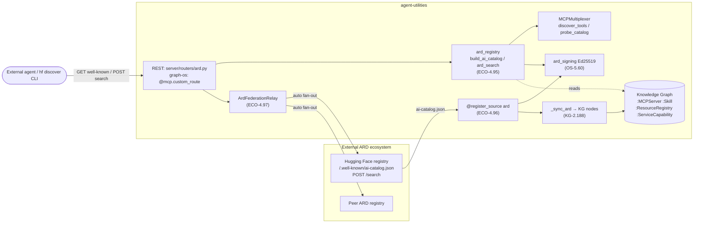

# Agentic Resource Discovery (ARD) interop

agent-utilities is both a **publisher** and a **consumer** of [Agentic Resource
Discovery](https://huggingface.co/blog/agentic-resource-discovery-launch) (ARD) — a draft
open spec (Hugging Face, Microsoft, Google, GoDaddy) that separates capability *discovery*
from *execution*. Instead of hardcoding an MCP URL, an agent discovers tools/skills/agents
at runtime through two artifacts plus federation:

- a **static manifest** `ai-catalog.json` at `/.well-known/ai-catalog.json` (publisher
  identity, per-resource name/description, tags, example queries, media type, signature);
- a **dynamic registry API** `POST /search` (ranked results for an NL query with a
  media-type filter);
- **federation** (`auto`/`referrals`/`none`) so one registry's search surfaces another's
  resources; and
- **publisher verification** — domain-anchored identity + Ed25519-signed datapoints.

We map our existing fleet onto ARD's envelope rather than building anything new. Media
types: `application/mcp-server+json`, `application/mcp-server-card+json`,
`application/ai-skill`.

## Concepts

| Concept | What |
|---|---|
| **ECO-4.95** | Publish registry — `build_ai_catalog` + `ard_search` core (`ecosystem/ard_registry.py`), served REST + graph-os routes |
| **ECO-4.96** | Consume connector — `@register_source("ard")` (`protocols/source_connectors/connectors/ard.py`) |
| **ECO-4.97** | Federation relay — `ArdFederationRelay` (`ecosystem/ard_federation.py`) |
| **KG-2.188** | Materialization — `_sync_ard` + `_DELTA_HANDLERS["ard"]` (`knowledge_graph/core/source_sync.py`) + ontology terms |
| **OS-5.60** | Ed25519 datapoint signing/verification (`security/ard_signing.py`) |

## Publish — become a registry

`ecosystem/ard_registry.py` is the single core both serving surfaces call:

- **`GET /.well-known/ai-catalog.json`** → `build_ai_catalog()` — fleet MCP servers (probed
  via `MCPMultiplexer.probe_catalog`) become `application/mcp-server+json` resources and KG
  `:Skill` nodes become `application/ai-skill` resources; tags + example queries come from
  `derive_capability_synonyms`. Each entry is Ed25519-signed; the manifest carries the
  `publisherKey`.
- **`POST /search`** → `ard_search()` — ranks fleet tools via `MCPMultiplexer.discover_tools`
  (token overlap blended with KG semantic search — the same path `find_tools` rides) and KG
  skills by lexical overlap, filtered by the requested media types.

Both are served twice for surface parity: the gateway router `server/routers/ard.py` and the
graph-os `@mcp.custom_route` mirrors in `mcp/kg_server.py` (the container the deploy mechanic
restarts). Signing keys follow the run-token custody model — private key only from
`setting("ARD_SIGNING_PRIVATE_KEY")` (OpenBao `apps/agent-utilities/ard`), `cryptography`
import-guarded so the lean image still boots (serving unsigned).

## Consume — ingest external registries

`@register_source("ard")` fetches a registry's `ai-catalog.json`, verifies each entry's
Ed25519 signature against the manifest `publisherKey` (domain-anchored), and yields
`SourceDocument`s. `_sync_ard` materializes them under `domain="ard"` as typed
`:MCPServer`/`:Skill` nodes, each `registeredIn` a `:ResourceRegistry` and
`providesCapability` a `:ServiceCapability` per tag. Configure with `ARD_REGISTRIES`
(e.g. `[{"name":"hf","preset":"huggingface"}]`); it is delta-capable and swept automatically.

## Federate

`ArdFederationRelay` mirrors `BusFederationRelay`: peers are A2A peers tagged `ard-registry`.
`POST /search` reads `federationMode` (default `setting("ARD_FEDERATION_MODE")`): `none` =
local; `referrals` = local + peer list; `auto` = concurrent fan-out to peers' `/search`,
merged and re-ranked, de-duplicated by `(publisher domain, resource id)`. Loop-break: peer
requests are sent with `federationMode="none"` and a `via` chain stamped with our origin; an
inbound request already carrying our origin is served local-only (a structural `max_depth = 1`).



## Configuration

| Key | Purpose | Default |
|---|---|---|
| `ARD_PUBLISHER_DOMAIN` | Domain-anchored publisher identity in the manifest | hostname |
| `ARD_SIGNING_PRIVATE_KEY` | Base64 Ed25519 seed (OpenBao-injected) | ephemeral (unsigned) |
| `ARD_SPEC_VERSION` | Draft revision stamped into the manifest | `draft-0` |
| `ARD_FEDERATION_MODE` | Default `/search` federation mode | `none` |
| `ARD_REGISTRIES` | JSON list of registries to ingest | none |
| `ARD_REQUIRE_SIGNATURE` | Drop unsigned inbound entries | `false` |

## Verify

```bash
# Serve (after restarting graph-os / gateway):
curl -s http://localhost:<port>/.well-known/ai-catalog.json | jq .
curl -s -X POST http://localhost:<port>/search -H 'content-type: application/json' \
  -d '{"query":{"text":"container management","filter":{"type":["application/mcp-server+json"]}},"pageSize":5}' | jq .

# Consume HF (set ARD_REGISTRIES=[{"name":"hf","preset":"huggingface"}]):
#   source_sync source=ard mode=full   (via served MCP/REST)
#   graph_query "MATCH (n) WHERE n.domain='ard' RETURN labels(n), count(*)"
```

The always-run proof is offline (`tests/unit/ecosystem/test_ard_*.py`,
`tests/unit/protocols/test_ard_connector.py`): build + sign a manifest, consume it through
the real connector, and assert `_sync_ard` writes the typed KG nodes.
