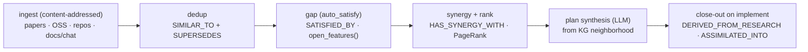

# Graph-Native Assimilation Engine

> **CONCEPT:KG-2.7** — Research Assimilation (+ KG-2.5 synergy, KG-2.10 orchestration synthesis)
> **Package:** `agent_utilities/knowledge_graph/assimilation/` · **Driver:** `research/golden_loop.py` · **MCP:** `graph_orchestrate(action="assimilate")`
> **Strategy/plan:** `.specify/specs/ecosystem-evolution/`

## Why

The first evolution pass read every paper with an LLM, found synergies by hand, and
re-discovered "does this already exist?" by re-reading — none of which scales, and
it repeatedly re-proposed already-built features. The assimilation engine makes the
hard parts **graph operations over one Evidence/Capability Knowledge Graph**, so the
LLM is used only at the edges (per-source extraction; plan synthesis from a
neighborhood). Cost grows with the *delta*, not the *corpus*.

## The graph

Sources (`Article`/`Source`/`Document`/`Requirement`/`Decision`), capabilities
(`SDDFeature`/`Capability`), and our `Concept`s, linked by:
`SIMILAR_TO` (dedup) · `SUPERSEDES` (duplicate/older) · `SATISFIED_BY` (a feature our
code already provides) · `HAS_SYNERGY_WITH` (cross-pillar bundle) ·
`DERIVED_FROM_RESEARCH` / `ASSIMILATED_INTO` (provenance close-out) ·
`ADDRESSED_BY` (an in-flight plan). Edges carry a `_rel` property marker so the
lifecycle read path is backend-portable (`out_edges`/`in_edges` expose properties,
not the relationship label). Type matching is **case-insensitive** (the live graph
stores capitalized labels like `Article`; our enum values are lowercase).

## Pipeline (all graph compute except where noted)



| Stage | Module | What it does |
|---|---|---|
| ingest | `ingest.py`, `breadth_ingest.py` | docs→`Requirement`, chat→`Decision`, codebases via `IngestionEngine`; `canonical_source_id` collapses arxiv/DOI/URL/path dupes; `content_fingerprint` per-item skip |
| dedup | `dedup.py` | embedding all-pairs (engine `compute_similarity_edges` fast path / local fallback) → `SIMILAR_TO`; cluster → `SUPERSEDES` survivor→dup |
| gap | `gap_analysis.py` | match features↔our concepts → `SATISFIED_BY`; **`open_features`** = no closing edge/status (the "stop rediscovering" filter) |
| synergy + rank | `synergy.py` | Louvain communities (engine / components fallback) → cross-pillar `HAS_SYNERGY_WITH`; `rank_features` = `source_count × (1+centrality)` (PageRank / degree fallback) |
| plan synthesis | `plan_synthesis.py` | `hydrate_feature` neighborhood → SDD plan (planner role; grounded-template fallback) → propose + flip feature to `proposed` |
| ledger / close-out | `ledger.py` | `record_feature`/`set_status`; on implement `close_out` writes provenance edges + status → permanently excluded |
| pilot | `pilot.py` | acceptance: asserts **no already-built feature is re-proposed** + emits ranked gaps |

## Idempotency (the "don't re-hit it" guarantee)

- **Ingest** is content-addressed — unchanged source = no-op (`content_fingerprint`); duplicate URIs collapse (`canonical_source_id`).
- **Cycle** carries a **state watermark** ((id, status, content_hash) of feature/source nodes); `golden_loop` skips the assimilate pass when the graph is unchanged (`force` overrides).
- **Lifecycle** excludes satisfied/superseded/implemented/in-flight features from `open_features`, so nothing built is re-proposed. Dedup/satisfy/synergy edges MERGE → re-runs converge.

## Running it

```python
# programmatic
from agent_utilities.knowledge_graph.research.golden_loop import run_assimilation_pass
run_assimilation_pass(synthesize=True, top_n=10)
```
```
# MCP
graph_orchestrate(action="assimilate")                  # dedup→gap→synergy→rank
graph_orchestrate(action="assimilate", task="synthesize")   # + propose plans
```
```
# autonomous daemon (golden-loop tick) — env-gated
KG_GOLDEN_LOOP=1 KG_GOLDEN_BREADTH=1 \
KG_BREADTH_LIBRARY_ROOTS=/path/to/open-source-libraries \
KG_BREADTH_REPO_ROOTS=/path/to/agent-packages
```
```
# breadth + acceptance pilot CLI
python scripts/run_assimilation_breadth.py ingest --libraries … --repos … --pilot
```

## Monitoring

Every `run_one_cycle` carries a `metrics` block (per-stage timings, `error_count`,
`open_gaps`, total duration), logs a structured health line, surfaces stage errors,
and persists a queryable `EvolutionCycle` node — query
`MATCH (c) WHERE c.type='orchestration_cycle' RETURN c.error_count, c.stage_ms` to
watch error rates / latencies and tune ingestion.

## Related

- [In-House Training Substrate](in_house_training_substrate.md) · [Global Workspace Attention](global_workspace_attention.md) · [MASS](multi_agent_social_system.md)
- Strategy: `.specify/specs/ecosystem-evolution/ASSIMILATION_STRATEGY.md`; plan: `…/PHASE0_IMPLEMENTATION_PLAN.md`.
