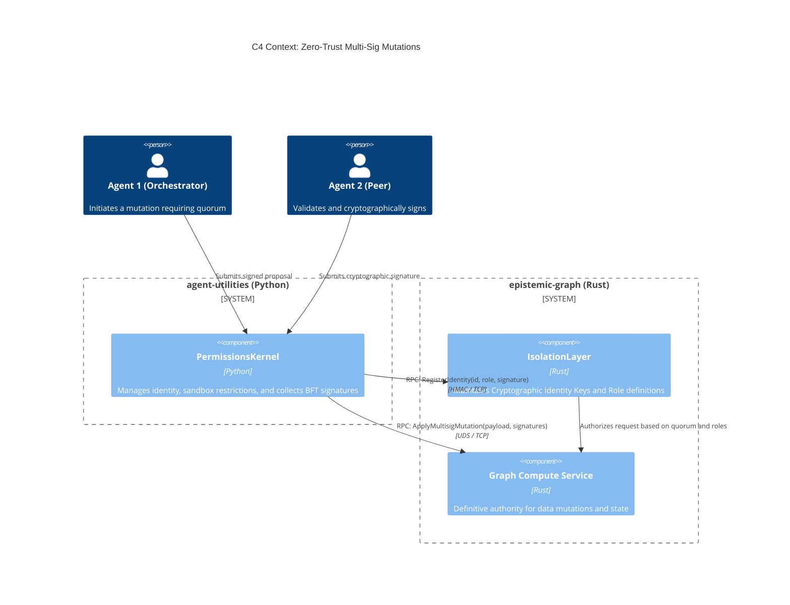
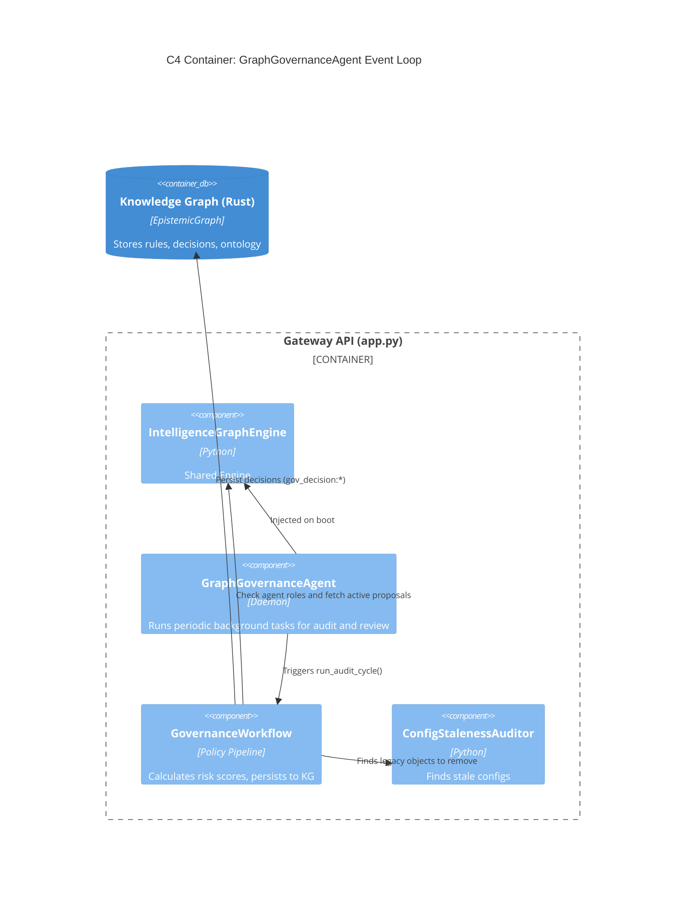

# Autonomous Governance & Zero-Trust Consensus

The ecosystem enforces **Zero-Trust** security across all operations utilizing the `PermissionsKernel` alongside a specialized background actor, the `GraphGovernanceAgent`.

## 1. Zero-Trust C4 Diagram

This illustrates how agent identities and multisig mutations flow securely to the Rust `epistemic-graph` service.

### Shared Architecture via IntelligenceGraphEngine

Both the legacy Graph workflows and the new background daemon tasks (like Consolidation and Governance) share a single, native gateway layer interface known as the `IntelligenceGraphEngine`.

When `agent_utilities` starts via `app.py`, the `FastAPI` lifespan boots a singleton `IntelligenceGraphEngine`. This engine establishes a pool of connections (UDS/TCP) to the persistent backends and the transient `epistemic-graph` service.

By injecting this exact `engine` into the `GraphGovernanceAgent` at startup, the governance daemon:
1. Reuses the exact same network pools, reducing socket pressure.
2. Sees identical state as the standard agent workloads.
3. Automatically respects the Zero-Trust policies enforced within the engine's `SyncEpistemicGraphClient`.

## 2. Governance Workflow Diagram

### Workflow Execution
1. **Audit Cycle**: Periodically, the daemon audits the graph for stale data or newly proposed `AGENTS.md` reflectors.
2. **Scoring**: It computes a `risk_score` for each ecosystem mutation proposal.
3. **Approval Gates**:
   - Low-risk (score < 0.4) are Auto-Approved by the Daemon.
   - High-risk (score > 0.4) are persisted as `PENDING` nodes in the Knowledge Graph for a human or a Multi-Sig threshold of administrative agents to approve.
