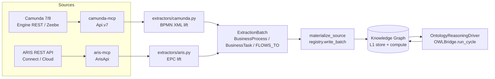
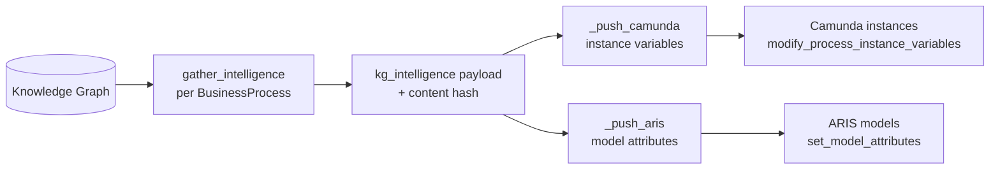

# Camunda + ARIS ↔ Knowledge Graph (bidirectional, OWL/RDF-native)

This is the end-to-end bridge between the **process world** (Software AG **ARIS**
models and **Camunda** BPMN processes) and the agent-utilities **Knowledge
Graph**. It is *bidirectional* and *OWL/RDF-native*: processes are **ingested**
into the KG as canonical ArchiMate ontology objects and reasoned over, and the
intelligence the KG accumulates is **enriched back** onto the live Camunda
instances and ARIS models.

It is built almost entirely on machinery that already existed — the canonical
ArchiMate ontology, the self-registering source-extractor framework, the OWL
bridge, and the ontology reasoning driver — so this is mostly *wiring*, not new
substrate. (CONCEPT:KG-2.8, KG-2.9, KG-2.53, KG-2.79.)

## The one ontology

Camunda, ARIS, and Egeria all fold into the **same canonical ArchiMate
crosswalk** (`ontology_archimate.ttl`, `ontology_quant.ttl`,
`ontology_orchestration.ttl`). There is no per-vendor schema:

| Concept | OWL class / property | Camunda source | ARIS source |
|---|---|---|---|
| Process | `:BusinessProcess` | process definition | EPC / VAD model |
| Step | `:BusinessTask` (`subClassOf :BusinessProcess`) | task/gateway | function / rule operator |
| Sequence flow | `:flowsTo` | `sequenceFlow` | control-flow connection |
| Same-process identity | `:alignedWith` (`ALIGNED_WITH`) | egeria GUID / — | `camundaKey` / egeria GUID |
| Realizing workflow | `:realizesProcess` (`REALIZES`) | — (compiled) | — (compiled) |
| Incident | `:Incident` (`AFFECTS`) | incident | — |
| Data | `:DataObject` | — | — |

Because the types are shared, an ARIS EPC process and its Camunda implementation
**collapse to one identity** under reasoning (via `ALIGNED_WITH`), and a single
query answers "show everything about this process" regardless of which tool it
came from.

## Inbound — ingest processes INTO the KG



- The **extractors** turn an injected vendor client into a uniform
  `ExtractionBatch`. `camunda.py` parses BPMN 2.0 XML; `aris.py` lifts the EPC
  (functions → `BusinessTask`, rule operators → gateway `BusinessTask`, events
  collapsed, connections → `FLOWS_TO` with branch conditions).
- **`materialize_source(backend, category, client)`**
  (`enrichment/materialize.py`) runs the registered extractor and persists the
  batch through the single generic writer. It chooses *materialize* over the
  query-time `register_rest_source` virtualization because cross-source
  reasoning (the `ALIGNED_WITH` crosswalk) needs the data persisted.
- After the write, **`OntologyReasoningDriver.extrapolate()`** promotes the new
  LPG types to OWL classes and runs one reasoning cycle, so the process
  structure is reasoned over natively (transitive `flowsTo`, `alignedWith`
  identity, governance attachment).

**Surface:** `graph_ingest(action="materialize_source", corpus_name="camunda"|"aris")`
(MCP) and `POST /graph/ingest/materialize-source` (REST).

## Outbound — enrich data back INTO Camunda & ARIS



`gather_intelligence` assembles four payloads per process, read through the
compute layer (the L1 `execute` is single-node-only, so edge reads go through
`GraphComputeReader`):

1. **Capability / code lineage** — Workflows that `REALIZES` the process and
   what they `ORCHESTRATES`.
2. **Ontology inferences** — `ALIGNED_WITH` twins, `governedBy` policies, and
   inferred relationships.
3. **Operational signals** — `Incident` nodes that `AFFECTS` the process.
4. **Glossary / data lineage** — `Concept` terms and `DataObject` data the
   process's tasks touch.

The payload is written under one namespaced key, `kg_intelligence`, as a Camunda
**process-instance variable** (Json) on every running instance, and/or an ARIS
**model attribute**. Writes are **hash-idempotent** (read-back, skip unchanged)
and individually fault-tolerant.

**Surface:** `graph_analyze(action="process_writeback", target="camunda"|"aris"|"both")`
(MCP) and `POST /graph/analyze/process-writeback` (REST). Gated by
`KG_PROCESS_WRITEBACK` (default off — it performs outbound mutations).

## Components

| Piece | Location | Role |
|---|---|---|
| Camunda extractor | `enrichment/extractors/camunda.py` | BPMN → KG |
| ARIS extractor | `enrichment/extractors/aris.py` | EPC → KG |
| Materialize | `enrichment/materialize.py` | run extractor + persist + reason |
| Process writeback | `enrichment/process_writeback.py` | KG intelligence → Camunda/ARIS |
| Process compiler | `process_plan_compiler.py` | `BusinessProcess` → executable Workflow |
| OWL bridge | `core/owl_bridge.py` | promote LPG → OWL, reason |
| Reasoning driver | `research/ara/reasoning_driver.py` | `extrapolate()` harvest |
| camunda-mcp | `agents/camunda-mcp` | Camunda 7/8 REST client |
| aris-mcp | `agents/aris-mcp` | ARIS REST client (read + gated write) |

## Configuration

Connector connection/credentials live in each connector package's environment,
read by its `auth.get_client()`:

- **Camunda** — `CAMUNDA_PLATFORM`, `CAMUNDA7_URL`/`CAMUNDA7_TOKEN`/basic, or the
  `CAMUNDA8_*` Zeebe/Operate/Tasklist set.
- **ARIS** — `ARIS_API_BASE`, OAuth2 (`ARIS_OAUTH_URL`/`ARIS_CLIENT_ID`/
  `ARIS_CLIENT_SECRET`/`ARIS_TENANT`) or `ARIS_TOKEN`/basic, `ARIS_PATHS_JSON`
  for tenants whose REST layout differs, and `ARIS_ENABLE_WRITE` for outbound.
- **Outbound gate** — `KG_PROCESS_WRITEBACK=1` (agent-utilities) to enable
  writeback at all.

See [Configuration Reference](configuration.md). For a guided, fully-configured
setup, use the **agent-utilities-process-integration** skill.

## Verification

```bash
# inbound, live (needs a Camunda 7 engine with a deployed definition)
CAMUNDA7_URL=http://camunda.arpa/engine-rest pytest -m live \
    tests/integration/test_camunda_live.py

# unit
pytest tests/unit/knowledge_graph/enrichment/test_aris_extractor.py \
       tests/unit/knowledge_graph/enrichment/test_materialize.py \
       tests/unit/knowledge_graph/enrichment/test_process_writeback.py
```

End-to-end over the live surface: `graph_ingest(action="materialize_source",
corpus_name="camunda")` → KG gains `bpmn_process:*` / `bpmn_task:*` / `FLOWS_TO`
and reasoning runs → `graph_analyze(action="process_writeback")` → the
`kg_intelligence` variable appears on the running Camunda instances.
