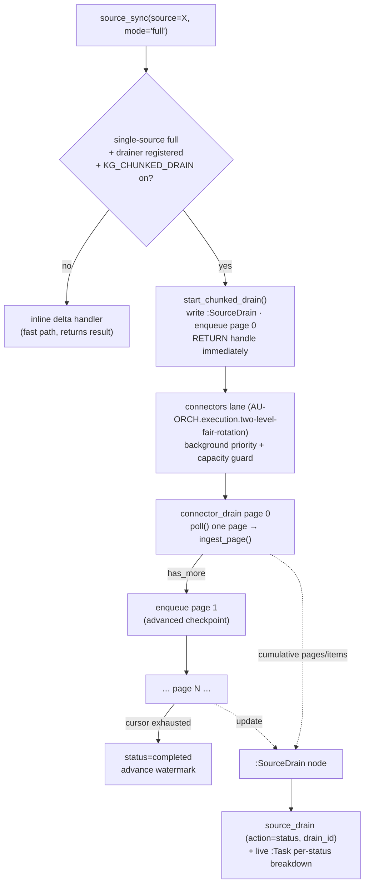

# Chunked async drain — one big `source_sync(full)` → capacity-guarded waves

> A single `source_sync(source=X, mode="full")` on a **large** corpus is no longer a
> long blocking call. It is normalized into a self-continuing stream of paginated,
> capacity-guarded background batch-tasks ("waves"), and you watch it finish with the
> `source_drain` status tool. Concepts: **CONCEPT:AU-KG.ontology.single-source-full-drain** (chunked async drain) and
> **CONCEPT:AU-KG.compute.connector-declared-page-drainer** (connector-declared page drainer). Source of truth:
> `agent_utilities/knowledge_graph/core/chunked_drain.py`.

This page builds on [Ingestion throughput](ingestion_throughput.md) (the lanes,
the best-effort cap, the tick-collapse, the bulk primitives) and on
[content-aware ingestion](content-aware-ingestion.md). Where that page is about
keeping the *steady-state* throughput lanes flowing, this one is about the one
operation that used to break that discipline: a **full re-ingest of a big source**.

## The problem — a full drain that monopolizes the request and the pool

A `source_sync(source=X, mode="full")` on a connector with a deep backlog
(FreshRSS's ~11k-article GReader history is the flagship) used to run
**synchronously, inline, to completion** and return the whole result in one call.
That has two failure modes:

1. **It blocks the MCP/REST request.** Draining 11k items in one call runs far past
   the gateway/MCP call budget (the 300s ceiling), so the request times out before
   the corpus is drained — or the operator is forced to hand-repeat narrow delta
   waves to nibble the backlog down.
2. **It monopolizes the worker / engine write path.** One giant inline fetch-and-
   ingest hogs a worker and funnels a flood of writes into the engine while it runs,
   starving the interactive / orchestration work that the resource-priority edict
   (CONCEPT:AU-ORCH.scheduling.resource-priority-edict/1.99) is supposed to protect.

The fix makes a full re-ingest **cooperative and non-blocking**: the one call
becomes many small, bounded, background page-tasks, each subject to the same
priority edict and the GB10 server-capacity guard (CONCEPT:AU-ORCH.dispatch.embedding-fanout/1.103) as
every other ingest unit — so it can neither time out the request nor OOM the box.

## How it works

### Routing — full single-source sync becomes a drain

`sync_source` in `core/source_sync.py` intercepts the case **before** the inline
delta handlers run:

```python
# CONCEPT:AU-KG.ontology.single-source-full-drain — a single-source FULL drain of a LARGE corpus must NOT run inline.
if mode == "full" and hasattr(engine, "submit_task"):
    if chunked_drain_enabled() and supports_chunked_drain(source):
        return start_chunked_drain(engine, source, mode="full")
```

So only a **single-source, `mode="full"`** sync against a source that has a
registered page drainer is chunked. Everything else stays on the fast inline path:
`source="all"`/`sweep` still fans out via `sweep_all_sources`, and `mode="delta"`
(or any small sync) runs inline and returns immediately as before. The chunked path
**reuses the existing `submit_task` + lane machinery** — there is no parallel
queue or scheduler.

### `start_chunked_drain` — return a handle immediately

`start_chunked_drain(engine, source, mode="full")`:

1. Resolves the source's `PageDrainer` (raises if none is registered).
2. **Idempotency guard:** `_active_drain_for` probes for an in-flight `:SourceDrain`
   node already `draining` this source; if one exists it returns that handle with
   `status="already_draining"` rather than starting a duplicate chain.
3. Mints a `drain_id` (`<source>-<8hex>`), writes the initial `:SourceDrain`
   progress node (`status="draining"`, zeroed counters, `started_at`), enqueues the
   **first** `connector_drain` page-task (page 0, no checkpoint), and **returns
   immediately** with `{drain_id, page_size, first_task, watch:{…}}` — never the
   drained result. The `watch` block hands back both the `source_drain` status-tool
   invocation and a ready-made `:Task` Cypher query.

### Each page-task drains one bounded page and self-continues

The `connector_drain` task type is dispatched in `core/engine_tasks.py`
(`_run_background_task`), which reads the task's `drain_id` / `drain_source` /
`sync_mode` / `drain_page` columns plus the serialized checkpoint from its metadata
blob, then calls `run_drain_page`. That function (in `chunked_drain.py`):

1. Rebuilds the connector via the `PageDrainer.build_connector(engine, mode)` — the
   connector is **stateless across tasks**; all pagination state lives in the carried
   `ConnectorCheckpoint`.
2. Resumes `PollConnector.poll(checkpoint)` from the carried cursor, draining **one
   bounded page** (`KG_DRAIN_PAGE_SIZE`, default 100 items).
3. Ingests that page via `PageDrainer.ingest_page(engine, docs)` and folds the
   returned counts into the cumulative `:SourceDrain` state (`pages_done`,
   `items_seen`, `items_ingested`).
4. **Self-continues:** while the returned checkpoint reports `has_more` (and the page
   isn't empty and the page backstop isn't hit), it enqueues the **next**
   `connector_drain` page-task carrying the advanced checkpoint. The corpus drains
   across many tasks until the cursor is exhausted.
5. **On exhaustion**, marks the drain `completed` (or `stopped_backstop` if the page
   cap was hit) and **advances the source watermark** (`_write_watermark`) so later
   `mode="delta"` syncs only pull what changed.

Two safety properties make this robust: it is **idempotent + resumable** (each
page-task replays from its carried checkpoint, and the write-layer content-hash
delta of CONCEPT:AU-KG.ingest.enterprise-source-extractor skips unchanged items so a re-drain is cheap), and it has a
**defensive page backstop** (`KG_DRAIN_MAX_PAGES`, default 5000) so a connector that
falsely reports `has_more` forever cannot loop unbounded.



### Connector-declared pagination (AU-KG.compute.connector-declared-page-drainer) — the `PageDrainer` registry

The driver is **not** FreshRSS-specific. A source opts into chunked drain by
registering a frozen `PageDrainer` dataclass via `register_page_drainer(...)`,
declaring two things:

- `build_connector(engine, mode) -> PollConnector` — build a connector whose `poll`
  walks the corpus via a resumable cursor. For `mode="full"` it must walk the
  **entire** backlog (bind no since-filter); for `"delta"` it may bind the watermark.
- `ingest_page(engine, docs) -> dict` — ingest one drained page and return its counts.

The generic `run_drain_page` driver then walks **any** such connector's cursor to
exhaustion. The flagship registration is FreshRSS: `_freshrss_build_connector` binds
**no `newer_than`** in `full` mode (so `poll` walks the entire GReader backlog via
the `continuation` cursor, with `batch_size` = the page size), and
`_freshrss_ingest_page` routes each page through the world-model relevance gate
(`WorldModelPipelineRunner`, CONCEPT:AU-KG.ingest.news-finance-tech-sibling) — so even a full backlog drain is
relevance-gated, returning `{items, ingested, relevant, marginal, research,
skipped_unchanged}` per page. `list_chunked_sources()` enumerates the registered set.

## The `source_drain` status tool

A full drain returns its handle instantly, so progress is observed out-of-band. The
new **`source_drain`** MCP tool (registered in `mcp/tools/ontology_tools.py`,
tags `graph-os` / `ingestion`) is how an operator or agent watches it:

| action | argument | returns |
|---|---|---|
| `status` | `drain_id` | the cumulative `:SourceDrain` state (`pages_done` / `items_seen` / `items_ingested` / `status` / timestamps) **plus** a live per-status breakdown of the chain's `connector_drain` `:Task` nodes (`{pending, running, completed, …}`) |
| `list` | — | the registered chunked-drain-capable sources (`list_chunked_sources()`) |

`drain_status(engine, drain_id)` in `chunked_drain.py` is the core: it reads the
`:SourceDrain` node and joins it with a `_control_cypher` query that counts the
drain's `:Task` rows by status (`WHERE t.drain_id = $id`), so one call shows both the
cumulative tally and how many page-tasks are still in flight. Because every
`connector_drain` `:Task` is stamped with `drain_id` / `drain_source` / `drain_page`
top-level, you can also watch a drain with a plain `graph_query` over `:Task` (the
exact query is handed back in the `start_chunked_drain` `watch.task_query` field).

> **Surface note.** The *start* of a drain rides `source_sync`, which is exposed on
> both the MCP surface and the REST gateway (per *Two surfaces by default*). The
> `source_drain` **status/list** surface is the MCP tool above; progress is also
> queryable through the generic `graph_query` REST/MCP surface over the
> `:SourceDrain` and `:Task` nodes, since the drain state is just graph data.

## Lane, priority, and capacity — why it can't hurt the box

`connector_drain` is mapped onto the **`connectors` lane** in `core/task_lanes.py`
(alongside `connector_sync` and `feed_sweep`). That placement is the whole point:

- It inherits the **background-ingestion priority edict** (CONCEPT:AU-ORCH.scheduling.resource-priority-edict/1.99):
  every page-task is enqueued at `priority=3` (the background bucket), so it yields to
  interactive / orchestration work and can never starve the harness.
- It inherits the **GB10 server-capacity guard** (CONCEPT:AU-ORCH.dispatch.embedding-fanout/1.103) that all
  ingestion shares, so the drain throttles to available LLM/embedding capacity rather
  than overrunning it.
- It is bounded by the `connectors` lane **soft timeout** (180s,
  `LANE_SOFT_TIMEOUT_SEC`, CONCEPT:AU-KG.compute.lane-bound-task) — each page is sized to complete well
  inside that bound, and a hung page is cancelled and retried via the
  retry→backoff→dead_letter machinery (CONCEPT:AU-KG.ingest.hardened-priority-scheduled-task) without pinning a worker.

So a full re-ingest of an 11k-item backlog drains as ~110 small background page-tasks
that interleave with everything else, instead of one inline call that times out the
request or one worker pinned for the whole drain.

## Config knobs

All are governed by *Configuration discipline* — auto-sized/defaulted; you rarely
touch them. They are read through `config.setting(...)`, so they are `config.json`-driven.

| Knob | Default | Meaning |
|---|---|---|
| `KG_CHUNKED_DRAIN` | `True` | Master switch for the chunked path (`chunked_drain_enabled()`). Off → a full single-source sync falls back to the inline handler. |
| `KG_DRAIN_PAGE_SIZE` | `100` | Items drained + ingested per `connector_drain` page-task (`_drain_page_size()`). Bounded so a page completes inside the lane timeout; also the connector's `batch_size`. |
| `KG_DRAIN_MAX_PAGES` | `5000` | Hard backstop on page-tasks one drain may chain (`_drain_max_pages()`) — defends against a connector that reports `has_more` forever (~110 pages for the 11k backlog, so generous headroom). Hitting it marks the drain `stopped_backstop`. |

Source-specific knobs still apply to the page ingest — e.g. FreshRSS's
`FRESHRSS_USE_NOVELTY` (default `False`) governs the world-model gate inside
`_freshrss_ingest_page`.

## Operating guidance

**Kick off a full re-ingest of a big source and watch it.**

1. Start it (returns instantly with a `drain_id`):
   `source_sync(source="freshrss", mode="full")` (MCP) or the REST twin
   `POST /graph/...` source-sync route. The response carries
   `{drain_id, page_size, first_task, watch:{…}}`.
2. Watch it drain: `source_drain(action="status", drain_id="freshrss-1a2b3c4d")`.
   `pages_done` / `items_seen` / `items_ingested` climb as page-tasks complete, and
   the `tasks` breakdown shows how many `connector_drain` tasks are still
   `pending` / `running`. When `status` flips to `completed`, the whole backlog is
   ingested and the watermark has advanced.
3. List what supports it: `source_drain(action="list")`.

**It composes with the existing lane/throughput system rather than bypassing it.**
The page-tasks are ordinary `:Task` rows on the `connectors` lane, so the
best-effort cap, the interactive reservation (CONCEPT:AU-KG.compute.interactive-lane-floor), the per-hop
profiler (`graph_ingest action=profile`), and `agent-utilities-doctor`'s
`ingestion_coverage` check all see and govern them like any other ingest. After a
drain completes, subsequent `mode="delta"` syncs are cheap because the watermark
advanced and the content-hash delta skips everything unchanged.

**When to reach for it.** Use a `mode="full"` drain for a first-time ingest of a deep
backlog or a deliberate full re-ingest after a clean-slate wipe; use `mode="delta"`
(or `source="all"` sweeps) for routine incremental freshness — those stay inline and
fast.

## See also

- [Ingestion throughput — lanes, tick-collapse, bulk primitives](ingestion_throughput.md)
- [Intelligent ingestion — classification, commit-history, embedding, tail](intelligent-ingestion.md)
- [Content-aware ingestion](content-aware-ingestion.md)
- [Delta-based ingestion recipe](../recipes/delta-ingestion.md)
- [Unified feeds](../recipes/unified-feeds.md)
