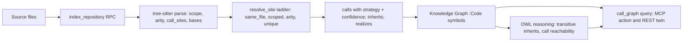

# Code Intelligence — type/scope-resolved call graph (CONCEPT:KG-2.100)

The Knowledge Graph models code as `:Code` symbols linked by `:calls`, `:inherits`,
`:realizes`, `:dependsOn`, `:covers`. The accuracy of those links is set by **how
calls are resolved**. Before KG-2.100 resolution was **name-only**: a method call
`obj.run()` bound to *any* symbol named `run`, and a callee name shared by more than
ten symbols was dropped entirely. KG-2.100 makes resolution **type- and
scope-aware**, computed in the Rust engine and shipped already-resolved.

## What changed

- **Resolution is in Rust, in one round-trip.** The `epistemic-graph` engine's
  `IndexRepository` op parses every file (rayon) **and** resolves cross-file calls
  over the whole batch, returning one merged graph. The Python pipeline calls it
  once instead of doing a separate parse pass plus a per-symbol Python resolution
  loop.
- **A resolution ladder, most-specific first** (`crates/eg-compute/src/parser/resolve.rs`):
  1. `same_file` — a definition in the caller's own file.
  2. `scoped` — a `self`/`this`/`super` (or implicit-this) call, or an explicit
     receiver naming a class, binds to that class's method or an **inherited** one.
  3. `arity` — same-name overloads disambiguated by argument count.
  4. `unique` — a single definition anywhere in the batch.
  5. otherwise **unresolved** — an ambiguous callee is never guessed.
  Every resolved `calls` edge carries a `strategy` and a `confidence`.
- **Structural class edges.** Class base/interface lists produce `inherits`
  (subclass to base) and `realizes` (class to interface) edges, resolved the same
  conservative way.
- **The OWL layer reasons over them.** `:inherits` is transitive, so the reasoner
  extrapolates inheritance chains; `:calls` reachability stays available to the
  graph algorithms (PageRank / community detection) over the now-accurate edges.

## The two ingest paths, one resolver

Both code-ingest paths consume the same Rust resolver:

- **Local `EnrichmentPipeline`** (`enrichment/pipeline.py`) — when the engine
  advertises `IndexRepository`, one `index_repository` call yields the symbols and
  the resolved `CALLS`/`INHERITS`/`REALIZES` edges. Name-only resolution remains
  only as the engine-unreachable fallback.
- **GitLab / source-sync** (`core/gitlab_indexer.py`) — already shipped each
  project to `index_repository`; it now also passes the `inherits`/`realizes`
  edges through, namespaced per instance.

## Surfaces

The resolved graph is queryable on both surfaces (same `_execute_tool` core):

- **MCP:** `graph_analyze(action="call_graph", node_id=<symbol>, target=<callees|callers|inherits>)`.
- **REST:** `GET /graph/analyze/call-graph?id=<symbol>&direction=<callees|callers|inherits>`
  (the action-routed `POST /graph/analyze` also accepts it).

## Flow

## Key files

| Layer | File |
|---|---|
| Rust extraction | `epistemic-graph/crates/eg-compute/src/parser/tree_sitter.rs` |
| Rust resolution | `epistemic-graph/crates/eg-compute/src/parser/resolve.rs` |
| Pipeline consumer | `agent_utilities/knowledge_graph/enrichment/pipeline.py`, `enrichment/extractors/code_test.py` |
| GitLab consumer | `agent_utilities/knowledge_graph/core/gitlab_indexer.py` |
| Ontology | `agent_utilities/knowledge_graph/ontology_software.ttl` (`:inherits`, `:realizes`) |
| Reasoning | `agent_utilities/knowledge_graph/core/owl_bridge.py` |
| Surfaces | `agent_utilities/mcp/tools/analysis_tools.py`, `agent_utilities/mcp/kg_server.py` |

This is the first increment of the code-intelligence cluster; later increments add
model-free similarity, code-to-service linking, and IaC/clone/git-coupling passes.
