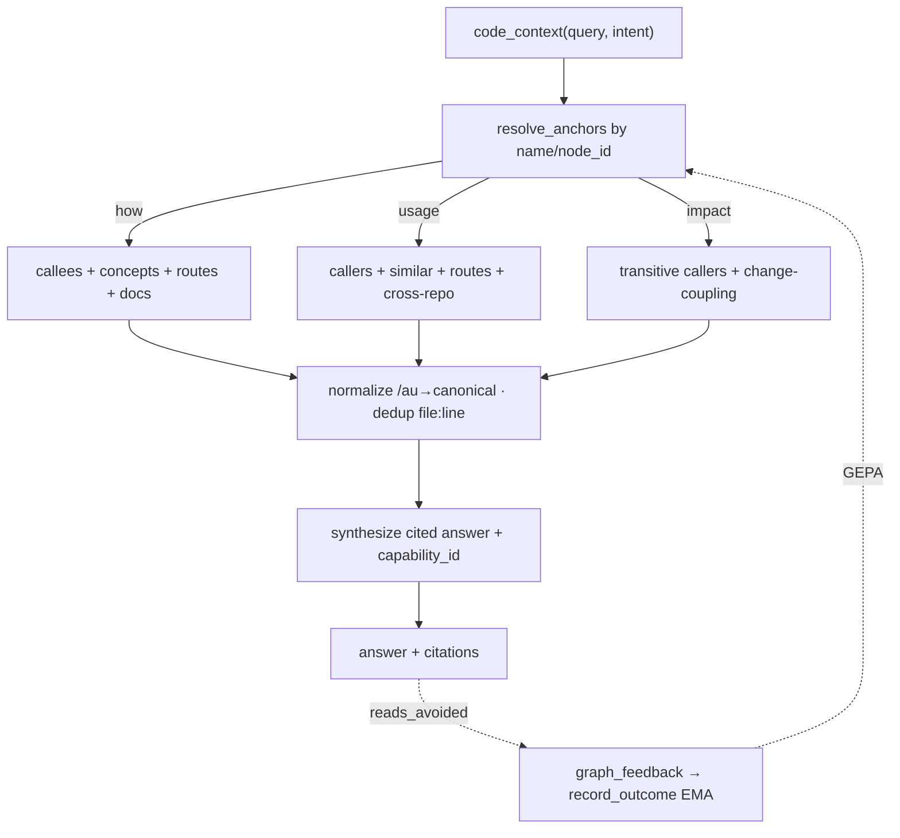

# Codebase context via the KG — query, don't grep

**Concepts:** KG-2.134 (`code_context`), KG-2.135 (cross-repo usage), AHE-3.61
(reads-avoided loop), OS-5.47 (ingestion-coverage doctor check).

The ecosystem's 80+ repos are continuously ingested into the KG as a typed,
resolved code graph. This program makes *"how does this code work / where is it
used / what breaks if I change it?"* a **free, native, grounded KG query** instead
of grep → read → Explore-fan-out. The agent learns an area from one cited answer
and reads only the `file:line`s it must *edit*, not to *understand*.

## The one tool — `code_context`

`graph_analyze action=code_context` (REST: `POST /graph/analyze/code-context`)
composes the already-built primitives into one synthesized, cited explanation:

| intent (`target`) | composes | answers |
|---|---|---|
| `how` | call graph (callees) + CONCEPT: markers + routes + docs | "how does the messaging reply path work?" |
| `usage` | callers (`file:line`) + similar-code + routes + **cross-repo** view | "where is `create_model` used across the fleet?" |
| `impact` | transitive callers (blast radius) + git change-coupling | "what breaks if I change `_conn`?" |

It returns `answer` (templated, grounded prose), `citations` (`file:line`),
`anchors`, `capability_id`, and `used_primitives`. It is **deterministic and
embedder-free** (pure Cypher over the resolved `:Code` graph), so it answers even
when the remote vLLM/embedder is down, and **degrades gracefully** — sections whose
enrichment has not run yet (docs, `similar_to`, `FILE_CHANGES_WITH`, concepts) come
back empty and richen as the delta sweep populates them.

## Native defaults (GAP 3)

1. **Instruction.** `AGENTS.md` → *"Query the code KG before you grep"* tells every
   session to reach for `code_context` first.
2. **Task-start prime.** `run_agent` primes the KG's synthesized view of the task's
   code area into the run context the way mementos prime a chat turn
   (`_prime_code_context`, off the event loop, skipped on the chat profile).

## Cross-repo usage (KG-2.135)

`cross_repo_usages(symbol)` (`graph_analyze action=cross_repo_usages`) anchors
callers by **name**, so usages resolve across every ingested repo in one query,
grouped by repo — `run_agent`'s callers span agent-utilities, the frameworks, and
the agents. The `/au` source-mount is normalized to its canonical path so the same
file never cites twice. It surfaces *resolved* `calls` references; an import the
intra-repo resolver left unbound is not yet a cross-repo edge.

## Reads-avoided loop (AHE-3.61)

Every answer carries a `capability_id`. After a task, the agent reports back via
`graph_feedback correction_type=reads_avoided target_id=<capability_id>
corrected_value={"reads_avoided":…,"files_read":…,"correct":…,"query":…}`. That
triple becomes a reward on the answer's reward-EMA (the code retriever
GEPA-optimizes toward answers that replace a read) and, when correct, an
eval-corpus case so the same question is graded automatically thereafter.

## Freshness SLA (OS-5.47)

`agent-utilities-doctor` (and `graph_configure action=system_doctor`) runs an
`ingestion_coverage` check: it enumerates the agent-packages subtree of
`workspace.yml`, compares it against the live `:Code` symbol counts and the
`DeltaManifest` last-sync watermark, and **warns/fails on missing or stale
(>7d) repos** with a `source_sync`/`graph_ingest` remediation — so a coverage gap
surfaces instead of silently degrading a KG query to grep.

## Two surfaces

Every piece is reachable from MCP and REST (the surface contract): the
`graph_analyze` actions + their REST twins (`/graph/analyze/code-context`,
`/graph/analyze/cross-repo-usages`), and `graph_feedback`'s `reads_avoided`
correction. The composition logic lives in
`knowledge_graph/retrieval/code_context.py`; the tools are thin dispatchers.
