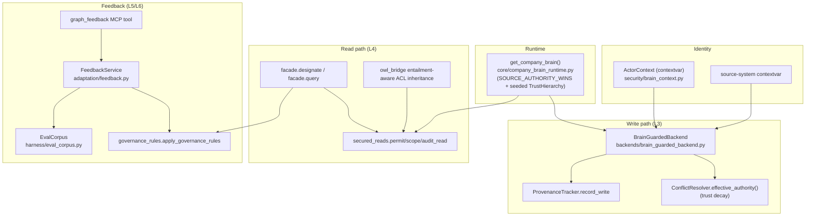

# Company Brain Runtime — Wiring the 6 Layers

> **Pillar 2 — Epistemic Knowledge Graph** · Concepts: `KG-2.6` (Company Brain),
> `KG-2.8` (Feedback/Enrichment), `KG-2.1` (Retrieval budget)

## Why this exists

The `CompanyBrain` primitives (trust hierarchy, conflict resolution, provenance,
data-level ACLs, tenancy) were fully implemented and unit-tested but **never
instantiated in the live read/write path** — the only `CompanyBrain()` call was a
docstring example. The reward/eval machinery existed but learned only from
execution success, not human corrections; retrieval had no token budget. This
runtime activates all of it, behind a single flag, without breaking the existing
default behaviour.

## The enforcement boundary

Everything is gated by **`KG_BRAIN_ENFORCE`** (default **off**). Off → byte-identical
to before. On → trust/permission/tenant enforcement engages. Provenance and
conflict logging are recorded when the guard is active.

| Concern | Off (default) | On (`KG_BRAIN_ENFORCE=1`) |
|---|---|---|
| `create_backend()` | raw backend | wrapped in `BrainGuardedBackend` |
| Writes | unchanged | provenance + source-authority arbitration |
| Reads (`facade.designate`/`query`) | unchanged | ACL filter + tenant scope + audit |
| Identity | `SYSTEM_ACTOR` | per-call `ActorContext` |

## Components



### Layer 3 — Source Truth (write path)
`create_backend()` wraps the store in **`BrainGuardedBackend`** when enforcement is
on. Every `add_node` records provenance and resolves contested writes by
**source authority with trust decay**: `effective_authority = authority_level *
exp(-trust_decay_rate * age_days)`. A live ServiceNow fact out-ranks a stale doc;
a *very* stale high-authority source can be overtaken by a fresher one.

Arbitration is **field-level survivorship** (the MDM "golden record" model) when
the backend can cheaply read a node's current properties (`get_node_properties` —
implemented on the epistemic-graph engine authority, also used by the fanout backend):
each attribute is kept from its highest-authority writer, so a low-authority
source can still contribute *new* attributes without clobbering a high-authority
source's fields. The full reconciled record is written back, so the result is
correct regardless of the backend's merge-vs-replace semantics.

**Durable, restart-proof provenance.** Each node carries its own per-attribute
provenance as a reserved `_field_prov` property — a JSON map
`{field: {src, ts}}` (wall-clock epoch). Because the guard already reads the node
before every write, that map is recovered for free, so a brand-new process (empty
in-memory ledger) reconstructs each attribute's prior owner from the node itself
and survivorship survives a restart. The in-memory ledger is just a cache;
authority is **recomputed** from the live trust hierarchy at decision time, so
re-tuning `KG_TRUST_HIERARCHY` re-judges existing data rather than freezing
write-time scores. `ProvenanceTracker.record_field_write`/`field_owner` keep an
in-process audit view alongside the durable node record.

Backends without a cheap read transparently fall back to **node-level**
arbitration. The trust hierarchy is declarative — seeded defaults, overridable
via `KG_TRUST_HIERARCHY` / `config.json`.

### Layer 4 — Permissions (read path)
`facade.designate` and the guarded `facade.query` apply, via `secured_reads`:
`permissions.filter_nodes` (role/classification ACLs), `tenancy.scope_cypher_query`
(hardened, injection-safe tenant isolation), and `provenance.record_read` (audit,
mandatory for RESTRICTED). `owl_bridge` propagates the **most-restrictive** parent
classification onto inferred facts so reasoning can't leak a RESTRICTED node.
MCP callers set identity via `_actor`/`_roles`/`_tenant` on any `graph_*` tool.

### Layer 5/6 — Feedback → rule → eval
The **`graph_feedback`** MCP tool routes to **`FeedbackService`**:
- `outcome` → reward EMA (`CapabilityIndex.record_outcome`).
- `rule` → a `Correction` node (+`CORRECTS`) and a durable, active governance/
  voice/source rule, authoritative immediately (a human asserted it).
- `eval` → a regression case in the KG-backed **`EvalCorpus`**.

Rules **change behaviour**: `apply_governance_rules` filters/re-ranks designations
in `facade.designate`, so a corrected mistake doesn't recur. `check_eval_corpus.py`
gates the eval pipeline in CI.

### Layer 1 — Capture enrichments
- **Operating intelligence**: `extract_intelligence` distils calls/docs into
  `Insight`/`Fact`/`Framework`/`Playbook` nodes (`DERIVED_FROM` the source);
  Playbook rides the ArchiMate crosswalk (`rdfs:subClassOf :BusinessProcess`).
- **Streams**: real `KafkaStreamAdapter`/`NatsStreamAdapter` (optional deps
  `agent-utilities[kafka]`/`[nats]`) implement `BaseStreamAdapter`.

### Layer 2 — Retrieval budget + task scope
`RetrievalBudgetManager.fit` keeps the highest-ranked results that fit a token
budget (no silent truncation — reports `dropped`). `HybridRetriever.
retrieve_hybrid_budgeted` and `WorkflowContextRouter.route_context(context_state=…)`
return only the task-relevant, budgeted slice.

## File map

```
security/brain_context.py                      # ActorContext + source contextvar (WS-0)
knowledge_graph/core/company_brain_runtime.py  # get_company_brain + enforcement gate
knowledge_graph/backends/brain_guarded_backend.py  # write-path guard (L3)
knowledge_graph/core/secured_reads.py          # read-path enforcement (L4)
knowledge_graph/core/company_brain.py          # effective_authority + hardened scope_cypher_query
knowledge_graph/adaptation/feedback.py         # FeedbackService (L5)
knowledge_graph/retrieval/governance_rules.py  # rules applied at retrieval (L5)
harness/eval_corpus.py + scripts/check_eval_corpus.py  # eval from usage (L6)
knowledge_graph/retrieval/budget.py            # retrieval token budget (L2)
knowledge_graph/streams/{kafka,nats}_adapter.py # concrete streams (L1)
knowledge_graph/enrichment/{models,extractors/document}.py  # Insight/Playbook (L1)
```

## Verification

```bash
# Unit
pytest tests/unit/knowledge_graph/test_brain_guarded_backend.py \
       tests/unit/knowledge_graph/test_secured_reads.py \
       tests/unit/knowledge_graph/test_feedback_loop.py \
       tests/unit/knowledge_graph/test_retrieval_budget.py \
       tests/unit/knowledge_graph/test_stream_adapters.py \
       tests/unit/knowledge_graph/test_insight_extraction.py -q
# End-to-end (enforcement on)
pytest tests/integration/knowledge_graph/test_company_brain_e2e.py -q
# Eval gate
python scripts/check_eval_corpus.py
```

## Enabling in a deployment

```bash
export KG_BRAIN_ENFORCE=1          # turn on trust + permission enforcement
export KG_TRUST_HIERARCHY='[...]'  # optional: override source authority (JSON)
```
MCP callers pass identity per call: `{"_actor": "agent:mk", "_roles": "marketing",
"_tenant": "acme", ...}`. Tool access remains governed by Eunomia; this adds
**data** access control on top.
```
