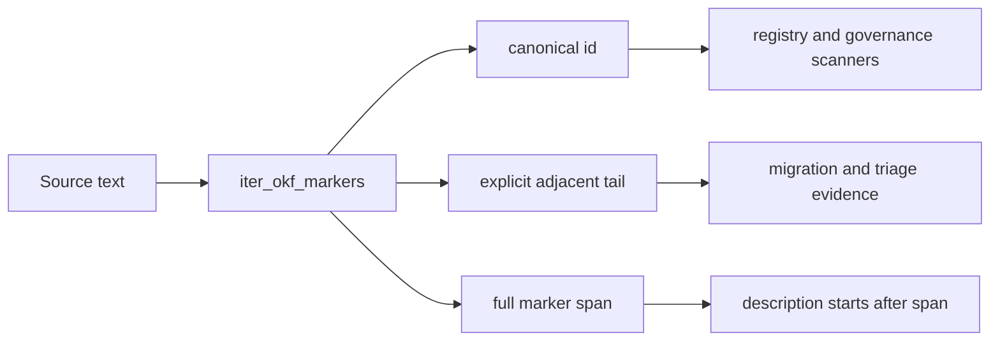

# Concept hierarchy

Agent Utilities uses one concept-ID grammar:

```text
<SLUG>-<PILLAR>.<domain>.<concept>[.<facet>...]
```

Example: `AU-KG.ingest.entropy-dedup`.

- `SLUG` is the two-letter repository code registered in
  `agent_utilities/governance/slug_registry.yaml`.
- `PILLAR` is one of `ORCH`, `KG`, `AHE`, `ECO`, `OS`, or `GBOT`.
- `domain` must be present in the pillar's closed vocabulary in
  `agent_utilities/governance/domain_vocab.yaml`.
- `concept` and optional facets are lowercase semantic kebab-case segments.

Numeric IDs, alternate spellings, aliases, and implicit hierarchy levels are
invalid. `agent_utilities.governance.concept_hierarchy` owns parsing, path/IRI
projection, and domain validation.

## Marker parsing

All scanners use `iter_okf_markers()` rather than slicing a raw regular-expression
match. The parser keeps the canonical ID separate from an immediately adjacent
tail such as `/2.15`, `_legacy`, or `UppercaseSuffix`. Historical slash annotations
remain visible as `OkfMarker.tail`, but tails are never treated as part of the ID or
as generated concept documentation. The marker's full span includes the tail, so
the description begins only after that span.



## Deterministic projections

For `AU-KG.ingest.entropy-dedup`:

| Projection | Value |
|---|---|
| OKF path | `AU/KG/ingest/entropy-dedup` |
| Concept IRI | `http://knuckles.team/kg/concept/AU/KG/ingest/entropy-dedup` |
| Domain IRI | `http://knuckles.team/kg/concept/AU/KG/ingest` |
| Shared pillar IRI | `http://knuckles.team/kg/pillar/KG` |
| Repository scheme | `http://knuckles.team/kg/scheme/AU` |

The generated RDF models concept → domain → shared pillar → repository scheme
with `:partOf` and SKOS relationships. Each concept stores exactly one
`:conceptId`.

## Authoring and validation

Reserve the complete semantic ID before adding its marker:

```bash
agent-utilities concept reserve --id AU-KG.ingest.entropy-dedup
```

Then add `CONCEPT:AU-KG.ingest.entropy-dedup` to source. The reservation ledger
stores only opaque session and design references. Regenerate and validate:

```bash
python scripts/build_concepts_yaml.py
python scripts/check_concepts.py
python scripts/check_domain_vocab.py
python scripts/build_concept_rdf.py \
  --registry docs/concepts.yaml \
  --out agent_utilities/knowledge_graph/ontology_concepts.ttl
```
