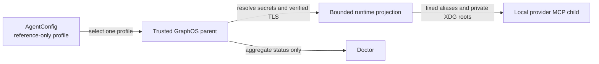

# Configuration Reference & Flag Audit

This is the single, authoritative inventory of every environment variable
`agent-utilities` reads, with a **verdict** for each: is the flag actually needed,
or should the system detect and self-configure instead?

It exists because the codebase had grown to **~96 distinct `KG_*` / `GRAPH_*` /
`EPISTEMIC_*` / `AGENT_UTILITIES_*` flags** — over-configuration that is overwhelming
to operate and a frequent source of footguns. The rule for adding new flags is in
`AGENTS.md` → *Configuration discipline*. The CI gate `scripts/check_no_env_sprawl.py`
enforces that flags are declared on `AgentConfig` (`core/config.py`), not read with bare
`os.environ.get()` scattered across modules.

## How configuration is read

`core/config.py` (and `core/paths.py`) are the **only** files that touch `os.environ`.
Every other module reads through one of two access paths, both driven by the XDG
AgentConfig. The loader stages `config.json` before projecting its keys, so
`graph_db_connection_profile_ref` becomes `GRAPH_DB_CONNECTION_PROFILE_REF`:

1. **Typed `AgentConfig` field** (`Field(alias="MY_VAR")`, read `config.my_var`) — for
   static settings parsed once at import.
2. **`config.setting("MY_VAR", default, cast=…)`** — the sanctioned accessor for reads
   that must stay **live** (daemon cadences, test-varied flags, runtime toggles). It
   reads `os.environ` at call time with a declared default and type coercion (inferred
   from the default's type, or pass `cast`).

**Decision:** field for static, `setting()` for dynamic — **never** a bare
`os.environ.get` / `os.getenv` / `os.environ[...]` read in a module.

### Provider profile execution boundary

External MCP packages use `AgentConfig.provider_configs` as their sole durable
connection boundary. A profile contains neutral reference fields for an endpoint,
credentials, selectors, and one TLS profile. It contains no raw credential,
certificate, environment-specific ontology, or provider-customized schema. Schema
discovery and generated mappings belong to the governed external-graph connector
pipeline, not to connection configuration.

GraphOS resolves exactly the selected profile in the trusted parent. Before a local
provider child starts, the parent projects the resolved values under fixed ephemeral
aliases into a private process environment. The child receives private XDG, home,
runtime, and temporary directories rather than the parent's configuration roots.
Sandbox-controlled keys are matched case-insensitively, so alternate spelling cannot
reintroduce a parent path. Original secret references, unrelated profiles, Vault or
engine authority, and parent environment values do not cross the process boundary.
Remote MCP packages are independently deployed and therefore cannot select a
parent-local profile.

Profile resolution is process-wide bounded, times out closed, and retains temporary
TLS material only for the child session. Doctor exercises the same resolution and
projection path, closes all material afterward, and reports only aggregate state and
counts. It never prints profile names, references, endpoints, values, identities, or
filesystem locations. Operator syntax and a neutral example are documented in
[External provider runtime profiles](../guides/configuration.md#external-provider-runtime-profiles).

AgentConfig does not search the repository, launch directory, or an agent package
for a dotenv file. Deployment inputs are the typed XDG document, explicit process
environment and runtime secret references. Container runtimes must project
secrets as explicit process environment values or mount the fixed private XDG
``runtime-secrets.json`` source; GraphOS does not scan a container secret directory.

Native Windows deployments use explicit process injection for secret values.
Until the loader has descriptor-level ACL validation, its private runtime-secret
source and production file-backed AgentConfig fail closed there. POSIX and WSL
enforce trusted ownership plus the documented private modes.

### Implicit XDG runtime-secret source

An operator may place `runtime-secrets.json` beside `config.json` in the Agent
Utilities XDG config directory. Its filename is fixed; no AgentConfig field stores
or selects a machine-specific path. The file is optional. When present it must be a
bounded regular JSON object with environment-variable names as keys and bounded,
non-empty strings as values. On POSIX its owner must be the current user or root and
its mode must be exactly `0600` or `0400`. Symbolic links, special files, duplicate
or case-ambiguous keys, malformed content, and files that change while being read
fail closed.

Only keys named by exact `env://NAME` references anywhere in `config.json`, including
nested model and connector blocks, are projected. Unreferenced entries are never
projected. An explicit process environment value wins. A durable `config.json`
value whose key collides with an `env://` target is rejected because secret material
does not belong in durable configuration.

The durable boundary recursively rejects non-empty raw credential aliases, nested
`api_key` fields, and all literal header maps. Model declarations use
`api_key_ref`/`headers_ref`, or an OAuth2 block whose `client_secret` is a reference.
Raw provider keys and ad-hoc header fields remain valid only as explicit runtime
process inputs where applicable; they cannot be serialized into XDG AgentConfig.

Reload validates both documents before replacing loader-owned projections. A failed
reload retains the last valid projection, a removed reference removes its still-owned
value, and a value changed later by the operator is preserved. Ownership tracking
uses process-local fingerprints rather than retained plaintext. Doctor reports only
aggregate source state and counts; it never reports a path, target name, reference,
value, owner, or mode.

**The fold is complete: ZERO bare env reads remain anywhere in `agent_utilities/`**
(every prefix — `KG_*`, `GRAPH_*`, `AGENT_*`, `VAULT_*`, `OTEL_*`, connector creds, …).
Deployment-varying/behavioral flags → `setting()` (or a typed field); pure load/cadence
tunables → auto-sized via `compute_ingest_worker_count()` or named module constants.
`scripts/check_no_env_sprawl.py` covers **every prefix** and its baseline
(`scripts/env_flag_baseline.txt`) is **empty** — any new bare read fails CI.
`setting()` itself lives in the dependency-free `core/_env.py` (re-exported by
`config`) so it stays importable while `config` is still initializing.

**Verdict legend**
- **KEEP** — legitimate deployment config (path / DSN / secret / port / socket). Must be
  read via the central `config` object, not bare `os.environ`.
- **AUTO** — should be auto-detected/auto-sized from the runtime; the flag should be
  removed (or kept only as an override with an auto default).
- **REMOVE** — always-on behavior or stale experiment; delete the flag.

## A. Deployment config — KEEP (read via `AgentConfig`)

| Flag | Default | What it sets |
|---|---|---|
| `GRAPH_DB_CONNECTION_PROFILE_REF` | none | Runtime secret reference resolving to the graph mirror's complete JSON connection profile |
| `GRAPH_MIRROR_TARGETS` | unset | Optional external projection names from `KG_CONNECTIONS`; a non-empty set enables automatic fan-out while epistemic-graph remains authority. |
| `EPISTEMIC_GRAPH_SOCKET` | runtime socket directory | Rust engine UDS; discover or inject the path at process start |
| `GRAPH_PERSISTENCE_PATH`, `GRAPH_SERVICE_PERSIST_DIR` | data dir | Engine durable snapshot dir |
| `KG_FUSEKI_ENDPOINT` (+ `GRAPH_FUSEKI_USER/PASSWORD/DATASET`) | runtime-configured | Fuseki endpoint (SPARQL query backend + ontology-publish tick); see section E below |
| `GITLAB_INSTANCES` | none | JSON list of GitLab instances to index/query — the multi-tenant source of truth shared by the KG GitLab indexer and the `gitlab-api` connector registry. Each durable entry uses `{"name":<str>,"url":<str>,"token_ref":<runtime-secret-reference>}`; raw `token` is rejected. TLS trust comes from the runtime profile. Unset → single-host process values `GITLAB_URL`/`GITLAB_TOKEN` (CONCEPT:AU-KG.backend.declared-columns-so-schema) |
| `GRAPH_PGGRAPH_SCHEMA` | `public` | Postgres schema |
| `AGENT_UTILITIES_{CONFIG,DATA,CACHE,LOG,MEMORY,RUNTIME}_DIR` | XDG | Path overrides (resolved in `core/paths.py`) |
| `AGENT_UTILITIES_TOKEN_SECRET` | — | Run-scoped tool-token secret |
| `KG_DAEMON_ROLE` | `auto` | host/client/auto election (topology) |
| `STATE_DB_URI` | none | Externalize session/turn/fleet metadata and queue-delivery state to shared Postgres; unset keeps zero-infra per-host SQLite support stores. Native WorkItem checkpoints remain in epistemic-graph (CONCEPT:AU-OS.state.unified-durable-state-externalization) |
| `STATE_DB_POOL_SIZE` | `8` | Max connections in the ONE shared state-store psycopg pool (CONCEPT:AU-OS.state.unified-durable-state-externalization) |
| `TASK_QUEUE_BACKEND` | none (auto) | Ingest task queue: `sqlite`\|`postgres`\|`kafka`. Unset = auto (postgres when `STATE_DB_URI` set, else sqlite). Explicit kafka/postgres is FAIL-LOUD at startup (CONCEPT:AU-KG.backend.selectable-queue-backend) |
| `KG_TASKS_PARTITIONS` | `6` | Partitions ensured on the `kg_tasks` topic at startup (grow-only, never shrinks); bounds kg-ingest consumer-group parallelism (CONCEPT:AU-KG.backend.keyed-ingest-partitions) |
| `AGENT_TURNS_PARTITIONS` | `6` | Partitions ensured on the `agent_turns` topic when Kafka carries dispatched agent turns (grow-only); bounds fleet-wide concurrent-session parallelism (CONCEPT:AU-ORCH.dispatch.queue-agent-dispatch) |
| `AGENT_DISPATCH_MAX_DEPTH` | `100000` | Fail-closed agent-turn admission bound; atomic on SQLite/Postgres and lag-gated on Kafka. |
| `AGENT_DISPATCH_CLAIM_TTL_S` | `120` | Renewable dispatch lease lifetime, bounded to the workload contract's 300-second RTO. |
| `AGENT_DISPATCH_RENEW_INTERVAL_S` | `30` | Maximum periodic renewal interval; the lease guard also renews synchronously before each side effect. |
| `AGENT_BUS_LOG_BACKEND` | `engine` | Required AgentBus delivery backend: `engine` or `kafka`; unavailable selections fail closed. |
| `AGENT_BUS_PARTITIONS` | `6` | Fixed/grow-only tenant delivery partitions. |
| `AGENT_BUS_MAX_CONSUMERS` | `32` | Process-local Kafka materializer/DLQ consumer bound. |
| `AGENT_BUS_MAX_DEPTH` | `100000` | Publisher backpressure threshold. |
| `AGENT_BUS_MAX_TOPIC_SUBSCRIBERS` | `1024` | Maximum subscribers materialized for one topic event. |
| `AGENT_BUS_DELIVERY_LEASE_SECONDS` | `300` | Engine-broker receipt lease while inbox transactions commit. |
| `ENGINE_LIFECYCLE` | `refcounted` | Lifecycle of an autostarted local engine (CONCEPT:AU-OS.deployment.engine-resolver-auto-provision): `refcounted` = reference-counted idle shutdown (self-stops `ENGINE_IDLE_SHUTDOWN_SECS` after the last client disconnects — the shared-tiny default, auto-stops when idle) · `persistent` = LONG-LIVING, never auto-stops even when idle (runs like a local service; forces idle-shutdown off). A remote/cluster engine is inherently persistent |
| `ENGINE_IDLE_SHUTDOWN_SECS` | `60` | Idle-shutdown grace (seconds) for a `refcounted` autostarted engine; `>0` passes `--idle-shutdown-secs <secs>` to the current engine. `<=0` (or `engine_lifecycle=persistent`) = long-living, no flag passed (CONCEPT:AU-OS.deployment.engine-resolver-auto-provision) |
| `EPISTEMIC_GRAPH_MAX_RESIDENT_GRAPHS` | `256` | Positive resident-graph bound for a shared workstation; generated production profiles use `1024`. Cold graphs reopen from durable state. |
| `EPISTEMIC_GRAPH_LAZY_OPEN_PAGE_SIZE` | `4096` | Bounded records per lazy-open page. While a page sequence is incomplete, the engine reports typed partial state rather than incomplete query results. |
| `EPISTEMIC_GRAPH_MAX_NODES_PER_GRAPH` | `250000` | Positive per-graph resident-node bound. Authoritative rows are checked in one durable snapshot and evicted from the resident projection in one batch. |
| `EPISTEMIC_GRAPH_MAX_REQUEST_BYTES` / `EPISTEMIC_GRAPH_MAX_RESPONSE_BYTES` | `67108864` | Native frame allocation budgets, additionally bounded by immutable Rust hard ceilings. |
| `EPISTEMIC_GRAPH_MAX_MSGPACK_ITEMS` | `1000000` | Preflight item budget that rejects nested MessagePack allocation bombs before deserialization. |
| `EPISTEMIC_GRAPH_CONNECTION_IO_TIMEOUT_SECS` / `EPISTEMIC_GRAPH_TLS_HANDSHAKE_TIMEOUT_SECS` | `120` / `10` | Slow-client and TLS-handshake deadlines for native connections. |
| `EPISTEMIC_GRAPH_AST_MAX_FILES` / `..._SOURCE_BYTES` / `..._TOTAL_BYTES` | `4096` / `4194304` / `33554432` | Bounds repository-relative source indexing; engine-host traversal is disabled. |
| `EPISTEMIC_GRAPH_MODALITY_MAX_BUNDLE_BYTES` / `..._SOURCE_BYTES` | `4194304` / `16777216` | Independent governed multimodal bundle/source limits beneath the transport frame budget. |
| `EPISTEMIC_GRAPH_ENCRYPTION_KEY_REF` | unset | External `env://` or `vault://` data-key reference for a packaged local durable engine. The launcher validates 32–4096 control-free UTF-8 bytes and projects the value only into the Rust child, then removes it from retained launcher mappings after spawn. Non-production `tiny` local mode instead creates one stable 0600 key beneath a validated 0700 XDG directory; production/non-tiny local mode fails closed without the explicit ref. Remote engines own their key lifecycle. |
| `EPISTEMIC_GRAPH_SQLITE_TRANSFER_ROOT_REF` | unset | Enables SQLite import/export only when a runtime secret ref resolves to a private non-symlink directory. AgentConfig never stores the path. |
| `EPISTEMIC_GRAPH_SQLITE_MAX_BYTES` / `..._MAX_ROWS` | `268435456` / `1000000` | Bounded native SQLite file and row transfer budgets. |
| `EPISTEMIC_GRAPH_BACKUP_ROOT_REF` | unset | Enables backup/restore only through a runtime-resolved private directory; RPCs accept logical bundle names, never host paths. |
| `GRAPH_SERVICE_ENDPOINTS` | unset | Sole explicit external/coordinator topology (comma/JSON list). Any configured value is connect-only and never gets a local stand-in; unset selects the packaged local engine lifecycle. Contacts are never a placement ring. |
| `GRAPH_RAFT_GROUP_ENDPOINTS` | unset | Strict JSON object mapping non-negative authoritative Raft group ids to `unix://`, `tcp://`, or `tls://` endpoints. Not needed with one stable coordinator; required for endpointless routes with multiple contacts. |
| `KG_DEFAULT_GRAPH` | `__bus__` | Default named graph; the ambient ActorContext tenant maps it to `tenant__<t>__<base>` before engine-authoritative placement. |
| `KG_WATCH_DIRS` | unset | Operator document directories the file-watcher auto-ingests **recursively**, unified with the built-in ScholarX/research download dirs. New files are ingested and modified files re-ingested on the 5s watch tick; unchanged files delta-skip by content hash (CONCEPT:EG-KG.storage.nonblocking-checkpoint). Value is a JSON array or an `os.pathsep`/comma-separated list of paths, e.g. `$DOCUMENT_INGEST_ROOT`. config.json key: `kg_watch_dirs`. Resolved by `sdd/watcher.py:get_watched_directories()` |
| `GRAPH_SERVICE_AUTH_SECRET` | auto-generated | Engine HMAC secret; unset → per-install secret persisted at `data_dir()/engine_secret` (0600) (CONCEPT:AU-OS.identity.authenticated-identity-enforcement) |
| `AUTH_JWT_AUDIENCE` | unset | Required expected JWT audience; session minting fails closed when absent |
| `KG_POLICY_VERSION` | unset | Required immutable policy revision stamped into every server-minted `GraphSession` |
| *(baked-in, no env var)* verified graph session | required | Every graph operation inherits middleware/process-minted actor, tenant, scopes, audience, and policy authority. |
| `MODEL_CONTEXT_TOKEN_BUDGET` | `2000` | Mandatory ContextCompiler evidence budget for every model invocation (minimum 64) |
| `MODEL_CONTEXT_ORDERING_VERSION` | `context-mmr-v1` | Versioned evidence-ordering identity folded into the privacy-safe context cache key |
| `MODEL_CONTEXT_REDACTION_VERSION` | `permissioning-v1` | Versioned redaction identity folded into the privacy-safe context cache key |
| *(baked-in, no env var)* single graph client | required | One process-owned operational engine/client; graph names are routed views, never independent transports. |
| `KG_AUTH_TOKEN_REF` | — | Runtime secret reference resolving to the stdio process JWT; mutually exclusive with `KG_IDENTITY_OAUTH2`. |
| `KG_IDENTITY_OAUTH2` | — | OAuth2 client-credentials block that mints a short-lived stdio process JWT; client secret must be a runtime secret reference. |
| *(baked-in, no env var)* ACL default | deny | Nodes without an explicit permitting ACL and authorization-infrastructure failures are denied. |
| *(baked-in, no env var)* connector capability fleet | 65 external packages plus the native transport bundle | Every `build_connector(...)` activation is **unconditionally** required to pass the live manifest gate. The signed native bundle covers ARD, database, filesystem, schema-neutral GraphQL, reader, REST, RSS, and web transports without operator configuration. Endpoint, auth, TLS, and source mappings remain runtime/secret-profile driven. Package discovery covers the complete external fleet. The gate requires a complete-manifest signature/release pin and exact connector-owned provider/tool-schema or native-code fingerprints, plus compile and ontology integrity. Missing providers, drift, invalid schemas, and gate exceptions fail closed. Live connector-owned bundles resolve first; Agent Utilities ships a pinned fallback for standalone wheels and GraphOS. |
| `SOURCE_SYNC_ALLOW_EMPTY_TOMBSTONE`\* | `""` (empty) | Comma-separated allowlist of source keys (e.g. `"leanix,twenty"`) that MAY tombstone every previously-known node when a reconcile pass returns a genuinely empty live-id set. Empty by default: a transient fetch failure/skip (`fetch_ok=False`) never tombstones regardless of this list; an empty-but-successful fetch only tombstones for a source named here. Read in `knowledge_graph/core/source_sync._reconcile` (AU-P0-4) |
| `KG_ENGINE_POOL_SIZE` | `8` | Bounded LRU warm tenant-client pool. `0` disables pooling and constructs clients per use (CONCEPT:AU-KG.sharding.elastic-over-kg-shard) |
| `KG_ENGINE_POOL_DROP_ON_EVICT` | `false` | On pool eviction also unload the tenant's named graph from the engine to reclaim memory — **only safe when a durable mirror holds the data** (CONCEPT:AU-KG.sharding.elastic-over-kg-shard) |
| `GATEWAY_METRICS` | `true` | Python-tier Prometheus middleware + `GET /metrics` on the gateway (CONCEPT:AU-OS.observability.no-op-without-metrics) |
| `GATEWAY_RATE_LIMIT` | `0` (gateway off; remote REST uses 50 req/s) | Privacy-safe token-bucket rate limit, sustained req/s; buckets are per-process (CONCEPT:AU-OS.observability.no-op-without-metrics) |
| `GATEWAY_RATE_BURST` | `0` (→ 2× rate) | Token-bucket burst capacity (CONCEPT:AU-OS.observability.no-op-without-metrics) |
| `GATEWAY_WORKERS` | `1` | Pre-forked gateway worker processes on one shared listen socket; the flock host-lock elects ONE KG host among them (CONCEPT:AU-OS.observability.no-op-without-metrics) |
| `ENGINE_BREAKER_THRESHOLD` | `5` | Consecutive engine connect/timeout failures before the client circuit opens (0 = off) (CONCEPT:AU-OS.observability.no-op-without-metrics) |
| `ENGINE_BREAKER_COOLDOWN` | `15` | Seconds an open engine circuit waits before the half-open probe (CONCEPT:AU-OS.observability.no-op-without-metrics) |
| `MCP_CHILD_MAX_CONCURRENCY` | `8` | Max in-flight tool calls per multiplexer child (bounded 1–128; cannot be disabled); per-server `max_concurrency` override in `mcp_config.json` (CONCEPT:AU-ECO.mcp.profile-differences-from-client) |
| `MCP_CHILD_QUEUE_TIMEOUT` | `30` | Seconds an excess call queues for a child slot before the typed `MCPChildBusyError`; per-server `queue_timeout` override (CONCEPT:AU-ECO.mcp.profile-differences-from-client) |
| `MCP_CHILD_POOL_SIZE` | `1` | Session-pool size for remote (streamable-http/SSE) children — N round-robin connections for parallel calls; stdio stays single-pipe; per-server `pool_size` override (CONCEPT:AU-ECO.mcp.profile-differences-from-client) |
| `MCP_CHILD_MAX_RESTARTS` | `5` | Auto-restarts a crashed child may consume inside the window before being parked `failed` (0 = no auto-restart); per-server `max_restarts` override (CONCEPT:AU-ECO.mcp.profile-differences-from-client) |
| `MCP_CHILD_RESTART_WINDOW` | `300` | Sliding window (s) for the restart budget; older restarts are forgiven; per-server `restart_window` override (CONCEPT:AU-ECO.mcp.profile-differences-from-client) |
| `MCP_CHILD_BREAKER_THRESHOLD` | `5` | Consecutive transport failures/timeouts before a child's circuit opens (typed `MCPChildCircuitOpenError`, 0 = off); per-server `breaker_threshold` override (CONCEPT:AU-ECO.mcp.profile-differences-from-client) |
| `MCP_CHILD_BREAKER_COOLDOWN` | `15` | Seconds an open child circuit waits before the half-open probe; per-server `breaker_cooldown` override (CONCEPT:AU-ECO.mcp.profile-differences-from-client) |
| `MCP_DYNAMIC_TOP_K` | `8` | Default number of ranked candidates `find_tools` returns when `top_k` is unspecified (CONCEPT:AU-ECO.multiplexer.tool-gateway-catalog) |
| `MCP_TOOL_MODE` | `intent` | Per-agent tool surface: `intent` (default intent verbs with granular action tools gated for `find_tools`/`load_tools`), `condensed` (action-routed tools), `verbose` (one 1:1 tool per API method), or `both`. Read fleet-wide via `tool_mode()`; verbose tools are tagged `verbose` for filtering. See [MCP Tool Modes](../guides/mcp-tool-modes.md) (CONCEPT:AU-ECO.mcp.tool-mode-standardization) |
| `ACTION_POLICY_PATH` | shipped default | Operational ActionPolicy YAML; empty → conservative `deploy/action-policy.default.yml` (everything mutating = approval_required). KG `governance_rule` overrides win (CONCEPT:AU-OS.deployment.fleet-lifecycle-control) |
| `FLEET_RECONCILER` | `false` | Opt-in leader-only desired-state fleet reconciler tick — diff registry vs observed, converge through the ActionPolicy gate + actuator seam (CONCEPT:AU-OS.config.desired-state-fleet-reconciler) |
| `FLEET_RECONCILER_INTERVAL` | `120` | Seconds between fleet-reconciler ticks (CONCEPT:AU-OS.config.desired-state-fleet-reconciler) |
| `FLEET_RECONCILER_MAX_ACTIONS` | `5` | Storm guard: max convergence actions per tick, rest deferred (CONCEPT:AU-OS.config.desired-state-fleet-reconciler) |
| `FLEET_REGISTRY_PATH` | shipped registry | Fleet service registry YAML; empty → `deploy/mcp-fleet.registry.yml` (CONCEPT:AU-OS.config.desired-state-fleet-reconciler) |
| `FLEET_DESIRED_STATE_PATH` | unset | Optional desired-state override YAML (per-service `replicas`/`desired`/`version`) layered on the registry (CONCEPT:AU-OS.config.desired-state-fleet-reconciler) |
| `FLEET_ACTUATOR` | `dryrun` | Actuator selection: `dryrun` (records intent, mutates nothing) or `docker` (reference CLI actuator). Portainer/Swarm actuators are deployment-wired via `set_fleet_actuator()` (CONCEPT:AU-OS.config.desired-state-fleet-reconciler) |
| `DEPLOY_WATCH_WINDOW` | `300` | Health-watch window (s) after a deploy/restart; failure inside the window triggers the policy-gated rollback (CONCEPT:AU-OS.config.health-gated-deploy-rollback) |
| `DEPLOY_WATCH_POLL` | `15` | Seconds between health probes inside a deploy watch (CONCEPT:AU-OS.config.health-gated-deploy-rollback) |
| `FLEET_AUTOSCALER` | `false` | Opt-in leader-only reactive replica autoscaler tick — load signal → registry-declared min/max bounds → policy-gated `scale_service` + deploy watch (CONCEPT:AU-OS.scaling.reactive-replica-autoscaling) |
| `FLEET_AUTOSCALER_INTERVAL` | `60` | Seconds between autoscaler ticks (CONCEPT:AU-OS.scaling.reactive-replica-autoscaling) |
| `SCALING_PROMETHEUS_URL` | unset | Prometheus base URL for autoscaling signals (instant `/api/v1/query` GETs); unset → zero-infra in-process gauges; injected provider via `set_scaling_signal_provider()` wins (CONCEPT:AU-OS.scaling.reactive-replica-autoscaling) |

\* Read via `config.setting(...)` at `core/source_sync.py` because the reconcile
policy is evaluated at call time. Connector ACL and manifest enforcement have no
runtime bypass flag.

These genuinely vary per host and are typed `AgentConfig` fields. Graph transport
material is resolved once from `GRAPH_DB_CONNECTION_PROFILE_REF`; consumers do not
read separate connection fields.

### A.1 Engine resolution — ONE resolver, every entrypoint (CONCEPT:AU-OS.deployment.engine-resolver-auto-provision)

Every entrypoint (graph-os MCP, the gateway/host daemon, `IntelligenceGraphEngine`,
the facade, `EpistemicGraphBackend`, the tenant engine pool, messaging,
agent/serving) funnels through the single chokepoint
`GraphComputeEngine.__init__`, which calls **`engine_resolver.resolve_engine(config)`**.
The resolver decides — by ONE precedence, with NO per-entrypoint code — how the
process reaches the ONE engine authority:

    remote  →  share-running-local  →  autostart-shared-supervised

- **external/connect-only** — any configured `GRAPH_SERVICE_ENDPOINTS` topology:
  connect to it, **never** autostart a
  local stand-in (fail-loud if unreachable). This is the "I deployed the engine in
  Docker on another host" case. A remote/cluster engine is inherently persistent.
- **shared** — the local endpoint is already serving (a cheap connect probe
  succeeds): reuse it, spawn nothing. Co-located entrypoints on one host share the
  ONE engine.
- **autostart** — nothing reachable on a local endpoint: spawn ONE **detached,
  supervised** engine under the per-socket spawn guard (first-one-wins flock, so
  concurrent resolves never start a second engine on the same `--persist-dir`).
  Detached = it survives the spawner so OTHER entrypoints share it. The autostart
  lifecycle is selected by `ENGINE_LIFECYCLE`. Configured topology is always
  connect-only.

**Two autostart lifecycles (the `ENGINE_LIFECYCLE` choice):**

- **`refcounted` (default) — shared tiny engine, auto-stops after idle.** The
  resolver passes `--idle-shutdown-secs <ENGINE_IDLE_SHUTDOWN_SECS>` (default 60);
  the engine self-terminates that many seconds after its LAST client disconnects
  (reference-counted, robust to client crashes). Best for a laptop/Pi where the
  engine shouldn't linger once nothing is using it.
- **`persistent` — long-living local engine, never auto-stops.** Set
  `engine_lifecycle=persistent` (or `engine_idle_shutdown_secs=0`) and the resolver
  passes NO idle-shutdown flag: the engine runs forever like a local service, even
  when idle. Best when you want a warm engine always ready (no cold-start on the
  next request).

The topology and lifecycle reads are typed `AgentConfig` fields
(`graph_service_endpoints`, `engine_lifecycle`, `engine_idle_shutdown_secs`) —
set them in `config.json`, no env-sprawl. The packaged current engine contract
includes `--idle-shutdown-secs`; an artifact missing it fails preflight.

## B. Maintenance scheduler control

`KG_DEV_MODE` is the single typed `AgentConfig` control for the maintenance
scheduler and embedding-backfill startup. Production runs all governed maintenance
jobs. Development mode pauses those background jobs as one unit. Embedding backfill
uses the named internal budget and fetch constants rather than deployment flags.

### B.1 Safety controls

| Flag | Default | What it gates |
|---|---|---|
| `KG_EPISTEMIC_LIGHT_DEFAULT` | `true` | Attach the light epistemic envelope (confidence/source_refs/evidence_refs/policy_labels/provenance) onto every plain read-path row by default (CONCEPT:AU-KB-CURRENCY) — additive, never changes a caller's `list[dict]` shape. Opt-out for a deployment that must skip the extra batched `explain_provenance_by_ids` round trip on every read; a row already showing a contested/low-confidence signal is still resolved regardless (auto-on override). Typed `config.epistemic_light_default`, read in `knowledge_graph/core/epistemic_row.py`. |

## C. Ingest throughput

Per-repository call-graph community detection is always active and is bounded by
the engine's wall-clock and iteration limits. `KG_INGEST_PROFILE` selects the
pipeline phases (`structural` or `full`, with `full` as the default); it does not
gate community detection. The maintenance scheduler detects bulk ingestion from
the durable submission-queue depth and defers whole-graph passes automatically.

## D. Performance controls

The worker pool auto-sizes from CPU and memory budgets. Stable batch sizes and
maintenance cadences are named constants; only deployment-dependent behavior is
exposed through `AgentConfig`. The engine independently bounds analytical calls.

| Flag | Default | Notes |
|---|---|---|
| `KG_LLM_CONCURRENCY` | 4 | Typed on `AgentConfig` (`kg_llm_concurrency`); the **total** parallel capacity of the local inference endpoint. One slot is reserved for the interactive path; background KG work is bounded to `background_llm_concurrency()` = capacity − 1. |
| `KG_PARSE_BATCH` | 128 | constant |
| `KG_ENRICH_BATCH` / `KG_ENRICH_MAX_BATCHES` | 16 / 8 | constants |
| Embedding-backfill budget/fetch | 256 / 512 | Named internal constants. |
| `KG_BACKGROUND_MAX_CONCURRENT` | 2 | auto |
| `GRAPH_POOL_MIN/MAX` | 2 / 10 | auto from cpu |
| `KG_CHAT_CONCURRENCY` | 8 | auto |
| `KG_*_INTERVAL` (enrich/file_watch/embed/evolution/golden) | 20–3600 | constants unless deployment-varying |
| `GRAPH_TIMEOUT` | 1200000 ms | RPC timeout; engine-side analytical bounds still apply. |

## E. Experiment / feature gates

**`KG_GOLDEN_*` controls.** All `KG_GOLDEN_*` and `KG_BREADTH_*`
settings are typed `AgentConfig` fields. They are opt-in and off by default.

| Flag | Default | What it gates |
|---|---|---|
| `KG_LOOP` | `False` | enable the autonomous golden-loop daemon cycle (intake→acquire→resolve→distil→synthesize) |
| `KG_LOOP_DISTILL` | `False` | distillation step of the golden loop |
| `KG_LOOP_BREADTH` | `False` | breadth ingest step (auto-ingest of the roots below) |
| `KG_LOOP_STANDARDIZE` | `False` | standardization pass of the golden loop |
| `KG_GOLDEN_AUTO_MERGE` | `False` | governed auto-merge of promoted proposals |
| `KG_GOLDEN_MERGE_THRESHOLD` | `None` | score threshold gating auto-merge |
| `KG_LOOP_INTERVAL` | `3600` | daemon tick interval (s) |
| `KG_LOOP_TOPICS` | `5` | hot topics processed per cycle |
| `KG_BREADTH_LIBRARY_ROOTS` | `""` | comma-separated OSS library roots auto-ingested by the breadth step (deployment-specific; empty = no-op) |
| `KG_BREADTH_REPO_ROOTS` | `""` | comma-separated code-repo roots auto-ingested by the breadth step |
| `AGENT_THINKING_EFFORT` | `""` | pydantic-ai v2 native extended thinking on every built agent: `low`/`medium`/`high` (empty = off). Opt-in because reasoning is expensive (more tokens/latency); runs natively where the provider supports it and no-ops elsewhere. Read via `setting()` in `agent/factory.py`; per-agent override = the `create_agent(thinking_effort=...)` arg. |

| Family | Count | Notes |
|---|---|---|
| `KG_EA_WRITEBACK`, `KG_ENABLE_HARD_NEGATIVE_MINING`, `KG_RESEARCH_EXTERNAL`, `KG_PROCESS_WRITEBACK` | 4 | remaining experiment gates — graduate (always-on) or delete |

**`KG_PROCESS_WRITEBACK` — outbound process-intelligence writeback (`CONCEPT:EG-KG.storage.nonblocking-checkpoint`,
default off).** Opt-in because it performs *outbound* mutating calls into external
systems (Camunda process-instance variables, ARIS model attributes) — exactly the
"expensive / side-effecting on every run" case the opt-in tier is reserved for. When
set, `resolve_process_writeback` pushes the KG's per-process intelligence (capability/
code lineage, OWL inferences, operational signals, glossary/data lineage) back onto the
live process world via the `graph_analyze action=process_writeback` surface. The
connector connection/credentials themselves are **not** agent-utilities config — they
live in the `camunda-mcp` / `aris-mcp` packages' own environment
(`CAMUNDA7_*`/`CAMUNDA8_*`, `ARIS_*`), read by each connector's `auth.get_client()`.

**`EVOLUTION_WORKTREE_ROOT` — evolution→branch bridge (`CONCEPT:AU-AHE.harness.evolution-branch-bridge`), typed on
`AgentConfig` (`evolution_worktree_root`).** Root directory the `LocalBranchPublisher`
creates fresh git worktrees under when publishing a promoted proposal as a reviewable
local branch. Empty (default) resolves to `data_dir()/evolution_worktrees` — publication
never writes into a canonical checkout's working tree.

**`KG_FAILURE_*` — Failure-Driven Evolution (`CONCEPT:AU-AHE.harness.failure-evolution`), typed on `AgentConfig`.**
Failure evolution auto-enables when both Langfuse credentials are runtime-injected;
an explicit `false` remains an opt-out. Dataset regression stays separately opt-in.
The boolean gates are parsed via `to_boolean`
(`"True"`/`"False"`, consistent with the fleet's other toggles). See
[`failure_driven_evolution.md`](./failure_driven_evolution.md).

| Flag | Default | Notes |
|---|---|---|
| `KG_FAILURE_EVOLUTION` | `auto` | enabled with both runtime Langfuse credentials unless explicitly disabled; runs the propose-only `failure_ingest` tick (pull failures → remediation topics) |
| `KG_FAILURE_EVOLUTION_INTERVAL` | `3600` | daemon tick interval (s) |
| `KG_FAILURE_EVOLUTION_WINDOW` | `86400` | telemetry look-back window (s) |
| `KG_FAILURE_REGRESSION_DATASET` | `False` | enable the dataset-based regression path |
| `KG_OPTIMIZATION_ENABLED` | `True` | Enable the propose-only native program-optimization sweep over self-supervised targets. |
| `KG_OPTIMIZATION_INTERVAL` | `10800` | Optimization sweep interval (s) |

**`KG_FUSEKI_*` — Ontology distribution to Apache Jena Fuseki (`CONCEPT:AU-KG.ontology.authoritative-tbox`), typed on
`AgentConfig`, opt-in publish / always-resolvable endpoint.** The `fuseki_publish`
maintenance tick pushes the bundled ontology modules (the authoritative TBox) to an
optional enterprise Fuseki triplestore for SPARQL federation. The **publish tick** stays
off by default — writing to Fuseki is opt-in even when an endpoint is reachable.

**`KG_FUSEKI_ENDPOINT` is THE one canonical Fuseki endpoint field** — every Fuseki-consuming
code path resolves through it: the `fuseki_publish` tick
(`engine_tasks._tick_fuseki_publish`), `publish_ontology_to_fuseki`'s endpoint fallback
(`ontology_publisher.py`), the `fuseki`-kind SPARQL smoke query
(`database_environment.sparql_query`), and the `jena_fuseki` query backend
(`backends/sparql/jena_fuseki_backend.py`, instantiated explicitly as an external query adapter).
The public contract does not embed a deployment endpoint. Operators discover the
service through their runtime registry and set `KG_FUSEKI_ENDPOINT` explicitly.
That value alone does **not** turn on the publish tick: `KG_FUSEKI_PUBLISH` only
auto-engages when `KG_FUSEKI_ENDPOINT` is explicitly set (env/config.json), per
`_auto_enable_from_dependencies` — see the "Configure-by-default" note in
`docs/guides/enterprise-enablement-runbook.md`. A non-cluster/zero-infra deployment with no
real Fuseki simply never selects the `jena_fuseki` backend and never flips the publish tick.

| Flag | Default | Notes |
|---|---|---|
| `KG_FUSEKI_PUBLISH` | `False` | enable the daemon `fuseki_publish` tick — engages automatically once `KG_FUSEKI_ENDPOINT` is explicitly set |
| `KG_FUSEKI_ENDPOINT` | runtime-configured | Fuseki URL for every reader (publish tick, SPARQL query backend, smoke query) |
| `KG_FUSEKI_PUBLISH_INTERVAL` | `3600` | daemon tick interval (s) |

**`KG_WORKFLOW_SHAPE_GATE` — execution-time workflow ontology gate (`CONCEPT:AU-ORCH.execution.ontology-validation-execution-path`),
typed on `AgentConfig`, default ON.** `execute_workflow` AND its background twin
`graph_workflows action=dispatch` (REST twin `/api/graph/workflows`) SHACL-validates
the stored `WorkflowDefinition` (+ steps) against the governance shapes before dispatch and
refuse malformed definitions with a structured violation report; cheap and LLM-free. The
companion permission gate (ontology permissioning ACL on the workflow node) is governed by
the mandatory OS-5.14 fail-closed graph boundary, not a new flag.

| Flag | Default | Notes |
|---|---|---|
| `KG_WORKFLOW_SHAPE_GATE` | `True` | SHACL-validate stored workflows before execution |

**Langfuse (`CONCEPT:AU-AHE.harness.failure-evolution` / `AHE-3.0`) — current configuration only.** The canonical host
variable is **`LANGFUSE_HOST`**. The host and neutral TLS profile are typed settings; credentials,
private trust, client identity, and proxy material are resolved from the corresponding
`*_REF` fields only at the runtime boundary.

| Flag | Default | Notes |
|---|---|---|
| `LANGFUSE_HOST` | `https://cloud.langfuse.com` | Langfuse base URL (read + OTEL write paths) |
| `LANGFUSE_CAPTURE_CONTENT` | `False` | Keep local and external traces metadata-only. Sanitized prompt capture is an explicit local opt-in and is rejected by the production profile. |
| `LANGFUSE_KG_AUTO_INGEST` | `False` | Opt in to privacy-guarded graph persistence; requires `LANGFUSE_PERSISTENCE_HMAC_KEY_REF`. GraphOS keeps the child read-only and performs the write in the authenticated parent under an explicit `kg:write` session. |
| `PERSISTENCE_PRIVACY_DENY_TERMS_REF` | unset | Secret reference resolving to a JSON list (or comma-separated list) of identity terms that must be removed before Knowledge Graph, log, or trace persistence. The terms remain runtime-only; telemetry records counts/categories, never the terms. |
| `PERSISTENCE_IDENTITY_HMAC_KEY_REF` | unset | Secret reference used to HMAC opaque durable identity references. Required by the production profile. |
| `MEMENTO_RAW_RETENTION_ENABLED` | `False` | Explicit opt-in gate for encrypted raw Memento recovery. There is no plaintext mode. |
| `MEMENTO_RAW_RETENTION_POLICY` | empty | Must be exactly `approved-encrypted-v1`; unknown or missing versions fail closed. |
| `MEMENTO_RAW_ENCRYPTION_KEY_REF` | unset | Secrets-backend reference for AES-GCM raw-block retention. The reference and key material are never persisted with a Memento. |
| `LANGFUSE_PUBLIC_KEY_REF` / `LANGFUSE_SECRET_KEY_REF` | `None` | Runtime secret references for the project API keypair |
| `LANGFUSE_PERSISTENCE_HMAC_KEY_REF` | `None` | Dedicated runtime secret reference used to HMAC Langfuse identities before Knowledge Graph persistence; it never falls back to the project API secret. |
| `LANGFUSE_TLS_PROFILE` / `LANGFUSE_TLS_PROFILE_REF` | `None` | Named verified trust profile or a runtime reference to one |
| `LANGFUSE_CA_BUNDLE_REF` / `LANGFUSE_CLIENT_CERT_REF` / `LANGFUSE_CLIENT_KEY_REF` / `LANGFUSE_CLIENT_KEY_PASSWORD_REF` | `None` | Runtime-only private trust and optional mTLS material |
| `LANGFUSE_PROXY_URL_REF` | `None` | Runtime reference for an optional outbound proxy URL |

## F. Testing — KEEP

| Flag | Default | Notes |
|---|---|---|
| `AGENT_UTILITIES_TESTING` | `False` | test-mode guard (read in ~8 places — centralize) |
| `AGENT_UTILITIES_GWT_STRICT` | `""` | global-workspace strict test mode |

## G. Complete `AgentConfig` inventory — platform fields beyond the KG/graph flag audit

Sections A–F are the original `KG_*`/`GRAPH_*` sprawl audit. `AgentConfig`
(`core/config.py`, pydantic-settings) additionally carries the platform's general
configuration surface. The generated
[runtime configuration reference](../reference/runtime-configuration.md) derives the
exhaustive inventory directly from `AgentConfig.model_fields`; the tables below group
the most operationally important settings without duplicating a fixed field count.

Every runtime alias is parsed through AgentConfig. Precedence is explicit constructor
input → runtime deployment override → XDG AgentConfig → configured runtime secret
provider. Resolved secret documents and container-mounted material are process state;
they are never written back to AgentConfig, traces, reports, or source control.

### G.1 Model providers & routing

| Flag | Default | What it sets |
|---|---|---|
| `CHAT_MODELS` | `[]` | Strict JSON list of chat-model configs; model credentials and headers use `api_key_ref` / `headers_ref` or referenced OAuth2. Drives `default_chat_model` / `lite_chat_model` / `super_chat_model`. |
| `EMBEDDING_MODELS` | `[]` | Strict embedding-model list with the same reference-only authentication contract (first entry = default) |
| `OPENAI_API_KEY` / `OPENAI_BASE_URL` | `None` | Process-only OpenAI fallback credential and endpoint for ad-hoc model creation; a non-empty raw key is rejected in durable XDG |
| `ANTHROPIC_API_KEY` | `None` | Anthropic fallback API key |
| `GEMINI_API_KEY` | `None` | Google Gemini fallback API key |
| `GROQ_API_KEY` | `None` | Groq fallback API key |
| `MISTRAL_API_KEY` | `None` | Mistral fallback API key |
| `HUGGING_FACE_API_KEY` | `None` | Hugging Face fallback API key |
| `DEEPSEEK_API_KEY` / `DEEPSEEK_BASE_URL` | `None` | DeepSeek fallback credentials |
| `VLLM_BASE_URL` | `None` | Dedicated vLLM inference server base URL |
| `MODEL_REGISTRY_PATH` | `None` | YAML/JSON model-registry file |
| `MODEL_ROLE_ROUTING` | `{}` | Role→{tier,tags} overrides for planner/generator/learner/judge selection (CONCEPT:AU-ORCH.routing.conductor-per-step-model); empty roles use `models/model_registry.py` defaults |
| `ROUTING_STRATEGY` | `hybrid` | Graph routing strategy |
| `ROUTING_PERCENTILE` | `50.0` | Routing percentile tunable |

### G.2 LLM request defaults

| Flag | Default | What it sets |
|---|---|---|
| `MAX_TOKENS` | `16384` | Default completion token cap |
| `TEMPERATURE` | `0.7` | Sampling temperature |
| `TOP_P` | `1.0` | Nucleus sampling |
| `TIMEOUT` | `3600` | LLM request timeout (s) |
| `TOOL_TIMEOUT` | `3600` | Tool-call timeout (s) |
| `PARALLEL_TOOL_CALLS` | `true` | Allow parallel tool calls |
| `SEED` | `None` | Deterministic sampling seed |
| `PRESENCE_PENALTY` / `FREQUENCY_PENALTY` | `0.0` | Repetition penalties |
| `LOGIT_BIAS` | `None` | Token logit-bias map (JSON) |
| `STOP_SEQUENCES` | `None` | Stop sequences (JSON list) |
| `EXTRA_HEADERS` / `EXTRA_BODY` | `None` | Process-only ad-hoc request controls; non-empty literal header maps are rejected in durable XDG. Per-model durable declarations use `headers_ref`. |

### G.3 Agent identity & HTTP server

| Flag | Default | What it sets |
|---|---|---|
| `DEFAULT_AGENT_NAME` | package name | Agent display name |
| `AGENT_DESCRIPTION` | package description | Agent description |
| `AGENT_SYSTEM_PROMPT` | `None` | System prompt override |
| `WORKSPACE_PATH` | `None` | Runtime-only workspace root override; never persist the resolved machine path in AgentConfig, traces, or reports |
| `HOST` | `0.0.0.0` | Gateway bind address |
| `PORT` | `9000` | Gateway port |
| `DEBUG` | `false` | Debug mode |
| `AIRGAP_MODE` | `false` | Sovereign/air-gap gate — refuse outbound HTTP to non-local hosts (`core/http_client.py`, `core/model_factory.py`); see `docs/guides/sovereign-self-hosted.md` §4 |
| `ENABLE_WEB_UI` | `false` | Serve the web UI |
| `ENABLE_TERMINAL_UI` | `false` | Terminal UI mode (disables `GATEWAY_WORKERS>1`) |
| `ENABLE_WEB_LOGS` | `false` | Explicit local opt-in for file-backed web log streaming; keep disabled where metadata-only retention is required |
| `ENABLE_ACP` | `false` | Agent Client Protocol adapter |
| `ACP_PORT` | `8001` | ACP port |
| `ACP_SESSION_ROOT` | `.acp-sessions` | ACP session storage dir |
| `MCP_URL` | `None` | Remote MCP server URL the agent attaches to |
| `MCP_CONFIG` | `None` | Path to `mcp_config.json` |
| `MAX_UPLOAD_SIZE` | `10485760` | Upload cap (bytes) |
| `ALLOWED_ORIGINS` | `None` (CORS disabled) | Exact CORS origins, comma-separated |
| `CORS_ALLOW_CREDENTIALS` | `false` | Permit credentials only with exact origins |
| `ALLOWED_HOSTS` | loopback authorities | TrustedHostMiddleware hosts; explicit for remote binds |

### G.4 Identity, JWT & delegation

`AUTH_JWT_JWKS_URI` is in section A's orbit (OS-5.14); its companions:

| Flag | Default | What it sets |
|---|---|---|
| `AUTH_JWT_JWKS_URI` | `None` | HTTPS JSON Web Key Set endpoint |
| `AUTH_JWT_ISSUER` | `None` | Expected JWT issuer claim |
| `AUTH_JWT_AUDIENCE` | `None` | Expected JWT audience claim |
| `KG_POLICY_VERSION` | `None` | Required immutable GraphSession policy revision |
| `OIDC_CONFIG_URL` | `None` | OIDC discovery URL (any compliant IdP) |
| `OIDC_CLIENT_ID` | `None` | Runtime OAuth 2.0 client identifier |
| `OIDC_CLIENT_SECRET_REF` | `None` | Runtime secret reference for the OAuth 2.0 client secret |
| `OIDC_TLS_PROFILE` / `OIDC_TLS_PROFILE_REF` | `None` | Verified private trust and optional mTLS for discovery, JWKS, and token calls |
| `OIDC_HTTP_ALLOWED_PRIVATE_HOSTS` | `[]` | Exact private identity-provider hostnames allowed by DNS-pinned egress |
| `MCP_BASIC_AUTH_PASSWORD_REF` | `None` | Runtime secret reference for outbound MCP Basic authentication |
| `ENABLE_DELEGATION` | `false` | RFC 8693 token exchange for downstream APIs (CONCEPT:AU-ECO.messaging.native-backend-abstraction) |
| `AUDIENCE` | `None` | Target audience for delegated tokens |
| `DELEGATED_SCOPES` | `api` | Space-separated delegation scopes |
| `FLEET_EVENTS_TOKEN_REF` | `None` | Secret-provider reference for `POST /api/fleet/events` webhook authentication (CONCEPT:AU-OS.config.fleet-event-ingress) |

### G.5 Secrets backends

| Flag | Default | What it sets |
|---|---|---|
| `SECRETS_BACKEND` | `engine` | `engine` \| `vault` |
| `SECRETS_VAULT_URL` | `None` | HashiCorp Vault / OpenBao URL (`vault_url`) |
| `SECRETS_VAULT_MOUNT` | `secret` | KV v2 mount (`vault_mount`) |
| `VAULT_AUTH_METHOD` | `auto` | `oidc` \| `approle` \| `token` \| `kubernetes` \| `auto` |
| `VAULT_AUTH_MOUNT` | `jwt` | Auth-method mount path |
| `VAULT_ROLE` | `None` | Role for OIDC/JWT or Kubernetes login |
| `VAULT_PATH_PREFIX` | `None` | KV path prefix (e.g. `agents/mcp/`) |

### G.6 Graph service & KG runtime (fields not already in A–F)

| Flag | Default | What it sets |
|---|---|---|
| `GRAPH_PERSISTENCE_TYPE` | `file` | Engine durable-persistence mode |
| `GRAPH_COMPUTE_BACKEND` | `rust` | Compute tier selection |
| `GRAPH_SERVICE_ENDPOINTS` | `None` | Ordered connect-only coordinator contacts. When absent, the packaged engine uses its platform-default local transport. |
| `GRAPH_SERVICE_PERSIST_ON_SHUTDOWN` | `true` | Serialize all graphs on engine shutdown |
| `GRAPH_ROUTER_TIMEOUT` / `GRAPH_VERIFIER_TIMEOUT` | `300` | Router/verifier timeouts (s) |
| `ENABLE_LLM_VALIDATION` | `false` | LLM validation pass |
| `ENABLE_KG_EMBEDDINGS` | `true` | KG embedding generation |
| `KG_EMBEDDING_DIM` | `768` | Must match the embedding model's output dimension; the schema vector column size derives from it |
| `KG_BACKUPS` | `3` | KG backup retention count |
| `KG_INGESTION_WORKERS` | `None` (auto) | Ingestion worker count override; unset auto-sizes |
| `KG_ADAPTIVE_CONCURRENCY` | `true` | Auto-scale per-model LLM/embedding fan-out to real vLLM serving capacity (CONCEPT:AU-KG.compute.surfaces-universal-latency-signal). Off → static `model_capacity` only. See `architecture/adaptive_model_concurrency.md` |
| `MODEL_MAX_CONCURRENCY` | `512` | Ceiling the adaptive per-model concurrency target can ramp to (no hardcoded small cap; static `model_capacity` is the floor) |
| `GPU_CONCURRENCY_BUDGETS` | `{}` (unset → no cap) | JSON `group -> int`: total concurrent in-flight calls across all models sharing one physical GPU (CONCEPT:AU-KG.compute.pure-config-enumeration-fail). Caps the SUM of member adaptive targets so they can't jointly oversubscribe the device, reserving latency-sensitive roles' floors first. Unset → per-model behaviour (no regression). See `architecture/distributed_gpu_concurrency.md` |
| `GPU_RESERVED_ROLES` | `chat,generator,default,lite,super` | Roles whose static floor is reserved off the top of a GPU budget (CONCEPT:AU-KG.compute.pure-config-enumeration-fail); best-effort roles (embedding/batch) get the remainder and yield to these under contention |
| `KG_ANALYSIS_MAX_DEPTH` | `2` | Max recursion depth for background research daemons |
| `MAX_RECURSION_DEPTH` | `2` | Graph recursion depth tunable |
| `KNOWLEDGE_GRAPH_SYNC_BACKGROUND` | `true` | Background task workers for the KG pipeline |
| `ENABLE_SDD_WATCHER` | `true` | Plan/task watcher thread in the KG MCP server |
| `KG_ANOMALY_CONSUMER` | `true` | Drain unconsumed PerformanceAnomaly nodes into failure_gap topics; LLM-free, bounded, propose-only (CONCEPT:AU-AHE.optimization.performance-anomaly-consumer) |
| `SPARQL_ENDPOINTS` | `["https://query.wikidata.org/sparql"]` | External SPARQL endpoints to federate (CONCEPT:AU-KG.query.vendor-agnostic-traversal) |
| `KAFKA_BOOTSTRAP_SERVERS` | runtime-configured | Broker list discovered from deployment configuration. Task-queue/event transport; one of the scale knobs in `docs/scaling/capacity_model.md`. Select Kafka with `TASK_QUEUE_BACKEND=kafka` and/or `AGENT_BUS_LOG_BACKEND=kafka`; explicit transports fail loudly when unreachable. |
| `KAFKA_TOPIC` | `None` | Default Kafka topic for messaging/event ingestion |
| `NATS_URL` | `None` | NATS broker URL |

### G.7 Observability exporters

The gateway Prometheus flags (`GATEWAY_METRICS` etc.) are in section A; the metric
series themselves are catalogued in [`../reference/metrics.md`](../reference/metrics.md).

| Flag | Default | What it sets |
|---|---|---|
| `ENABLE_OTEL` | `false` in development | OpenTelemetry tracing. When enabled, GraphOS activates the metadata-only exporter at startup. The production profile guard requires `true` plus a resolvable OTLP endpoint. |
| `TRACE_EXPORT_ENABLED` | `false` | Enable trace export. Production presets set this `true`; endpoint and credentials remain runtime-injected. |
| `OTEL_EXPORTER_OTLP_ENDPOINT` | `None` | OTLP collector endpoint. When omitted, a complete canonical Langfuse key-reference pair derives the configured Langfuse OTLP endpoint. |
| `OTEL_EXPORTER_OTLP_HEADERS_REF` | `None` | Secret reference resolving to OTLP headers |
| `OTEL_EXPORTER_OTLP_PUBLIC_KEY_REF` / `OTEL_EXPORTER_OTLP_SECRET_KEY_REF` | `None` | Reference pair for OTLP basic auth |
| `OTEL_EXPORTER_OTLP_PROTOCOL` | `http/protobuf` | OTLP protocol |
| `OTEL_TLS_PROFILE` / `OTEL_TLS_PROFILE_REF` | `None` | Purpose-specific verified OTLP transport profile. A Langfuse-origin endpoint reuses `LANGFUSE_TLS_PROFILE` when this is unset. |
| `LANGFUSE_DATASET_CAPTURE_THRESHOLD` | `0.0` | Score threshold for dataset capture (AU-AHE.harness.failure-evolution regression datasets) |
| `LANGFUSE_LATENCY_BASELINE_SECONDS` | `60` | Latency baseline for anomaly scoring |
| `LANGFUSE_TOKEN_BASELINE` | `20000` | Token-usage baseline for anomaly scoring |
| `LANGFUSE_VERIFIER_FALLBACK_LIMIT` | `1` | Verifier fallback attempts |
| `LANGFUSE_MCP_ENABLED` | `auto` | Enabled when both runtime Langfuse credentials are available; explicit `false` opts out. |
| `LANGFUSE_CAPTURE_CONTENT` | `false` | Metadata-only trace posture. Production rejects content capture. |

When the collector shares the configured Langfuse origin, GraphOS derives the standard
OTLP endpoint and reuses the Langfuse credential references and TLS profile. A different
collector must configure its own OTLP auth references and TLS profile; credentials are never
forwarded across origins.

### G.8 A2A (agent-to-agent)

| Flag | Default | What it sets |
|---|---|---|
| `A2A_BROKER` | `epistemic_graph` | Sole current durable FastA2A operation-delivery plane |
| `A2A_STORAGE` | `epistemic_graph` | Sole current CAS-fenced FastA2A task/context state plane |
| `A2A_BROKER_POLL_INTERVAL_MS` | `100` | Bounded broker poll interval |
| `A2A_BROKER_LEASE_MS` | `300000` | Message-processing lease duration |
| `A2A_BROKER_PREFETCH` | `1` | Maximum leased messages per consume operation |
| `A2A_BROKER_MESSAGE_TTL_MS` | `86400000` | Message expiry bound |
| `A2A_BROKER_MAX_DELIVERY_COUNT` | `5` | Delivery-attempt bound before terminal rejection |
| `A2A_MAX_PAYLOAD_BYTES` | `262144` | Serialized operation payload bound |
| `A2A_MAX_HISTORY` | `100` | Task history-entry bound |
| `A2A_MAX_ARTIFACTS` | `50` | Artifact-count bound per task |
| `A2A_MAX_CONTEXT_MESSAGES` | `100` | Context-message bound |
| `A2A_STORAGE_UPDATE_RETRIES` | `4` | CAS conflict retry bound |
| `A2A_DISPATCH_RECONCILE_INTERVAL_MS` | `1000` | Interval between bounded recovery scans for persisted, undispatched operations |
| `A2A_DISPATCH_RECONCILE_LIMIT` | `64` | Maximum task records inspected by one recovery scan |
| `A2A_CANCELLATION_POLL_INTERVAL_MS` | `1000` | Maximum interval between durable cross-process cancellation checks |
| `A2A_CONFIG` | `None` | `a2a_config.json` path for external agent discovery (CONCEPT:AU-ECO.messaging.native-backend-abstraction) |
| `A2A_REFRESH_INTERVAL` | `300` | Agent-card re-fetch interval (s) |

The broker and storage selectors accept only `epistemic_graph`; URL-selected,
in-memory, Redis, and Postgres A2A adapters are not part of the current contract.
Every message and state update remains on the engine authority, with bounded
leases, payloads, histories, artifacts, contexts, and CAS retries.

Task creation uses the engine's atomic create-if-absent operation. Task and
context transitions use revision, payload-digest, delivery-tag, and consumer
fences; terminal context plus task results commit in one engine transaction.
Submission persists an opaque operation before publishing it, and the bounded
reconciler republishes an unconfirmed operation through the engine's idempotent
producer contract. A worker renews its visibility lease while executing, and
only the current consumer/tag generation can acknowledge or reject delivery.
Cancellation first commits durable state, then publishes a wake operation, so a
worker in another process stops without allowing a late completion to win.

Persisted A2A material is admitted before model validation and serialization.
Inline file bytes, ungoverned locations, privacy-transforming input, excessive
depth/count/size, and payload-digest mismatch fail closed. File inputs may carry
only content-addressed governed references; deployment paths, connection data,
and human identity values are not part of the durable protocol record.

### G.9 Orchestration, scheduler & guardrails

| Flag | Default | What it sets |
|---|---|---|
| `MIN_CONFIDENCE` | `0.4` | Minimum confidence gate |
| `VALIDATION_MODE` | `false` | Validation-only execution mode |
| `APPROVAL_TIMEOUT` | `0` | Approval wait timeout (s; 0 = no wait) |
| `COGNITIVE_SCHEDULER_ENABLED` | `true` | Priority-aware agent scheduler (CONCEPT:AU-OS.state.cognitive-scheduler-preemption) |
| `MAX_CONCURRENT_AGENTS` | `5` | Concurrent specialist agents (CONCEPT:AU-OS.state.cognitive-scheduler-preemption) |
| `AGENT_TOKEN_QUOTA` | `100000` | Per-agent token budget before preemption (CONCEPT:AU-OS.state.cognitive-scheduler-preemption) |
| `PREEMPTION_THRESHOLD_PCT` | `0.85` | Quota usage triggering preemption warning |
| `AGENT_POLICIES_PATH` | `None` | `agent_policies.json` for identity-based governance |
| `PERMISSIONS_SIGNING_KEY_REF` | `None` | Runtime secret reference for stable agent-identity HMAC authority; required by production and by MCP bootstrap |
| `SPECIALIST_REGISTRY_PATH` | `None` | Local specialist registry dir |
| `MAX_PARALLEL_AGENTS` | `60` | Global engine-wide execution semaphore (CONCEPT:AU-ORCH.execution.parallel-engine-visualizer) |
| `WORKER_POOL_SIZE` | `8` | Workers per node for agent turns / graph mutations; active-concurrency scale knob (CONCEPT:AU-ORCH.execution.parallel-engine-visualizer) |
| `PARALLEL_BATCH_SIZE` | `25` | Agents per execution wave |
| `SYNTHESIS_STRATEGY` | `auto` | `auto` \| `flat` \| `hierarchical` \| `progressive` \| `rlm` (CONCEPT:AU-ORCH.execution.rlm-synthesis-failed-falling) |
| `SYNTHESIS_RATIO` | `10` | Outputs per hierarchical synthesis sub-node |
| `AGENT_EXECUTION_TIMEOUT` | `120` | Per-agent timeout (s) |
| `CIRCUIT_BREAKER_THRESHOLD` | `3` | Consecutive failures disabling an agent type |
| `ENABLE_PROGRESSIVE_SYNTHESIS` | `true` | Streaming synthesis as agents complete |
| `HOMEOSTATIC_DOWNGRADE_ENABLED` | `true` | Auto model-tier downgrade under budget pressure (CONCEPT:AU-OS.state.cognitive-scheduler-preemption) |
| `ADVERSARIAL_VERIFICATION` | `false` | Adversarial verification pass — opt-in, doubles verification cost (CONCEPT:AU-AHE.evaluation.adaptive-reasoning-effort) |
| `MAINTENANCE_TOKEN_BUDGET` | `0` (unlimited) | Token budget for the autonomous maintenance cron |
| `MAINTENANCE_PRIORITY` | `LOW` | Maintenance task priority (LOW/MEDIUM/HIGH) |
| `WATCHDOG_PATTERNS` | `pyproject.toml, mcp_config.json, requirements*.txt` | File patterns for the file-watcher trigger (CONCEPT:AU-OS.safety.doom-loop-detection) |
| `TOOL_GUARD_MODE` | `strict` | `on` uses configured sensitivity patterns; `strict` guards every non-read-only function tool. No disabled mode exists. |
| `SENSITIVE_TOOL_PATTERNS` | 67 regexes | Tool-name patterns treated as mutating/sensitive (delete/exec/deploy/...); override only to extend |

### G.10 Skills

| Flag | Default | What it sets |
|---|---|---|
| `CUSTOM_SKILLS_DIRECTORY` | `None` | Extra skills directory |
| `SKILL_TYPES` | `None` | Skill-type filter (JSON list) |

### G.11 Native messaging backends (CONCEPT:AU-ECO.messaging.native-backend-abstraction)

| Flag | Default | What it sets |
|---|---|---|
| `MESSAGING_ENABLED_BACKENDS` | `[]` | Backend IDs to auto-connect (e.g. `["discord","slack"]`) |
| `MESSAGING_KG_INGEST` | `true` | Auto-ingest all inbound/outbound messages into the KG |
| `MESSAGING_KG_MEMORY_TYPE` | `episodic` | KG memory tier for inbound messages (`episodic`/`semantic`/`procedural`) |
| `MESSAGING_ROUTE_TO_PLANNER` | `true` | Route inbound events to the Planner Graph Agent |
| `MESSAGING_DISCORD_TOKEN` | `None` | Discord bot token (also reads `DISCORD_BOT_TOKEN`) |
| `MESSAGING_SLACK_TOKEN` | `None` | Slack bot token `xoxb-...` (also reads `SLACK_BOT_TOKEN`) |
| `MESSAGING_SLACK_APP_TOKEN` | `None` | Slack app-level token `xapp-...` (Socket Mode) |
| `MESSAGING_TELEGRAM_TOKEN` | `None` | Telegram bot token (also reads `TELEGRAM_BOT_TOKEN`) |
| `MESSAGING_WHATSAPP_TOKEN` | `None` | WhatsApp API token (also reads `WHATSAPP_TOKEN`) |
| `MESSAGING_WHATSAPP_PHONE_NUMBER_ID` | `None` | WhatsApp Business phone number ID |
| `MESSAGING_WHATSAPP_USE_BUSINESS_API` | `false` | Official Business API vs neonize bridge |
| `MESSAGING_TEAMS_APP_ID` / `MESSAGING_TEAMS_APP_SECRET` | `None` | Microsoft Teams Bot Framework credentials |
| `MESSAGING_GOOGLECHAT_TOKEN` | `None` | Google Chat service-account JSON path |
| `MESSAGING_GOOGLEMEET_TOKEN` | `None` | Google Meet service-account JSON path |
| `MESSAGING_MATTERMOST_TOKEN` / `MESSAGING_MATTERMOST_URL` | `None` | Mattermost token + server URL |
| `MESSAGING_MATRIX_TOKEN` / `MESSAGING_MATRIX_HOMESERVER` / `MESSAGING_MATRIX_USER_ID` | `None` | Matrix credentials |
| `MESSAGING_IRC_SERVER` | `None` | IRC server |
| `MESSAGING_IRC_PORT` | `6667` | IRC port |
| `MESSAGING_IRC_NICKNAME` | `agent_bot` | IRC nickname |
| `MESSAGING_IRC_CHANNELS` | `[]` | IRC channels to auto-join |
| `MESSAGING_SIGNAL_TOKEN` | `None` | Signal phone number (semaphore-bot) |
| `MESSAGING_LINE_TOKEN` | `None` | LINE channel access token |
| `MESSAGING_TWITCH_TOKEN` | `None` | Twitch OAuth token |
| `MESSAGING_TWITCH_CHANNELS` | `[]` | Twitch channels to join |
| `MESSAGING_SYNOLOGY_WEBHOOK_URL` | `None` | Synology Chat webhook URL |
| `MESSAGING_VOICECALL_APP_ID` / `MESSAGING_VOICECALL_TOKEN` / `MESSAGING_VOICECALL_FROM_NUMBER` | `None` | Twilio voice/SMS credentials (account SID / auth token / from number) |
| `MESSAGING_NEXTCLOUD_URL` / `MESSAGING_NEXTCLOUD_TOKEN` / `MESSAGING_NEXTCLOUD_APP_ID` | `None` | Nextcloud Talk credentials (URL / app token / username) |

## H. Governed configuration resolution

Every governed `KG_*`, `GRAPH_*`, and `EPISTEMIC_*` setting resolves through a
centralized path, per *Configuration discipline*:

- **Deployment-varying / behavioral / test-varied** → `config.setting("VAR", default)`
  (live, config.json-driven). Still fully settable — set `var` in `config.json` or
  `VAR` in the environment.
- **Pure load tunables** (concurrency/batch) → **auto-sized** via
  `compute_ingest_worker_count()`.
- **Single-value cadences/limits/timeouts** → **named module constants** (no knob).

`scripts/check_no_env_sprawl.py` enforces the direct-environment-read boundary.
The table below identifies the centralized resolution path for each setting. For
`setting()` rows, the value remains AgentConfig/environment-overridable:

| Flag | Default | Read in | What it sets |
|---|---|---|---|
| `KG_DAEMON_LOG_LEVEL` | `INFO` | `gateway/daemon.py` | Daemon log level |
| `KG_CARD_MODEL` | `lite` | `core/engine_tasks.py` | `lite` or `heavy` model for enrichment cards |
| `KG_LLM_TIMEOUT` / `KG_LLM_MAX_RETRIES` | `30` / `1` | `enrichment/cards.py` | Enrichment LLM call timeout (s) / retries |
| `KG_EMBED_BACKFILL_INTERVAL` / `KG_EMBED_BACKFILL_BUSY_SLEEP` | `30` / `1` | `core/engine_tasks.py` | Embedding-backfill idle/busy sleep (s) |
| `KG_RECONCILE_INTERVAL` | `900` | `core/engine_tasks.py` | engine→mirror reconcile tick (s) |
| `KG_HYGIENE_INTERVAL` | `86400` | `core/engine_tasks.py` | Memory decay/dedup tick (s) |
| `KG_GRAPH_NAME` | `__bus__` | `distillation/skill_graph_distiller.py` | Target graph for skill-graph distillation |
| `KG_INGEST_INFLIGHT` | `40` | `ingestion/batch_orchestrator.py` | Max in-flight ingest submissions |
| `KG_INGEST_PROFILE` | unset (= `full`) | `pipeline/__init__.py` | Pipeline phase profile (`structural` \| `full`) — residual read, see the section C correction |
| `KG_EVAL_CAPTURE` | off | `memory/optimization_engine.py` | Capture retrieval evals |
| `KG_MIN_RELEVANCE_THRESHOLD` | unset (arg/schema-pack) | `retrieval/retrieval_quality.py` | Relevance-gate threshold override |
| `KG_TRUST_HIERARCHY` | built-in defaults | `core/company_brain_runtime.py` | JSON trust-hierarchy entries used by mandatory Company Brain arbitration |
| `GRAPH_SCHEMA_PACK` | unset | `models/schema_pack_loader.py` | Schema-pack selection override |
| `GRAPH_SCHEMA_AUDIT_DIR` / `GRAPH_SCHEMA_AUDIT_VERBOSE` | unset / off | `models/schema_pack_audit.py` | Schema-audit output dir / verbosity |
| `KG_PROVIDER_ADAPTER_BACKEND` | `static` | `prompting/provider_adapter.py` | Prompting provider-adapter backend |

Disposition: the address / model-choice / behavioral / profile / schema rows
(`KG_SERVER_*`, `KG_CARD_MODEL`, `KG_GRAPH_NAME`,
`KG_INGEST_*`, `KG_EVAL_CAPTURE`, `KG_MIN_RELEVANCE_THRESHOLD`, `KG_TRUST_HIERARCHY`,
`GRAPH_SCHEMA_*`, `KG_PROVIDER_ADAPTER_BACKEND`, `KG_DAEMON_LOG_LEVEL`) are now
`config.setting(...)` reads (config.json-/env-overridable). The cadence/limit/timeout
rows (`KG_*_INTERVAL`, `KG_TASK_*`, `KG_LLM_TIMEOUT`/`_MAX_RETRIES`,
`KG_EMBED_BACKFILL_*`) are now named module
constants. `MCP_CHILD_*` flags were already fully typed on `AgentConfig` with no bare
reads (`mcp/child_resilience.py` consumes the config object).

The agent toolset gates in `tools/tool_registry.py` are also bare reads (not
KG-prefixed, so outside the ratchet). The optional-infra toolsets all default
OFF and are opt-in:

| Flag | Default | What it gates |
|---|---|---|
| `X_TOOLS` | `False` | X/Grok social search + post browsing via xAI (needs `XAI_API_KEY`); production X/Grok deployments must set `X_TOOLS=1` explicitly |
| `MEDIA_TOOLS` | `False` | Media generation / transcription services (ECO-4.30/4.31) |
| `DB_TOOLS` | `False` | Native database traversal tools (AU-ECO.toolkit.database-traversal-tools) |

(The always-available local toolsets — `WORKSPACE_TOOLS`, `GIT_TOOLS`,
`A2A_TOOLS`, `SCHEDULER_TOOLS`, `BROWSER_TOOLS`, `DEVELOPER_TOOLS` — default
ON in the same registry.) `DEVELOPER_TOOLS` exposes read/search and graph tools
by default. Governed `DevWorkspace` tools are the sole mutation and execution
surface; direct-host file, shell, and process-launch tools are not registered.

## Coverage statement

Verified against `agent_utilities/core/config.py` by extracting
`AgentConfig.model_fields`. The generated runtime configuration reference derives the
current field and alias counts and is checked in CI; sections A–G provide the
architectural grouping and operator guidance without duplicating those counts.

## Current contract checks

1. **`KG_EMBED_BACKFILL_BATCH` dual default** — 256 (`engine_tasks.py:1040`) vs 512
   (`:1155`). Same flag, two meanings (per-tick budget vs DB fetch batch). Split into two
   named constants or one config field.
2. **Graph connection source** — exactly one typed
   `GRAPH_DB_CONNECTION_PROFILE_REF`; raw connection fields are rejected.
3. **`GRAPH_TIMEOUT=1200000` (20 min)** makes a non-converging engine call look like an
   infinite hang for 20 minutes before erroring.

## Target end-state

~96 flags → roughly the **~27 KEEP** deployment items (all typed on `AgentConfig`),
behavior otherwise auto-detected, and `scripts/check_no_env_sprawl.py` blocking
regressions. A fresh `graph-os-daemon` with **zero `KG_*` env vars set** should ingest a
full corpus correctly.
