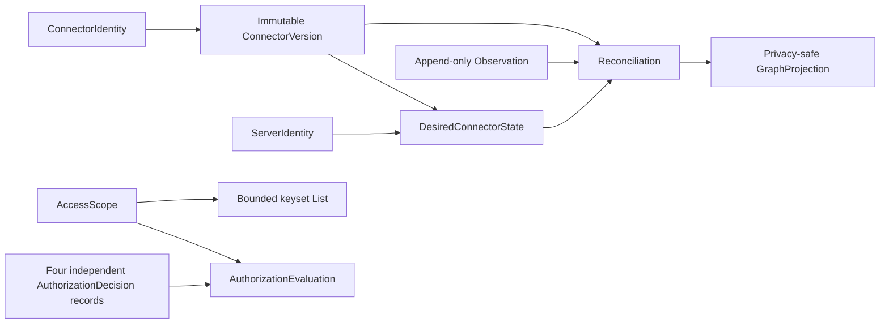

# Connector control-plane contract

The typed contract in `agent_utilities.control_plane.connectors` is the
policy-aware domain boundary for connector registration, discovery, and
reconciliation. It is deliberately not a provider client, database driver, or
second catalog. A repository adapter maps these records to the approved
authoritative catalog/engine while preserving the operation boundaries below.

## State model

`ConnectorIdentity` is derived from publisher, package, and protocol. A
`ServerIdentity` is derived from tenant, connector, and an opaque instance
reference. Neither identity contains a host, URL, credential, or browser
transport detail. `ConnectorVersion` is immutable and digest-pinned to its
controlled inventory reference, mapping, compatibility declaration, and
normalized capability set.

Desired state is operator-owned and versioned. Observations are immutable
probe outcomes and are append-only at the repository seam. Reconciliation
reads both and returns separate desired, observed, drift, lifecycle, and graph
projection records; an observation never calls `put_desired`.

## Capability and inventory bindings

Every capability is an exact `tool`, `resource`, or `prompt` binding with a
stable identity, semantic version, protocol version, schema digest, and
binding digest. Capability sets are bounded, duplicate-free, sorted, and
content-addressed. Compatibility values follow the same bounded, sorted,
unique rule. Inventory records use opaque package/manifest/source/signer
coordinates and a manifest digest. URL, filesystem, environment, and secret
references are rejected at the model boundary.

## Honest probe and drift semantics

An empty result is not proof of deletion. It becomes `verified_empty` only when
the probe is complete and explicitly authoritative. Failed and unreachable
probes require one of the bounded failure codes and can never be marked
verified empty. Reconciliation retains the desired record and emits degraded
drift (`probe_failed`, `probe_unreachable`, `empty_snapshot_unverified`, or
`no_observation`). A genuinely authoritative empty snapshot is reported as
`verified_empty` for explicit operator handling; it does not silently delete or
disable desired state.

Version, manifest, capability, and compatibility mismatches are emitted as
allow-listed drift codes. A quarantined observation produces a deterministic,
opaque quarantine reference and a quarantined lifecycle/projection. Entering
or leaving quarantine remains an explicit desired-state decision, not an
implicit side effect of a probe.

## Authorization and visibility

Approval, package installation, credential access, and enablement are four
independently auditable decisions. Enablement is allowed only when all four are
approved, unexpired, bound to the same tenant/principal/server/version, and the
credential grant is present in the caller's `AccessScope`. No credential value
is accepted by this contract.

Every list request carries a tenant/principal/grant scope and a maximum page
size. Repositories must apply that scope before ordering, cursor application,
counting, or page construction. Keyset cursors carry the scope digest and are
rejected when reused under another scope. Graph projections and page items are
allow-listed summaries: they contain identifiers, status, bounded counts,
digests, and opaque package references, never endpoints, raw provider errors,
principals, grants, or secrets.

## Adapter obligations

Implementations of `ConnectorRepository` must:

1. retain immutable identity, release, and inventory records;
2. mutate desired state only through an explicit revisioned operation;
3. append observations without tombstoning desired state;
4. preserve the four authorization kinds independently;
5. enforce tenant/principal/grant scope before any list operation;
6. return only bounded, scope-bound pages and cursors; and
7. fail closed with `RepositoryContractError` when an adapter violates the
   typed privacy or identity contract.

The adapter may use the native knowledge engine, the existing relational fleet
catalog, or another approved persistence implementation. The control-plane
package makes no storage selection and starts no provider transport. Provider
connectors remain responsible for fetching and mapping external data into
these records; the engine/catalog remains authoritative for durable state.
