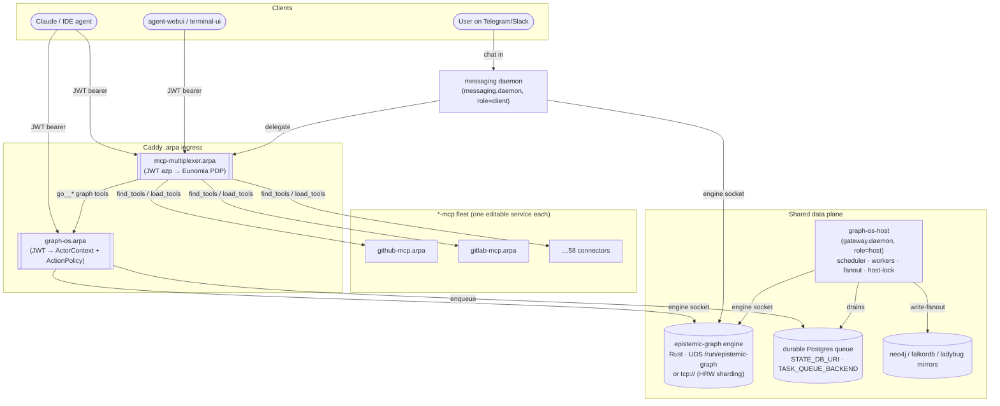

# Containerized Deployment — the KG platform as microservices

> How the agent-utilities Knowledge Graph platform runs **fully containerized**:
> a set of independently deployable services sharing **one data plane** (the Rust
> `epistemic-graph` engine + a durable Postgres queue), fronted by JWT/Eunomia
> auth and Caddy `.arpa` ingress. This replaced the old bare-metal systemd units
> (`epistemic-graph.service`, `agent-utilities-gateway.service`,
> `agent-utilities-messaging.service`) with containers — **zero systemd**.
>
> Ground truth for this page: the committed compose files under
> [`services/graph-os/`](https://gitlab.arpa), `services/mcp-multiplexer/`,
> and the representative `services/github-mcp/` editable fleet service.

## Overview

The platform is **not a monolith**. It is decomposed into single-responsibility
services that all read and write the same graph through a shared low-level data
plane, and submit work onto one durable queue:

| Service | Process | Role | Served surface |
|---|---|---|---|
| **epistemic-graph engine** | Rust `epistemic-graph` | L0/L1 data store; serves a Unix Domain Socket (UDS), optionally TCP | engine socket / `tcp://…:9090` (no HTTP) |
| **graph-os-host** | `agent_utilities.gateway.daemon` (`KG_DAEMON_ROLE=host`) | the single KG host daemon — maintenance scheduler, task/ingest workers, embed-backfill, write-fanout to mirrors, owns the host-lock | none (no port) |
| **graph-os** | `agent_utilities.mcp.kg_server` (`KG_DAEMON_ROLE=client`) | the graph-os **MCP surface** over streamable-http, JWT-authenticated | `graph-os.arpa` |
| **mcp-multiplexer** | `agent_utilities.mcp.multiplexer` | fronts the **whole fleet** (dynamic `find_tools`/`load_tools`); JWT auth + Eunomia zero-trust policy | `mcp-multiplexer.arpa` |
| **messaging daemon** | `messaging.daemon` (client) | chat reply / inbound router; connects to the engine + the multiplexer; loads OIDC fleet creds | inbound chat only (no HTTP port) |
| **`*-mcp` fleet** | one editable service per connector (github, gitlab, …) | one external system each, behind the multiplexer | `<svc>.arpa` |

The **coupling point** is deliberate: every KG client (`graph-os`,
`graph-os-host`, the messaging daemon) talks to the **same engine** over the
shared socket and submits to the **same durable Postgres queue** that
`graph-os-host` drains. The `*-mcp` connectors are independent — they front
external systems and are reached only through the multiplexer.



## Are these microservices?

**Yes.** Each box above is an independently deployable, independently scalable
service with **one responsibility**, communicating over network contracts (the
engine UDS/TCP, the durable Postgres queue, and MCP over streamable-http) rather
than in-process calls:

- **Independently deployable** — each has its own compose stack, image, env, and
  Portainer GitOps source; you can redeploy `github-mcp` without touching
  `graph-os`.
- **Independently scalable** — `graph-os` (the MCP surface) replicates
  horizontally behind Caddy; the `*-mcp` connectors scale per load; the engine
  shards by tenant; `graph-os-host` stays a singleton (it owns the host-lock).
- **Single responsibility** — `graph-os` serves MCP, `graph-os-host` runs the
  background plane, the multiplexer does discovery+auth, each `*-mcp` fronts one
  external system.
- **Not a monolith** — there is no one process that does everything; the old
  bare-metal "one big gateway" was split apart.

**The trade-off** is honest: the **shared engine data plane is the coupling
point**. All KG clients depend on one engine (per shard) and one durable queue
schema. That is a deliberate choice — a single source of truth for the graph
beats N divergent copies — but it means the engine and the queue are the blast
radius, so they get the durability (snapshots, checkpoints, SKIP-LOCKED claims,
advisory-lock leadership) and the placement care. Within a shard the services are
loosely coupled around that shared substrate; across shards the engine is
partitioned by tenant (HRW routing), so the data plane itself scales out.

## Dev deployment (fully editable)

The dev pattern is **edit-on-host, restart-the-service, changes-are-live** — no
image build. It works the same for every KG service:

1. **Base image supplies the heavy runtime deps**, e.g.
   `knucklessg1/agent-utilities:latest` for `graph-os`/`graph-os-host`,
   `python:3.11-slim` for the multiplexer (which pip-installs
   `requirements-multiplexer.txt` at start).
2. **Bind-mount `/au`** — the agent-utilities source from the host
   (`/home/apps/workspace/agent-packages/agent-utilities:/au:ro`) — and set
   `PYTHONPATH=/au` so the live source overlays the image's installed deps. **No
   editable install** (`/au` is read-only); a `*-mcp` service additionally mounts
   its own package at `/src` and sets `PYTHONPATH=/au:/src`.
3. **Bind-mount the shared XDG config dir as a volume** —
   `/home/genius/.config/agent-utilities:/root/.config/agent-utilities:ro` with
   `AGENT_UTILITIES_CONFIG_DIR=/root/.config/agent-utilities` — so the
   containerized service reads the **exact same `config.json`** (embedding,
   backends, `GRAPH_DB_URI`) as the bare-metal host/parent agent. Every KG client
   shares this one config, so they share one KG.
4. **Mount the engine socket dir** so the service reaches the **same engine** the
   host uses: `/tmp/epistemic-graph.sock:/tmp/epistemic-graph.sock` (the
   committed dev compose mounts the socket directly; the canonical shared layout
   is the host dir `/run/epistemic-graph`).

### The engine in dev

The engine runs the **host-built Rust binary** inside an `ubuntu:26.04` base so
the container glibc matches the host toolchain that built the binary. It serves a
**UDS in a shared host dir** (`/run/epistemic-graph`) that is mounted into every
KG client. Bare-metal clients (a debug `graph-os`, a one-off script) reach the
same socket via `GRAPH_SERVICE_SOCKET`. The persist-dir holds snapshots;
`checkpoint-interval 60` flushes every 60s.

### graph-os (MCP surface) — env contract

From `services/graph-os/compose.dev.yml`:

```yaml
environment:
  - TRANSPORT=streamable-http
  - PORT=8000
  - PYTHONPATH=/au                  # editable: import agent_utilities from the mount
  - KG_DAEMON_ROLE=client           # serves MCP; the host daemon is the sibling
  - GRAPH_BACKEND=tiered
  - AGENT_UTILITIES_CONFIG_DIR=/root/.config/agent-utilities
  - MCP_AUTH_TYPE=${MCP_AUTH_TYPE:-jwt}   # jwt validates the Keycloak bearer at ingress
  - AUTH_JWT_JWKS_URI=http://keycloak.arpa/realms/master/protocol/openid-connect/certs
  - AUTH_JWT_ISSUER=http://keycloak.arpa/realms/master
  - AUTH_JWT_AUDIENCE=agent-services
volumes:
  - /home/apps/workspace/agent-packages/agent-utilities:/au:ro
  - /tmp/epistemic-graph.sock:/tmp/epistemic-graph.sock
  - /home/genius/.config/agent-utilities:/root/.config/agent-utilities:ro
  - agent_utilities_data:/root/.local/share/agent-utilities   # snapshots / L1 cache
command:
  - sh
  - -c
  - "pip install --no-cache-dir neo4j falkordb redis 2>&1 | tail -1; exec python -m agent_utilities.mcp.kg_server"
```

**Mirror-driver install caveat:** the base image carries the core deps, but the
mirror drivers (`neo4j`, `falkordb`, `redis`) that write-fanout needs are **not**
in the base image — the dev `command` installs the light wheels at start before
launching. The first boot is therefore slow; `start_period: 120s` on the
healthcheck accounts for it.

`MCP_AUTH_TYPE=jwt` validates every client's Keycloak JWT so each request runs
under a per-user `ActorContext` and the fail-closed **ActionPolicy** gate
enforces per-principal permissions (OS-5.14) — the graph-os peer of the
multiplexer's Eunomia. For a **day-0 bootstrap before Keycloak is up**, set
`MCP_AUTH_TYPE=none` in the stack env. `KG_SERVED_PROFILE=0` lets a standalone
debug `graph-os` accept local unauthenticated inbound calls.

### graph-os-host (the background plane)

Identical mounts and config, but `KG_DAEMON_ROLE=host`, **no served port**, and
it launches `python -m agent_utilities.gateway.daemon`. It owns the host-lock
(its healthcheck asserts `effective_daemon_role() == "host"`), runs the
maintenance scheduler + task/ingest workers + embed-backfill, and fans writes out
to the mirrors. It replaces the bare-metal `agent-utilities-gateway.service`.

### mcp-multiplexer (dev)

`MCP_MULTIPLEXER_MODE=dynamic` — only meta-tools + always-on servers are mounted;
the rest load on demand. It reads `MCP_CONFIG=/mcp_config_central.json` (the
fleet config) and `EUNOMIA_POLICY_FILE=/eunomia_policy.json` (both bind-mounted).
JWT identity at ingress sets the principal to the token **azp** (e.g.
`claude-code`). In dev the JWKS/issuer/audience and `MCP_AUTH_TYPE`/`EUNOMIA_TYPE`
are supplied via the stack env as **plain `${VAR}`** (not `${VAR:-default}` —
Portainer string-stacks don't honour the default form).

### The `*-mcp` fleet (dev)

Each connector is one editable service. From `services/github-mcp/compose.dev.yml`:
it bind-mounts its own package at `/src` and agent-utilities at `/au`, sets
`PYTHONPATH=/au:/src`, builds an installable copy at start
(`cp -a /src/. /tmp/pkg && pip install /tmp/pkg && exec github-mcp`), and is
fronted with `AUTH_TYPE=jwt` + `EUNOMIA_TYPE=remote`
(`EUNOMIA_REMOTE_URL=http://eunomia.arpa`). Connector creds (`GITHUB_TOKEN`, …)
come from the stack env.

### Deploying the dev stacks

Deploy from the **R820 Swarm manager** (RW710 is a worker). Because the services
bind-mount host paths, they are **pinned to the node holding the bind-mounts**
via a placement constraint (`node.labels.name == ${SERVER:-RW710}`):

```bash
# from the R820 swarm manager
docker stack deploy -c services/graph-os/compose.dev.yml         graph-os
docker stack deploy -c services/mcp-multiplexer/compose.dev.yml  mcp-multiplexer
docker stack deploy -c services/github-mcp/compose.dev.yml       github-mcp

# edit code on the host, then restart the service to pick it up live:
docker service update --force graph-os_graph-os
docker service update --force graph-os_graph-os-host
```

> The dev stacks pin every service to the node that physically holds the source
> tree + XDG config + engine socket. If you scale a bind-mounted service across
> nodes, the mounts won't exist on the other nodes — keep dev replicas on the
> pinned node, or move to the production (no-bind-mount) model.

## Production deployment

Production swaps bind-mounts for **built, pinned images** and injects secrets
from OpenBao. Nothing editable, nothing secret in the repo.

### Images, not mounts

Each service runs a **versioned image pulled from the private registry**
(`docker.io/knucklessg1/<service>:<tag>` per
[`deploy/mcp-fleet.registry.yml`](../../deploy/mcp-fleet.registry.yml)) — no
`/au`/`/src` bind-mount, no pip-install-at-start. The engine runs as a **built
engine image** (not the host-binary-in-ubuntu trick). GitOps is **Portainer off
`gitlab.arpa`**: the stack source is a git repo, Portainer redeploys on change.

### Secrets from OpenBao (never committed)

Secrets live in **OpenBao at `apps/<service>`** (KV v2, mount `apps/`) and are
injected into each stack's env at deploy time. The repo `.env` holds only
non-secret defaults and the *names* of vars. Retrieve with `bao kv get
apps/<service>` or `openbao-mcp`; the per-service `OPENBAO_TOKEN` carries the
`agent-apps-rw` policy scoped to `apps/data/*`. Key secrets per service:

| Secret | Used by | Purpose |
|---|---|---|
| `OIDC_CLIENT_ID` / `OIDC_CLIENT_SECRET` / `OIDC_AUDIENCE` / `OIDC_TOKEN_URL` (+ `MCP_CLIENT_AUTH=oidc-client-credentials`) | multiplexer, messaging daemon, every spawned agent | Keycloak client-credentials bearer to reach the jwt-protected fleet |
| `GRAPH_DB_URI` | host daemon, graph-os | L3 Postgres KG store |
| `STATE_DB_URI` | host daemon, graph-os | durable checkpoints/sessions/**queue** Postgres |
| provider keys (`LLM_API_KEY`, `ANTHROPIC_API_KEY`, …) | graph-os, messaging, connectors | model inference |
| `TELEGRAM_BOT_TOKEN` (+ Slack/Mattermost/…) | messaging daemon | enable each chat backend |
| connector creds (`GITHUB_TOKEN`, `GITLAB_TOKEN`, …) | the matching `*-mcp` | reach the external system |
| `OPENBAO_TOKEN` | every service | read its own `apps/<service>` secrets |

The messaging daemon specifically loads the OIDC client-credentials into its
process env at startup (sourced from `apps/mcp-multiplexer` in OpenBao) so the
multiplexer it spawns — **and every nested `graph_orchestrate`-spawned agent** —
authenticate to the fleet. These creds are **never** put in a plaintext config or
`.env` file (see [Messaging Reach](messaging_reach.md)).

### Multi-user auth, edge, engine, queue

- **JWT + Eunomia for multi-user.** Keycloak mints the bearer; the multiplexer
  validates it and maps the **azp principal** to an Eunomia identity. The Eunomia
  policy is **zero-trust default-deny**: a `_base-meta-tools` rule grants every
  authenticated principal only the discovery meta-tools (`find_tools`,
  `list_catalog`, `load_tools`, `unload_tools`, `multiplexer_status`), and
  **per-client rules grant actual capability**. Onboard a new client (mint the
  Keycloak client + append its allow rule) with the **`mcp-client-onboarder`**
  skill. graph-os enforces the peer control: JWT → `ActorContext` →
  per-principal ActionPolicy.
- **Caddy edge.** All ingress is the global Caddy reverse proxy publishing the
  `.arpa` domains (`graph-os.arpa`, `mcp-multiplexer.arpa`, `<svc>.arpa`) with
  HTTPS termination.
- **Engine via socket-volume or TCP sharding.** Single-host prod can share the
  engine UDS through a host-dir volume; scale-out exposes the engine over TCP
  (`--tcp-addr`) and clients address shards via `GRAPH_SERVICE_ENDPOINTS` (e.g.
  `tcp://engine:9090`) with **client-side HRW routing** by tenant — see
  [Tenant-Partitioned Engine Sharding](engine_sharding.md).
- **Durable Postgres queue/state.** `STATE_DB_URI` externalizes
  checkpoints/sessions/queues onto shared Postgres with `SKIP LOCKED` claims and
  advisory-lock daemon leadership; `TASK_QUEUE_BACKEND` selects the durable queue
  the host daemon drains — see
  [Durable-State Externalization](state_externalization.md) and
  [Queue-Driven Agent Dispatch](agent_dispatch.md).

### Health, placement, scaling

Each service ships a healthcheck (HTTP `/health` for graph-os, a socket connect
for the multiplexer, the host-lock assertion for the daemon). With images (no
bind-mount pin) you can place by capacity and **scale each service
independently**: replicate `graph-os` and the `*-mcp` connectors behind Caddy;
keep **`graph-os-host` a singleton** (host-lock); shard the engine by adding
endpoints. Reactive autoscaling is declared per-service in the
`FLEET_DESIRED_STATE_PATH` override (see the scaling block in
[`deploy/mcp-fleet.registry.yml`](../../deploy/mcp-fleet.registry.yml)) and acted
on by the leader-only autoscaler tick.

### Day-0 bring-up

Stand the whole thing up from bare hosts with the **`agent-os-genesis`** skill:
it resolves the adaptive run plan (orchestrator, IdP, secrets store, ontology
host), brings up Swarm + Vault + DNS + SSO + Caddy ingress + observability, then
deploys the `*-mcp` fleet from
[`deploy/mcp-fleet.registry.yml`](../../deploy/mcp-fleet.registry.yml). The
`deploy/swarm/graphos.stack.yml` and `deploy/k8s/graphos.yaml` manifests carry
the **same env contract** as the dev compose, downscaled/upscaled by replica
count and placement only.

## Migration note — from systemd to zero-systemd

The platform previously ran as three bare-metal **systemd units** on the source
host:

| Old systemd unit | Now |
|---|---|
| `epistemic-graph.service` | **engine** container (dev: host-built binary in `ubuntu:26.04`; prod: built engine image), UDS exported via a shared host dir / TCP shards |
| `agent-utilities-gateway.service` | **graph-os-host** (`gateway.daemon`, `KG_DAEMON_ROLE=host`) container — the background plane — **plus** **graph-os** (`kg_server`, role `client`) container for the MCP surface (the one unit was split into the host daemon and the served surface) |
| `agent-utilities-messaging.service` | **messaging daemon** (`messaging.daemon`) container |

The move is a **strangle-then-delete**: the containers read the **same**
`config.json` (the shared XDG mount) and the **same** engine socket, so they join
the identical KG the systemd units served — no data migration. Once the stacks
are healthy, the systemd units are removed entirely. Result: **zero systemd** —
the whole KG platform is containerized, GitOps-managed via Portainer, and
restartable/redeployable per service without touching the host's init system.
