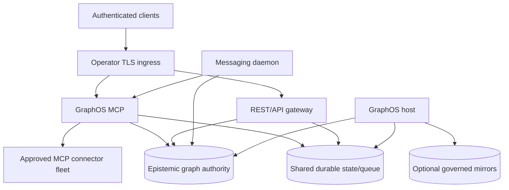

# Containerized deployment

Agent Utilities can run as independently deployable services around one
authoritative Rust epistemic-graph data plane. Container manifests are templates;
the operator supplies placement, endpoints, identities, secret references, TLS
profiles, and image digests through an external deployment profile.

## Service model

| Service | Process | Responsibility | Network surface |
|---|---|---|---|
| Epistemic graph engine | packaged Rust server | authoritative graph persistence, compute, cache, semantics, and placement | native UDS or authenticated TLS/TCP; no HTTP |
| GraphOS host | `graph-os-daemon` | maintenance scheduler, background workers, embedding backfill, and governed mirror fan-out | none |
| GraphOS MCP | `graph-os` | authenticated MCP, fleet discovery, delegation, and graph tools | stdio or streamable HTTP |
| REST/API gateway | `python -m agent_utilities` | application and UI API surface | authenticated HTTP |
| Messaging daemon | `agent-utilities-messaging` | inbound channel routing and GraphOS delegation | provider-specific inbound transport |
| Connector fleet | selected `*-mcp` packages | native connection point to one external system per package | registry-declared MCP transport |

The engine is the single source of truth. Optional Neo4j, PostgreSQL/AGE,
LadybugDB, and other stores are governed mirrors or external ingest sources; they do
not silently become graph authority.


```mermaid
flowchart TB
    C[Authenticated clients] --> I[Operator TLS ingress]
    I --> G[GraphOS MCP]
    I --> R[REST/API gateway]
    M[Messaging daemon] --> G
    G --> F[Approved MCP connector fleet]
    G --> E[(Epistemic graph authority)]
    R --> E
    M --> E
    H[GraphOS host] --> E
    G --> Q[(Shared durable state/queue)]
    R --> Q
    H --> Q
    H --> X[(Optional governed mirrors)]
```

## Deployment invariants

- Every non-loopback request is authenticated and converted into a verified
  `ActorContext`; authorization and ACL infrastructure fail closed.
- Clients contact the configured engine coordinator. They never infer graph
  placement or start a local substitute when `GRAPH_SERVICE_ENDPOINTS` is set.
- GraphOS MCP, the headless host daemon, and the REST gateway are distinct
  entrypoints.
- Every service receives the same reference-only AgentConfig policy, but only the
  minimum credentials required for its role.
- Container images are immutable and digest-pinned. Runtime package installation and
  editable source mounts are development conveniences, not a production posture.
- Logs, traces, manifests, and reports exclude resolved secrets, raw identities,
  deployment endpoints, host names, and host filesystem locations.

## AgentConfig boundary

The canonical document is `$XDG_CONFIG_HOME/agent-utilities/config.json`. A
container orchestrator presents that document read-only through its config mechanism
and sets the XDG config root for the workload. Do not maintain a repository `.env`
file or bake a site profile into an image.

The following is a neutral distributed shape:

```json
{
  "GRAPH_SERVICE_ENDPOINTS": ["tls://engine.example.invalid:9100"],
  "ENGINE_TLS_PROFILE_REF": "secret://tls/engine-client-profile",
  "GRAPH_MIRROR_TARGETS": "age",
  "GRAPH_DB_CONNECTION_PROFILE_REF": "secret://graph/mirror-profile",
  "KG_DAEMON_ROLE": "client",
  "KG_IDENTITY_OAUTH2": {
    "token_url": "https://identity.example.invalid/oauth2/token",
    "client_id": "graph-client",
    "client_secret": "secret://identity/graph-client-secret",
    "audience": "graph-services"
  },
  "AUTH_JWT_JWKS_URI": "https://identity.example.invalid/.well-known/jwks.json",
  "AUTH_JWT_AUDIENCE": "graph-services",
  "KG_POLICY_VERSION": "current",
  "LANGFUSE_HOST": "https://observability.example.invalid",
  "LANGFUSE_PUBLIC_KEY_REF": "secret://observability/langfuse-public-key",
  "LANGFUSE_SECRET_KEY_REF": "secret://observability/langfuse-secret-key",
  "LANGFUSE_TLS_PROFILE_REF": "secret://tls/langfuse-profile",
  "LANGFUSE_CAPTURE_CONTENT": false,
  "LANGFUSE_KG_AUTO_INGEST": false
}
```

Reserved `.invalid` names are documentation placeholders. Runtime discovery supplies
the real topology outside the source tree.

Use `KG_AUTH_TOKEN_REF` instead of `KG_IDENTITY_OAUTH2` only when the deployment
deliberately issues a governed static client token. Configure exactly one identity
mode. A GraphOS-host workload uses the same policy with `KG_DAEMON_ROLE=host` and does
not expose an HTTP port.

## Secrets and TLS

AgentConfig stores references, not resolved values:

| Material | Configuration boundary |
|---|---|
| Engine client identity | `KG_AUTH_TOKEN_REF` or the secret reference inside `KG_IDENTITY_OAUTH2` |
| Engine transport trust | `ENGINE_TLS_PROFILE_REF` |
| Graph mirror connection | `GRAPH_DB_CONNECTION_PROFILE_REF` |
| Connector credentials | connector-specific runtime secret references |
| Langfuse credentials and trust | both Langfuse key references plus `LANGFUSE_TLS_PROFILE_REF` |
| OpenTelemetry auth and trust | OTLP credential/header references and `OTEL_TLS_PROFILE_REF` |
| Fleet event authentication | `FLEET_EVENTS_TOKEN_REF` |

Some libraries require resolved material rather than a reference field. For example,
the shared state store consumes `STATE_DB_URI`, and a distributed engine may consume a
shared HMAC value. The deployment secret resolver injects those values into process
memory at launch; they are not persisted to AgentConfig or a repository file.

TLS profiles contain the CA bundle reference, optional client certificate/key
references, expected server name, and verification policy. Use the shared resolver for
private PKI and incomplete server chains. Never hardcode certificate verification off.

The secret provider and its key hierarchy are operator choices. Workload-scoped
identity must allow each service to resolve only its own references; administrative
or root tokens are not runtime credentials.

## Engine connectivity

### Supervised local engine

When `GRAPH_SERVICE_ENDPOINTS` is absent, GraphOS supervises the packaged engine as an
out-of-process child over a private local transport. The resolver manages its runtime
location and per-install authentication material under XDG directories. Containers
should use a private shared runtime volume when the engine and clients are separate
workloads on one host; no host path belongs in AgentConfig.

### Remote or sharded engine

When `GRAPH_SERVICE_ENDPOINTS` is present, every client is connect-only. Use one stable
coordinator contact whenever possible. If the deployment exposes Raft groups
separately, provide the strict `GRAPH_RAFT_GROUP_ENDPOINTS` mapping generated from the
external placement inventory. The engine returns authoritative group, epoch, and fence
information; stale routes refresh without inventing a second placement authority.

See [Engine sharding](engine_sharding.md).

## Durable state and queue

Single-host deployments may retain XDG-managed SQLite state. Multi-host deployments
inject a shared PostgreSQL DSN as `STATE_DB_URI` and select the desired queue backend.
This externalizes checkpoints, sessions, goals, and task claims and enables
leader-election and `SKIP LOCKED` work claiming across replicas.

Broker addresses, database DSNs, credentials, and TLS material remain in the external
runtime profile and secret/TLS references. See
[Durable-state externalization](state_externalization.md) and
[Queue-driven agent dispatch](agent_dispatch.md).

## Connector fleet

The generated fleet registry is a capability catalog, not a site inventory. The
operator-owned deployment profile selects packages and supplies discovered endpoints,
workload identity, connector secret references, and TLS profiles. GraphOS loads tools
on demand through the registry rather than exposing every connector tool in every
context.

For graph-shaped external data, use the universal connector lifecycle:

1. discover the remote schema;
2. generate or accept an external mapping artifact;
3. validate policy, provenance, TLS, and limits;
4. preview a `ChangeEnvelope`;
5. apply a governed snapshot or delta sync;
6. checkpoint an opaque cursor.

See [Universal external graph connectors](universal-external-graph-connectors.md).

## Development deployment

Use the same images, XDG AgentConfig boundary, identity checks, and secret/TLS
resolution as production. A developer may overlay source through an
orchestrator-managed workspace mount, but the mount is runtime-only and never appears
in AgentConfig, a trace, or a report. Keep local HTTP listeners on loopback.

Before exposing a network listener:

```bash
agent-utilities doctor --only config auth secrets transport_security graph_connections
```

## Production deployment

The `agent-utilities-deployment` workflow consumes the external profile and performs
an ordered rollout:

1. verify image signatures/digests and dependency versions;
2. validate workload identity and all secret/TLS references;
3. deploy engine authority and certify placement;
4. deploy the GraphOS host and shared state workers;
5. deploy MCP, REST, messaging, and selected connectors;
6. run authenticated health, delegation, trace, and connector certification;
7. enable propose-only optimization and later autonomous mutations under
   ActionPolicy approval.

Scale stateless GraphOS, REST, and connector workloads independently. Scale workers by
queue depth and engine capacity. Shard the engine only through its governed placement
catalog. A health check must cover process readiness, identity validation, engine
reachability, queue/state access, and the effective host/client daemon role.

## Langfuse and traces

Both Langfuse credential references plus the TLS profile allow the Langfuse MCP child
and propose-only failure evolution to auto-enable. `TRACE_EXPORT_ENABLED`, content
capture, and KG auto-ingestion are independent explicit gates. Content capture remains
off by default. KG auto-ingestion additionally requires
`LANGFUSE_PERSISTENCE_HMAC_KEY_REF` so durable identities remain opaque.

Validate the configured TLS chain, list traces through the Langfuse MCP capability,
run one local delegated turn, and confirm that its metadata-only trace is visible.

## Updates and hot swaps

Roll out one compatible workload class at a time behind readiness checks. Keep the
engine protocol and graph schema gates explicit, drain queue workers before replacing
them, and preserve idempotency keys across retries. Roll back the immutable deployment
revision if certification fails; do not mutate running containers or install packages
at startup.
