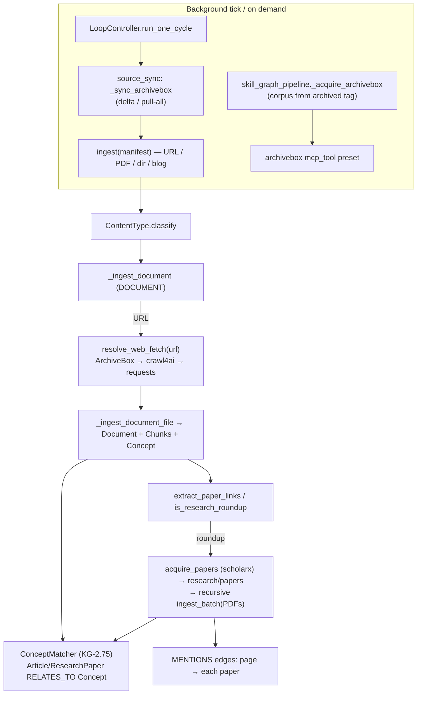

# Content-Aware Ingestion (ArchiveBox · crawl4ai · scholarx)

**CONCEPT:KG-2.7** — extends the unified Ingestion Engine so that *fetching* a web
page is pluggable and *what we do with it* depends on the content. Throw a
document, a URL, a PDF, or a research-roundup blog at the engine and it ingests,
enriches, vectorizes — and for a page that points at research papers it also
downloads and ingests those papers automatically.

## Why

The Ingestion Engine (`knowledge_graph/ingestion/engine.py`) already turns any
`ContentType` into `Document`/`Chunk`/`Concept` nodes with one enrichment pass and
ConceptMatcher cross-linking (KG-2.75). Three gaps remained: web fetching was a bare
`requests.get` (no crawl4ai, no ArchiveBox); a research roundup was ingested as a
flat page (its paper links ignored); and the deployed ArchiveBox instance — which
perfectly preserves pages — was unused. This change closes all three on top of the
existing spine.

## Components

- **Unified web-fetch resolver** — `ingestion/web_fetch.py:resolve_web_fetch(url)`.
  One front door, precedence **ArchiveBox → crawl4ai → requests+markitdown**.
  ArchiveBox serves the preserved snapshot via the `archivebox-api` MCP server
  (archive-on-miss); crawl4ai renders JS; requests is the zero-dep floor. Both the
  `DOCUMENT` URL adaptor and the skill-graph pipeline call it.
- **Research acquisition** — `ingestion/paper_links.py` extracts arXiv/DOI/PDF refs
  and detects a "roundup" (≥3 distinct scholarly links);
  `ingestion/research_acquisition.py` downloads them via `scholarx-mcp`
  (`sx_storage download_url`, direct fallback) into `research/papers`. The
  `DOCUMENT` adaptor, after ingesting a roundup page, downloads + ingests each paper
  and writes a `MENTIONS` edge page→paper. Default ON for roundups; force/disable
  with `metadata["extract_papers"]`.
- **ArchiveBox source** — an `archivebox` `mcp_tool` source preset (KG-2.59) lists
  snapshots; `core/source_sync.py:_sync_archivebox` ingests each archived URL
  through the `DOCUMENT` path (so the body is ArchiveBox-served and roundups still
  acquire their papers); the `LoopController` runs it as a default-on background
  stage when `ARCHIVEBOX_URL` is set. The skill-graph pipeline gains an
  `archivebox` source kind to build a corpus from snapshots under a tag.
- **Surfaces** — `graph_ingest` actions `ingest_url` and `archivebox_sync` (with the
  generic action-routed REST twin).

## Flow



## Configuration

- `ARCHIVEBOX_URL` — presence is the on-signal that prefers ArchiveBox for fetching
  and enables the background intake stage. The credential lives with the
  `archivebox-api` MCP server, not here.
- crawl4ai is auto-detected (`SKILL_GRAPH_CRAWLER` / installed `crawl4ai`); no flag.
- `metadata["extract_papers"]` — `True` forces paper acquisition for any page,
  `False` disables it; absent → auto-detect roundups.

## Usage

```text
# Ingest a research roundup → page + its papers, cross-linked
graph_ingest action=ingest_url target_path=https://www.turingpost.com/p/...   # auto
graph_ingest action=ingest_url target_path=<url> description=extract_papers     # force

# Pull everything preserved in ArchiveBox (or delta)
graph_ingest action=archivebox_sync corpus_name=full

# Build a skill-graph from archived snapshots tagged "research"
graph_ingest action=build_skill_graph corpus_name=research-archive base_path='[{"kind":"archivebox","uri":"research"}]'
```
