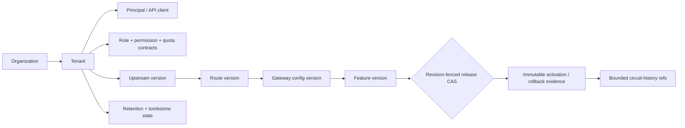

# Control-plane foundation contracts

`agent_utilities.control_plane.foundation` is the persistence-independent
contract for the identity, policy, and gateway-release planes. It is deliberately
metadata-only: request-rate buckets, health samples, secret values, raw gateway
payloads, and provider transports belong to later adapters and never enter these
records.

## Scope and identity

Every tenant-owned record carries both `organization_id` and `tenant_id`. A
`TenantScope` additionally binds the verified principal, optional API client, and
sorted grant digests. Repository reads are scope-first; a reference to another
organization or tenant is treated as missing and the service fails closed. Stable
IDs are derived from the owning scope and canonical names/opaque subject refs.

Organizations, tenants, principals, and API clients are frozen identity records.
API clients carry only a provider-owned `key_ref`; no key or secret material is
accepted. Roles, permissions, memberships, entitlements, and quota contracts are
also immutable records. Quotas describe bounded policy limits only; they do not
contain hot counters or rate-limit buckets.

## Versioned gateway surface

Upstreams, routes, gateway configs, and features are versioned, digest-pinned
records. Routes bind an exact upstream version; configs bind sorted exact route
and upstream references, including each target's content digest; features may bind
an exact config version with the same digest fence. Endpoint,
TLS-key, CA, policy, and artifact values are opaque references rather than URLs,
credentials, or configuration bodies.

## Activation, rollback, and deletion

The release pointer is mutable only through `compare_and_swap_release`: callers
must present the expected revision and prior digest. Each successful transition
creates an immutable activation record, including whether it was an activation
or a rollback and the prior target version. Rollback is limited to a version
already present in that pointer's activation history; an unknown or tombstoned
version cannot be reintroduced. A stale CAS fails without changing the pointer.

Tombstones are separate immutable records with a bounded retention reference,
reason reference, and purge horizon. A currently released version cannot be
tombstoned. Once tombstoned, it cannot be activated again. The service never
rewrites an identity or version record to make a lifecycle transition appear
atomic; the immutable state record plus tombstone/activation evidence is the
audit boundary.

Circuit state stores only a bounded, sorted set of opaque history references and
transition metadata. Health samples and raw failure bodies remain outside this
control-plane contract.
