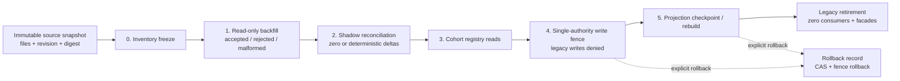

# Governed control-plane migrations

The migration authority turns a legacy-to-target move into a typed, replayable
state machine.  Source Markdown/configuration/data remains authoritative during
the move; migration records store only canonical identities, revisions, digests,
bounded observations, and evidence references.

## Evidence and identity rules

Every source snapshot has a repository-relative file inventory, source revision,
content digest, metadata digest, and a canonical snapshot digest.  Plans,
inventories, observations, batches, reconciliations, cutovers, fences,
checkpoints, retirement proofs, and rollback records have stable opaque
references plus version/digest pairs.  No model accepts inline source bytes,
payloads, secrets, credentials, tokens, or results.

Stage 0 freezes the inventory.  Stage 1 is explicitly read-only: an accepted
observation means that the source record was understood, not that the target has
been approved.  Rejected and malformed observations remain evidence and block
the clean cutover gate.  Approval fields require separate approval and operator
references, while the backfill authority rejects approved observations entirely.

Stage 2 compares canonical record identities in sorted order.  Identical source
and target snapshots produce zero deltas; one changed record or file revision
produces exactly one successor delta.  Reconciliation never approves a write.

## Cutover, retirement, and recovery

Read cutover is cohort-scoped and requires a passed gate over the exact source
snapshot plus a clean shadow reconciliation.  Write cutover requires every
activated cohort, the target authority identity, a monotonically increasing
fence epoch, and literal denial of legacy writes.  A projection checkpoint is
complete only with a deterministic projection digest and rebuild-plan identity.

Legacy retirement requires a passed gate, an active write fence, a complete
checkpoint, and independently digested inventories proving zero remaining
consumers and zero compatibility facades.  A nonzero count cannot become a
retired state.

Every stage transition is a compare-and-set version advance.  Replaying the same
reference and digest returns the existing record; changed input at the same
identity is rejected.  Rollback is never inferred from a failed gate: an
explicit rollback record is required, and active write fences are themselves
versioned into a rolled-back state before the migration plan advances to the
rollback state.
