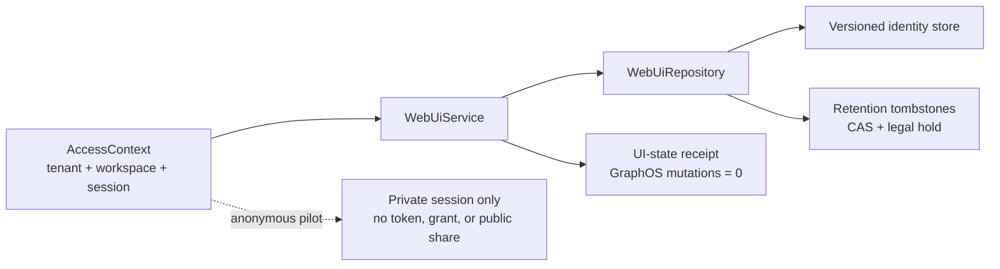

# Control-plane Web UI authority

The Web UI control plane is a tenant/workspace-scoped identity boundary.  It
records immutable identities and opaque references for the interface; it does
not become a second content store, credential issuer, or GraphOS permission
authority.

## Authority and data boundaries

Every repository and service operation receives an `AccessContext` explicitly.
The repository key includes the context tenant and workspace, and authorization
is checked before a read, write, page, or retention transition.  Cross-scope
lookups return no result (and retention transitions return the same typed
not-found error) rather than revealing whether another tenant has an object.

The models cover tenant, workspace, user, profile, session, conversation,
message, content reference, attachment, preference, saved query, dashboard,
widget, notification, feedback, and support identities.  Content and
attachment values are represented by opaque artifact/reference identifiers and
digests only.  Inline text, bytes, credentials, provider grants, tokens,
vectors, results, and public-share material are rejected at the model boundary.

Saving preferences, saved queries, dashboards, or widgets returns a typed
`UiStateWriteReceipt`.  Its authority counters are literal zeroes: a UI-state
write cannot grant GraphOS permissions, provider access, or a public share.

## Consistency and lifecycle

Entity updates require monotonic versions and the caller's exact expected
version.  The in-memory repository is a deterministic contract implementation;
a durable adapter can replace it behind `WebUiRepository` without changing the
authority rules.  Pages are sorted by opaque identity and bounded by
`MAX_PAGE_SIZE`, with canonical `cursor:<offset>` cursors.

Retention is a separate versioned record so replaying an old identity cannot
resurrect a deleted object.  Valid paths are `active → retained →
deletion_pending → deleted` (or a direct `active → deletion_pending` request),
with legal hold attachable before deletion.  A
hold records the exact state to resume; release must name the matching state,
and deletion is rejected while the hold is active.  Deleted entities remain
represented by a tombstone and are excluded from current reads and pages.

## Anonymous pilot

An anonymous pilot uses an explicit private-boundary context and may create
only scoped, private records.  Pilot sessions are time-bounded opaque
identities; opening one does not mint a token or provider grant.  Workspace
visibility, authority identities, session mismatches, public shares, and inline
authority material fail closed.  The pilot boundary is an application guard,
not a GraphOS permission mutation.
