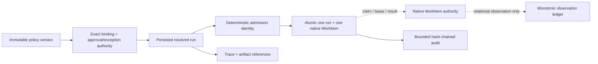

# Policy-bound resolved runs

NE-086 separates policy resolution and admission identity from execution. A
policy version is immutable and content-addressed. Capability bindings, policy
approvals, and signed exceptions pin exact versions and digests. A resolved run
persists those exact references so a crash, retry, or reclaim cannot silently
adopt a newer policy, job, task, or tool binding.

## Invariants

- `(policy_id, version)` and every capability binding are immutable exact
  identities. `latest`, ranges, aliases, and digest drift are rejected.
- Requested task/depth/fanout/tool/token/time/cost budgets cannot exceed the
  policy or rule ceiling. Binding privilege cannot exceed the policy ceiling.
- Approval decisions bind the exact policy reference, operation, request digest,
  approver quorum, signer, and validity window. Expired, stale, denied, or
  signature-invalid approvals fail closed.
- A signed exception binds the same policy/operation/request and has its own
  bounded budget, signer, and time window. It cannot raise a policy budget.
- Run identity is derived from tenant and idempotency key only; the request
  body digest is checked separately. Replaying an identity with different body
  or resolution data is a hard drift error.
- Admission atomically creates one persisted resolved run and one native
  WorkItem request. Duplicate delivery returns the original receipt; it never
  creates a second pair or re-resolves policy.
- Trace, artifact, invocation, and tool references carry identifiers and
  digests only. Raw secrets, arguments, bodies, prompts, and results are not
  accepted by the models.
- The relational observation ledger is append-only and monotonic. It cannot
  claim, lease, fence, complete, or return results for WorkItems.
- Audit events are bounded, material-free, and hash-chained. Discontinuity or
  capacity exhaustion fails closed rather than silently truncating history.

