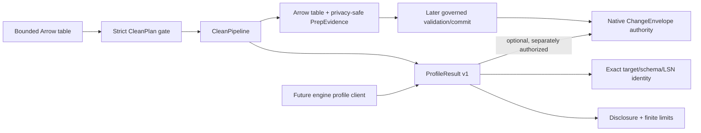
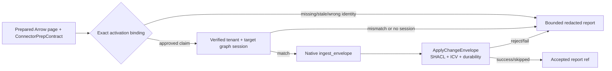

# Arrow data-preparation kernel

This page records the NE-108 preparation boundary and the NE-112 profiling
contract implemented by `agent_utilities.data_prep`.  It is a pure, local
preparation layer: it does not publish graph facts, advance a source
checkpoint, or replace the native `ChangeEnvelope`/`MutationBatch` admission
path.



## Contract

`CleanPlan` is a frozen `ProtocolModel` with `extra="forbid"` and strict
primitive validation.  A plan must carry a schema version, immutable plan,
policy and approved-model references, an explicit local `LocalProfile`, and an
explicit `invalid_row_disposition` (`fail` or `quarantine`).  Its `steps` are a
discriminated union of exactly five verbs:

* `canonical_names` deterministically normalizes field names and rejects
  collisions;
* `null_policy` explicitly allows or rejects nulls in named fields;
* `safe_cast` requires the observed source type and allows only same-type or
  widening signed/unsigned integer and `float32` to `float64` conversions;
* `dedupe` requires one or more explicit key fields and retains the first
  occurrence in input order; and
* `fill_nulls` supplies strict scalar values that must fit the current Arrow
  type without a lossy conversion.

The executor uses Arrow tables and compute kernels only.  There is no pandas
hot path, row-oriented adapter, dynamic method dispatch, caller-plan mutation,
or unsafe cast mode.  `ArrowAdapter.from_batches` is the only convenience
adapter and enforces the same local profile before returning a table.

Before evidence is emitted, `CleanPipeline` resolves the plan's model reference
through an immutable `RowModelRegistry`.  Registry entries are trusted strict
Pydantic models (`strict=True`, `extra="forbid"`) pinned by a digest of their
JSON schema; the plan cannot name an import path or execute a caller-selected
class.  The model fields must exactly match the post-clean Arrow schema, and
every bounded row is validated.  Validation errors are intentionally reduced to
per-row `accepted`/`quarantined` dispositions and generic reason codes; rows
removed by deduplication receive a terminal `dropped`/`deduplicated` outcome.

## Evidence and checkpoints

`PrepEvidence` is a versioned operation record, not a second artifact store. It
reuses the existing protocol's opaque artifact/source reference convention;
later callers can bind those references to the canonical `Artifact` and native
evidence envelopes.  It contains only:

* plan and input/output schema digests;
* algorithm/version, row counts and bounded step accounting;
* immutable plan/model digests plus policy and opaque source/artifact references;
* allow-listed quarantine reason codes with counts; and
* bounded per-row terminal outcomes containing only an ordinal, status and
  generic reason code.  Accepted, deduplicated (`dropped`) and quarantined
  outcomes cover every input ordinal exactly once, so a checkpoint decision
  cannot silently omit rows removed by deduplication.

Rows, field names, rejected values, fill values, samples, top-k values,
unkeyed content fingerprints and secrets are absent.  A quarantined result has
`outcome="quarantined"` and
`checkpoint_eligible=false`; no local preparation result can claim checkpoint
success.  A `fail` disposition raises `InvalidRowsError` before returning a
result.  Checkpoint advancement remains the responsibility of the selected
source/WorkItem authority after every item has a terminal, evidenced outcome.

The local profile bounds rows, columns, Arrow memory footprint, plan steps,
quarantine rows and per-row evidence before work begins.  The versioned
`ProfileResult` is also the response contract for a future engine-native
profile client.  It carries an exact target kind/reference, schema digest and
optional as-of LSN; a result whose identity differs from its target is
invalid.  Per-column signals are ordinal-based (field names are never
returned) and bounded to null count/rate, cardinality, numeric min/max/mean,
quantiles, thresholded top-k values and stable warning codes.  A selector may
request a bounded ordinal subset while retaining the full schema digest.
Numeric values
and top-k entries are suppressed when their non-null group is below the
`disclosure_threshold`; top-k values never disclose a count below that
threshold.  `max_columns`, `max_cardinality`, `max_bytes`, `deadline_ms`,
`max_top_k`, `max_quantiles` and `max_warnings` are strict finite budgets, and
truncation is explicit and deterministic.

`profile_table` and `CleanPipeline.profile` are Arrow-only and read-only.  The
shared synchronous `ProfileClient` seam validates an engine result against the
same target, schema/LSN identity, deadline and caller limits; it does not write
or cache.  A profile
can become evidence only by calling an explicitly supplied native authority,
which returns a digest and opaque `ChangeEnvelope`/artifact reference.  The
local profiler cannot manufacture a commit, checkpoint, or evidence authority.
Schema and plan fingerprints are canonical; the plan digest replaces fill
literals with scalar type markers.  Input/output content identity remains an
approved source/artifact reference owned by the surrounding authority, not an
unkeyed digest emitted by this local kernel.

## Process-owned served runtime

The served `graph_data_prep` surface is composed once, during normal
`IntelligenceGraphEngine` startup, by
`knowledge_graph.core.data_prep_runtime`.  `DATA_PREP_RUNTIME` is a declarative
configuration object, not a Python/plugin loader.  A deployment may declare
approved scalar row models, policy facts and the fixed native ICV/shape
profile.  The process compiles those declarations into an immutable strict
`RowModelRegistry`, a policy loader and a public
`ApplyChangeEnvelope`/prepared-shape capability loader.

For example, the owner-controlled XDG configuration may contain:

```json
{
  "DATA_PREP_RUNTIME": {
    "schema_version": "data-prep-runtime.v1",
    "connector_version": "connector:data-prep:v1",
    "models": [
      {
        "ref": "model:customer:v1",
        "fields": [
          {"name": "customer_id", "arrow_type": "string"},
          {"name": "balance", "arrow_type": "float64", "nullable": true}
        ]
      }
    ],
    "policy": {
      "ref": "policy:data-prep:v1",
      "allow_inline_records": false,
      "read_roles": ["data-prep-reader"],
      "classification": "confidential",
      "legal_hold": true
    },
    "icv_shape": {"profile": "graph-native-v1"}
  }
}
```

The loader rejects import/module paths, executable code, URLs, filesystem or
public storage references, arbitrary authority/trust objects and unknown
fields.  Row models are generated only from the allow-listed scalar types and
remain digest-pinned.  Inline records are disabled unless the process policy
explicitly enables them; they are always private and tenant/session-bound.
Missing model/policy declarations or native capabilities leave the provider
installed for health/introspection but make every served action fail closed
until the owner supplies the corresponding approved dependency.

The provider reads artifact metadata and ACL/classification facts before a blob
fetch.  `clean_dataset` and `validate_prepared` retain only opaque,
content-bound receipts.  `commit_prepared` stores the derived blob through the
native content-addressed client and submits one public `ChangeEnvelope` to the
canonical ingest path, which owns lock/OCC/recovery, mirror projection,
privacy and policy admission.  There is no caller-selected artifact authority,
private native apply/version call, checkpoint advancement or alternate commit
path at the data-prep boundary.

## Deliberate follow-up boundary

This package does not expose connector-specific storage or checkpoint
or commit operations. The served data-prep tool can expose the local typed
profile, while artifact authority, engine-native profiling, profile-as-evidence,
and canonical commit remain process/graph concerns. Optional GE/Pandera
certification is not part of the Arrow kernel, and pandas/numpy are not
dependencies of this path.

## Connector page certification

`agent_utilities.data_prep.connector_contract` is the bounded seam between
that local kernel and a source connector.  A connector publishes one frozen
`ConnectorPrepContract` (`connector-prep.v1`) containing refs and SHA-256
digests for the raw row model, `CleanPlan`, expected Arrow schema, mapping,
SHACL shapes, and ICV policy.  `ConnectorPageLimits` bounds rows, columns,
distinct source-object cardinality, and diagnostics.  The mapper is an
Arrow-table callback wrapped by `ConnectorMapper`; it is domain-specific but
cannot replace the engine's writer.

`ConnectorPreparation.prepare()` produces a `PreparedConnectorPage` with the
existing `PrepEvidence`, native `ChangeEnvelope` values, and a
`PageCertification`.  Strict mode fails closed on model/prep/mapping errors;
quarantine mode returns an explicit `quarantined` or `partial` certification.
Both modes keep the page ineligible for checkpoint advancement unless the
page is complete, diagnostic-free, fetch-complete, and replay-digest pinned.
The page returns a defensive checkpoint copy only when that proof exists.
Each emitted envelope carries a bounded content-free evidence summary alongside
the artifact refs; row values and provider exception text never enter that
provenance record.

The only page-level deletion/reconcile marker is
`PreparedConnectorPage.snapshot_complete()`.  It refuses failed, partial, or
quarantined pages, and an empty live-id set requires an explicit
`authoritative_empty=True`.  `build_native_change_envelope()` delegates to
the existing `ChangeEnvelope.from_connector_record()` bridge for row mapping;
the resulting envelopes are still handed to `ingest_envelope`/
`ingest_envelopes`, where SHACL/ICV and durable cursor admission remain
authoritative.

## Activation binding and native admission (NE-113)

Preparation evidence is not permission to write. Before a prepared envelope
can enter the graph, the control plane must activate one exact, versioned
binding:

```text
connector + connector_version + tenant + target_graph
    └── binding_ref + mapping(ref,digest) + SHACL(ref,digest) + ICV(ref,digest)
```

`agent_utilities.data_prep.connector_activation` represents that binding with
`ActivationBinding`. Its digest covers every field above, so replacing a
mapping, SHACL shape, ICV policy, tenant, graph or connector version produces a
different activation. The binding is checked against the prepared
`ConnectorPrepContract` (from the connector-prep contract track), or against
the envelope's existing `connector_preparation` provenance when the contract
object is not threaded through the caller. Missing or substituted artifacts
are rejected before the activation claim is stamped.

Activation rotation is a pure state transition (`active` → `rotating` →
`active`), retaining the prior generation for an explicit rollback. A pending
candidate cannot admit a write. The state object is not a store or a second
authority; the operator/control plane owns its durability and publication.



`ActivationAdmissionAdapter.admit` resolves the middleware-minted `kg:write`
session and then delegates only to the existing native
`ingest_envelope`/`ApplyChangeEnvelope` path. It never materializes a graph
fact itself and never falls back to a Python-side commit. Reports contain only
stable allow-listed codes, safe field pointers, a digest-based report
reference and the activation digest; native reasons, source values, graph
names and secrets are not copied into evidence. The engine remains the final
SHACL/ICV authority, including nonconformance rejection.
