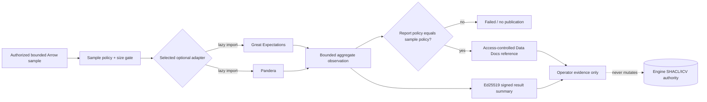

# Optional operator data-quality certification

NE-114 adds an operator-only composition boundary for Great Expectations or
Pandera.  It is intentionally separate from the Arrow preparation kernel and
is not an agent tool, an ingest gate, or a second graph authority.  The native
engine's SHACL/ICV result remains authoritative; a certification result is an
optional observation that cannot alter an already-committed fact.



## Contract

Install exactly one provider extra in an isolated operator job:

```sh
uv run --extra data-quality-ge python operator_certify.py
# or
uv run --extra data-quality-pandera python operator_certify.py
```

The job calls `run_certification_job(table, job, adapter=..., signer=...)`
where `job.sample` is an `AuthorizedArrowSample` with a non-expired
authorization reference, tenant, classification, retention, deletion, and
access-policy references, plus finite row/column/byte limits.  The Arrow table
is checked against those limits before provider code runs.  A list of records,
an unbounded IPC stream, a URL, a query, or a provider secret is not a valid
sample input or evidence field.

Provider-specific suite/schema lookup and Data Docs publication belong to the
trusted operator runner supplied to `GreatExpectationsAdapter` or
`PanderaAdapter`.  The runner returns only `AdapterObservation`; any human
report is published through the deployment's access-controlled artifact store
and returned as a `CertificationArtifact` reference.  The reference must carry
the exact sample policy, including tenant classification, retention, deletion,
and access control.  The job rejects a weaker or different policy.

The result is deliberately small: provider version, check counts, allow-listed
failure codes, an opaque report reference, and an Ed25519 signature over a
canonical digest.  Raw rows, report bodies, exception strings, bearer tokens,
URLs, queries, paths, and provider configuration never enter logs or evidence.

## Honest optional states

`not_requested` means no operator job was selected.  `unavailable` means Arrow
or the selected provider is not installed.  `denied` means authorization or
sample bounds failed.  `failed` means the provider or signing contract did not
complete.  Only a signed `passed` or `failed` execution may carry an artifact
reference.  Missing optional certification is therefore never represented as
success, and a failure cannot replace or retroactively revise an engine
SHACL/ICV decision.

The adapter package itself imports neither provider.  The base agent-utilities
runtime gains no Great Expectations, Pandera, pandas, or NumPy dependency; the
two named extras are operator-only and are not required by the NE-115 governed
profile → prepare → validate → commit path.
