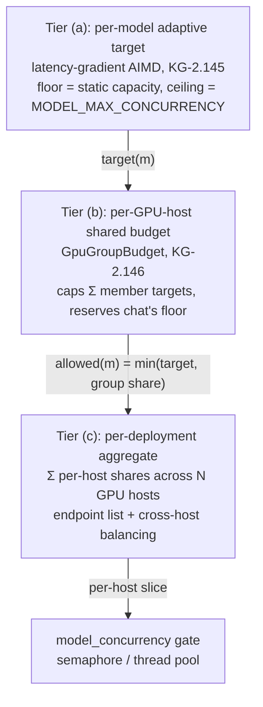
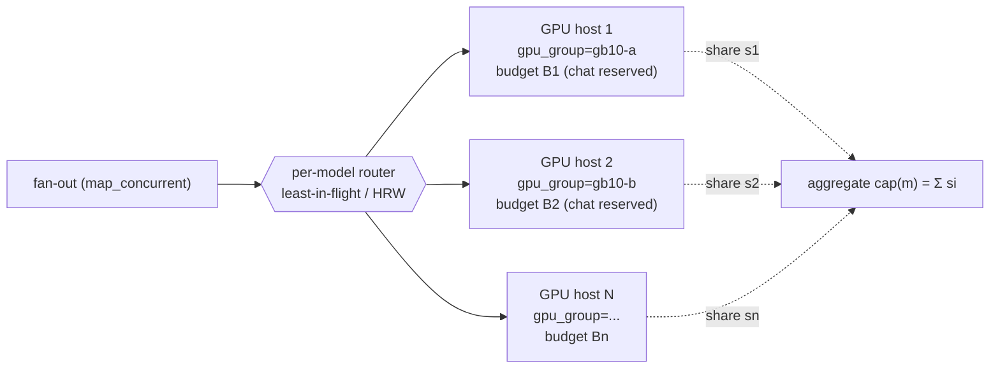

# Distributed multi-GPU concurrency & optimal planning

> **Concepts:** `CONCEPT:KG-2.143` (per-model static capacity), `CONCEPT:KG-2.145`
> (per-model adaptive target), `CONCEPT:KG-2.146` (shared-GPU budget — this doc's
> headline). Code: `core/model_concurrency.py`, `core/model_capacity_autoscale.py`,
> `core/gpu_group_budget.py`, `core/config.py`. Sharding precedent:
> `epistemic_graph/pool.py` (`ShardRouter`, HRW).

This is the plan for how LLM/embedding fan-out concurrency is sized — from a single
shared GPU today to many GPU hosts in the future — so that **interactive chat
latency is protected** while **bulk embedding uses leftover headroom**, and adding
hardware automatically yields more aggregate throughput.

## The 3-tier concurrency model

Concurrency is decided at three nested tiers. Each tier only ever *narrows* the
one above it, and every tier is fail-safe (a missing/unknown value falls back to
the conservative behaviour of the tier above — never to oversubscription).



### (a) Per-model adaptive target — `CONCEPT:KG-2.145`

Each model runs an AIMD controller keyed on client-observed latency (a TCP-Vegas /
Netflix-adaptive-limits gradient) plus, when present, vLLM `/metrics`
`waiting{capacity}` as a hard saturation back-off. It ramps from the static
`floor` (`parallel_instances × max_parallel_calls`) toward
`MODEL_MAX_CONCURRENCY`, backing off the instant latency inflates. This discovers
the real serving capacity of *one* model without any hardcoded ceiling.

### (b) Per-GPU-host shared budget — `CONCEPT:KG-2.146` (the new layer)

Tier (a) tunes each model in isolation, so two models that **share one physical
GPU** would each happily ramp and jointly oversubscribe it. The budget tier fixes
that: models on one GPU are grouped (`Config.gpu_group`), the group has a total
concurrency `budget`, and each model's adaptive target is capped at its **allowed
share**:

```
allowed(m) = budget
             − Σ floor(p)     for priority peers p ≠ m   (reserved, latency-safe)
             − Σ target(q)    for best-effort peers q ≠ m (actually in use)
floored at floor(m)
```

* **Priority roles** (chat / generator / default — `GPU_RESERVED_ROLES`) always
  keep their static floor reserved off the top of the budget, subtracted from
  *every* peer's allowance, so no best-effort peer can ever consume chat's slice.
* **Best-effort roles** (embedding / batch) get the remainder. When chat is busy
  they are squeezed down toward — but never below — their own floor; when chat is
  idle they reclaim up to the whole budget. Conservative by construction:
  **embedding yields to chat.**

This is a *ceiling that protects chat*, not an aggressive ramp. Live fact it
encodes: on the GB10, embed-capacity 4 alone peaked the device at ~62 % with no
concurrent chat, so embedding must leave headroom — the budget makes that
structural instead of a hope.

### (c) Per-deployment aggregate — across N GPU hosts (target state)

A model can be replicated across several GPU hosts. The deployment-level capacity
for a model is then the **sum of its per-host shares**, and requests are
load-balanced across hosts. Adding a GPU host raises the aggregate and is
auto-discovered (below). This tier composes with (b): each host's budget still
locally protects that host's chat slice; the aggregate is just their sum.

## Distributed multi-GPU

Today every model has one `base_url`. The distributed design generalizes that to
an **endpoint list per model**, mirroring the engine's existing sharding precedent
in `epistemic_graph/pool.py`:

* `ShardRouter(GRAPH_SERVICE_ENDPOINTS)` already fans the Rust engine across shards
  using **HRW (rendezvous) hashing** — deterministic, minimal-reshuffle endpoint
  selection. We reuse exactly this shape for model endpoints.
* **Per-model endpoint list.** `base_url` becomes (or is augmented by) a list of
  GPU-host endpoints serving the same model id. Each endpoint belongs to its own
  `gpu_group` (one GPU host) and carries its own tier-(b) budget.
* **Per-model total capacity = Σ per-host shares.** The fan-out gate is sized to
  the sum of each host's `allowed(m)`; the per-call router then picks a host.
* **Cross-host load balancing — least-in-flight, HRW as fallback.** For
  interactive calls prefer **least-in-flight** (route to the host with the most
  free chat slice right now) so a momentarily hot host is avoided; for cache- or
  affinity-sensitive work use **HRW** (stable mapping → warm KV cache). This is the
  same least-loaded-vs-rendezvous choice the engine already makes.
* **Scale-out is automatic.** Adding a host to a model's endpoint list raises the
  aggregate capacity and gives the AIMD controllers more total headroom to ramp
  into; removing one shrinks it. No code change — it is a config-list edit, exactly
  like adding a `GRAPH_SERVICE_ENDPOINTS` shard.



## Optimal concurrency planning

### Deriving each GPU host's budget — the "saturation knee"

A host's budget is the concurrency at which it is **fully but not over** loaded.
Find it with a short profiling sweep per GPU host:

1. Ramp offered concurrency 1 → N against the host's models.
2. Watch three signals together:
   * **p95 latency knee** — the concurrency where p95 starts climbing
     super-linearly (queueing begins). This is the same gradient signal tier (a)
     uses online.
   * **vLLM `waiting{capacity} > 0`** — the engine itself reporting it is queueing
     at the scheduler (hard saturation).
   * **GPU utilization / unified-memory pressure** approaching its ceiling.
3. The **budget = the concurrency just before the knee** (where throughput is
   maxed but latency hasn't inflated). For the GB10 today that knee is low because
   embed-4 alone already hits ~62 %.

This is a one-time (or occasional) calibration; the online AIMD then auto-tunes
*within* the budget continuously, so the budget only has to be roughly right.

### Reserved slices: interactive vs best-effort

* **Latency-sensitive (chat / generator)** → reserved slice = its static floor,
  guaranteed off the top of the budget (`GPU_RESERVED_ROLES`). This is the
  interactive SLA: chat can always get its floor even mid-embedding-storm.
* **Best-effort (embedding / batch ingest)** → the remainder, scaled by the AIMD
  controller to fill leftover headroom and squeezed back toward its floor whenever
  chat demand rises.

### How AIMD auto-tunes within the budget

The budget is a **hard cap**; the per-model controller is the **dynamic dial under
it**. Embedding ramps up via the latency gradient until it either inflates latency
(tier a backs off) or hits its group-allowed share (tier b caps it). Chat ramps
independently but is always guaranteed its reserved floor. The two never have to
coordinate beyond reporting their current target into the shared `GpuGroupBudget`.

### Safe defaults

* **No budget configured → no cap** (`GPU_CONCURRENCY_BUDGETS` unset) → pure
  per-model behaviour, zero regression. The budget is strictly opt-in.
* **Floors are sacrosanct** — no model is ever capped below its own static floor,
  so ingestion/chat never deadlock to zero.
* **Conservative direction** — when uncertain (contention, missing signal) the
  budget squeezes best-effort toward its floor, never the reverse.

### Scale up vs scale out

* **Scale up (raise a host's budget)** when the saturation knee proves the GPU has
  unused headroom (low utilization at the current budget, no `waiting{capacity}`).
* **Scale out (add a GPU host to the endpoint list)** when a single host is at its
  knee under sustained demand — chat's reserved slice is fully subscribed and
  best-effort is pinned at its floor. Adding a host raises the aggregate (tier c)
  rather than oversubscribing a saturated device.

## Staying conservative + protecting interactive latency

The whole design biases toward interactive latency: chat's floor is reserved off
the top of every GPU budget and subtracted from every peer's allowance, so
embedding can *only* use what chat isn't entitled to. Bulk embedding still gets to
saturate genuine leftover headroom (good throughput) but yields the instant chat
needs the GPU. Nothing ramps without a live congestion signal, and every tier
fails safe toward the floor.

## Current state vs target

| | Today | Target |
|---|---|---|
| GPUs | one GB10 (10.0.0.18, unified memory) | N GPU hosts |
| Model→endpoint | one `base_url` per model | endpoint **list** per model |
| Sharing | `bge-m3` (vllm-embed.arpa) + `qwen3.5-9b` (vllm.arpa) share the GB10 | each host its own `gpu_group` + budget |
| Tier (a) | live (`KG-2.145`) | unchanged |
| Tier (b) | **live (`KG-2.146`)** — tag both `gpu_group="gb10"`, set `GPU_CONCURRENCY_BUDGETS={"gb10": <knee>}`; embedding yields, chat reserved | per-host budgets, one per GPU |
| Tier (c) | n/a (single host) | aggregate = Σ per-host shares; least-in-flight / HRW routing reusing `pool.py` precedent |
| Planning | manual knee estimate (embed-4 ≈ 62 %) | profiling sweep per host → budget; AIMD tunes within |

### Configuration

```jsonc
// ~/.config/agent-utilities/config.json
{
  // Group both models onto the one physical GB10 (cross-endpoint grouping needs
  // the explicit tag; same-endpoint models group by host automatically).
  "chat_models":      [{ "id": "qwen3.5-9b", "base_url": "http://vllm.arpa/v1",       "gpu_group": "gb10" }],
  "embedding_models": [{ "id": "bge-m3",     "base_url": "http://vllm-embed.arpa/v1", "gpu_group": "gb10" }],

  // Total concurrent in-flight calls across ALL models on the gb10 GPU (the
  // saturation knee). Unset → no budget → per-model behaviour (no regression).
  "GPU_CONCURRENCY_BUDGETS": { "gb10": 6 },

  // Optional: which roles get their floor reserved first (default: chat/generator/
  // default/lite/super). Best-effort roles (embedding/batch) get the remainder.
  "GPU_RESERVED_ROLES": "chat,generator,default"
}
```
