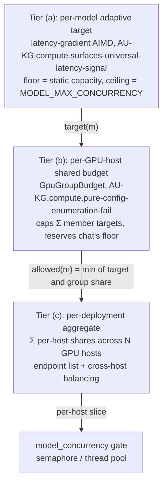
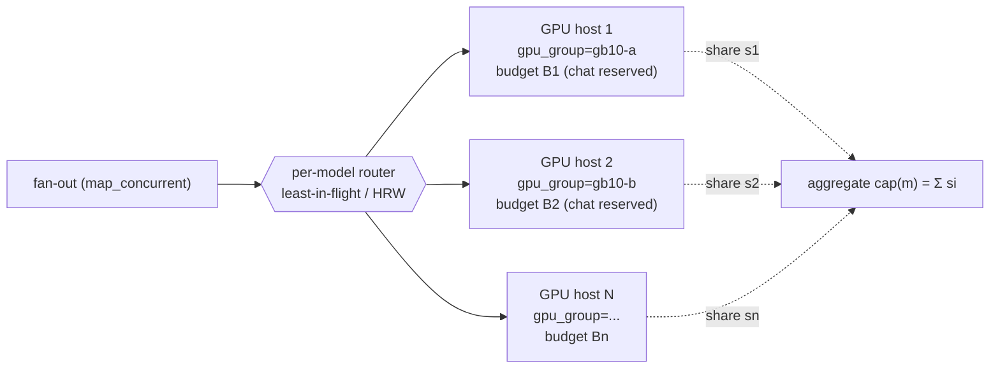

# Distributed multi-GPU concurrency & optimal planning

> **Concepts:** `CONCEPT:AU-KG.compute.concurrency-controller-sizing` (per-model static capacity), `CONCEPT:AU-KG.compute.surfaces-universal-latency-signal`
> (per-model adaptive target), `CONCEPT:AU-KG.compute.pure-config-enumeration-fail` (shared-GPU budget — this doc's
> headline). Code: `core/model_concurrency.py`, `core/model_capacity_autoscale.py`,
> `core/gpu_group_budget.py`, `core/config.py`. Sharding precedent:
> `epistemic_graph/pool.py` (`ShardRouter`, HRW).

This is the plan for how LLM/embedding fan-out concurrency is sized — from a single
shared GPU today to many GPU hosts in the future — so that **interactive chat
latency is protected** while **bulk embedding uses leftover headroom**, and adding
hardware automatically yields more aggregate throughput.

## The 3-tier concurrency model

Concurrency is decided at three nested tiers. Each tier only ever *narrows* the
one above it, and every tier is fail-safe (a missing/unknown value falls back to
the conservative behaviour of the tier above — never to oversubscription).



### (a) Per-model adaptive target — `CONCEPT:AU-KG.compute.surfaces-universal-latency-signal`

Each model runs an AIMD controller keyed on client-observed latency (a TCP-Vegas /
Netflix-adaptive-limits gradient) plus, when present, vLLM `/metrics`
`waiting{capacity}` as a hard saturation back-off. It ramps from the static
`floor` (`parallel_instances × max_parallel_calls`) toward
`MODEL_MAX_CONCURRENCY`, backing off the instant latency inflates. This discovers
the real serving capacity of *one* model without any hardcoded ceiling.

### (b) Per-GPU-host shared budget — `CONCEPT:AU-KG.compute.pure-config-enumeration-fail` (the new layer)

Tier (a) tunes each model in isolation, so two models that **share one physical
GPU** would each happily ramp and jointly oversubscribe it. The budget tier fixes
that: models on one GPU are grouped (`Config.gpu_group`), the group has a total
concurrency `budget`, and each model's adaptive target is capped at its **allowed
share**:

```
allowed(m) = budget
             − Σ floor(p)     for priority peers p ≠ m   (reserved, latency-safe)
             − Σ target(q)    for best-effort peers q ≠ m (actually in use)
floored at floor(m)
```

* **Priority roles** (chat / generator / default — `GPU_RESERVED_ROLES`) always
  keep their static floor reserved off the top of the budget, subtracted from
  *every* peer's allowance, so no best-effort peer can ever consume chat's slice.
* **Best-effort roles** (embedding / batch) get the remainder. When chat is busy
  they are squeezed down toward — but never below — their own floor; when chat is
  idle they reclaim up to the whole budget. Conservative by construction:
  **embedding yields to chat.**

This is a *ceiling that protects chat*, not an aggressive ramp. Live fact it
encodes: on the GB10, embed-capacity 4 alone peaked the device at ~62 % with no
concurrent chat, so embedding must leave headroom — the budget makes that
structural instead of a hope.

### (c) Per-deployment aggregate — across N GPU hosts (target state)

A model can be replicated across several GPU hosts. The deployment-level capacity
for a model is then the **sum of its per-host shares**, and requests are
load-balanced across hosts. Adding a GPU host raises the aggregate and is
auto-discovered (below). This tier composes with (b): each host's budget still
locally protects that host's chat slice; the aggregate is just their sum.

## Distributed multi-GPU

Today every model has one `base_url`. The distributed design generalizes that to
an **endpoint list per model**, mirroring the engine's existing sharding precedent
in `epistemic_graph/pool.py`:

* `ShardRouter(GRAPH_SERVICE_ENDPOINTS)` already fans the Rust engine across shards
  using **HRW (rendezvous) hashing** — deterministic, minimal-reshuffle endpoint
  selection. We reuse exactly this shape for model endpoints.
* **Per-model endpoint list.** `base_url` becomes (or is augmented by) a list of
  GPU-host endpoints serving the same model id. Each endpoint belongs to its own
  `gpu_group` (one GPU host) and carries its own tier-(b) budget.
* **Per-model total capacity = Σ per-host shares.** The fan-out gate is sized to
  the sum of each host's `allowed(m)`; the per-call router then picks a host.
* **Cross-host load balancing — least-in-flight, HRW as fallback.** For
  interactive calls prefer **least-in-flight** (route to the host with the most
  free chat slice right now) so a momentarily hot host is avoided; for cache- or
  affinity-sensitive work use **HRW** (stable mapping → warm KV cache). This is the
  same least-loaded-vs-rendezvous choice the engine already makes.
* **Scale-out is automatic.** Adding a host to a model's endpoint list raises the
  aggregate capacity and gives the AIMD controllers more total headroom to ramp
  into; removing one shrinks it. No code change — it is a config-list edit, exactly
  like adding a `GRAPH_SERVICE_ENDPOINTS` shard.



## Optimal concurrency planning

### Deriving each GPU host's budget — the "saturation knee"

A host's budget is the concurrency at which it is **fully but not over** loaded.
Find it with a short profiling sweep per GPU host:

1. Ramp offered concurrency 1 → N against the host's models.
2. Watch three signals together:
   * **p95 latency knee** — the concurrency where p95 starts climbing
     super-linearly (queueing begins). This is the same gradient signal tier (a)
     uses online.
   * **vLLM `waiting{capacity} > 0`** — the engine itself reporting it is queueing
     at the scheduler (hard saturation).
   * **GPU utilization / unified-memory pressure** approaching its ceiling.
3. The **budget = the concurrency just before the knee** (where throughput is
   maxed but latency hasn't inflated). For the GB10 today that knee is low because
   embed-4 alone already hits ~62 %.

This is a one-time (or occasional) calibration; the online AIMD then auto-tunes
*within* the budget continuously, so the budget only has to be roughly right.

### Reserved slices: interactive vs best-effort

* **Latency-sensitive (chat / generator)** → reserved slice = its static floor,
  guaranteed off the top of the budget (`GPU_RESERVED_ROLES`). This is the
  interactive SLA: chat can always get its floor even mid-embedding-storm.
* **Best-effort (embedding / batch ingest)** → the remainder, scaled by the AIMD
  controller to fill leftover headroom and squeezed back toward its floor whenever
  chat demand rises.

### How AIMD auto-tunes within the budget

The budget is a **hard cap**; the per-model controller is the **dynamic dial under
it**. Embedding ramps up via the latency gradient until it either inflates latency
(tier a backs off) or hits its group-allowed share (tier b caps it). Chat ramps
independently but is always guaranteed its reserved floor. The two never have to
coordinate beyond reporting their current target into the shared `GpuGroupBudget`.

### Safe defaults

* **No budget configured → no cap** (`GPU_CONCURRENCY_BUDGETS` unset) → pure
  per-model behaviour, zero regression. The budget is strictly opt-in.
* **Floors are sacrosanct** — no model is ever capped below its own static floor,
  so ingestion/chat never deadlock to zero.
* **Conservative direction** — when uncertain (contention, missing signal) the
  budget squeezes best-effort toward its floor, never the reverse.

### Scale up vs scale out

* **Scale up (raise a host's budget)** when the saturation knee proves the GPU has
  unused headroom (low utilization at the current budget, no `waiting{capacity}`).
* **Scale out (add a GPU host to the endpoint list)** when a single host is at its
  knee under sustained demand — chat's reserved slice is fully subscribed and
  best-effort is pinned at its floor. Adding a host raises the aggregate (tier c)
  rather than oversubscribing a saturated device.

## Dedicate vs share — placing embeddings vs generation (deployment planning)

Tiers (a)/(b)/(c) above *manage* contention on a shared GPU. The cheapest way to
*eliminate* it, when the hardware allows, is to **not share at all** — give
embeddings and generation **different GPUs**. This is the GPU-allocation rule the
deployment planner and genesis Step 4 apply, profile-aware:

### Multiple GPUs → DEDICATE one to embeddings, one to generation (preferred)

When the deployment has **more than one GPU / inference host**, place the **LLM
(generation)** alone on the strongest GPU and the **embedder** on a separate,
typically **cheaper/older** GPU. Each endpoint gets its **own** `gpu_group` and its
**own** tier-(b) budget — so the embedder can scale to *its* GPU's max with **zero**
risk to chat, and the LLM keeps its whole device for KV cache.

Why this is the right split:

* **Embeddings are throughput-not-latency, and batchable.** They tolerate a slower
  device run 24/7 at max batch; generation is the latency-critical interactive path
  that wants the fast GPU and its full memory. Trading surplus embed throughput for
  guaranteed LLM headroom is a good trade.
* **It removes the contention class entirely.** Two models on one *unified-memory*
  box share one KV/activation pool; a bulk-embedding storm can starve the LLM's KV
  cache and OOM the whole host. Different GPUs cannot share a pool — the failure mode
  is **gone**, not merely managed.
* **The cheaper GPU may not run the same stack.** An older card
  (e.g. Pascal, compute-capability < 7.0) **cannot run vLLM** (needs CC ≥ 7.0).
  Serve embeddings there with a CC-agnostic OpenAI-compatible stack — **Infinity**
  (or a `sentence-transformers`+FastAPI shim) — and in **FP32** (consumer Pascal's
  native FP16 is crippled, so FP16 is *slower*). Because the embedder client is
  OpenAI-style (`base_url` + `/v1/embeddings`), this is a drop-in: only `base_url`
  and `gpu_group` change. Keep the **served model name identical** so the pgvector
  dimension/schema is unchanged across hosts.
* **Optional fallback.** Keep an embedder on the LLM host as an automatic
  **failover** for the dedicated embedder — but tag it `gpu_group=<llm-host>` so the
  shared-GPU budget (tier b) caps its **joint** in-flight with the LLM and it can
  never OOM the box even when it takes load.

```jsonc
// Two GPUs: embedder dedicated to the cheaper card, LLM alone on the strong one.
"chat_models":      [{ "id": "<llm>",   "base_url": "http://llm-host/v1",
                       "gpu_group": "llm-host" }],
"embedding_models": [
  { "id": "<embed>", "base_url": "http://embed-host/v1", "gpu_group": "embed-host" },   // PRIMARY (own budget)
  { "id": "<embed>", "base_url": "http://llm-host/v1",   "gpu_group": "llm-host",       // FALLBACK on the LLM host
    "role": "fallback" }
],
// Each physical GPU its OWN budget; the embed-host can ramp to its max independently.
"GPU_CONCURRENCY_BUDGETS": { "llm-host": 32, "embed-host": 16 }
```

### One shared GPU/host → CAPACITY-GUARD the share (homelab / tiny / Pi)

When there is only **one** GPU (or one box) for both roles — a homelab/tiny/Pi
profile — keep both on it but apply the guard so the combined load is bounded:

* both models on **one `gpu_group`** → the joint `GPU_CONCURRENCY_BUDGETS` caps
  their **sum** (tier b), with chat's floor reserved off the top;
* a per-endpoint **`max_concurrent_requests`** ceiling (AU-KG.compute.same-semantics-as) per model;
* the per-endpoint **circuit breaker** (ORCH-1.102/1.103) backing off on a
  shedding server. See [`llm-server-capacity-guard.md`](llm-server-capacity-guard.md).

For the smallest single-host deploys, embeddings can also be pushed off the GPU
entirely — **CPU or a remote embedding endpoint** — leaving the whole GPU for
generation.

**Decision in one line:** *more than one GPU → dedicate (separate endpoints +
per-GPU budgets, cheaper GPU for embeds, optional LLM-host fallback); one GPU →
capacity-guard the shared budget, or move embeds to CPU/remote.*

## Staying conservative + protecting interactive latency

The whole design biases toward interactive latency: chat's floor is reserved off
the top of every GPU budget and subtracted from every peer's allowance, so
embedding can *only* use what chat isn't entitled to. Bulk embedding still gets to
saturate genuine leftover headroom (good throughput) but yields the instant chat
needs the GPU. Nothing ramps without a live congestion signal, and every tier
fails safe toward the floor.

## Current state vs target

| | Today | Target |
|---|---|---|
| GPUs | **two**: a dedicated GR1080 embedder (`gr1080-embed.arpa`) + a GB10 generator (10.0.0.18, unified memory) — the split-GPU shape below | N GPU hosts |
| Model→endpoint | one `base_url` per model, **plus** a `fallback` endpoint on the embedder (AU-KG.enrichment.each-call-resolves-active) | endpoint **list** per model |
| Sharing | PRIMARY `bge-m3` dedicated to the GR1080 (`gpu_group="gr1080"`); the GB10 runs the `qwen3.6-27b` generator **and** the FALLBACK `bge-m3` (`gpu_group="gb10"`), which only takes load while the primary's breaker is OPEN | each host its own `gpu_group` + budget |
| Tier (a) | live (`AU-KG.compute.surfaces-universal-latency-signal`) | unchanged |
| Tier (b) | **live (`AU-KG.compute.pure-config-enumeration-fail`)** — `GPU_CONCURRENCY_BUDGETS={"gr1080": <knee>, "gb10": <knee>}`; on the GB10 the generator's floor is reserved off the top so the fallback embedder yields | per-host budgets, one per GPU |
| Tier (c) | n/a (single host per role) | aggregate = Σ per-host shares; least-in-flight / HRW routing reusing `pool.py` precedent |
| Failover | **live (`AU-KG.enrichment.each-call-resolves-active/2.300`)** — GR1080 primary → GB10 fallback, capacity-guard inheritance, auto-recovery | per-model endpoint health + balancing |
| Planning | manual knee estimate (embed-4 ≈ 62 %) | profiling sweep per host → budget; AIMD tunes within |

### Configuration

```jsonc
// ~/.config/agent-utilities/config.json
{
  // Group both models onto the one physical GB10 (cross-endpoint grouping needs
  // the explicit tag; same-endpoint models group by host automatically).
  "chat_models":      [{ "id": "qwen3.6-27b", "base_url": "http://vllm.arpa/v1",  "gpu_group": "gb10" }],
  "embedding_models": [{ "id": "bge-m3",     "base_url": "http://vllm-embed.arpa/v1", "gpu_group": "gb10" }],

  // Total concurrent in-flight calls across ALL models on the gb10 GPU (the
  // saturation knee). Unset → no budget → per-model behaviour (no regression).
  "GPU_CONCURRENCY_BUDGETS": { "gb10": 6 },

  // Optional: which roles get their floor reserved first (default: chat/generator/
  // default/lite/super). Best-effort roles (embedding/batch) get the remainder.
  "GPU_RESERVED_ROLES": "chat,generator,default"
}
```

## Automatic embedder failover (CONCEPT:AU-KG.enrichment.each-call-resolves-active / AU-KG.ingest.keys-off)

The embedding plane runs against a **primary** embedder endpoint and, when that
endpoint is unreachable, **fails over automatically** to a configured **fallback**
endpoint — routing **back** automatically once the primary recovers. The operator's
homelab shape: a dedicated `gr1080-embed.arpa` GPU (its own `gpu_group="gr1080"`,
its own budget) is the primary; the shared GB10 `vllm-embed.arpa`
(`gpu_group="gb10"`, sharing the GB10 with the `qwen` generator) is the fallback.

The headline guarantee: **while failed over, the fallback inherits the GB10 joint
budget.** Because the fallback is resolved as a first-class capacity-guard model key
(`embedding:fallback`) whose config carries `gpu_group="gb10"`, the whole guard —
`server_ceiling`, the adaptive controller, and the per-GPU joint budget — keys off
the fallback endpoint. So fallback embeds share the GB10 ceiling with the generator
(the generator's floor is reserved off the top) and **can never OOM the shared box**
— exactly the rule that governs the steady-state co-tenancy above, now applied to
the failover path too.

### How it works

* **Trigger / recovery — the existing circuit breaker.** The primary embedder's
  per-endpoint breaker (`embedding`, CONCEPT:AU-ORCH.routing.load-shedding-backoff) is fed by the primary embed
  fan-out itself. While it is OPEN within its backoff cooldown
  (`ModelCircuitBreaker.is_tripped()`), the router (`core/embedding_failover.py`,
  `active_embedding_endpoint()`) selects the fallback. Once the cooldown elapses the
  router returns to the primary, whose own HALF_OPEN probe confirms recovery (close →
  stay primary) or re-opens (→ fallback again next round). No extra polling.
* **Transparent to callers.** `create_embedding_model()` builds the client for the
  active endpoint; the process-scoped client cache (CONCEPT:AU-KG.compute.config-keyed-embedder-client) keys on the
  resolved `base_url`, so it **swaps** to the fallback's client on failover and back
  on recovery — never a stale primary client. `make_embed_fn` resolves the active
  endpoint per call and gates the fan-out on the active model key.
* **Observability.** Failover/recovery transitions are logged (WARN on failover, INFO
  on recovery) and counted; `embedding_endpoint_status()` returns the active endpoint,
  whether it is the fallback, the primary breaker snapshot, and the cumulative
  failover/recovery counts.

### Configuration

```jsonc
// ~/.config/agent-utilities/config.json
{
  "embedding_models": [{
    "id": "bge-m3",
    "base_url": "http://gr1080-embed.arpa/v1",   // PRIMARY: dedicated GR1080
    "gpu_group": "gr1080",
    "max_concurrent_requests": 16,
    "fallback": {                                  // FALLBACK: shared GB10
      "id": "bge-m3",
      "base_url": "http://vllm-embed.arpa/v1",
      "gpu_group": "gb10",                         // shares the GB10 joint budget
      "max_concurrent_requests": 8
    }
  }],
  "chat_models": [{ "id": "qwen3.6-27b", "base_url": "http://vllm.arpa/v1", "gpu_group": "gb10" }],

  // The GB10 joint budget governs the generator + the fallback embedder together,
  // and (separately) the dedicated GR1080 budget governs the primary embedder.
  "GPU_CONCURRENCY_BUDGETS": { "gb10": 20, "gr1080": 16 }
}
```

A `fallback` is **optional**: with none configured, embedding behaves exactly as
before (always primary, zero change). Single-level only — a nested `fallback` inside
a `fallback` is ignored (enforced in `Config._resolve_model_config` for the
`embedding:fallback` key).

### Why the fallback can't OOM the GB10 — the capacity-guard inheritance, precisely

The guarantee hinges on the fallback being a **first-class capacity-guard model key**,
not a special case bolted onto the embedder. Three wirings make it hold:

1. **Key resolution.** `Config._resolve_model_config("embedding:fallback")` returns the
   primary embedder's `.fallback` config object — so `server_ceiling("embedding:fallback")`,
   `gpu_group("embedding:fallback")`, and `model_capacity("embedding:fallback")` all read
   the **fallback endpoint's** own `max_concurrent_requests` / `gpu_group` / capacity.
2. **Gate keying.** `make_embed_fn` (`knowledge_graph/enrichment/semantic.py`) resolves
   `active_embedding_endpoint()` *per call* and gates the fan-out
   (`map_concurrent_sync(..., model=endpoint.model_key)`) on that active key. On failover
   the key flips to `embedding:fallback`, so the breaker, the `server_ceiling`, and the
   joint GPU-group budget all switch to the fallback's GB10 config in the same step. The
   client itself is rebuilt for the fallback's `base_url` (the process-scoped client cache,
   KG-2.294, keys on `base_url`, so it swaps — never a stale primary client).
3. **Role classification.** `model_capacity_autoscale._role_hint` maps
   `embedding:fallback` (and the `embed:fallback` / `embedding-fallback` aliases) to the
   `"embedding"` **role** — a *best-effort* role under tier (b). So while failed over, the
   GB10 budget reserves the **generator's** floor off the top and squeezes the fallback
   embedder toward *its* floor: the generator (latency-critical) keeps its slice and the
   fallback uses only genuine leftover headroom. The exact rule that governs steady-state
   GB10 co-tenancy now governs the failover path too.

### Operating notes — wiring a split-GPU host and handling a downed GPU

* **Wire each endpoint to its own `gpu_group`.** Tag the generator and the *dedicated*
  embedder with **different** `gpu_group` values (`gb10`, `gr1080`) so each physical GPU
  gets its own tier-(b) budget and the embedder can ramp to its own GPU's max with zero
  risk to chat. Tag the **fallback** embedder with the **generator's** `gpu_group` (`gb10`)
  so it shares that budget when it takes load. Give each group a `GPU_CONCURRENCY_BUDGETS`
  entry equal to its saturation knee; leave the generator's role in `GPU_RESERVED_ROLES`
  (default `chat,generator,default,…`) so its floor is always reserved.
* **Keep the served model name identical across primary and fallback.** Both serve
  `bge-m3` (only `base_url` / `gpu_group` / `max_concurrent_requests` differ), so the
  pgvector dimension and schema are unchanged across hosts and vectors are interchangeable.
* **Primary embedder GPU down → automatic, observable failover.** The next embed batch
  whose call fails/times out feeds the primary's breaker (key `embedding`); on its first
  overload it trips OPEN, `is_tripped()` returns `True`, and `active_embedding_endpoint()`
  routes to the fallback for the duration of the cooldown. A WARN log
  (`embedding failover: PRIMARY embedder unreachable …`) and the `failover_count` in
  `embedding_endpoint_status()` record the transition. No polling thread, no manual switch.
* **Primary recovers → automatic return.** Once the backoff cooldown elapses `is_tripped()`
  flips back to `False`, the next batch returns to the primary, and the primary's own
  HALF_OPEN probe confirms recovery (close → stay primary) or re-opens (→ fallback again
  next round). An INFO log + `recovery_count` mark it.
* **Generator (GB10) down with no fallback for *it*.** Generation has no failover endpoint
  (it is the latency-critical singleton); its breaker simply backs off callers until the
  server returns. The fallback embedder on the GB10 is governed by the *same* breaker key
  only insofar as it shares the endpoint host — embeds keep running on the GR1080 primary
  the whole time, unaffected by a generator outage.
* **Check failover health** via `embedding_endpoint_status()` (REST/MCP observability):
  it returns the active endpoint, `is_fallback`, `fallback_configured`, the primary breaker
  snapshot, and cumulative `failover_count` / `recovery_count`. A high failover count with
  no recovery means the primary embedder GPU is genuinely down — go fix the GR1080, not the
  config.
