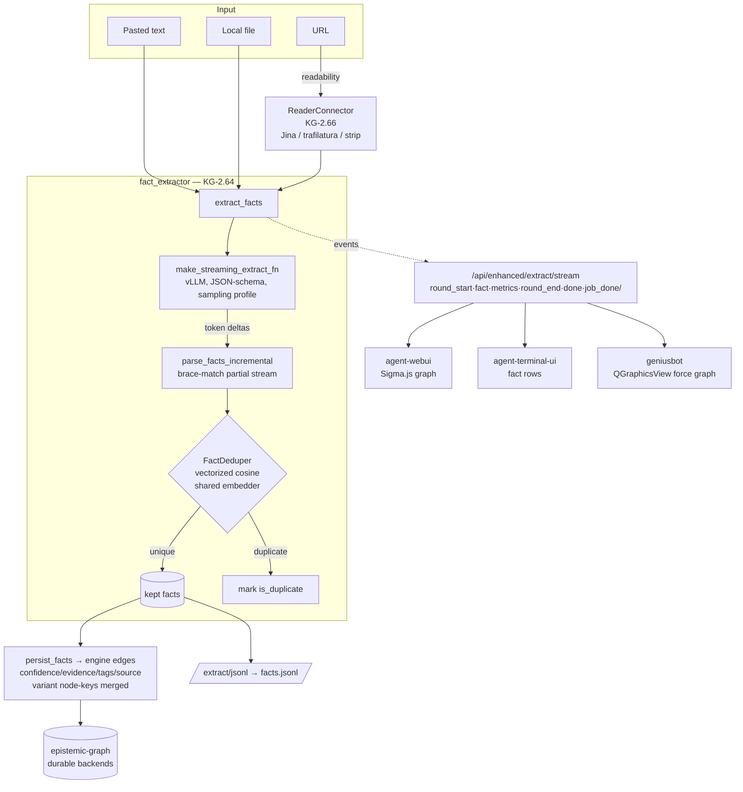
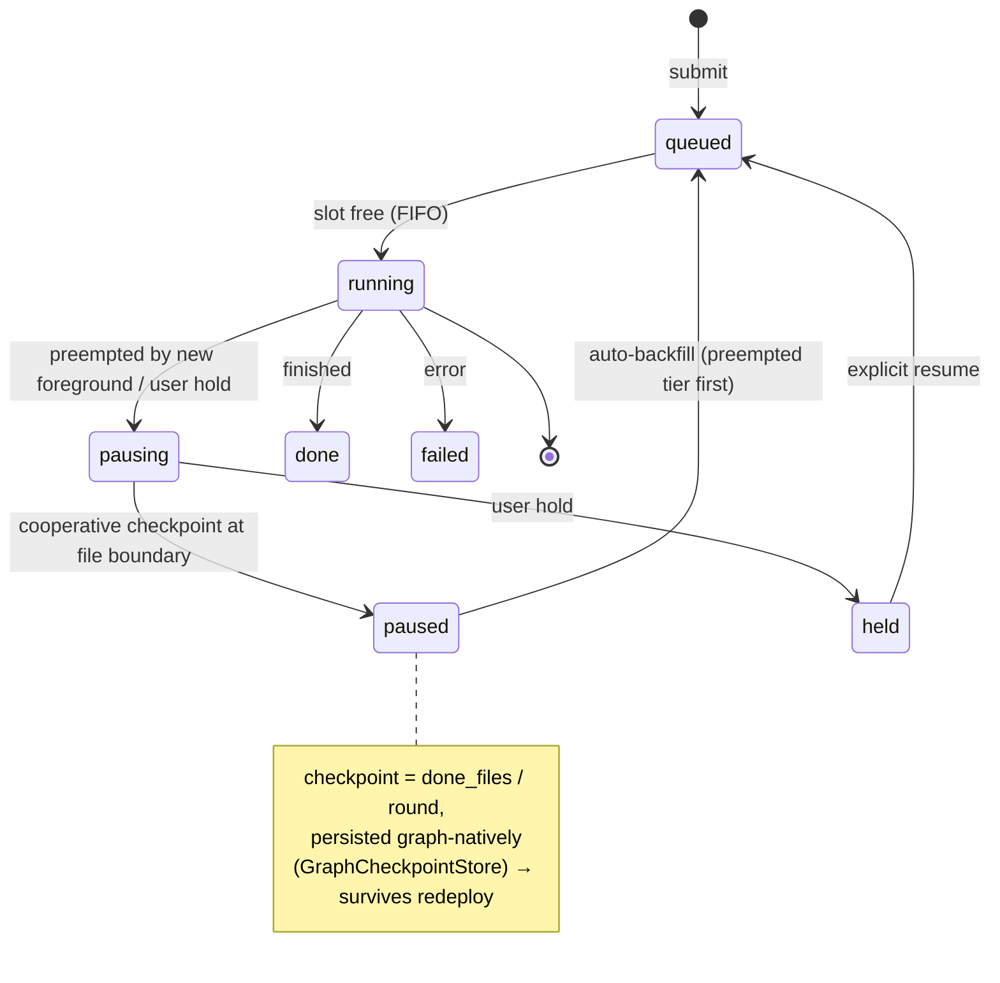
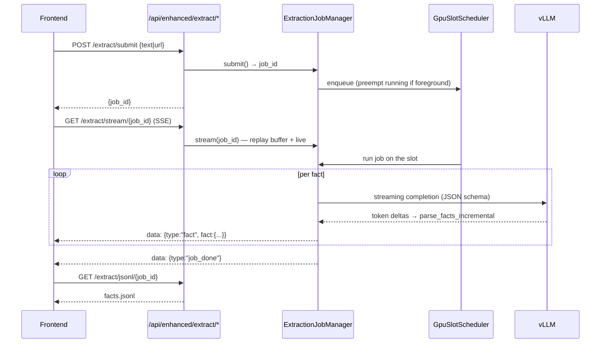
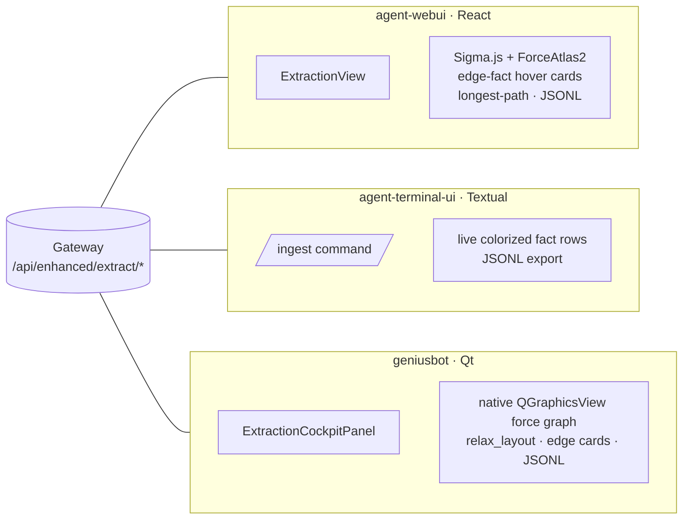

# Document → Knowledge-Graph Fact Extraction

**Concepts:** KG-2.64 (fact extractor), KG-2.65 (GPU-slot scheduler), KG-2.66
(readability reader), ECO-4.43 (three-frontend extraction UI).

Turn any document, URL, or pasted text into an interactive knowledge graph: the
LLM emits atomic `(subject) --[predicate]--> (object)` facts — each carrying a
title, description, verbatim evidence span, confidence, and tags — which stream
live onto a force-directed graph, dedup semantically, and persist as engine
edges. The capability was assimilated from the open-source
`knowledge-graph-extractor` and re-grounded on our own embedder, engine edge
model, durable queue, and three frontends — **no new always-on service**.

## Why it exists

We already had claim/entity extraction (`kb/`), multi-backend graph storage,
OWL/RDF, and an ontology layer. What we lacked was the *extraction craft* that
makes a graph **connect**: a prompt that forces short canonical entity/value
nodes (so the same entity comes out identical every time and edges join instead
of becoming prose dead-ends), per-fact evidence + confidence, live streaming, and
a single-GPU job discipline. Those are the four pieces this subsystem adds.

## System flow



The same `extract_facts` async generator drives **both** persistence and the SSE
stream, so what a user watches stream in is exactly what lands in the graph.

## The extraction contract

Each fact is wire-compatible with the upstream `facts.jsonl` schema so our export
is byte-comparable:

| Field | Meaning |
|-------|---------|
| `subject` / `object` | **canonical** short entity or atomic value — the graph nodes |
| `predicate` | precise `snake_case` relation (free-form, coined per fact) |
| `title` / `description` | natural-language statement + evidence-bearing context |
| `evidence_span` | verbatim substring of the source (provenance/grounding) |
| `confidence` | 0–100 (persisted as 0–1 on the edge) |
| `tags` | lowercase topic/entity/year tags |
| `is_duplicate` / `source_file` | our streaming + multi-file provenance |

Node identity uses `ExtractedFact.normalize_key` (NFKC + lowercase + punctuation
strip) so `"The Jina AI team"` and `"jina ai"` collapse to one node — in the
graph **and** in every frontend (each reimplements the same `normKey`).

## GPU-slot scheduler (KG-2.65)

The durable Kafka queue (KG-2.55–2.57) fans work across hosts; the slot scheduler
governs the **one** GPU inference slot a host contends on. A fresh foreground
submission preempts the running job, which is checkpointed and auto-resumes.



The runner (`ExtractionJobManager._run_job`) checks `scheduler.should_pause()` at
each file boundary, persists its checkpoint, and yields. On restart,
`reconcile_on_startup` demotes any mid-flight job to `paused` (preempted tier) so
it rejoins backfill — nothing is lost across a deploy.

## Live streaming sequence



A late subscriber misses nothing: the manager keeps a bounded per-job event
buffer and replays history before tailing live events.

## Three-frontend topology (ECO-4.43)

One gateway contract, three native renderings:



| Frontend | Graph | Edge metadata | Live stream | Export |
|----------|-------|---------------|-------------|--------|
| agent-webui | Sigma.js / ForceAtlas2 | hover card + dup badge | EventSource | JSONL + RDF |
| agent-terminal-ui | colorized fact table | inline per row | `client.stream_extraction` | JSONL |
| geniusbot | native QGraphicsView (`relax_layout`) | click → fact card | worker `progress` signal | JSONL |

## Serving discipline

Extraction is long structured-JSON generation on a contended GPU. The tuning that
matters — low-bit k-quant (~3.5 bpw floor), MTP-style speculative decoding,
single-stream, uniform-KV flash-attn — is documented in
[Single-GPU LLM serving](../guides/single-gpu-llm-serving.md). The extractor
already sets the matching sampling profile (temp 0.7, top_p 0.8, top_k 20,
presence_penalty 1.5, `enable_thinking=False`) and a strict JSON-schema response
format.

## Watched directories — auto-ingest a document corpus (KG-2.8)

The file-watcher (`sdd/watcher.py`, a leader-only maintenance tick every 5s)
auto-ingests documents that land in a set of **watched directories**, so a
corpus stays mirrored into the KG with **no manual ingest call**:

- **Built-in:** the ScholarX / research download dirs
  (`~/.local/share/scholarx/papers`, `~/.local/share/agent-utilities/research`,
  plus `SCHOLARX_PAPERS_DIR` / `AGENT_RESEARCH_DIR`) — scanned top-level,
  provenance `watcher_scholarx`.
- **Operator-configured:** any directories in **`KG_WATCH_DIRS`** — scanned
  **recursively** (noise dirs like `.git`/`node_modules` skipped), provenance
  `watcher_documents`. Point it at e.g. `~/Documents`.

Both flow through the **same** unified resolver
`get_watched_directories() -> [(path, recursive, source)]` and the same
per-file submit (`process_watched_file` → `engine.submit_task(task_type=
"document")`), then the standard document adaptor + this fact/concept extraction.

**New / modified / unchanged** are handled by the content-hash `DeltaManifest`
(`knowledge_graph/ingestion/manifest.py`): a **new** file is ingested, a
**modified** file (new hash) is re-ingested, and an **unchanged** file is
delta-skipped — validated at ~0.15s/file for a 150 MB PDF. So you can drop or
edit files in the directory and the KG converges on the next tick.

**Configure it** (deployment) via `config.json`:

```json
{ "kg_watch_dirs": "/home/genius/Documents" }
```

or env `KG_WATCH_DIRS=~/Documents` (JSON array or `os.pathsep`/comma list for
multiple). Supported file types: `.pdf .docx .doc .txt .md` — PDFs read via the
PyMuPDF fast path. See `docs/architecture/configuration.md` (`KG_WATCH_DIRS`).

## Entry points

- **MCP:** `graph_ingest action=fact_extract` (inline) or
  `extract_submit|extract_jobs|extract_status|extract_pause|extract_resume|extract_jsonl`
  (GPU-slot-scheduled).
- **REST:** `/api/enhanced/extract/{submit,stream/{id},jobs,status/{id},jsonl/{id},pause/{id},resume/{id}}`.
- **Code:** `agent_utilities.knowledge_graph.extraction` —
  `extract_facts`, `FactDeduper`, `persist_facts`, `facts_to_jsonl`,
  `ExtractionJobManager`; scheduler in
  `knowledge_graph/ingestion/gpu_slot_scheduler.py`; reader in
  `protocols/source_connectors/connectors/reader.py`.

## Design choices (and what we deliberately did not copy)

- **Reuse the existing embedder** for dedup — no second model in memory.
- **Recursive separator chunker** (`ontology/document_processing.py`) already
  exists; we did not port the upstream backoff chunker.
- **vLLM**, not llama.cpp — we assimilate the serving *knowledge*, not the runtime.
- **Sigma.js** stays the webui engine; geniusbot uses a native `QGraphicsView`
  force layout (no QWebEngine dependency) whose math is a pure, unit-tested
  `relax_layout`.
