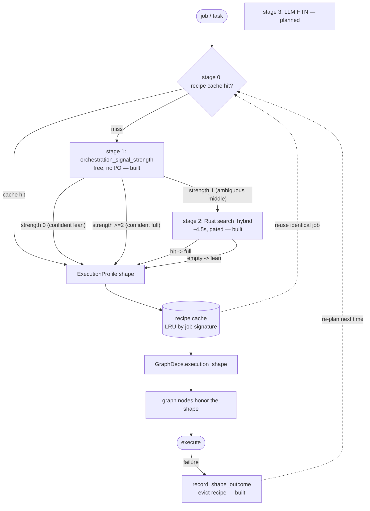

# Dynamic graph construction — one path, dynamically shaped

> CONCEPT:AU-ORCH.execution.dynamic-execution-profile / ORCH-1.68 (built) · AU-ORCH.execution.residual-ambiguous / AU-ORCH.execution.planner-failure-feedback (planned)

agent-utilities is **one** pydantic-ai Knowledge-Graph orchestrator. Historically it had two
hard-coded altitudes — a "fast path" escape hatch buried inside the router, and the full
multi-agent graph — and a chat turn paid for the heavy one whether it needed it or not. This
document describes the replacement: **a single path whose shape is constructed per job.**
"Fast" and "heavy" are no longer separate code paths; they are two shapes the same planner
emits. There are **no fixed tiers** — each job gets a bespoke shape built from its own signals.

## The shape

The `ExecutionProfile` (`orchestration/execution_profile.py`) is the per-job **shape**. It is
no longer a static `"chat"`/`"task"` preset; it is constructed by `plan_execution_shape(task)`
and carries the decisions every graph node reads to decide whether to run its work or pass
through for this job:

| Field | Meaning | Consumed by |
|---|---|---|
| `direct_complete` | answer with ONE local-model round; skip router→dispatcher→verifier | `router_step` (`graph/_router_impl.py`) |
| `skip_usage_guard` | skip the per-turn policy-LLM round | `usage_guard` (`graph/lifecycle.py`) |
| `run_discovery` | run the router's pre-LLM KG discovery bundle | `router_step` |
| `run_verifier` | run the verifier (+repair) round | dispatcher/verifier routing |
| `resolve_agent` | resolve the agent name in the KG (a semantic search) before the run | `run_agent` (`orchestration/agent_runner.py`) |
| `enable_reasoning` | run the model with extended reasoning ("thinking"/RLM) on/off | `router_step` direct-completion model settings |
| `model_id` | per-job model override (`None` → local default) | `router_step`; (recipe → all nodes) |
| `router_timeout` / `verifier_timeout` | per-node LLM-round budget | `GraphDeps` → router/verifier |
| `origin` / `confidence` | which planner stage produced the shape; planner confidence | the escalation cascade |

The shape is threaded into `GraphDeps.execution_shape` (`graph/state.py`) so any node can read
it. A `None` shape preserves the full-graph behaviour for direct callers that planned none.

## The escalating planner ("a classifier for the classifier")

`plan_execution_shape` runs an **escalation cascade**: each stage costs more than the last and
is reached only when the cheaper stage is not confident. A trivial turn pays only the free
structural check; a genuinely complex job earns the KG / LLM planning it needs.

- **Stage 0 — reuse a cached recipe** (AU-ORCH.execution.planner-failure-feedback, **built**): a bounded in-process LRU keyed by a
  normalized job signature returns the constructed shape for an identical job, skipping all
  resolution (incl. the expensive stage-2 search). `reset_recipe_cache()` for tests. The durable
  cross-process layer (persisting recipes as `AgentTemplate`s for reuse across restarts) is the
  next increment.
- **Stage 1 — free structural signals** (**built**): the graded `orchestration_signal_strength`
  (`graph/routing/strategies/fast_path.py`, single source of truth). **0** → confident lean; **≥2**
  → confident full; **1 → the ambiguous middle**, the only case that escalates. No I/O, no LLM.
- **Stage 2 — cheap, Rust-routed KG search** (AU-ORCH.execution.residual-ambiguous, **built**): only the ambiguous middle pays
  this — `engine.search_hybrid` disambiguates *tool-task* (→ full) vs. *conversational* (→ lean).
- **Stage 3 — LLM HTN planning** (AU-ORCH.execution.residual-ambiguous, planned): genuinely complex jobs earn an HTN
  decomposition (`graph/planning/Planner.decompose`).
- **Learning loop** (AU-ORCH.execution.planner-failure-feedback, **built**): `record_shape_outcome`, wired into `run_agent`, evicts a
  recipe whose run **failed** (re-plan next time) and keeps one whose run **succeeded** (reinforce).
- **Learned shape policy** (AU-ORCH.execution.shape-policy-learning, **built**): the heuristic cascade is a *prior*; an
  outcome-learned policy (`orchestration/outcome_router.OutcomeRouter`) refines which archetype
  (lean vs full) actually wins **per task-class**, learned from real outcomes (`success × speed`,
  `outcome_reward`). Applied as a fresh dynamic overlay on every plan (`_apply_shape_policy`) so it
  reflects the latest learning and **flips** the heuristic only once the alternative's reward-EMA
  exceeds the prior's.

## Collapsing into the one reward spine (no parallel bandit)

The shape policy deliberately **does not** add a new learner. `OutcomeRouter` is a thin,
**embedding-free** wrapper over the *same* `CapabilityIndex` reward-EMA (`record_outcome`/`reward_of`)
that the **AU-KG.compute.first-class-reasoner-paradigm `ReasonerRouter`** (paradigm routing) and the **AHE-3.38** sampling-profile
EMA-tournament already use — keyed like `_profile_id(task_class, choice)`, with the task-class from the
*same* `agent/sampling_profile.classify_task`. So shape, paradigm, and profile selection are all
instances of **one** *"pick per task-class, learn from outcome"* mechanism, not N. (DSPy stays for
offline *text-artifact* optimization; the live learner is the reward spine. Langfuse is export-only.)

**Overhead is ~zero:** selection is a free keyword `classify_task` + two O(1) reward reads — **no
per-turn embedding** — so it never reintroduces the latency the lean fast path removed. Durable
cross-process persistence of the reward map (fleet-wide, survives restart) is the next layer; the
in-process router mirrors `ReasonerRouter`'s own index.

## Performance: routing vector search through the Rust engine

The single biggest planner optimization is **where the ANN/vector search runs**. The capability
designation (`designate_specialists` → the Python `CapabilityIndex`, hnswlib/numpy) **cold-builds an
in-process HNSW index** — measured **>70 s** on first use. The KG engine already exposes the same
similarity search over the **Rust `epistemic-graph` engine** (tokio + MessagePack/UDS) via
`search_hybrid` → `HybridRetriever` → `graph_compute` — measured **~4.5 s** (and most of that is the
query *embedding*, not the search). So stage 2 routes through `search_hybrid`, per the standing rule
*"vector similarity / ANN → the Rust engine, never an O(N) Python scan."*

Layered optimizations, in order of impact:

1. **Early-exit cascade** — clear jobs (strength 0 / ≥2) never touch the engine at all.
2. **Rust-routed stage 2** — the ambiguous middle uses `search_hybrid` (~15× faster than the Python
   cold-build).
3. **Recipe cache** — an identical job skips stage 2 entirely (free reuse); failure self-corrects.

**Known remaining hot path (recommended next):** the **router's** discovery (`_router_impl._run_discovery`)
still calls the slow Python `designate_specialists` (line ~243) *alongside* the Rust `search_hybrid`
(line ~249) on every full-graph turn — a redundant cold-build. The fix that preserves designation's
reward-EMA learning is to route the `CapabilityIndex` **candidate retrieval** through `search_hybrid`
(Rust) and apply only the cheap reward/ontology re-rank in Python on the small candidate set
(*"Rust computes, Python orchestrates"*), or to warm the index at daemon startup. Not done here
(behavior-sensitive — needs its own validation).

**On hard tool/skill binding (#9):** binding a job to *only* the designated tools via
`invoker_allowed_tools` is **unsafe as-is** — the KG hits are mixed capability/code nodes
(`type: Code`, e.g. `create_asset`) whose names do **not** cleanly map to the live MCP toolset tool
names the filter matches on, so a hard allow-list would filter the agent's tools to nothing. The safe
context-window optimization is the cascade's lean/full decision + the existing routing prioritization
+ the lean loadout + the multiplexer's on-demand `load_tools`. Hard binding needs a verified
id→tool-name resolution and live validation first.

## The shape is an agent *recipe* (planned, AU-ORCH.execution.residual-ambiguous/1.70)

The shape generalizes beyond node-flags to a full **agent recipe** — node-set **+ model +
system prompt + tools + skills** — all resolved from the KG per job and bound to only what the
job needs (the context-window optimization). Every dimension already has a resolution primitive
and a binding mechanism in the codebase; the work is the *resolve→bind* wire:

| Recipe dimension | Resolve (exists) | Bind (exists) |
|---|---|---|
| model | `create_model(role=/model_id=)` | `Agent(model=)` / `ModelSettings` |
| reasoning capability | shape `enable_reasoning` (built) | `chat_template_kwargs.enable_thinking` |
| system prompt | `_resolve_prompt_from_kg` / `AgentTemplate` / prompt catalog | `Agent(system_prompt=)` |
| tools | `designate_specialists` / `search_hybrid` | `invoker_allowed_tools` / `mcp_toolsets` (enforced) |
| skills | KG-relevance over skill nodes | `SkillsToolset` tag filter |

A resolved/constructed recipe **is** an `AgentTemplate` node — which is also what the
skill-workflow store (`WorkflowStore`) persists and `kg_graph_factory` already instantiates. So
"graph shape", "agent recipe", and "reusable skill-workflow" are the same object, and stage 0's
reuse + stage 3's persist close the loop via `WorkflowStore.save_from_execution` (currently
unwired) and `CapabilityIndex.record_outcome` (the reward-EMA that learns which recipe wins for
which job).

## Why (the latency diagnosis that motivated this)

A trivial Telegram chat reply (`what is 2 plus 2?`) hit the 45 s `MESSAGING_REPLY_TIMEOUT` (and
could overrun to ~113 s) even though vLLM answers in ~0.4 s. Live instrumentation localized the
cost to unconditional, un-bounded pre-LLM work that ran for *every* turn and that the chat
`ExecutionProfile`'s node-timeout never bounded:

- `_resolve_agent_from_kg` — a ~6–15 s semantic search that *mis-resolved* the prompt-only
  `messaging-assistant` to an unrelated node, every turn;
- `usage_guard` — a full LLM policy round, every turn;
- the in-router "fast path" built a `gpt-4o-mini` model the homelab cannot serve, so it threw
  and fell through to the full pipeline (memory_selection → dispatcher → verifier);
- the local qwen reasoning model emitted a multi-second chain-of-thought trace for a trivial
  question (~28 s vs ~0.4 s with thinking off).

The dynamic shape makes a trivial turn skip all of it: no KG resolution, no usage-guard LLM
round, a direct completion on the local model with reasoning off — while a real task still gets
the full graph. See `optimization-campaign-checkpoint.md` for the full diagnosis.
