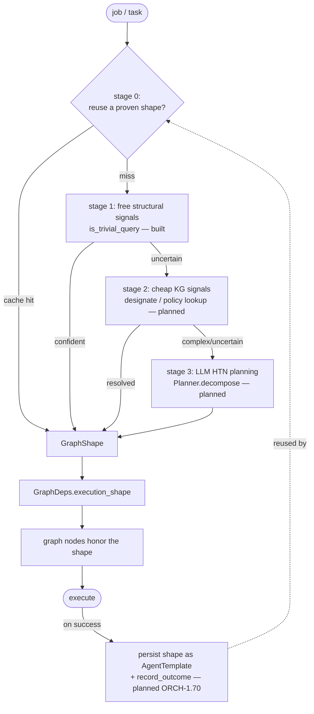

# Dynamic graph construction — one path, dynamically shaped

> CONCEPT:ORCH-1.67 / ORCH-1.68 (built) · ORCH-1.69 / ORCH-1.70 (planned)

agent-utilities is **one** pydantic-ai Knowledge-Graph orchestrator. Historically it had two
hard-coded altitudes — a "fast path" escape hatch buried inside the router, and the full
multi-agent graph — and a chat turn paid for the heavy one whether it needed it or not. This
document describes the replacement: **a single path whose shape is constructed per job.**
"Fast" and "heavy" are no longer separate code paths; they are two shapes the same planner
emits. There are **no fixed tiers** — each job gets a bespoke shape built from its own signals.

## The shape

The `ExecutionProfile` (`orchestration/execution_profile.py`) is the per-job **shape**. It is
no longer a static `"chat"`/`"task"` preset; it is constructed by `plan_execution_shape(task)`
and carries the decisions every graph node reads to decide whether to run its work or pass
through for this job:

| Field | Meaning | Consumed by |
|---|---|---|
| `direct_complete` | answer with ONE local-model round; skip router→dispatcher→verifier | `router_step` (`graph/_router_impl.py`) |
| `skip_usage_guard` | skip the per-turn policy-LLM round | `usage_guard` (`graph/lifecycle.py`) |
| `run_discovery` | run the router's pre-LLM KG discovery bundle | `router_step` |
| `run_verifier` | run the verifier (+repair) round | dispatcher/verifier routing |
| `resolve_agent` | resolve the agent name in the KG (a semantic search) before the run | `run_agent` (`orchestration/agent_runner.py`) |
| `enable_reasoning` | run the model with extended reasoning ("thinking"/RLM) on/off | `router_step` direct-completion model settings |
| `model_id` | per-job model override (`None` → local default) | `router_step`; (recipe → all nodes) |
| `router_timeout` / `verifier_timeout` | per-node LLM-round budget | `GraphDeps` → router/verifier |
| `origin` / `confidence` | which planner stage produced the shape; planner confidence | the escalation cascade |

The shape is threaded into `GraphDeps.execution_shape` (`graph/state.py`) so any node can read
it. A `None` shape preserves the full-graph behaviour for direct callers that planned none.

## The escalating planner ("a classifier for the classifier")

`plan_execution_shape` runs an **escalation cascade**: each stage costs more than the last and
is reached only when the cheaper stage is not confident. A trivial turn pays only the free
structural check; a genuinely complex job earns the KG / LLM planning it needs.

- **Stage 0 — reuse a proven shape** (ORCH-1.70, planned): a previously-constructed shape for a
  similar job, persisted as an `AgentTemplate` / skill-workflow and reused successfully, is
  returned directly. This is the closed self-improvement loop: the system accrues optimized,
  job-scoped recipes and gets faster with use.
- **Stage 1 — free structural signals** (built): the rules-first `is_trivial_query`
  (`graph/routing/strategies/fast_path.py`, the single source of truth) shapes a lean
  direct-completion turn vs. the full graph, with no I/O and no LLM.
- **Stage 2 — cheap KG signals** (ORCH-1.69, planned): a capability designation / policy lookup
  refines *which* nodes/specialists/tools the job needs when stage 1 is uncertain.
- **Stage 3 — LLM HTN planning** (ORCH-1.69, planned): for genuinely complex jobs, an HTN
  decomposition (`graph/planning/Planner.decompose`) produces the shape.

## The shape is an agent *recipe* (planned, ORCH-1.69/1.70)

The shape generalizes beyond node-flags to a full **agent recipe** — node-set **+ model +
system prompt + tools + skills** — all resolved from the KG per job and bound to only what the
job needs (the context-window optimization). Every dimension already has a resolution primitive
and a binding mechanism in the codebase; the work is the *resolve→bind* wire:

| Recipe dimension | Resolve (exists) | Bind (exists) |
|---|---|---|
| model | `create_model(role=/model_id=)` | `Agent(model=)` / `ModelSettings` |
| reasoning capability | shape `enable_reasoning` (built) | `chat_template_kwargs.enable_thinking` |
| system prompt | `_resolve_prompt_from_kg` / `AgentTemplate` / prompt catalog | `Agent(system_prompt=)` |
| tools | `designate_specialists` / `search_hybrid` | `invoker_allowed_tools` / `mcp_toolsets` (enforced) |
| skills | KG-relevance over skill nodes | `SkillsToolset` tag filter |

A resolved/constructed recipe **is** an `AgentTemplate` node — which is also what the
skill-workflow store (`WorkflowStore`) persists and `kg_graph_factory` already instantiates. So
"graph shape", "agent recipe", and "reusable skill-workflow" are the same object, and stage 0's
reuse + stage 3's persist close the loop via `WorkflowStore.save_from_execution` (currently
unwired) and `CapabilityIndex.record_outcome` (the reward-EMA that learns which recipe wins for
which job).

## Why (the latency diagnosis that motivated this)

A trivial Telegram chat reply (`what is 2 plus 2?`) hit the 45 s `MESSAGING_REPLY_TIMEOUT` (and
could overrun to ~113 s) even though vLLM answers in ~0.4 s. Live instrumentation localized the
cost to unconditional, un-bounded pre-LLM work that ran for *every* turn and that the chat
`ExecutionProfile`'s node-timeout never bounded:

- `_resolve_agent_from_kg` — a ~6–15 s semantic search that *mis-resolved* the prompt-only
  `messaging-assistant` to an unrelated node, every turn;
- `usage_guard` — a full LLM policy round, every turn;
- the in-router "fast path" built a `gpt-4o-mini` model the homelab cannot serve, so it threw
  and fell through to the full pipeline (memory_selection → dispatcher → verifier);
- the local qwen reasoning model emitted a multi-second chain-of-thought trace for a trivial
  question (~28 s vs ~0.4 s with thinking off).

The dynamic shape makes a trivial turn skip all of it: no KG resolution, no usage-guard LLM
round, a direct completion on the local model with reasoning off — while a real task still gets
the full graph. See `optimization-campaign-checkpoint.md` for the full diagnosis.
