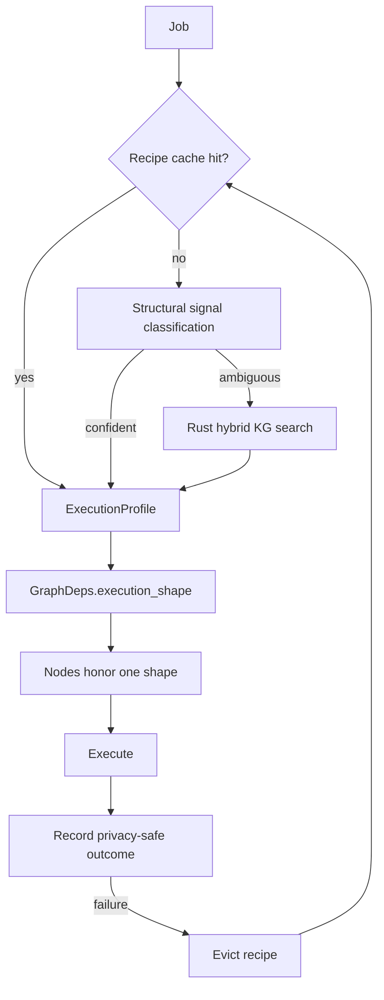

# Dynamic graph construction

> CONCEPT:AU-ORCH.execution.dynamic-execution-profile ·
> AU-ORCH.execution.planner-failure-feedback ·
> AU-ORCH.execution.shape-policy-learning

Agent Utilities uses one orchestration path whose execution shape is constructed for
each job. A small conversational request can complete directly, while a complex or
tool-bearing request activates discovery, dispatch, verification, and extended
reasoning. These are shapes of the same governed planner, not separate runtime modes.

## Execution shape

`ExecutionProfile` is the per-job contract produced by
`plan_execution_shape(task)`. It is carried in `GraphDeps.execution_shape`, where
every graph node can make the same decision:

| Field | Meaning | Consumer |
|---|---|---|
| `direct_complete` | complete with one model round | router |
| `skip_usage_guard` | omit the optional model-based usage round while retaining deterministic policy enforcement | lifecycle |
| `run_discovery` | perform pre-model KG capability discovery | router |
| `run_verifier` | perform verification and governed repair | dispatcher/verifier |
| `resolve_agent` | resolve a named agent template from the KG | agent runner |
| `enable_reasoning` | request the model route's extended-reasoning capability | router/model settings |
| `model_id` | optional logical model-route override | model router |
| `router_timeout`, `verifier_timeout` | bounded node budgets | router/verifier |
| `origin`, `confidence` | planner evidence for the selected shape | escalation policy and trace |

Model identifiers are logical deployment routes resolved from XDG AgentConfig. The
profile never embeds a provider endpoint, credential, host path, or user identity.

## Bounded escalation cascade

The planner spends more only when cheaper signals are insufficient:

```mermaid
flowchart TD
    J[Job] --> C{Recipe cache hit?}
    C -- yes --> S[ExecutionProfile]
    C -- no --> H[Structural signal classification]
    H -- confident --> S
    H -- ambiguous --> K[Rust hybrid KG search]
    K --> S
    S --> D[GraphDeps.execution_shape]
    D --> N[Nodes honor one shape]
    N --> E[Execute]
    E --> O[Record privacy-safe outcome]
    O -- failure --> V[Evict recipe]
    V --> C
```

1. **Recipe reuse:** a bounded cache keyed by an opaque normalized job signature
   reuses a successful shape without repeating discovery.
2. **Structural classification:** `orchestration_signal_strength` classifies clear
   conversational and tool-bearing work without I/O or an LLM call.
3. **Rust hybrid retrieval:** only ambiguous work calls `engine.search_hybrid` to
   distinguish a tool task from a conversational turn.
4. **Outcome feedback:** `record_shape_outcome` retains successful recipes and evicts
   failed ones so the next run replans.

Cache keys and outcome records follow the mandatory context and persistence-privacy
boundaries. They contain opaque references and numeric/boolean outcome data, not raw
prompts, identities, endpoints, or filesystem locations.

## One reward spine

`OutcomeRouter` uses the same `CapabilityIndex` reward EMA as reasoner and sampling
profile selection. Shape, reasoning paradigm, and sampling choice are instances of
one operation: choose per task class, observe the governed outcome, and update the
reward estimate.

Selection requires constant-time reward lookups after a dependency-free task
classification. It does not add a per-turn embedding or a second learning subsystem.
Offline native program optimization consumes privacy-safe execution references through
the same reward spine. Langfuse is an optional trace/export and proposal source, not a
second runtime policy authority.

## Rust-first retrieval

Vector and hybrid candidate retrieval runs in the Rust epistemic-graph engine. Python
orchestrates bounded candidate sets and applies policy/reward reranking; it does not
perform an unbounded linear scan or cold-build a duplicate full index on the request
path.

The latency controls are layered:

1. clear jobs stop after structural classification;
2. ambiguous jobs use the engine's indexed hybrid retrieval;
3. repeated successful jobs reuse the bounded recipe cache;
4. every engine and model call has an explicit budget;
5. failed outcomes evict the cached decision.

## Tool and skill binding

The selected shape narrows context through registered toolset and skill identifiers.
The multiplexer discovers and loads tools on demand. A tool allow-list is applied only
after a registry identifier resolves to a live tool name and the verified
`ActorContext` authorizes it; unresolved identifiers fail closed instead of producing
an empty or invented tool surface.

Agent templates bind the logical model route, system-prompt reference, toolset IDs,
skill IDs, and execution controls. Resolved content is compiled in memory for one run.
Durable templates, traces, and optimization artifacts retain governed references and
provenance rather than copied prompt content or deployment details.

## Configuration and observability

Deployment-varying model routes, timeouts, identity, and telemetry settings come from
`$XDG_CONFIG_HOME/agent-utilities/config.json`. Credentials and TLS material use
runtime secret/TLS references. Content capture remains off unless explicitly approved.

Each run records the selected shape, confidence, bounded timings, tool references,
policy decisions, and outcome under the trace/outcome ontology. This is sufficient for
performance analysis and reward updates without retaining the originating identity or
raw request content.
