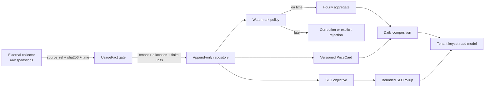

# Economics and SLO control-plane contract

The economics domain is an append-only accounting and service-level-observation
boundary.  It is not a telemetry collector and it is not a dashboard cache.
Collectors keep raw spans, logs, and provider payloads in an external retention
tier.  The control plane receives bounded facts, tenant-owned allocation
references, opaque source references, and content digests.

## Authority rules

* A `UsageFact` is immutable.  Its `fact_id` and `fact_digest` are derived from
  tenant, allocation, source reference/digest, event time, metric quantities,
  service/meter, sequence, and bounded dimensions.
* Replaying an exact identity is a no-op with `replayed`; reusing an identity with
  another digest is a conflict.  A correction or privacy retraction is a new
  append-only record and never an update to the original fact.
* Pricing is an immutable, versioned `PriceCard`.  The card's effective interval,
  version, rate set, and source digest are part of its identity.  Aggregates use
  integer currency micros, never binary floating point.
* Hourly and daily windows are UTC-aligned.  A daily aggregate is composed from
  all 24 hourly windows; a missing hour is a reconciliation gap, not zero usage.
* Watermarks make lateness explicit.  A late sample is accepted, turned into an
  append-only correction, or rejected according to a versioned policy; it is
  never silently dropped.
* SLO rollups carry counts, bounded measurements, source digests, objective
  version, and window identity.  Missing data is `insufficient_data`, never an
  invented zero.
* Reads require a tenant scope.  Keyset cursors are opaque, tenant-bound, and
  bound to the exact filter digest.  Offset pagination and cross-tenant joins
  are not part of this contract.

## Boundary flow

## Repository seam

Adapters implement `EconomicsRepository` and own the transaction that appends a
fact, correction, aggregate, rollup, tombstone, or watermark.  They must preserve
the model-derived identity and return `replayed` only for the exact stored digest.
The reference in-memory implementation exists solely for focused contract
fixtures; it is not an operational telemetry backend.

The four cadences remain separate:

1. collectors publish bounded facts at source cadence;
2. watermarks and late-event decisions advance at ingestion cadence;
3. hourly/daily accounting and SLO windows close at window cadence;
4. retention/tombstones and reconciliation run at governance cadence.

High-rate samples stay in the external telemetry tier.  Durable graph/control-plane
mutations contain summaries and evidence references only.
