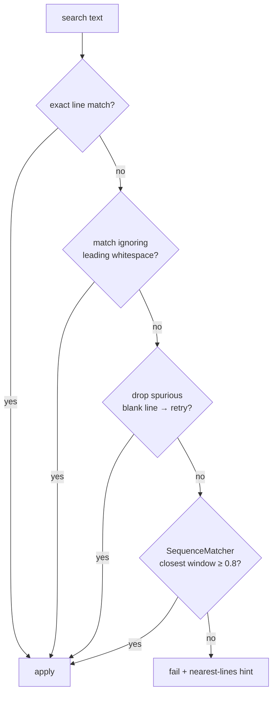
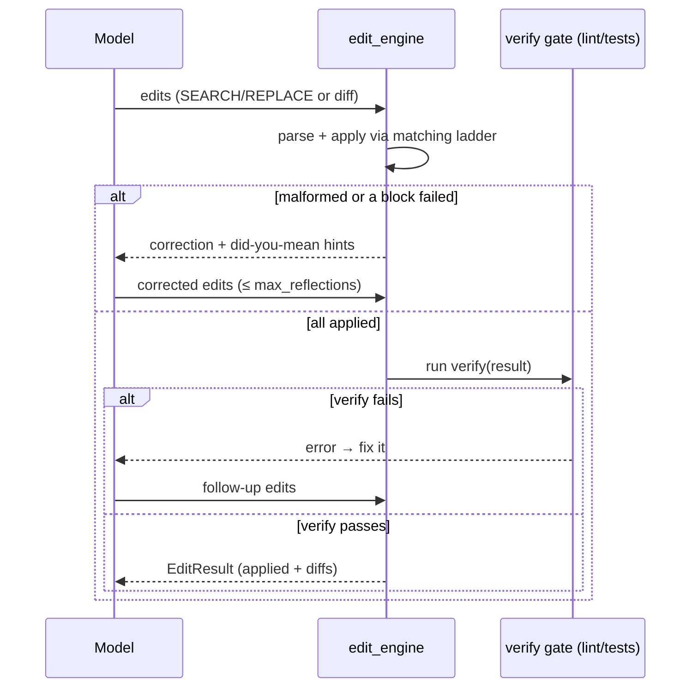

# Robust Edit-Application Engine (CONCEPT:AU-ORCH.execution.robust-multi-format-edit)

> A multi-format code-edit applier that lands LLM-proposed edits even when their
> whitespace drifts from disk, and **reflects** on failures by re-prompting the
> model with did-you-mean hints. It is the harness layer that turns a model's
> "here is the change" into a file actually edited — for our own Claude and for
> every spawned coding sub-agent.

## Why

The original `tools/developer_tools.py::replace_in_file` did a single **exact**
`str.replace(old, new, 1)`. Any whitespace drift between what the model emitted and
what is on disk made it fail silently, with no recovery — the single weakest link
for any coding agent. Production coding harnesses (e.g. aider) instead parse a
well-known edit format and apply it with a *ladder* of increasingly-forgiving
matchers, then retry on failure. AU-ORCH.execution.robust-multi-format-edit brings that capability natively to
agent-utilities. The fuzzy-match laddering is our own implementation; the laddered
strategy is inspired by aider's `editblock_coder`.

## Formats

Two formats, auto-detected from the text:

| Format | Marker | Notes |
|---|---|---|
| **search/replace block** | `<<<<<<< SEARCH` / `=======` / `>>>>>>> REPLACE` | Filename on the line above the fence. Tolerant of 5–9 marker chars. Empty SEARCH = append / create-file. |
| **unified diff** | `--- a/f` / `+++ b/f` / `@@` hunks | Per-hunk `-`/`+`/context lines lifted into a search/replace pair. |

## The matching ladder

Each search block is applied with the first matcher that hits, getting progressively
more forgiving. A failure at every tier returns a *did-you-mean* hint (the closest
existing lines) instead of silently doing nothing.

## The reflection loop

`apply_with_reflection` mirrors aider's `max_reflections` recovery: a malformed
parse or a non-matching block re-prompts the model with the failure hints (up to
`max_reflections`, default 3). An optional `verify` callback runs after a fully
applied batch (lint / tests) and, if it returns an error, feeds that back into the
same loop — the computational "checker" half of a maker/checker cycle.

## Surface

- **Tool:** `apply_edits(edits, root=".", fmt="auto")` in
  `tools/developer_tools.py` (registered in the `developer_tools` toolset).
  `replace_in_file` is kept for the trivial exact-match path.
- **Library:** `agent_utilities.harness.edit_engine` —
  `parse_edits`, `apply_edits`, `apply_with_reflection`, `Edit`, `EditOutcome`,
  `EditResult`. Re-exported from `agent_utilities.harness`.

## Code paths

- `agent_utilities/harness/edit_engine.py` — parsers, the matching ladder
  (`_perfect_replace`, `_replace_flexible_ws`, `_replace_closest`), nearest-line
  hints, and `apply_with_reflection`.
- `agent_utilities/tools/developer_tools.py` — the `apply_edits` tool wrapper.

## Relationship to other concepts

- The optional post-apply `verify` gate composes with the **AU-AHE.harness.pre-emit-quality-gate** pre-emit
  quality gates (`harness/quality_gates.py`) and the lint-enforcement hook.
- It is the edit-execution half of the maker/checker loop that the golden loop
  (**KG-2.7**) and verifier (`harness/verifier.py`) drive at the proposal level.
