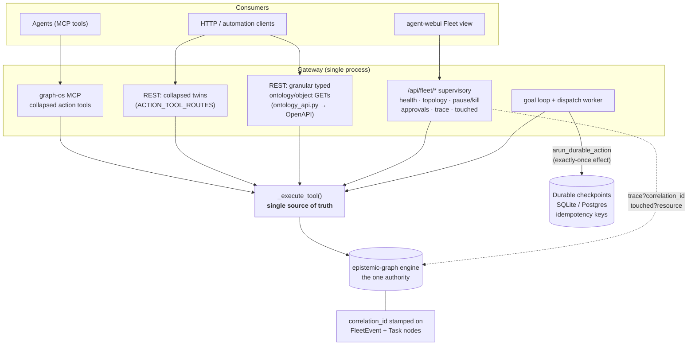

# Enterprise Parity, Supervisory Plane & Durable Execution

Architecture decisions for running the ecosystem as an AI-first enterprise at
scale: a single source of truth across the MCP and REST surfaces, a native
supervisory plane, crash-safe durable execution, and cross-agent trace
correlation. These records exist so the rationale survives as the surface grows.

## 1. Gateway ⇄ MCP parity over a shared dispatch (CONCEPT:ECO-4.0)

**Context.** The GraphOS MCP tools and the gateway's REST routes both dispatch
through the same in-process `_execute_tool()` → `IntelligenceGraphEngine`
singleton (`agent_utilities/mcp/kg_server.py`). `_execute_tool` is therefore the
*de-facto service layer* — neither "the MCP" nor "the REST app" owns the logic.
Despite a docstring claiming the two never drift, ~17 MCP tools (the `ontology_*`,
`object_*`, `graph_context/feedback/hydrate/sessions/goals`, `document_process`,
`source_connector` surface) had **no REST route**.

**Decision.** Keep `_execute_tool` as the single source of truth. Maintain a
canonical `ACTION_TOOL_ROUTES` map (tool → collapsed REST path) and serve every
tool's REST twin from one factory (`_make_tool_endpoint`). MCP stays collapsed to
action-routed tools (context-window friendly); REST exposes the full surface.

**Granular typed surface (shipped).** Per-entity REST verbs are no longer a
follow-on — `gateway/ontology_api.py` mounts a typed FastAPI `APIRouter` of
resource-style reads over the ontology/object layer
(`GET /api/ontology/value-types/{name}`, `/ontology/interfaces/{name}`,
`/ontology/functions/{name}`, `/objects/{id}`, `/objects/{id}/history`,
`/objects/{id}/as-of`). Because it's an `APIRouter`, every route appears in
`/openapi.json` with documented params and a response envelope — the schema
enforcement the raw-Starlette collapsed routes lacked. Each handler is pure sugar:
it builds the `action` + params and dispatches through the **same**
`_execute_tool`, so there is no parallel implementation. Collapsed routes remain
for agents.

**Enforcement.** `tests/unit/test_gateway_mcp_parity.py` asserts bidirectional
parity (every MCP tool has a mounted REST twin; no phantom routes), so the
collapsed surfaces can never silently drift; the granular router is additive and
leaves that contract untouched.

## 2. Native swarm supervisory plane (CONCEPT:OS-5.10)

**Context.** Supervisory data already exists — MASS swarm-health P1–P4
(`graph/social_system.py`), per-agent circuit breakers, the durable session
registry, and request/grant approvals — but was scattered and unsurfaced. A
separate supervisor *service* would add operational complexity.

**Decision.** No new service. Expose a `/api/fleet/*` plane from the existing
gateway (`gateway/fleet.py`): per-domain health/error-rates, live topology,
whole-domain pause/kill (blast-radius containment reusing `core.sessions` cancel
mechanics), the mutation/risk approval queue (read/grant via the parity-covered
`graph_query`/`graph_orchestrate` tools), and the correlation query endpoints
(`GET /api/fleet/trace?correlation_id=…`, `GET /api/fleet/touched?resource=…`,
see §4). The `agent-webui` Fleet Supervisor view is the single pane of glass over
it. Multi-agent containment + recovery are covered end-to-end by
`tests/integration/test_fleet_chaos.py` (domain pause contains only its domain;
concurrent goal loops honor pause with zero side effects).

## 3. Durable execution on embedded SQLite (CONCEPT:ORCH-1.36)

**Context.** `DurableExecutionManager` persisted to an in-memory mock — it
survived nothing. While the epistemic-graph engine is the durable authority for
KG state, execution checkpoints (idempotency keys, in-flight action progress)
are deliberately kept off the graph hot path and on a dedicated transactional
substrate, so the in-memory mock was the wrong place for crash-survivable
execution.

**Decision.** Persist checkpoints to an embedded, crash-safe SQLite store (the
same substrate `core.sessions` uses for recovery; `state_db_uri` promotes it to
shared Postgres for multi-host). `run_durable_action` provides **at-least-once**
retries (via `ResiliencePolicy`) and **exactly-once effects** via idempotency
keys: a completed key short-circuits re-execution and returns the recorded
result, so a retry or crash-resume never double-applies.

**Wired into the live path (shipped).** Durable execution was previously
reachable but uninvoked. It now runs on the real async paths via
`arun_durable_action` (the async twin of `run_durable_action`):

* **Goal loop** (`core/sessions.py run_goal_loop`) resumes from the last
  in-flight checkpoint on restart and wraps each iteration's validation command
  under an idempotency key `{goal_id}:{iteration}` — a crash-resume or redelivery
  never re-runs an effect that already ran.
* **Dispatch worker** (`orchestration/agent_dispatch_worker.py`) wraps the agent
  invocation under the turn's `job_id`, so at-least-once queue redelivery returns
  the recorded result instead of re-executing the agent.

Covered by `tests/test_durable_execution.py` (async exactly-once + restart) and
`tests/unit/test_goal_loop_durable.py` (live-path replay does not re-run).

## 4. Cross-agent trace correlation (CONCEPT:OS-5.11)

**Context.** `@trace` nests spans within one process via contextvars, but a
multi-agent run had no shared key and side-effects carried no correlation — "which
agents touched record X?" was unanswerable across boundaries.

**Decision.** `observability/correlation.py` adds a run-wide correlation id,
W3C `traceparent` (de)serialization (`current_carrier`/`bind_carrier`) for
cross-process agent spawns, and `inject`/`extract` for outbound side-effect
headers (Kafka records, ServiceNow/connector calls). `engine.run_graph`
establishes the id at every entry point; the Langfuse exporter stamps it on every
trace so a run is one joinable story.

**Queryable from the graph (shipped).** Emission alone left "who touched X?"
answerable only from Langfuse / ad-hoc Cypher. The correlation id (plus
actor/tenant) is now **persisted** onto the durable effect nodes — `FleetEvent`
(`gateway/fleet_events.py persist_event`) and executed `Task` nodes (the dispatch
worker) — and read back through two supervisory routes: `GET /api/fleet/trace?
correlation_id=…` returns every node stamped with a run's id, and
`GET /api/fleet/touched?resource=…` returns the events + originating actors that
touched a resource (blast-radius). Covered by `tests/unit/test_fleet_correlation.py`.

## Scale note (100k–100M agents)

These decisions make the control surface complete and correct, but extreme scale
needs a **distributed execution substrate**: multiple gateway workers, a durable
queue (Kafka is deployed), shared durable graph state (pg-age), and
lease/heartbeat work distribution. Durable execution (§3) is now wired into the
live goal-loop and dispatch paths and, with `state_db_uri`, shares Postgres
checkpoints across hosts — the concrete first step; broader horizontal scale-out
is tracked separately.

## Wire contract integrity (CONCEPT:KG-2.19)

The gateway/engine boundary is out-of-process MessagePack over UDS/TCP — there is
**no PyO3 / FFI** — so the Python client mirrors the Rust `Method` enum by
sending variant names as strings. Nothing generated or type-checked that, so a
renamed/removed engine op or a client typo could drift silently. The
epistemic-graph repo now ships a CI gate (`tests/test_protocol_parity.py`, run in
`rust-ci.yml`): it parses the `Method` enum (165 variants) and the client's
`_send(...)` calls, asserts no client method lacks a Rust variant, and ratchets
the set of unbound variants against a committed baseline so a new engine op forces
a conscious client binding.
