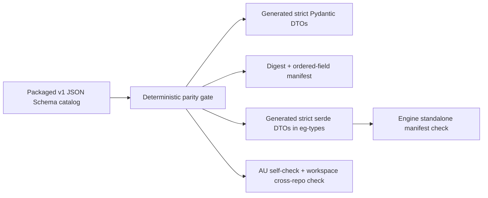

# Epistemic Operations Protocol

The Epistemic Operations Protocol is the current, language-neutral contract
between agent-utilities and epistemic-graph. It replaces parallel ad hoc
envelopes with twelve strict JSON Schemas and generated Python/Rust projections.

The authoritative catalog ships inside `agent_utilities.protocols.epistemic_operations`.
It is available in installed wheels as package data; deployments do not need a
schema service, a source-specific profile, or an additional protocol package.
Consumers use `load_catalog()` for discovery and `load_schema(name)` for a
catalog-bounded schema lookup; an undeclared name fails closed.

## Contract

| Schema | Purpose |
| --- | --- |
| `RequestContext` | Verified subject, tenant, scopes, policy, graph, placement epoch, and trace authority. |
| `MutationBatch` | Ordered, idempotent mutations committed under one verified context. |
| `ChangeEnvelope` | Governed source change with ACL, temporal, checkpoint, lineage, and replay identity. |
| `WorkItem` | Durable dependency, lease, retry, and artifact state for delegated work. |
| `Artifact` | Content-addressed multimodal material and modality-neutral loci. |
| `KnowledgeBatch` | Bounded, cursor-aware result currency for every query modality. |
| `AnalyticsJob` | Durable asynchronous analytics state, algorithm lineage, checkpoint, and results. |
| `TraceOutcome` | Content-free observability and evolution feedback. |
| `PlacementRoute` | Authoritative, fenced placement request/result without deployment endpoints. |
| `ClaimWorkItem` | Atomic lease request/result for the sole eight-state WorkItem lifecycle. |
| `EvidenceBundle` | Content-free claims, bitemporal evidence references, contradictions, proofs, and policy labels. |
| `OperationResult` | Shared success, failure, and placement-redirect envelope with stable error codes. |

All twelve schemas use JSON Schema draft 2020-12, require every declared field,
and reject unknown fields. Catalog version `1` carries the already-cut-over
`RequestContext` schema version `2` and version `1` of the other eleven schemas,
matching the exact release matrix. Its compatibility policy is `current-only`.
A contract change updates every consumer atomically; it does not add a second
model, deprecated alias, fallback reader, or dual-version branch.

## Source and projection flow



`scripts/check_epistemic_operations_protocol.py` canonicalizes each schema,
computes its SHA-256 digest, derives the catalog digest, extracts every bound
object, and compares ordered fields against both implementations. It also
rejects duplicate JSON keys, references outside the catalog, unmarked dynamic
maps, forbidden environment/credential/personal fields, and local-path
markers. The engine keeps a generated manifest so its own source-only CI can
detect serde drift without importing agent-utilities or compiling a binary.

The generator writes the importable Pydantic DTOs and the serde enums/structs;
the checked-in language projections are outputs, not parallel handwritten
authorities. Placement, WorkItem claiming, provenance evidence, and structured
redirect/error paths consume these projections directly.

Run the full workspace proof from agent-utilities:

```bash
python3 scripts/check_epistemic_operations_protocol.py \
  --epistemic-graph-root ../epistemic-graph
```

An isolated agent-utilities CI checkout uses `--self-only`. After an intentional
schema change, regenerate projections with `--write`, review both repository
diffs, and run the full cross-repository check before merging.

## Privacy and deployment neutrality

The protocol control plane stores opaque identifiers and governed or
content-addressed references. It deliberately has no credential, token,
password, endpoint, CA-bundle path, personal name, email, or local filesystem
path field. Artifact bodies and diagnostic details remain behind governed
references; `TraceOutcome` contains metrics, status, codes, and artifact refs,
not prompts or responses.

Connection URLs, trust material, authentication secrets, and connector schema
discovery remain external configuration resolved by `AgentConfig`. None are
compiled into this catalog or either language projection.
