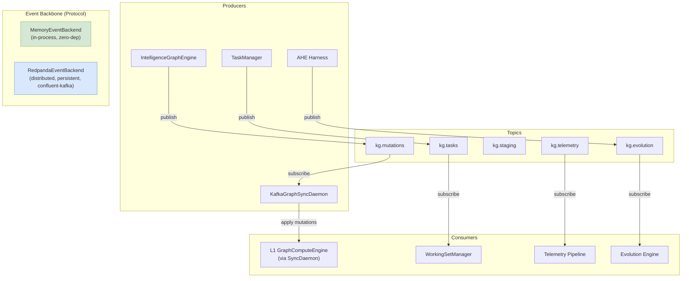
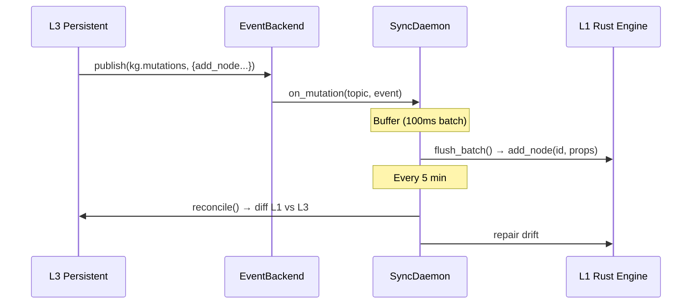

# Event Backbone Architecture

> CONCEPT:KG-2.7 — Vendor-Agnostic Event Backbone

## Overview

The event backbone provides protocol-based pub/sub event streaming for
graph mutations, task queues, telemetry, and evolution triggers. It follows
the same pattern as `GraphBackend` — abstract protocol with an in-memory
default and optional distributed backends.

## Architecture



## Topic Taxonomy

| Topic | Purpose | Retention | Cleanup Policy |
|-------|---------|-----------|---------------|
| `kg.mutations` | Graph CRUD events (add/update/delete node/edge) | 7 days | compact + delete |
| `kg.tasks` | Task queue scheduling and completion | 3 days | delete |
| `kg.staging` | Staged graph payloads awaiting write | 1 day | delete |
| `kg.telemetry` | Agent traces, latency, error rates | 1 day | delete |
| `kg.evolution` | Self-improvement triggers, AHE cycle events | 7 days | compact + delete |

## Event Schema

All events are JSON-serialized with the following base structure:

```json
{
    "action": "add_node",
    "data": {
        "id": "agent-001",
        "properties": {"type": "Agent", "name": "Research Agent"}
    },
    "timestamp": 1716912000.0,
    "source": "IntelligenceGraphEngine"
}
```

### Mutation Actions

| Action | Data Fields | Description |
|--------|------------|-------------|
| `add_node` | `id`, `properties` | Add or update a node |
| `add_edge` | `source`, `target`, `properties` | Add or update an edge |
| `remove_node` | `id` | Remove a node and its edges |
| `remove_edge` | `source`, `target` | Remove a specific edge |

## Backend Selection

```python
from agent_utilities.knowledge_graph.core.event_backend import create_event_backend

# In-memory (default, zero config, single-process)
backend = create_event_backend("memory")

# Redpanda (production, multi-process)
backend = create_event_backend("redpanda", bootstrap_servers="redpanda:9092")
```

### Environment Variables

| Variable | Default | Description |
|----------|---------|-------------|
| `EVENT_BACKEND` | `redpanda` | Backend type (`memory`, `redpanda`) — falls back to `memory` unless `KAFKA_ENABLED=true` |
| `KAFKA_ENABLED` | `false` | Gate that enables the distributed backend; otherwise `MemoryEventBackend` is used |
| `REDPANDA_BROKERS` | `localhost:9092` | Broker addresses (Kafka/Redpanda) |
| `REDPANDA_CONSUMER_GROUP` | `agent-utilities` | Default consumer group |
| `REDPANDA_SECURITY_PROTOCOL` | `PLAINTEXT` | Security protocol |

## Graph Sync Daemon

The `KafkaGraphSyncDaemon` (in `core/kafka_graph_sync.py`) ensures L1 (Rust
GraphComputeEngine) stays synchronized with L3 (persistent backend):



### Failure Modes

| Failure Mode | Mitigation |
|-------------|-----------|
| Redpanda unavailable | Auto-fallback to MemoryEventBackend |
| Consumer lag > 10K | Circuit breaker → full L1 reload from L3 |
| L1↔L3 drift | 5-minute reconciliation daemon |
| Duplicate events | Idempotent dedup via (action, id, timestamp) key |

## Docker Deployment

```bash
# Start Kafka (KRaft mode, no Zookeeper) — also runs Redpanda-compatible brokers
docker compose -f docker/kafka-kraft.compose.yml up -d

# Verify topics
docker exec agent-utilities-kafka \
    /opt/kafka/bin/kafka-topics.sh --list --bootstrap-server localhost:9092
```

## Dependencies

```toml
# pyproject.toml
[project.optional-dependencies]
event-kafka = ["confluent-kafka>=2.0"]
```
