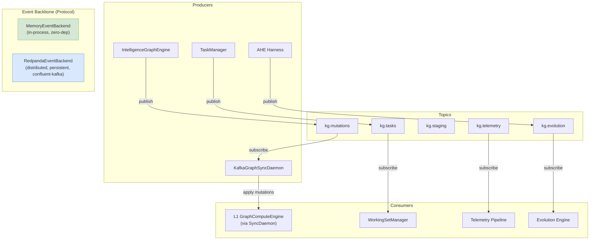
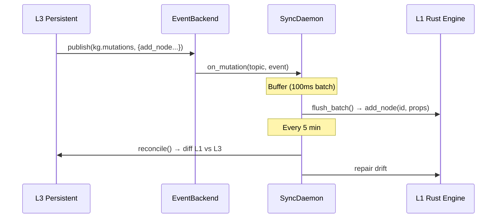

# Event Backbone Architecture

> CONCEPT:KG-2.7 — Vendor-Agnostic Event Backbone

## Overview

The event backbone provides protocol-based pub/sub event streaming for
graph mutations, task queues, telemetry, and evolution triggers. It follows
the same pattern as `GraphBackend` — abstract protocol with an in-memory
default and optional distributed backends.

## Architecture



## Topic Taxonomy

| Topic | Purpose | Retention | Cleanup Policy |
|-------|---------|-----------|---------------|
| `kg.mutations` | Graph CRUD events (add/update/delete node/edge) | 7 days | compact + delete |
| `kg.tasks` | Task queue scheduling and completion | 3 days | delete |
| `kg.staging` | Staged graph payloads awaiting write | 1 day | delete |
| `kg.telemetry` | Agent traces, latency, error rates | 1 day | delete |
| `kg.evolution` | Self-improvement triggers, AHE cycle events | 7 days | compact + delete |

## Event Schema

All events are JSON-serialized with the following base structure:

```json
{
    "action": "add_node",
    "data": {
        "id": "agent-001",
        "properties": {"type": "Agent", "name": "Research Agent"}
    },
    "timestamp": 1716912000.0,
    "source": "IntelligenceGraphEngine"
}
```

### Mutation Actions

| Action | Data Fields | Description |
|--------|------------|-------------|
| `add_node` | `id`, `properties` | Add or update a node |
| `add_edge` | `source`, `target`, `properties` | Add or update an edge |
| `remove_node` | `id` | Remove a node and its edges |
| `remove_edge` | `source`, `target` | Remove a specific edge |

## Backend Selection

```python
from agent_utilities.knowledge_graph.core.event_backend import create_event_backend

# In-memory (default, zero config, single-process)
backend = create_event_backend("memory")

# Redpanda (production, multi-process)
backend = create_event_backend("redpanda", bootstrap_servers="redpanda:9092")
```

### Environment Variables

| Variable | Default | Description |
|----------|---------|-------------|
| `EVENT_BACKEND` | `redpanda` | Backend type (`memory`, `redpanda`) — falls back to `memory` unless `KAFKA_ENABLED=true` |
| `KAFKA_ENABLED` | `false` | Gate that enables the distributed backend; otherwise `MemoryEventBackend` is used |
| `REDPANDA_BROKERS` | `localhost:9092` | Broker addresses (Kafka/Redpanda) |
| `REDPANDA_CONSUMER_GROUP` | `agent-utilities` | Default consumer group |
| `REDPANDA_SECURITY_PROTOCOL` | `PLAINTEXT` | Security protocol |

## Graph Sync Daemon

The `KafkaGraphSyncDaemon` (in `core/kafka_graph_sync.py`) ensures L1 (Rust
GraphComputeEngine) stays synchronized with L3 (persistent backend):



### Failure Modes

| Failure Mode | Mitigation |
|-------------|-----------|
| Redpanda unavailable | Auto-fallback to MemoryEventBackend |
| Consumer lag > 10K | Circuit breaker → full L1 reload from L3 |
| L1↔L3 drift | 5-minute reconciliation daemon |
| Duplicate events | Idempotent dedup via (action, id, timestamp) key |

## Docker Deployment

```bash
# Start Kafka (KRaft mode, no Zookeeper) — also runs Redpanda-compatible brokers
docker compose -f docker/kafka-kraft.compose.yml up -d

# Verify topics
docker exec agent-utilities-kafka \
    /opt/kafka/bin/kafka-topics.sh --list --bootstrap-server localhost:9092
```

## Dependencies

```toml
# pyproject.toml
[project.optional-dependencies]
event-kafka = ["confluent-kafka>=2.0"]
```

## Ingest Task Queue Scale-Out (CONCEPT:KG-2.55 / KG-2.56 / KG-2.57)

Separate from the pub/sub event backbone above, the **durable ingest task
queue** (the queue `submit_task` writes and the ingest workers drain) is
selectable, fail-loud, and — with Kafka — horizontally scalable.

### Three queue modes

| Mode | Selected by | Scope | Workers |
|------|-------------|-------|---------|
| `sqlite` | default (nothing set) | one host (per-host `kg_task_queue.db`) | in-process daemon threads on the flock host |
| `postgres` | auto when `STATE_DB_URI` is set, or `TASK_QUEUE_BACKEND=postgres` | fleet (one shared queue, `FOR UPDATE SKIP LOCKED` claims — KG-2.54) | in-process threads on every participating host |
| `kafka` | `TASK_QUEUE_BACKEND=kafka` | fleet (keyed `kg_tasks` topic) | the `kg-ingest` consumer group: the host engine's pool **plus** any number of decoupled `kg-ingest-worker` processes |

Selection contract (KG-2.55):

- `TASK_QUEUE_BACKEND` unset → **auto**: `postgres` when `STATE_DB_URI` is
  set, else `sqlite`. Auto stays graceful — an unreachable Postgres degrades
  to the per-host SQLite queue with a warning.
- `TASK_QUEUE_BACKEND=kafka|postgres` set **explicitly** → fail-loud: an
  unreachable broker/state store raises `TaskQueueUnavailable` at startup
  with the endpoint and fall-back instructions. Never a silent degrade.
- The old `QUEUE_BACKEND` env is a **deprecated alias**: honored with a
  `DeprecationWarning` and the legacy silent-fallback semantics.

### Partition-key hierarchy (KG-2.56)

Producers key every `kg_tasks` message; Kafka guarantees ordering per key
without serializing unrelated work. First match wins:

1. `tenant:<id>` — ambient `ActorContext.tenant_id` (multi-tenant ordering);
2. `corpus:<repo>` — the ingest target's repo/corpus identifier (batch-ingest
   provenance `full_path`, else the path-derived repo root) — per-repo
   ordering for codebase fan-out;
3. `type:<task_type>` — coarsest bucket for everything else.

`kg_tasks` is ensured idempotently at startup with `KG_TASKS_PARTITIONS`
partitions (default 6). **Grow-only**: raising the flag adds partitions; an
existing topic is never shrunk. Partition count bounds the consumer group's
maximum parallelism.

### Ordering & idempotency guarantees (KG-2.57)

- **At-least-once delivery.** Offsets are committed only after a task
  completes (or is durably marked failed); worker crashes redeliver.
- **Idempotent claims.** `job_id` is the idempotency key: a consumer claims by
  MERGE-ing the `:Task` node to `running` (skipping jobs already
  running/completed/failed/cancelled), guarded cross-host by the KG-2.54
  `state_claim_guard` advisory lock when `STATE_DB_URI` is set. Graph writes
  are MERGE-based, so rare duplicate executions converge.
- **Per-key ordering only.** There is no global order and no cross-partition
  priority lane (the graph-polling modes' `priority=high` fast path does not
  apply in Kafka mode).
- **Zombie recovery.** Uncommitted offsets redeliver automatically; the task
  reaper additionally re-publishes reaped orphans to the topic (in Kafka mode
  nothing polls `pending` nodes).

### Worker deployment shape

```bash
# Host engine (unchanged): in Kafka mode its worker pool simply joins kg-ingest.
TASK_QUEUE_BACKEND=kafka KAFKA_BOOTSTRAP_SERVERS=kafka:9092 graph-os-daemon

# Scale out: N decoupled workers, any host, NO KG host role required.
# Each is an engine *client* (Rust daemon over TCP/UDS + OS-5.14 HMAC secret).
GRAPH_SERVICE_TCP_ADDR=engine-host:9100 \
GRAPH_SERVICE_AUTH_SECRET=... \
KAFKA_BOOTSTRAP_SERVERS=kafka:9092 \
kg-ingest-worker            # or: python -m agent_utilities.knowledge_graph.ingest_worker
```

Per-host concurrency autosizes with the shared CPU/memory sizer
(`compute_ingest_worker_count`: ~36% of cores, ~3 GB RAM per worker, floor 2);
override with `--workers` / `KG_INGESTION_WORKERS`.

### Backpressure & lag visibility

The leader host's maintenance scheduler samples the queue every pass and
publishes to the OS-5.23 gateway Prometheus registry:

- `agent_utilities_kg_ingest_queue_depth{backend}` — pending tasks in the
  selected backend (uniform across sqlite/postgres/kafka);
- `agent_utilities_kg_ingest_consumer_lag{topic,group}` — total `kg-ingest`
  group lag on `kg_tasks` (Kafka mode).

The batch orchestrator's deferral and the maintenance bulk-defer gate read the
same uniform number via `engine.ingest_queue_depth()` (queue backlog + in-graph
pending/running `:Task` nodes), so backpressure behaves identically in all
three modes.
