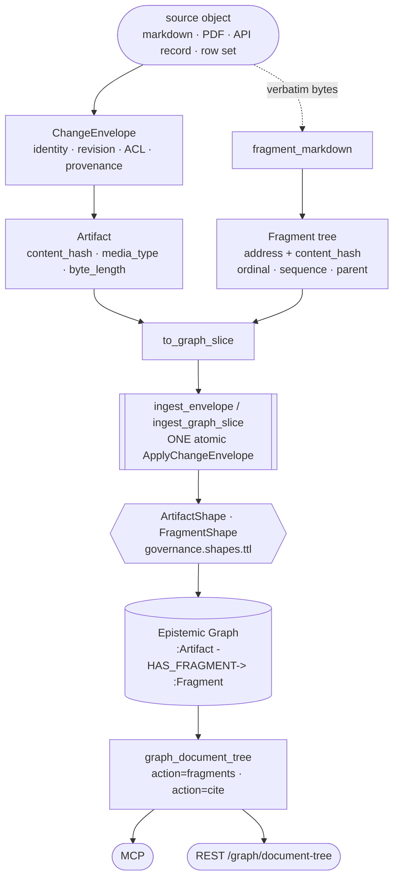

# Evidence spine — `Artifact` → addressable `Fragment`

**CONCEPT:AU-KG.ingest.evidence-spine-artifact** · **CONCEPT:AU-KG.ingest.stable-fragment-address**

The citation unit universal ingestion binds to. Every downstream track — candidate-claim
extraction, entity resolution, governed promotion, retrieval — cites a `Fragment`, so the
one property that has to hold is that **a citation survives the edits real documents
receive**.

## What already existed

Most of the spine was already here, and had no producer:

| Piece | Where it already lived | What it lacked |
|---|---|---|
| source identity, revision, ACL, payload, change events, provenance | `ChangeEnvelope` (`ingestion/change_envelope.py`) | nothing — it is reused verbatim |
| atomic multi-node commit | `ingest_envelope` / `ingest_graph_slice` | nothing — the spine rides it |
| an engine-side `Artifact` wire projection (`digest`, `content_ref`, `segment_ids`, `loci`) | `protocols/epistemic_operations` | **no Python ever constructed one**; `segment_ids` had no type behind it |
| document chunking + section trees | `ontology/document_processing.py` | chunk ids of the form `{doc}::chunk::{i}:{sha(text)[:12]}` — **both positional and content-hashed**, so they break on an insert above *and* on a typo fix |

The genuine gap was therefore narrow: a **stable, hashed, orderable, nestable citation
address**, and a caller that produces one.

## The identity scheme

Two questions get two fields, because one value cannot answer both.

| Field | Answers | Changes when |
|---|---|---|
| `Fragment.fragment_id` | *where is it?* — the **address** a citation stores | the document's **structure** around it changes |
| `Fragment.content_hash` | *does it still say that?* — the **revision** | the fragment's **text** changes |
| `Fragment.version_id` | a content-pinned, immutable citation (`<id>#<hash>`) | either changes |

`fragment_id = sha256(artifact_id ‖ structural_path)`. Each path segment is
`<kind>:<anchor>`, where the anchor is a **slug of the node's own label** when it has one
(a heading, a table's header row, a table row's first cell) and a **sibling ordinal** when
it does not. Ordinals are counted **per (parent, kind)**, so inserting a code block never
renumbers the paragraphs around it.

### The trade-off, stated plainly

Both pure schemes were rejected:

- A **purely positional** id is stable across body edits, but one inserted paragraph
  renumbers every later fragment and invalidates the whole tail of a document's citations.
- A **purely content-hashed** id is stable across inserts, but a typo fix breaks the
  citation to a passage that still says the same thing, and two identical paragraphs
  collide onto one id.

The scoped-structural scheme buys most of both. What it costs:

| Edit | Address | Hash |
|---|---|---|
| re-ingest unchanged | identical | identical |
| reflow / trailing whitespace | identical | identical (normalized before hashing) |
| fix a typo | **identical** | changes |
| insert a paragraph in another section | identical | identical |
| insert a whole new section | identical | identical |
| re-sort table rows | identical (rows anchor on their first cell) | identical |
| **rename a heading** | **changes** for everything beneath it | identical |
| **insert a same-kind sibling above** | **changes** | identical |

The last two are real. A renamed section is arguably a different section, and the
alternative — a content-independent synthetic id — needs durable state we would then have
to keep correct across every re-ingest. The same-kind-sibling case is covered by
`resolve_fragment` / `citation_status`, which match **address first, content second**:

- `current` — address resolved, content unchanged.
- `moved` — exactly one fragment still carries the cited content, at a different address;
  the citation is re-pointable. Checked **before** `stale`, because a displaced quote is
  not a rewritten quote.
- `stale` — address resolved, content changed, cited content exists nowhere else.
- `lost` — neither resolves, or the content is ambiguous across several fragments.
  Reported, never guessed — a lucky match would re-point a citation at text it never
  supported.

## How it flows

The spine never opens a second write path. A half-landed spine — an artifact whose
fragments did not commit, or fragments orphaned from their artifact — is not a state a
reader should have to handle, so it is not a state this can produce.

## Wiring

`DocumentProcessor.process()` builds the spine on **every** processed document, default on,
no flag (*Native by default*). Chunks and fragments answer different questions and both are
materialized from the one extraction:

- **`Chunk`** — the retrieval unit: fixed-size, overlapping, embedded.
- **`Fragment`** — the citation unit: structural, stably addressed, hashed.

They are joined through `Document -HAS_ARTIFACT-> Artifact -HAS_FRAGMENT-> Fragment`.

> **Defect found and fixed while wiring this.** `DocumentProcessor._read_file` routes a
> markdown file through `KBDocumentParser`, which returns whitespace-normalized chunks —
> every heading, table and list boundary is already gone by the time anything downstream
> sees the text. That is fine for embeddings and fatal for addressing. The spine now
> fragments the **verbatim** source for formats whose bytes are the document
> (`.md`/`.markdown`/`.mdx`/`.txt`/`.rst`) and falls back to extracted text for formats
> that genuinely need an extractor. The chunk pipeline is unchanged.
>
> **Second defect.** `doc_id` is derived from the content hash, so keying the artifact to
> it would fork a new artifact on every edit and orphan every citation. The artifact is
> keyed to the **source object** (path/URL); its `content_hash` carries the revision.

## Ontology + SHACL

`:Artifact` and `:Fragment` go into the **canonical** `ontology.ttl` beside `:Document` and
`:Evidence` — no new top-level `.ttl` (*Sprawl boundaries*). The shapes go into
`shapes/governance.shapes.ttl`, which is the file `envelope_ingest._shacl_validate_rows`
actually loads, so they are enforced **at the ingest boundary**:

- `ArtifactShape` — `content_hash` matching `^sha256:[0-9a-f]{64}$`, `connector`,
  `source_object_id`.
- `FragmentShape` — `artifact_id` (parent linkage), `content_hash`, `address`,
  `fragment_kind`, and a non-negative `sequence`.

## Both surfaces

`graph_document_tree` gains two actions, reaching the same core; its REST twin
`/graph/document-tree` carries them with no second implementation.

| Action | Purpose |
|---|---|
| `fragments` | list every citable fragment of an artifact/document (or of inline `text`), with address, content hash, version id, order and nesting |
| `cite` | resolve a stored citation and report `current` / `moved` / `stale` / `lost` |

## Tests

| Level | File | Proves |
|---|---|---|
| Unit | `tests/unit/knowledge_graph/ingestion/test_evidence_spine.py` | the id scheme's stability class-by-class, and that ambiguity is preserved rather than guessed |
| Wiring | `..._wiring.py` | a **real markdown file on disk** reaches `envelope_ingest.ingest_envelope` as an `Artifact` + `Fragment` rows in the **same envelope**, and re-ingesting it unchanged produces identical fragment ids |
| Contract | `..._contract.py` | the `graph_document_tree` action set is exactly pinned and both surfaces carry the new actions |
