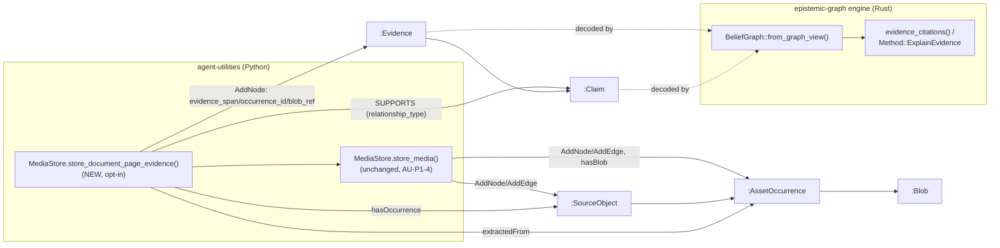

# Evidence-Spine Convergence (Seam 2)

**Concepts:** AU-KG.identity.evidence-spine-convergence (this doc) ·
AU-KG.identity.asset-occurrence (AU-P1-4, `media_store.py`'s existing
`Blob`/`Rendition`/`AssetOccurrence` identity chain) · EG-X1 (epistemic-graph's
multimodal evidence-graph spine + citation resolver,
`crates/eg-epistemic/src/evidence.rs`, feature `evidence-graph`).

## The gap this closes

Before this change there were **two parallel evidence chains** for the same
`EvidenceSpan` shape:

* AU stored *that* some bytes occurred — a `:SourceObject -> :AssetOccurrence ->
  :Blob` identity chain (AU-P1-4) — but had no way to say *where inside those
  bytes* a claim's evidence sat.
* epistemic-graph's own evidence-graph (EG-X1) already resolved a located
  `EvidenceSpan` locus (`PageBox`/`ImageRegion`/`AudioSegment`/…) off an
  `:Evidence` node's `evidence_span`/`occurrence_id`/`blob_ref` properties via
  `Method::ExplainEvidence` / `eg_epistemic::evidence_citations` — but nothing
  ever wrote an AU-produced occurrence into that shape.

A citation resolved through AU and a citation resolved through EG were
answering two different questions from two different graphs of record. Seam 2
converges them: **one write path, one resolver.**

## What changed

`MediaStore.store_document_page_evidence` (`agent_utilities/knowledge_graph/
memory/media_store.py`) is a new, **opt-in** method — nothing about
`store_media`/`store_rendition` changed, and a caller that never calls it writes
nothing extra. When a caller HAS a document page + bounding box for the bytes
it's storing, this method:

1. Stores the bytes via the existing `store_media` (AU-P1-4's `:AssetOccurrence
   -> :Blob` chain, unchanged).
2. Writes/reuses a `:SourceObject` node for the owning document
   (`sourceobject:<document_id>`, upserted once) plus a structural
   `hasOccurrence` edge to the new occurrence.
3. Writes an `:Evidence` node carrying the located `PageBox` `EvidenceSpan`
   locus (the externally-tagged `{"PageBox": {document_id, page, x, y, width,
   height}}` shape `eg_epistemic::BeliefGraph::from_graph_view` decodes) plus
   `occurrence_id`/`blob_ref` — the SAME identity-chain convention
   `eg_epistemic::evidence` documents — and a structural `extractedFrom` edge
   back to the occurrence.
4. When a `claim_id` is given, links the evidence to it with a
   `relationship_type: "SUPPORTS"` edge — the SAME convention
   `eg_epistemic`'s own claim materialization
   (`src/server/handlers/mining.rs::materialize_claim`) writes, so
   `evidence_citations`'s support/contradiction/attack walk recognizes it with
   **no engine-side change**.

**No second resolver, no new engine write endpoint.** The generic
`AddNode`/`AddEdge` RPCs (`client.nodes.add`/`client.edges.add`) the rest of
`MediaStore` already uses are sufficient to produce the exact property/edge
shape the engine's real decoder expects — reading citations back always goes
through epistemic-graph's own `Method::ExplainEvidence`, never a second,
AU-side implementation of the same resolution logic.

## Proof (the vertical slice)

One modality, end-to-end: **document page-box** (`EvidenceSpan::PageBox`).

* AU half (no live engine needed): `tests/unit/knowledge_graph/
  test_media_store_evidence_spine.py` proves `store_document_page_evidence`
  writes the exact node/edge shape — `evidence_span`/`occurrence_id`/`blob_ref`
  on the `:Evidence` node, structural `hasOccurrence`/`extractedFrom`/`hasBlob`
  edges, and the `relationship_type: "SUPPORTS"` edge when a `claim_id` is
  given.
* EG half (epistemic-graph repo): `crates/eg-epistemic/tests/
  x1_au_occurrence_chain.rs` mirrors those EXACT literal values into a real
  `GraphView`, decodes them through the REAL `BeliefGraph::from_graph_view`,
  and asserts `evidence_citations`/`resolve_locus` return the exact `PageBox`
  locus + occurrence/blob identity — the same acceptance shape EG-X1's own
  `x1_evidence_chain.rs` established for a hand-built fixture, now keyed off
  AU's actual write shape.

Together the two prove the round trip without requiring a live server built
with the (opt-in, non-default) `evidence-graph` Cargo feature in this repo's
test harness — see "What remains" below.

## All eleven loci now wired (AU half) — Seam 2 completion

`eg_modality::EvidenceSpan` defines eleven located-locus variants. The
page-box slice above proved the pattern for `PageBox`; the SAME pattern now
extends to the remaining ten via a shared private skeleton,
`MediaStore._store_located_evidence` (`agent_utilities/knowledge_graph/
memory/media_store.py`) — the generalized form of
`store_document_page_evidence`'s steps 2-4 (upsert `:SourceObject`, write the
`:Evidence` node with `evidence_span`/`occurrence_id`/`blob_ref`, the
`extractedFrom` edge, and the `SUPPORTS` edge when `claim_id` is given),
parameterized over `about_id` (whichever locus field identifies the owning
artifact) and the caller-built externally-tagged `evidence_span` dict. Each
public wrapper below returns the (identically-shaped) `EvidenceLocus`
dataclass and is opt-in exactly like `store_document_page_evidence` — nothing
about `store_media`/`store_rendition` changes.

| Locus (`eg_modality::EvidenceSpan`) | `MediaStore` method | Producer wiring |
|---|---|---|
| `PageBox` | `store_document_page_evidence` | Shipped Seam 2 slice (pre-existing) |
| `DocumentSpan` | `store_document_span_evidence` | Not wired — see below |
| `TableCellRange` | `store_table_cell_evidence` | Not wired — see below |
| `ImageRegion` | `store_image_region_evidence` | Not wired — see below |
| `AudioSegment` | `store_audio_segment_evidence` | Not wired — see below |
| `VideoShot` | `store_video_shot_evidence` | No natural producer (see below) |
| `VideoFrameRange` | `store_video_frame_range_evidence` | No natural producer (see below) |
| `MetricWindow` | `store_metric_window_evidence` | Not wired — see below |
| `RowVersion` | `store_row_version_evidence` | Not wired — see below |
| `CodeSymbol` | `store_code_symbol_evidence` | Not wired — see below |
| `TraceSpan` | `store_trace_span_evidence` | Not wired — see below |

**Proof:** `tests/unit/knowledge_graph/test_media_store_evidence_spine.py`'s
`test_store_locus_evidence_writes_the_full_identity_chain` /
`test_store_locus_evidence_links_supports_edge_when_claim_given` are
parametrized over all ten new loci (`LOCUS_CASES`), each asserting the exact
`evidence_span` literal plus `occurrence_id`/`blob_ref` and the structural
`hasOccurrence`/`extractedFrom`/`hasBlob` edges, mirroring the page-box test's
approach node-for-node.

### Producer wiring — surveyed, deliberately not forced this pass

Every remaining locus was matched against a candidate AU producer (a real
ingestion/extraction path that already has, or nearly has, that modality's
locus fields):

* **`AudioSegment`** — `agent_utilities/messaging/voice.py`'s
  `_FasterWhisper.transcribe()` calls `faster-whisper`, whose `segments`
  objects natively carry `.start`/`.end`; today only `seg.text` is kept. The
  messaging router (`agent_utilities/messaging/router.py`) already resolves a
  `MediaStore` (`_resolve_media_store`) and separately downloads+stores voice
  attachment bytes (`_persist_media`) — but transcription
  (`_transcribe_attachments` → `transcribe_voice`) is a second, independent
  download that discards timing and never sees the stored occurrence.
* **`DocumentSpan`** — `agent_utilities/knowledge_graph/extraction/
  fact_extractor.py`'s `ExtractedFact.evidence_span` is a *verbatim substring*
  of the source text (offsets are derivable via `str.find`), but
  `persist_facts()` writes through a different facade (`store.add_node`/
  `store.add_edge`, not `MediaStore`'s `client.nodes.add`/`client.blob`/
  `client.txn`) and never sees the raw document bytes — the same loose
  `evidence_span` *string* property already lives on the fact edge for a
  different (narrative, not located-locus) purpose.
* **`CodeSymbol`** — `agent_utilities/knowledge_graph/enrichment/extractors/
  code_test.py`'s `entities_from_parse_result()` has `file_path`/`name`/`line`
  from the Rust AST parse (an `end_line` prop already exists on the engine
  node, per `agent_utilities/models/codemap.py`, just not read here yet) but
  is a pure mapper by design ("this module only maps... no Python AST
  walking") with no engine-client/MediaStore coupling to add to.
  `agent_utilities/harness/trace_backend.py`'s `KGTraceBackend.record_event()`
  is the strongest **`TraceSpan`** candidate (already takes `trace_id`/
  `span_id` explicitly) but writes through the same non-`MediaStore`
  `add_node`/`link_nodes` facade.
* **`TableCellRange`** — `agent_utilities/knowledge_graph/extraction/
  readers_office.py`/`readers.py` (`read_xlsx`/`read_csv`/`read_delimited`)
  iterate rows/cells in order but flatten to joined text, discarding indices;
  wiring would change the return shape of shared reader utilities several
  other callers depend on.
* **`RowVersion`** — `agent_utilities/protocols/source_connectors/connectors/
  database.py`'s `DatabaseConnector.poll()` already tracks `row_id` + an
  `updated_at` watermark, but has no explicit `table` field and, like the
  others above, no `MediaStore` reach from a connector poll loop.
* **`MetricWindow`** — `agent_utilities/knowledge_graph/memory/timeseries/
  engine_backend.py`'s `EngineTimeSeriesBackend.query()` already takes a
  `symbol`/time range and per-metric fields, but it is a *read* path
  (answering a query), not an ingestion path that would naturally mint new
  evidence.
* **`ImageRegion`** — `agent_utilities/knowledge_graph/extraction/
  readers_media.py`'s `_ocr_with_rapidocr()` gets `[box, text, score]` rows
  from RapidOCR but keeps only the text; `_ocr_with_pytesseract()` doesn't
  request box data at all.
* **`VideoShot`/`VideoFrameRange`** — no shot-detection or frame-accurate
  video-processing path exists in AU today; `agent_utilities/tools/
  media_tools.py`'s `generate_video()` only generates video, it does not
  analyze one.

None of these is a same-file, no-risk addition: each needs either a
client-shape bridge (the extractor/connector writes through a different KG
facade than `MediaStore`), a behavior change to a shared utility several
other callers depend on (discarding data that would need to start flowing
through), or new context plumbing (an `audio_id`/`claim_id` that doesn't
reach the call site today). Per this seam's own charter ("no new engine
capability is needed... only the AU-side locus-field plumbing differs per
modality"), the `MediaStore` methods above are the complete, tested AU-side
half; wiring any one of them into its candidate producer is a scoped,
single-locus follow-up rather than part of this pass.

## What remains for full convergence

* **Ten loci have a tested `MediaStore` method but no live AU producer call**
  (see the survey above) — each is opt-in and ready for a caller to adopt.
* **No live-engine round-trip test in AU's own suite.** `evidence-graph` is an
  opt-in, non-default Cargo feature (not folded into any tier, including
  `full`/`default`) — AU's shared ephemeral-engine test fixture
  (`tests/_test_engine.py`, `tiny_engine`/`engine_graph`) does not build or
  probe for it, so there is no `pytest.mark.engine` test in AU asserting
  `client.query.explain_evidence(...)` against a REAL running server for this
  seam yet. The EG-side Rust test is the closest thing to that proof today
  (it runs the actual engine decode/resolve code, just not over the wire).
  Standing up a dedicated `evidence-graph`-featured test engine (or folding
  `evidence-graph` into a test-only tier) is the natural follow-up.
* **`tests/_test_engine.py`'s `BUILD_TIER = "pi-max"` fallback build path is
  stale** relative to epistemic-graph's own tier retirement (EG-371: `pi`/
  `pi-max`/`node` no longer exist as Cargo features — `full` **is** `default`
  now) — a pre-existing drift unrelated to this seam, noted here because it's
  exactly what would need fixing (or superseding) to add the live-engine test
  above.
