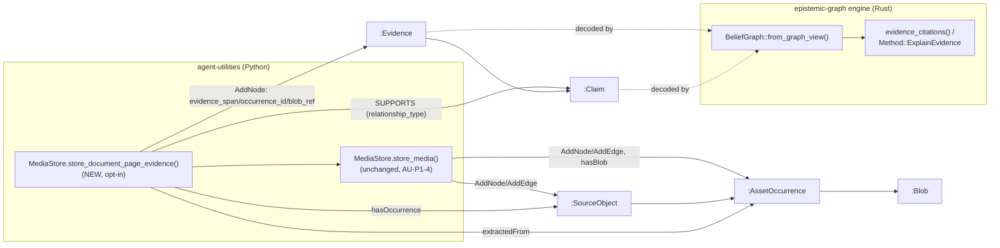

# Evidence-Spine Convergence (Seam 2)

**Concepts:** AU-KG.identity.evidence-spine-convergence (this doc) ·
AU-KG.identity.asset-occurrence (AU-P1-4, `media_store.py`'s existing
`Blob`/`Rendition`/`AssetOccurrence` identity chain) · EG-X1 (epistemic-graph's
multimodal evidence-graph spine + citation resolver,
`crates/eg-epistemic/src/evidence.rs`, feature `evidence-graph`).

## The gap this closes

Before this change there were **two parallel evidence chains** for the same
`EvidenceSpan` shape:

* AU stored *that* some bytes occurred — a `:SourceObject -> :AssetOccurrence ->
  :Blob` identity chain (AU-P1-4) — but had no way to say *where inside those
  bytes* a claim's evidence sat.
* epistemic-graph's own evidence-graph (EG-X1) already resolved a located
  `EvidenceSpan` locus (`PageBox`/`ImageRegion`/`AudioSegment`/…) off an
  `:Evidence` node's `evidence_span`/`occurrence_id`/`blob_ref` properties via
  `Method::ExplainEvidence` / `eg_epistemic::evidence_citations` — but nothing
  ever wrote an AU-produced occurrence into that shape.

A citation resolved through AU and a citation resolved through EG were
answering two different questions from two different graphs of record. Seam 2
converges them: **one write path, one resolver.**

## What changed

`MediaStore.store_document_page_evidence` (`agent_utilities/knowledge_graph/
memory/media_store.py`) is a new, **opt-in** method — nothing about
`store_media`/`store_rendition` changed, and a caller that never calls it writes
nothing extra. When a caller HAS a document page + bounding box for the bytes
it's storing, this method:

1. Stores the bytes via the existing `store_media` (AU-P1-4's `:AssetOccurrence
   -> :Blob` chain, unchanged).
2. Writes/reuses a `:SourceObject` node for the owning document
   (`sourceobject:<document_id>`, upserted once) plus a structural
   `hasOccurrence` edge to the new occurrence.
3. Writes an `:Evidence` node carrying the located `PageBox` `EvidenceSpan`
   locus (the externally-tagged `{"PageBox": {document_id, page, x, y, width,
   height}}` shape `eg_epistemic::BeliefGraph::from_graph_view` decodes) plus
   `occurrence_id`/`blob_ref` — the SAME identity-chain convention
   `eg_epistemic::evidence` documents — and a structural `extractedFrom` edge
   back to the occurrence.
4. When a `claim_id` is given, links the evidence to it with a
   `relationship_type: "SUPPORTS"` edge — the SAME convention
   `eg_epistemic`'s own claim materialization
   (`src/server/handlers/mining.rs::materialize_claim`) writes, so
   `evidence_citations`'s support/contradiction/attack walk recognizes it with
   **no engine-side change**.

**No second resolver, no new engine write endpoint.** The generic
`AddNode`/`AddEdge` RPCs (`client.nodes.add`/`client.edges.add`) the rest of
`MediaStore` already uses are sufficient to produce the exact property/edge
shape the engine's real decoder expects — reading citations back always goes
through epistemic-graph's own `Method::ExplainEvidence`, never a second,
AU-side implementation of the same resolution logic.

## Proof (the vertical slice)

One modality, end-to-end: **document page-box** (`EvidenceSpan::PageBox`).

* AU half (no live engine needed): `tests/unit/knowledge_graph/
  test_media_store_evidence_spine.py` proves `store_document_page_evidence`
  writes the exact node/edge shape — `evidence_span`/`occurrence_id`/`blob_ref`
  on the `:Evidence` node, structural `hasOccurrence`/`extractedFrom`/`hasBlob`
  edges, and the `relationship_type: "SUPPORTS"` edge when a `claim_id` is
  given.
* EG half (epistemic-graph repo): `crates/eg-epistemic/tests/
  x1_au_occurrence_chain.rs` mirrors those EXACT literal values into a real
  `GraphView`, decodes them through the REAL `BeliefGraph::from_graph_view`,
  and asserts `evidence_citations`/`resolve_locus` return the exact `PageBox`
  locus + occurrence/blob identity — the same acceptance shape EG-X1's own
  `x1_evidence_chain.rs` established for a hand-built fixture, now keyed off
  AU's actual write shape.

Together the two prove the round trip without requiring a live server built
with the (opt-in, non-default) `evidence-graph` Cargo feature in this repo's
test harness — see "What remains" below.

## Pattern for the other modalities (not yet wired)

`eg_modality::EvidenceSpan` defines eleven located-locus variants; this seam
wires exactly one (`PageBox`) end-to-end. The SAME pattern extends unchanged
to the rest — each needs only:

1. An AU-side write path that already has (or can derive) the modality's
   locus fields (e.g. an image ingestion path has `x`/`y`/`width`/`height` in
   pixel space for `ImageRegion`; an ASR/transcription path has
   `start_ms`/`end_ms` for `AudioSegment`; a code-intelligence path has
   `file_path`/`symbol`/`start_line`/`end_line` for `CodeSymbol`).
2. An `:Evidence` node whose `evidence_span` is that variant's externally
   tagged shape (`{"<Variant>": {...}}`), plus `occurrence_id`/`blob_ref`
   pointing at the SAME `AssetOccurrence`/`Blob` identity chain
   `MediaStore.store_media` already writes.
3. The SAME `relationship_type: "SUPPORTS"` edge convention to link it to a
   claim, when one exists.

No new engine capability is needed for any of them — `evidence_citations`
already decodes any `EvidenceSpan` variant identically; only the AU-side
locus-field plumbing differs per modality.

## What remains for full convergence

* **Only one modality wired** (document page-box). `ImageRegion`,
  `AudioSegment`, `VideoShot`/`VideoFrameRange`, `TableCellRange`,
  `DocumentSpan`, `RowVersion`, `CodeSymbol`, `TraceSpan`, `MetricWindow` are
  documented (above) but not yet plumbed into a concrete AU ingestion path.
* **No live-engine round-trip test in AU's own suite.** `evidence-graph` is an
  opt-in, non-default Cargo feature (not folded into any tier, including
  `full`/`default`) — AU's shared ephemeral-engine test fixture
  (`tests/_test_engine.py`, `tiny_engine`/`engine_graph`) does not build or
  probe for it, so there is no `pytest.mark.engine` test in AU asserting
  `client.query.explain_evidence(...)` against a REAL running server for this
  seam yet. The EG-side Rust test is the closest thing to that proof today
  (it runs the actual engine decode/resolve code, just not over the wire).
  Standing up a dedicated `evidence-graph`-featured test engine (or folding
  `evidence-graph` into a test-only tier) is the natural follow-up.
* **`tests/_test_engine.py`'s `BUILD_TIER = "pi-max"` fallback build path is
  stale** relative to epistemic-graph's own tier retirement (EG-371: `pi`/
  `pi-max`/`node` no longer exist as Cargo features — `full` **is** `default`
  now) — a pre-existing drift unrelated to this seam, noted here because it's
  exactly what would need fixing (or superseding) to add the live-engine test
  above.
