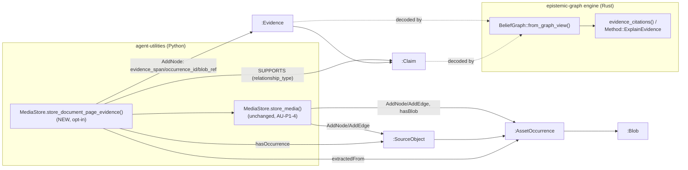

# Evidence-Spine Convergence (Seam 2)

**Concepts:** AU-KG.identity.evidence-spine-convergence (this doc) ·
AU-KG.identity.asset-occurrence (AU-P1-4, `media_store.py`'s existing
`Blob`/`Rendition`/`AssetOccurrence` identity chain) · EG-X1 (epistemic-graph's
multimodal evidence-graph spine + citation resolver,
`crates/eg-epistemic/src/evidence.rs`, feature `evidence-graph`).

## The gap this closes

Before this change there were **two parallel evidence chains** for the same
`EvidenceSpan` shape:

* AU stored *that* some bytes occurred — a `:SourceObject -> :AssetOccurrence ->
  :Blob` identity chain (AU-P1-4) — but had no way to say *where inside those
  bytes* a claim's evidence sat.
* epistemic-graph's own evidence-graph (EG-X1) already resolved a located
  `EvidenceSpan` locus (`PageBox`/`ImageRegion`/`AudioSegment`/…) off an
  `:Evidence` node's `evidence_span`/`occurrence_id`/`blob_ref` properties via
  `Method::ExplainEvidence` / `eg_epistemic::evidence_citations` — but nothing
  ever wrote an AU-produced occurrence into that shape.

A citation resolved through AU and a citation resolved through EG were
answering two different questions from two different graphs of record. Seam 2
converges them: **one write path, one resolver.**

## What changed

`MediaStore.store_document_page_evidence` (`agent_utilities/knowledge_graph/
memory/media_store.py`) is a new, **opt-in** method — nothing about
`store_media`/`store_rendition` changed, and a caller that never calls it writes
nothing extra. When a caller HAS a document page + bounding box for the bytes
it's storing, this method:

1. Stores the bytes via the existing `store_media` (AU-P1-4's `:AssetOccurrence
   -> :Blob` chain, unchanged).
2. Writes/reuses a `:SourceObject` node for the owning document
   (`sourceobject:<document_id>`, upserted once) plus a structural
   `hasOccurrence` edge to the new occurrence.
3. Writes an `:Evidence` node carrying the located `PageBox` `EvidenceSpan`
   locus (the externally-tagged `{"PageBox": {document_id, page, x, y, width,
   height}}` shape `eg_epistemic::BeliefGraph::from_graph_view` decodes) plus
   `occurrence_id`/`blob_ref` — the SAME identity-chain convention
   `eg_epistemic::evidence` documents — and a structural `extractedFrom` edge
   back to the occurrence.
4. When a `claim_id` is given, links the evidence to it with a
   `relationship_type: "SUPPORTS"` edge — the SAME convention
   `eg_epistemic`'s own claim materialization
   (`src/server/handlers/mining.rs::materialize_claim`) writes, so
   `evidence_citations`'s support/contradiction/attack walk recognizes it with
   **no engine-side change**.

**No second resolver, no new engine write endpoint.** The generic
`AddNode`/`AddEdge` RPCs (`client.nodes.add`/`client.edges.add`) the rest of
`MediaStore` already uses are sufficient to produce the exact property/edge
shape the engine's real decoder expects — reading citations back always goes
through epistemic-graph's own `Method::ExplainEvidence`, never a second,
AU-side implementation of the same resolution logic.

```mermaid
flowchart LR
    subgraph AU["agent-utilities (Python)"]
        SM["MediaStore.store_media()\n(unchanged, AU-P1-4)"]
        SD["MediaStore.store_document_page_evidence()\n(NEW, opt-in)"]
        SD --> SM
    end

    SM -->|AddNode/AddEdge| SO[":SourceObject"]
    SM -->|AddNode/AddEdge, hasBlob| OC[":AssetOccurrence"]
    OC --> BL[":Blob"]
    SD -->|hasOccurrence| SO
    SO --> OC
    SD -->|AddNode: evidence_span/occurrence_id/blob_ref| EV[":Evidence"]
    SD -->|extractedFrom| OC
    SD -->|"SUPPORTS (relationship_type)"| CL[":Claim"]
    EV --> CL

    subgraph EG["epistemic-graph engine (Rust)"]
        BGV["BeliefGraph::from_graph_view()"]
        EC["evidence_citations() /\nMethod::ExplainEvidence"]
        BGV --> EC
    end

    EV -.decoded by.-> BGV
    CL -.decoded by.-> BGV
```

## Proof (the vertical slice)

One modality, end-to-end: **document page-box** (`EvidenceSpan::PageBox`).

* AU half (no live engine needed): `tests/unit/knowledge_graph/
  test_media_store_evidence_spine.py` proves `store_document_page_evidence`
  writes the exact node/edge shape — `evidence_span`/`occurrence_id`/`blob_ref`
  on the `:Evidence` node, structural `hasOccurrence`/`extractedFrom`/`hasBlob`
  edges, and the `relationship_type: "SUPPORTS"` edge when a `claim_id` is
  given.
* EG half (epistemic-graph repo): `crates/eg-epistemic/tests/
  x1_au_occurrence_chain.rs` mirrors those EXACT literal values into a real
  `GraphView`, decodes them through the REAL `BeliefGraph::from_graph_view`,
  and asserts `evidence_citations`/`resolve_locus` return the exact `PageBox`
  locus + occurrence/blob identity — the same acceptance shape EG-X1's own
  `x1_evidence_chain.rs` established for a hand-built fixture, now keyed off
  AU's actual write shape.

Together the two prove the round trip without requiring a live server built
with the (opt-in, non-default) `evidence-graph` Cargo feature in this repo's
test harness — see "What remains" below.

## All eleven loci now wired (AU half) — Seam 2 completion

`eg_modality::EvidenceSpan` defines eleven located-locus variants. The
page-box slice above proved the pattern for `PageBox`; the SAME pattern now
extends to the remaining ten via a shared private skeleton,
`MediaStore._store_located_evidence` (`agent_utilities/knowledge_graph/
memory/media_store.py`) — the generalized form of
`store_document_page_evidence`'s steps 2-4 (upsert `:SourceObject`, write the
`:Evidence` node with `evidence_span`/`occurrence_id`/`blob_ref`, the
`extractedFrom` edge, and the `SUPPORTS` edge when `claim_id` is given),
parameterized over `about_id` (whichever locus field identifies the owning
artifact) and the caller-built externally-tagged `evidence_span` dict. Each
public wrapper below returns the (identically-shaped) `EvidenceLocus`
dataclass and is opt-in exactly like `store_document_page_evidence` — nothing
about `store_media`/`store_rendition` changes.

| Locus (`eg_modality::EvidenceSpan`) | `MediaStore` method | Producer wiring |
|---|---|---|
| `PageBox` | `store_document_page_evidence` | **Wired 2026-07-22 (pass 2)** — `readers_office.read_pptx` (`agent_utilities/knowledge_graph/extraction/readers_office.py`), one locus per slide, boxed to the deck's real `slide_width`/`slide_height`. The PDF text path (`extraction/pdf.py`) was surveyed and genuinely has no computed-and-discarded per-page box to wire: it deliberately isolates parsing in a killable, engine-less subprocess and joins ALL pages into one flat string, by design, for security isolation — no page boundary or box survives the pipe, so wiring it would require new computation, not just plumbing. |
| `DocumentSpan` | `store_document_span_evidence` | Wired (pass 1, 2026-07-22) — `IngestionEngine._extract_facts_into_graph` (`agent_utilities/knowledge_graph/ingestion/engine.py`), one locus per persisted fact whose `evidence_span` is a real substring of the window it was extracted from. |
| `TableCellRange` | `store_table_cell_evidence` | Wired (pass 1, 2026-07-22) — `readers_office.read_xlsx` (`agent_utilities/knowledge_graph/extraction/readers_office.py`), one locus per worksheet covering its full used range. |
| `ImageRegion` | `store_image_region_evidence` | Wired (pass 1, 2026-07-22), RapidOCR branch only — `readers_media._ocr_with_rapidocr` (`agent_utilities/knowledge_graph/extraction/readers_media.py`). The `pytesseract` branch (`_ocr_with_pytesseract`) never computes a box at all (`image_to_string` has no box output), so there is nothing to wire there without adding new computation — left unwired by design. |
| `AudioSegment` | `store_audio_segment_evidence` | Wired (pre-existing, confirmed 2026-07-21) — `messaging/router.py`. |
| `MetricWindow` | `store_metric_window_evidence` | **Wired 2026-07-22 (pass 2)** — new `observability/gateway_health.py`, driven from `GatewayMetricsMiddleware`'s already-computed per-request `duration` (`observability/gateway_metrics.py`). Bounded/claim-driven-equivalent by design: request durations distill into ONE `HealthTrendBuffer` window (5 min), and a write fires only when `health.detect_anomaly` actually flags that window against the gateway's own rolling baseline — never per request. This SAME wiring is also the first live caller anywhere in AU of `observability.health`'s anomaly kernel + `health_ingest.ingest_health_anomaly`, which pass 1 found was itself a fully-built, unwired kernel. |
| `CodeSymbol` | `store_code_symbol_evidence` | **Wired 2026-07-22 (pass 2)** — `research/candidate_insight.py`'s `register_claim_materialization` (the ONE shared seam every real, floor-cleared `:Claim` from every finding family already passes through), via new `_persist_code_symbol_evidence`. Bounded/claim-driven: fires only when a claim's own `source_ids` resolve to a real, engine-stored `:Code`/`:Test` node — never per AST symbol on ingestion. `data` is the real text of the symbol's known start line, read back from the source file on disk (no fabricated `end_line` — the stored node doesn't carry one, and recovering it would need a second, language-specific re-parse this module deliberately avoids). |
| `TraceSpan` | `store_trace_span_evidence` | **Wired 2026-07-22 (pass 2)** — same `register_claim_materialization` seam, via new `_persist_trace_span_evidence`. Bounded/claim-driven: fires only when a claim's `source_ids` resolve to a real, engine-stored span/generation node (the shape an ops-causal root-cause finding's causal path produces, since it runs from an ingested Trace/Generation through agent/tool/model/service/deploy) — never per span/generation event on `KGTraceBackend.record_event`'s hot path. `data` is the node's own already-stored properties, serialized. |
| `RowVersion` | `store_row_version_evidence` | **Wired 2026-07-22 (pass 2), opt-in** — `DatabaseConnector.poll()` (`protocols/source_connectors/connectors/database.py`), via new `_persist_row_version_evidence`. Requires TWO real, non-fabricated facts: a new optional `table` config field (the connector wraps an arbitrary `SELECT`, so this is NEVER inferred from the query text — only written when the operator who authored the query explicitly configures it) AND `updated_field`'s value parsing as a genuine integer (a real incrementing-id/revision watermark; an ISO-timestamp watermark, the other documented `updated_field` use case, cleanly no-ops — no version is invented). With `table` unset (the default) or a non-numeric watermark, this locus stays unwired for that source, honestly, rather than guessing. |
| `VideoShot` | `store_video_shot_evidence` | **Still unwired — re-surveyed 2026-07-22, no producer exists.** See "What would be required" below. |
| `VideoFrameRange` | `store_video_frame_range_evidence` | **Still unwired — re-surveyed 2026-07-22, no producer exists.** See "What would be required" below. |

**Proof:** `tests/unit/knowledge_graph/test_media_store_evidence_spine.py`'s
`test_store_locus_evidence_writes_the_full_identity_chain` /
`test_store_locus_evidence_links_supports_edge_when_claim_given` are
parametrized over all ten new loci (`LOCUS_CASES`), each asserting the exact
`evidence_span` literal plus `occurrence_id`/`blob_ref` and the structural
`hasOccurrence`/`extractedFrom`/`hasBlob` edges, mirroring the page-box test's
approach node-for-node.

### Producer wiring — 2026-07-22 pass (three more closed)

The seam-closure audit (`reports/seam-closure-audit-2026-07-22.md`) re-counted
this survey against live callers and found only 2 of 11 loci (`PageBox`,
`AudioSegment`) had one — the other nine had a tested `MediaStore` method with
the underlying data computed and discarded right next to it. This pass wired
three of the nine (`DocumentSpan`, `TableCellRange`, `ImageRegion`), following
`AudioSegment`'s own producer (`messaging/router.py`) as the template — a
best-effort side effect at the exact point the data was already being thrown
away, reached via `knowledge_graph.memory.native_ingest.media_store()` (the
same ambient-engine accessor `native_ingest.py`'s other typed writers already
use, so no new context plumbing was needed to reach a bound `MediaStore`):

* **`DocumentSpan`** — `IngestionEngine._extract_facts_into_graph`
  (`knowledge_graph/ingestion/engine.py`) now locates each persisted fact's
  `evidence_span` back into the SAME window `extract_facts` mined it from via
  `str.find` (a real offset lookup, not a new computation) and writes one
  locus per fact. `persist_facts()` itself is untouched — the evidence write
  sits alongside it, exactly like `_persist_audio_segment_evidence` sits
  alongside `store_media` in the router.
* **`TableCellRange`** — `readers_office.read_xlsx` now writes ONE locus per
  worksheet spanning its real used range (`row_end`/`col_end` from the same
  row/column extent `_format_rows` was already iterating over) rather than one
  per cell/row — a large sheet would otherwise mean thousands of writes for a
  single ingest pass, an unreasonable multiple of the sheet's own read. The
  `.csv`/`.tsv` reader (owned by `extraction/readers.py`, not
  `readers_office.py`) was left unwired this pass — same shape, not yet done.
* **`ImageRegion`** — `readers_media._ocr_with_rapidocr` now writes one locus
  per recognised text line, the quadrilateral box RapidOCR already returns
  collapsed to the axis-aligned rectangle the locus expects (min/max over the
  same points, no new detection). Scoped to the RapidOCR branch only —
  `_ocr_with_pytesseract`'s `image_to_string` call never computes a box at
  all, so there is nothing to wire there without adding new computation
  (fabricating one would violate this seam's own "no invented data" charter).

### Producer wiring — 2026-07-22 pass 2 (five more closed; 10/11 total)

Pass 2 closed every locus pass 1 left unwired except the two with no real
underlying capability in AU (`VideoShot`/`VideoFrameRange` — see below), and
also fixed `PageBox` itself (found to have zero live callers despite being
this seam's original template).

* **`PageBox`** — `readers_office.read_pptx` now writes one locus per slide,
  boxed to `Presentation.slide_width`/`slide_height` (the deck's real EMU
  dimensions, the same "whole known extent" convention `TableCellRange`'s
  producer established) — not a per-shape box, which `python-pptx` doesn't
  expose without walking every shape's own layout individually.
* **`MetricWindow`** — closed alongside a SEPARATE pre-existing gap pass 1
  found: `observability/health.py`'s anomaly kernel (`compute_baseline`/
  `detect_anomaly`/`HealthTrendBuffer`) and `health_ingest.
  ingest_health_anomaly` had zero live AU callers anywhere — a fully-built,
  unwired kernel. New `observability/gateway_health.py` wires BOTH gaps with
  ONE real, already-computed signal: `GatewayMetricsMiddleware` already
  measures per-request latency for its Prometheus histogram
  (`gateway_metrics.py`) and now also feeds it into a `HealthTrendBuffer`.
  Request durations distill into one 5-minute trend window (never a
  per-request write — the same volume discipline the audit asked for); when
  `detect_anomaly` flags a window against the gateway's own rolling
  baseline, `ingest_health_anomaly` writes the `:HealthAnomaly` node AND
  `store_metric_window_evidence` writes the triggering window itself
  (`data = json.dumps(trend)`) as its evidence, `metric="gateway:
  request_duration_seconds"`, `start_ms`/`end_ms` from the buffer's own real
  min/max sample timestamps (a new additive `start_at`/`end_at` on
  `HealthTrendBuffer._flush`, not fabricated — genuinely the first/last
  sample time in that flush).
* **`CodeSymbol`** / **`TraceSpan`** — pass 1 declined both for the same
  reason: their candidate producers (`enrichment/extractors/code_test.py`'s
  AST mapper; `harness/trace_backend.py::KGTraceBackend.record_event`) sit on
  genuinely HOT paths (every symbol across the fleet; every span/generation
  in the harness) with no `claim_id`, and named the fix as "a claim actually
  cites this symbol/span" — a trigger that didn't exist as a call site yet.
  Pass 2 built it: `research/candidate_insight.py`'s
  `register_claim_materialization` is THE one shared seam every real,
  floor-cleared `:Claim` from every finding family (association rule /
  anomaly / predicted edge / sequential pattern / ops-causal root cause /
  placement proposal) already passes through on persist. Two new functions
  hook it: `_persist_code_symbol_evidence` resolves each of a claim's
  `source_ids` against the engine's stored `:Code`/`:Test` nodes (the same
  `code:<file_path>::<name>` / `test:<file_path>::<name>` id convention
  `code_test.py` mints) and, on a hit, writes a `CodeSymbol` locus whose
  `data` is the real text of the symbol's known start line read back from
  disk (no fabricated `end_line` — the stored node doesn't track one, and a
  second language-specific re-parse to recover it is exactly the kind of new
  computation this module's own docstring says the Rust engine, not Python,
  should own); `_persist_trace_span_evidence` resolves each `source_id`
  against a `SpanNode`/`GenerationNode` (matched by the node's own
  `node_type` property, since span/generation ids carry no distinguishing
  prefix) and writes a `TraceSpan` locus whose `data` is the node's own
  already-stored properties, serialized. Both are genuinely reachable: an
  ops-causal root-cause finding's causal path (`enrichment/
  ops_causal_graph.py`) runs FROM an ingested Trace/Generation THROUGH
  agent/tool/model/service/deploy, and a `graph_learn`-mined `PredictedEdge`
  finding can legitimately connect two code-symbol nodes — so `source_ids`
  citing either kind is a real, not hypothetical, case. A claim citing
  neither kind writes nothing extra, exactly preserving every existing
  caller's behavior.
* **`RowVersion`** — `DatabaseConnector.poll()` genuinely lacked both
  required fields, confirmed by re-reading the connector in full: `table` is
  unknowable in general (the connector wraps an arbitrary `SELECT`,
  potentially a join/view/aggregate — inferring one from the query text
  risks misattributing a multi-table read, worse than not writing at all),
  and `updated_field` is documented as EITHER a timestamp OR an incrementing
  id, so it is not reliably a `version` int. Pass 2's remedy is "plumb
  through what's real, never invent": a new optional `table: str = ""`
  config field lets the OPERATOR — who alone knows what their own `query`
  reads — supply it explicitly (unset by default, so nothing is guessed);
  `version` is `int(updated_field's value)`, which succeeds only when that
  column genuinely is numeric (a real, already-fetched value, not a new
  computation) and cleanly no-ops for a timestamp. With `table` unset, the
  locus stays unwired for that source — an honest, config-gated closure
  rather than a forced one.

Still not wired, re-surveyed this pass:

* **`VideoShot`/`VideoFrameRange`** — unchanged, re-confirmed: no
  shot-detection or frame-accurate video-processing path exists anywhere in
  AU (`grep` for `ffmpeg`/`cv2`/`VideoFileClip`/`moviepy`/`scenedetect`
  across `agent_utilities/` returns nothing outside generated protocol
  schemas); `tools/media_tools.py`'s `generate_video()` only generates video,
  it does not analyze one; `harness/optimization_backend.py`'s
  `_evidence_address(modality="video")` is a SYNTHETIC placeholder locus
  generator for the training harness's ephemeral program-example rows
  (`{"start_frame": 0, "end_frame": 0}` unconditionally) — not a real
  extractor, and not something to repurpose as one. **What building this
  would actually require:** a new video-decode dependency (`opencv-python`/
  `PyAV`/`ffmpeg` subprocess) plus either a shot-boundary-detection algorithm
  (histogram/perceptual-hash frame-diffing, or a vendored detector like
  `PySceneDetect`) for `VideoShot`, or exact frame-accurate seeking for
  `VideoFrameRange` — genuinely new capability, not a wiring gap, and
  explicitly out of scope for this seam-closure pass per the task's own
  instruction not to build a video pipeline.

## What remains for full convergence

* **One locus has no real capability to wire to** (`VideoShot`/
  `VideoFrameRange` — see above; both loci share the same missing
  capability, a video-decode/shot-detection path, so they move together).
  Every other locus (10/11) now has both a tested `MediaStore` method AND a
  live AU producer call.
* **No live-engine round-trip test in AU's own suite.** `evidence-graph` is an
  opt-in, non-default Cargo feature (not folded into any tier, including
  `full`/`default`) — AU's shared ephemeral-engine test fixture
  (`tests/_test_engine.py`, `tiny_engine`/`engine_graph`) does not build or
  probe for it, so there is no `pytest.mark.engine` test in AU asserting
  `client.query.explain_evidence(...)` against a REAL running server for this
  seam yet. The EG-side Rust test is the closest thing to that proof today
  (it runs the actual engine decode/resolve code, just not over the wire).
  Standing up a dedicated `evidence-graph`-featured test engine (or folding
  `evidence-graph` into a test-only tier) is the natural follow-up.
* **`tests/_test_engine.py`'s `BUILD_TIER = "pi-max"` fallback build path is
  stale** relative to epistemic-graph's own tier retirement (EG-371: `pi`/
  `pi-max`/`node` no longer exist as Cargo features — `full` **is** `default`
  now) — a pre-existing drift unrelated to this seam, noted here because it's
  exactly what would need fixing (or superseding) to add the live-engine test
  above.
